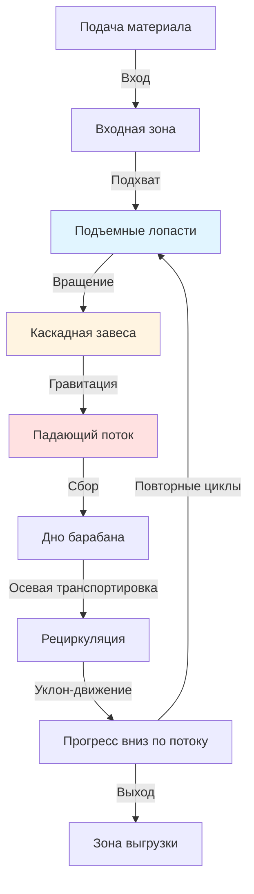

## Основные механизмы потока

Транспортировка материала в ротационных сушильных барабанах представляет собой комбинацию гравитационного перемещения вдоль оси барабана и поперечного движения, создаваемого вращением и внутренними лопастями. Доминирующий механизм транспортировки определяет эффективность сушки, равномерность времени пребывания и тепловой контакт между материалом и сушильным газом.

Три основных режима потока определяют работу ротационных сушилок:

**Режим проседания (Slumping flow)** возникает при низких скоростях вращения, когда материал скатывается по поверхности лопастей, не поднимаясь в воздух. Этот режим обеспечивает минимальный контакт газ-твердое тело и низкую эффективность теплообмена.

**Режим каскадирования (Cascading flow)** развивается при умеренных скоростях, когда материал падает через газовый поток отдельными завесами. Этот режим максимизирует площадь межфазной поверхности и представляет собой оптимальный режим работы для большинства применений.

**Режим центробежного потока (Centrifuging flow)** возникает при чрезмерных скоростях, когда центробежные силы превышают гравитационные, предотвращая выгрузку материала с лопастей. Этот непродуктивный режим следует избегать.

## Распределение времени пребывания

Время пребывания материала $\tau$ в ротационной сушилке зависит от геометрии барабана, уклона, скорости вращения и свойств материала. Основное уравнение времени пребывания, выведенное из первых принципов:

$$\tau = \frac{L}{v_a}$$

где $L$ — длина барабана, а $v_a$ — средняя осевая скорость. Для наклонного ротационного барабана:

$$v_a = \frac{4QN}{60\pi D^2 \tan\theta}$$

где:
- $Q$ — объемный запас материала (безразмерный)
- $N$ — скорость вращения (об/мин)
- $D$ — диаметр барабана (м)
- $\theta$ — угол наклона барабана (рад)

Комбинирование этих зависимостей дает полное уравнение времени пребывания:

$$\tau = \frac{15\pi D^2 L \tan\theta}{QN}$$

Это уравнение показывает, что время пребывания линейно возрастает с длиной и уклоном, квадратично зависит от диаметра и обратно пропорционально скорости вращения и доле запаса материала.

## Распределение материала, индуцированное лопастями

Внутренние лопасти поднимают и создают каскад материала через газовый поток. Количество лопастей в активной зоне определяет плотность завесы и эффективность теплообмена. Нагрузка на лопасти определяется геометрическим анализом:

$$m_f = \rho_b V_f = \rho_b w h^2 \left(\frac{\pi}{4} - \frac{1}{3}\right)$$

где:
- $\rho_b$ — насыпная плотность (кг/м³)
- $w$ — ширина лопасти (м)
- $h$ — высота лопасти (м)

Общее количество материала в лопастях в любой момент времени:

$$M_{flight} = n_{active} m_f = \frac{N_{flights}}{4} m_f$$

при условии, что 25% лопастей находятся в активной зоне подъема. Этот взвешенный в воздухе материал создает газ-твердотельную поверхность, критически важную для конвективного теплообмена.

## Конфигурация паттерна потока

## Сравнение конфигураций потока

| Конфигурация | Запас Q | Теплообмен | Время пребывания | Применения |
|------|-----------|-------|--------|--|
| Прямой барабан, без лопастей | 0.05-0.10 | Плохой (обход газа) | Переменное, неконтролируемое | Не рекомендуется |
| Прямой барабан с лопастями | 0.10-0.15 | Отличный | Среднее | Свободнотекущие гранулы |
| Наклонный барабан с лопастями | 0.08-0.12 | Отличный | Контролируется уклоном | Стандартные применения |
| Наклонный с подъемными лопастями | 0.12-0.18 | Максимальный | Увеличенное | Сложные материалы |
| Противоток с лопастями | 0.10-0.15 | Отличный | Оптимальный контроль | Высокое удаление влаги |
| Прямой ток с лопастями | 0.08-0.12 | Хороший | Короткое | Теплочувствительные продукты |

## Осевая дисперсия и смешивание

Материал не протекает через ротационные сушилки как поршневой поток. Осевая дисперсия создает распределение времени пребывания вокруг среднего значения. Число Пекле характеризует дисперсию:

$$Pe = \frac{v_a L}{D_a}$$

где $D_a$ — коэффициент осевой дисперсии. Низкие числа Пекле указывают на большую дисперсию и более широкое распределение времени пребывания. Типичные ротационные сушилки работают при $Pe = 10-50$.

Дисперсия распределения времени пребывания связана с числом Пекле:

$$\sigma_\theta^2 = \frac{2}{Pe} - \frac{2}{Pe^2}(1 - e^{-Pe})$$

где $\sigma_\theta^2$ — безразмерная дисперсия. Увеличение дисперсии снижает равномерность сушки и может привести к проблемам с качеством продукта.

## Критические скорости

Число Фруда определяет переходы между режимами течения:

$$Fr = \frac{N^2 D}{1800g}$$

где $g = 9.81$ м/с². Границы режимов течения:

- **Сплющивание (Slumping):** $Fr < 0.003$
- **Каскадный режим (Cascading):** $0.003 < Fr < 0.02$
- **Центрифугирование (Centrifuging):** $Fr > 0.02$

Большинство промышленных сушилок работают при $Fr = 0.005\text{--}0.015$ для поддержания каскадного режима. Рабочая скорость обычно составляет 30–70% от критической скорости, где критическая скорость:

$$N_c = \frac{42.3}{\sqrt{D}}$$

где $D$ в метрах, а $N_c$ в об/мин.

## Стандарты интеграции конструкции

Спецификации ASME для проектирования потока материала в ротационных сушилках включают:

**Доля загрузки (Holdup fraction):** Поддерживать $Q = 0.08\text{--}0.15$ для оптимального газотвердого контакта без избыточного энергопотребления.

**Расстояние между лопатками:** Размещать лопатки с угловым интервалом 15–30° для обеспечения непрерывного падения материала без перегрузки отдельных лопаток.

**Оптимизация уклона:** Ограничить уклон 0–5 см/м для баланса времени пребывания и предотвращения скольжения материала вместо его подъема.

**Скорость вращения:** Выбирать $N = 4\text{--}8$ об/мин для крупных сушилок ($D > 2$ м) и $N = 8\text{--}15$ об/мин для малых установок для поддержания $Fr$ в каскадном режиме.

Правильное проектирование потока материала обеспечивает равномерное распределение времени пребывания, максимизирует эффективность теплообмена и предотвращает эксплуатационные проблемы, такие как вибрация (ringing), накопление материала или преждевременный разряд.

## Мониторинг эксплуатации

Ключевые индикаторы правильного потока материала:

- Постоянная скорость разряда, соответствующая скорости подачи в стационарном режиме
- Равномерное распределение температуры вдоль длины барабана
- Отсутствие слышимых звуков лавинообразного падения материала или ударов
- Видимое падение материала через смотровые люки
- Потребление мощности в пределах проектных спецификаций (кВт/тонна производительности)

Отклонения от этих индикаторов указывают на изменение режима течения, требующее корректировки эксплуатации или механического осмотра состояния лопаток.
