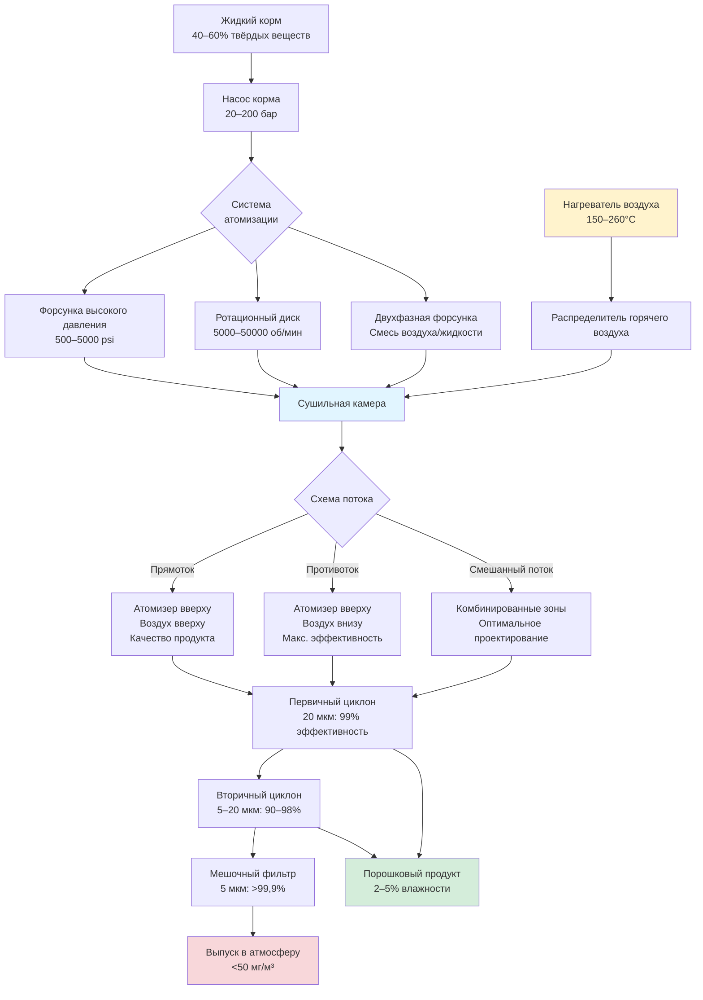

## Основы распылительной сушки

Распылительная сушка преобразует жидкие исходные материалы в сухой порошок посредством атомизации, контакта с горячим воздухом и быстрого испарения влаги. Этот процесс достигает удаления влаги в течение нескольких секунд, что делает его незаменимым для термочувствительных материалов, требующих минимального теплового воздействия. Технология доминирует в производстве молочного порошка, растворимого кофе, фармацевтических препаратов, керамики и специальных химических веществ.

Фундаментальная последовательность распылительной сушки включает три явления переноса, происходящие одновременно:

- **Атомизация** — разрушение жидкости на капли с отношением площади поверхности к объему 10 000–60 000 м²/м³
- **Теплопередача** — конвективная передача энергии от горячего воздуха к поверхности капли
- **Массопередача** — диффузия влаги из внутренней части капли через испарение на границе раздела с воздухом

Скорость сушки следует характеристической кривой с начальным периодом постоянной скорости, контролируемым поверхностным испарением, переходящим в период падающей скорости по мере того, как внутренняя диффузия влаги становится ограничивающей.

## Принципы и технология атомизации

Атомизация создаёт высокую площадь поверхности, необходимую для быстрой сушки. Распределение размера капель критически влияет на качество продукта, требуемое время пребывания и энергетическую эффективность.

### Атомизеры с форсунками высокого давления

Форсунки высокого давления проталкивают жидкость через малые отверстия при 500–5000 psi, генерируя капли посредством гидравлического сдвига. Средний диаметр капли следует корреляции:

$$D_{mean} = K \cdot \left(\frac{\sigma}{\rho_a v^2}\right)^{0.5} \cdot \left(\frac{\mu_l^2}{\sigma \rho_l d_o}\right)^{0.25}$$

где $\sigma$ — поверхностное натяжение, $\rho_a$ — плотность воздуха, $v$ — относительная скорость, $\mu_l$ — вязкость жидкости, $\rho_l$ — плотность жидкости, $d_o$ — диаметр отверстия, и $K$ — эмпирическая константа (обычно 3,0–4,5).

**Характеристики форсунок высокого давления:**

- Диапазон капель: 40–300 мкм средний диаметр
- Расход корма: 10–2000 кг/ч на форсунку
- Потребление энергии: 0,3–0,8 кВт·ч на 1000 кг корма
- Применение: корма средней и низкой вязкости (<300 сП)

### Ротационные атомизеры

Центробежные атомизеры распределяют жидкость на вращающийся диск или чашу, работающие на 5000–50000 об/мин. Жидкость течёт радиально наружу, разрушаясь на периферии под действием центробежной силы. Размер капли зависит от скорости диска, расхода корма и свойств жидкости:

$$D_{mean} = 0.4 \left(\frac{Q}{\pi \omega D_{disc}}\right)^{0.6} \left(\frac{\sigma}{\rho_l \omega^2 D_{disc}^2}\right)^{0.2}$$

где $Q$ — объёмный расход корма, $\omega$ — угловая скорость, $D_{disc}$ — диаметр диска.

**Преимущества ротационных атомизеров:**

- Диапазон капель: 20–200 мкм (более узкое распределение, чем форсунки высокого давления)
- Высокая производительность: до 100 000 кг/ч
- Обработка вязких кормов: до 2000 сП
- Регулируемый размер частиц через управление скоростью

### Двухфазные форсунки

Двухфазные форсунки используют сжатый воздух (или пар) для атомизации жидкого корма посредством пневматического сдвига. Массовые отношения воздуха к жидкости 0,2–1,0 создают тонкие капли, подходящие для мелкомасштабных или пилотных операций.

## Проектирование камеры и схемы воздушного потока

Геометрия камеры определяет распределение времени пребывания, траекторию частиц и эффективность контакта продукта с воздухом. Существуют три основные конфигурации:

### Конструкция с прямотоком

Горячий воздух и атомизированные капли движутся в одном направлении. Температура входного воздуха 300–500°F контактирует с влажными каплями с высоким содержанием влаги. По мере высыхания частиц и охлаждения воздуха температурные перепады уменьшаются, защищая термочувствительные продукты.

**Особенности конструкции с прямотоком:**

- Температура на выходе: 71–104°C
- Температура продукта: остаётся близко к температуре мокрого термометра до завершающей стадии сушки
- Применение: термочувствительные материалы (молочный порошок, фармацевтические препараты, ароматизаторы)
- Соотношение высоты к диаметру камеры: 2:1 – 5:1

Термальное преимущество прямоточного потока заключается в том, что влажные частицы никогда не испытывают максимальную температуру воздуха. Температура продукта следует:

$$T_{product} \approx T_{wb} + (T_{out} - T_{wb}) \cdot \left(\frac{X_{final}}{X_{initial}}\right)^{0.5}$$

Это соотношение показывает, что температура продукта остаётся близко к температуре мокрого термометра на большей части цикла сушки.

### Конструкция с противотоком

Горячий воздух входит снизу, а атомизация происходит сверху. Сухие частицы встречаются с самым горячим воздухом, значительно повышая температуру продукта. Эта конфигурация максимизирует тепловую эффективность, но подвергает продукт повышенным температурам.

**Применение противотока:**

- Детергенты, суспензии керамики, минералы
- Продукты, выдерживающие 149–204°C
- Максимальная эффективность испарения

Противоточный поток достигает 10–20% лучшей тепловой эффективности по сравнению с прямотоком благодаря оптимальному температурному напору по всей камере. Температура выхода продукта приближается к температуре входящего воздуха минус 11–22°C.

### Смешанная схема потока

Комбинированные зоны прямотока и противотока оптимизируют как качество продукта, так и энергетическую эффективность. Атомизация происходит в зоне прямотока; высушенные частицы падают через зону противотока для завершающего снижения влажности.

Профиль температуры в конструкциях со смешанным потоком обеспечивает начальную мягкую сушку, за которой следует агрессивное завершающее снижение влажности, достигая целей как качества продукта, так и энергетической эффективности.

## Системы горячего воздуха

### Методы нагревания воздуха

Системы нагревания воздуха распылительных сушилок должны подавать чистый, точно контролируемый горячий воздух при расходах 10 000–500 000 CFM (16 990–848 000 м³/ч).

**Прямые газовые нагреватели:**

- Эффективность: 92–98%
- Управление температурой: ±5,6°C
- Продукты сгорания контактируют с продуктом (допустимо для нечувствительных материалов)
- Потребление топлива: 800–1200 Btu на фунт испарённой воды

**Косвенные паровые или масляные нагреватели:**

- Чистый воздух (без продуктов сгорания)
- Точное управление температурой: ±1,7°C
- Более высокие капитальные затраты
- Применение: фармацевтические препараты, пищевые продукты, требующие изолированного воздуха

### Распределение воздуха

Равномерное распределение воздуха предотвращает градиенты температуры, вызывающие деградацию продукта или неполную сушку. Распределители входящего воздуха создают контролируемые схемы потока:

- **Генераторы спирального потока** — тангенциальная подача воздуха, создающая циклонический поток для ротационных атомизеров
- **Распределительные пластины** — перфорированные пластины, обеспечивающие равномерное радиальное распределение
- **Выпрямители воздуха** — сотовые структуры, устраняющие турбулентность для систем форсунок высокого давления

Скорость воздуха в сушильной камере составляет 0,15–0,91 м/с, уравновешивая время пребывания и унос частиц.

## Уравнения теплопередачи и массопередачи

### Конвективная теплопередача к капле

Скорость теплопередачи от горячего воздуха к поверхности капли следует закону охлаждения Ньютона:

$$q = h \cdot A \cdot (T_{air} - T_{surface})$$

где $h$ — коэффициент конвективной теплопередачи (Вт/м²·К), $A$ — площадь поверхности капли (м²), $T_{air}$ — температура воздуха (К), $T_{surface}$ — температура поверхности капли (К).

Коэффициент теплопередачи для сферы в потоке воздуха рассчитывается с использованием корреляции Ранца–Маршалла:

$$Nu = \frac{hD}{k_{air}} = 2 + 0.6 \cdot Re^{0.5} \cdot Pr^{0.33}$$

где $Nu$ — число Нуссельта, $D$ — диаметр капли (м), $k_{air}$ — теплопроводность воздуха (Вт/м·К), $Re$ — число Рейнольдса, $Pr$ — число Прандтля.

### Скорость испарения

Скорость массопередачи с поверхности капли в воздух следует:

$$\frac{dm}{dt} = h_m \cdot A \cdot (C_{surface} - C_{air})$$

где $h_m$ — коэффициент массопередачи (м/с), $C$ — концентрация влаги (кг/м³).

Число Шервуда для массопередачи соответствует теплопередаче:

$$Sh = \frac{h_m D}{D_{AB}} = 2 + 0.6 \cdot Re^{0.5} \cdot Sc^{0.33}$$

где $D_{AB}$ — коэффициент диффузии вода-воздух (м²/с), $Sc$ — число Шмидта.

### Время сушки капли

Для периода постоянной скорости сушки общее время сушки оценивается:

$$t_{dry} = \frac{\rho_l D_0^2}{8 k_{air} (T_{air} - T_{wb})} \cdot \Delta H_v \cdot \left(X_0 - X_f\right)$$

где $\rho_l$ — плотность жидкости (кг/м³), $D_0$ — начальный диаметр капли (м), $T_{wb}$ — температура мокрого термометра (К), $\Delta H_v$ — удельная теплота парообразования (Дж/кг), $X_0$ — начальное содержание влаги (кг воды/кг сухого вещества), $X_f$ — конечное содержание влаги.

### Энергетический баланс

Общий энергетический баланс для камеры распылительной сушилки:

$$\dot{m}_{air} \cdot c_{p,air} \cdot (T_{in} - T_{out}) = \dot{m}_{water} \cdot \Delta H_v + \dot{m}_{solids} \cdot c_{p,solids} \cdot (T_{out} - T_{feed})$$

где $\dot{m}$ обозначает массовый расход (кг/с), $c_p$ — удельная теплоёмкость (Дж/кг·К).

Тепловая эффективность рассчитывается как:

$$\eta_{thermal} = \frac{\dot{m}_{water} \cdot \Delta H_v}{\dot{m}_{air} \cdot c_{p,air} \cdot (T_{in} - T_{ambient})} \times 100\%$$

Типичная тепловая эффективность находится в диапазоне 50–75% в зависимости от температуры выхода, концентрации корма и применения рекуперации тепла.

## Системы циклонного разделения

### Принципы разделения

Циклоны разделяют высушенный порошок от выхлопного воздуха посредством центробежной силы. Воздух входит тангенциально, создавая вихрь. Частицы с достаточной инерцией мигрируют к стенке и спускаются; чистый воздух выходит через центральное ядро.

Эффективность сбора следует:

$$\eta = 1 - \exp\left(-\frac{2NL}{D}\right)$$

где $N$ — число эффективных витков, $L$ — длина циклона, $D$ — диаметр циклона.

**Типичная производительность циклона:**

| Размер частиц (мкм) | Эффективность сбора |
|-------------------|----------------------|
| >20 | >99% |
| 10–20 | 90–98% |
| 5–10 | 70–90% |
| <5 | 40–70% |

### Многоступенчатые системы

Тонкие частицы, уходящие из первичных циклонов, требуют вторичного разделения:

- **Вторичные циклоны** — установки меньшего диаметра для сбора частиц 5–15 мкм
- **Мешочные фильтры** — тканевая фильтрация для субмикронных частиц, достигающая >99,9% сбора
- **Мокрые скрубберы** — финальная доработка для соответствия экологическим требованиям

## Промышленные применения

### Молочная промышленность

Производство молочного порошка представляет крупнейшее глобальное применение распылительной сушки. Цельное молоко, обезжиренное молоко и молочная сыворотка проходят предварительное сгущение до 40–50% твёрдых веществ путём испарения, затем распылительную сушку до 2–4% конечной влажности.

**Спецификации распылительных сушилок молочного назначения:**

| Параметр | Порошок цельного молока | Порошок обезжиренного молока | Порошок сыворотки | Детская смесь |
|-----------|-------------------|------------------|-------------|----------------|
| Твёрдые вещества корма (%) | 45–50 | 48–52 | 45–50 | 50–55 |
| Температура входа (°C) | 177–199 | 182–204 | 171–188 | 160–177 |
| Температура выхода (°C) | 82–90 | 85–93 | 79–88 | 74–82 |
| Конечная влажность (%) | 2,5–3,5 | 2,5–4,0 | 3,0–4,5 | 2,0–3,0 |
| Насыпная плотность (г/см³) | 0,50–0,65 | 0,55–0,70 | 0,45–0,60 | 0,35–0,50 |
| Размер частиц (мкм) | 80–150 | 100–180 | 60–120 | 50–100 |
| Время пребывания (сек) | 18–28 | 20–30 | 15–25 | 25–35 |

Параметры качества продукта включают насыпную плотность, распределение размера частиц и мгновенные свойства (смачиваемость, диспергируемость). Растворимый молочный порошок требует агломерации путём повторного увлажнения и пересушивания для достижения размеров частиц 200–500 мкм.

### Химическая промышленность

Распылительная сушка в химии производит катализаторы, пигменты, красители и полимерные смолы. Условия эксплуатации учитывают коррозионные корма, органические растворители и инертные атмосферы.

**Особенности химической сушилки:**

- Замкнутые системы инертного газа (азот) для огнеопасных растворителей
- Системы рекуперации и конденсации растворителей
- Взрывозащищённые электросистемы
- Коррозионностойкие материалы (нержавеющая сталь 316, хастеллой)

### Фармацевтическая промышленность

Фармацевтическая распылительная сушка создаёт аморфные твёрдые дисперсии, улучшающие биодоступность препарата. Требования к асептическому проектированию и валидации превышают стандарты пищевой и химической промышленности.

**Фармацевтические требования:**

- cGMP-совместимое проектирование и документирование
- CIP (очистка на месте) системы с документированной валидацией очистки
- Поверхности, контактирующие с продуктом: электрополированная нержавеющая сталь 316L
- Системы изоляции для высокоактивных API
- Технология аналитических процессов (PAT) для мониторинга в реальном времени

Проектирование камеры включает конические дно с гладкими переходами, минимизирующими накопление продукта. Температуры на выходе остаются ниже пороговых значений деградации препарата, обычно 60–82°C для термочувствительных соединений.

## Управление процессом и свойства порошка

### Критические параметры процесса

Свойства порошка зависят от точного управления параметрами эксплуатации:

| Свойство продукта | Основные контролирующие факторы | Типичный диапазон |
|------------------|----------------------------|---------------|
| Размер частиц | Скорость/давление атомизации, расход корма, вязкость корма | 20–300 мкм |
| Насыпная плотность | Температура выхода, содержание твёрдых веществ в корме, агломерация | 0,3–0,8 г/см³ |
| Содержание влаги | Температура выхода, время пребывания, влажность воздуха | 1–5% |
| Текучесть | Форма частиц, распределение размера, влажность | Индекс Карра 5–25 |
| Смачиваемость | Состав поверхности, пористость, размер частиц | 5–60 сек |
| Диспергируемость | Агломерация, поверхностные фины, структура частиц | 60–95% |
| Цвет | История температур продукта, качество корма | Значение L* 85–98 |

### Морфология частиц

Структура распылительно-высушенной частицы эволюционирует на протяжении процесса сушки:

1. **Стадия влажной капли** (0–2 сек): однородная жидкая сфера
2. **Образование корки** (2–8 сек): поверхностное затвердевание при жидком ядре
3. **Стадия вспучивания** (8–15 сек): внутреннее давление пара создаёт полые частицы
4. **Завершающая сушка** (15–30 сек): удаление остаточной влаги, окончательное затвердевание структуры

Образование полых частиц происходит при:

$$\frac{dP_{internal}}{dt} > \frac{d\sigma_{crust}}{dt}$$

где скорость увеличения внутреннего давления пара превышает скорость развития прочности корки. Это создаёт порошок с более низкой насыпной плотностью и улучшенными мгновенными свойствами.

### Влияние условий эксплуатации

**Повышение температуры входа:**
- Более быстрая скорость сушки (сокращение времени пребывания)
- Более низкая насыпная плотность (увеличение вспучивания)
- Повышенный риск деградации продукта
- Улучшенная тепловая эффективность

**Повышение температуры выхода:**
- Более низкое конечное содержание влаги
- Сниженная текучесть порошка (поверхностная липкость)
- Сниженная стабильность продукта (окисление, реакции Майяра)

**Повышение концентрации твёрдых веществ в корме:**
- Повышенная производственная мощность
- Сниженное удельное энергопотребление (Btu/фунт испаренной воды)
- Увеличенная вязкость корма (может требовать другой атомизации)
- Улучшенная морфология частиц

## Энергетические соображения

Потребление энергии распылительной сушкой составляет 1200–2000 Btu на фунт испарённой воды, значительно больше, чем механическое испарение (400–600 Btu/фунт). Стратегии оптимизации энергии включают:

- **Предварительное сгущение корма** — снижение испарительной нагрузки сушилки
- **Рекуперация тепла выхлопного воздуха** — предварительный нагрев входящего воздуха или корма
- **Многоступенчатая сушка** — комбинирование распылительной сушки с ленточной или псевдоожиженной сушкой
- **Сушка с осушением** — замкнутые системы с осушением влаги тепловым насосом

## Условия эксплуатации распылительной сушилки по применениям

Конкретные применения требуют специально подобранных параметров температуры, атомизации и времени пребывания:

| Применение | Концентрация корма (%) | Температура входа (°C) | Температура выхода (°C) | Тип атомизера | Схема потока | Конечная влажность (%) |
|-------------|---------------|-----------------|------------------|---------------|--------------|-------------------|
| Порошок цельного молока | 45–50 | 182–199 | 85–90 | Ротационная/Высокого давления | Прямоток | 2,5–3,5 |
| Порошок обезжиренного молока | 48–52 | 188–204 | 88–93 | Ротационная/Высокого давления | Прямоток | 2,5–4,0 |
| Растворимый кофе | 30–40 | 149–177 | 71–82 | Высокого давления | Прямоток | 2,5–4,0 |
| Сливочное кофе | 35–45 | 177–193 | 79–88 | Ротационная | Прямоток | 2,0–3,5 |
| Порошок яиц | 40–48 | 138–160 | 60–71 | Высокого давления | Прямоток | 2,0–5,0 |
| Кровяная плазма | 15–25 | 121–138 | 49–60 | Двухфазная | Прямоток | 3,0–6,0 |
| Суспензия керамики | 60–70 | 260–371 | 93–121 | Высокого давления | Противоток | 0,5–2,0 |
| Порошок детергента | 55–65 | 288–343 | 82–104 | Высокого давления | Противоток | 3,0–8,0 |
| Порошок катализатора | 30–50 | 204–288 | 82–104 | Ротационная | Смешанный поток | 1,0–5,0 |
| Фармацевтический API | 20–35 | 121–160 | 54–71 | Двухфазная | Прямоток | 1,0–3,0 |
| Порошок фруктового сока | 50–60 | 171–193 | 77–88 | Ротационная | Прямоток | 2,0–4,0 |
| Порошок смолы | 40–55 | 160–204 | 71–88 | Высокого давления | Прямоток | 0,5–2,0 |

## Стандарты и руководства

### Стандарты пищевой безопасности

- **FDA 21 CFR Part 110** — Надлежащая производственная практика при производстве пищевых продуктов
- **3-A Sanitary Standards** — Проектирование оборудования для молочной переработки
- **FDA 21 CFR Part 117** — Анализ опасностей и профилактические меры на основе рисков
- **ISO 22000** — Системы управления безопасностью пищевых продуктов

### Стандарты процесса

- **ASHRAE Handbook - HVAC Applications, Chapter 29** — Проектирование промышленных систем сушки
- **Руководства GMP (FDA/EMA)** — Требования к производству фармацевтических препаратов
- **ASME BPE** — Проектирование биопроцессного оборудования
- **3-A Standard 16-03** — Распылительные сушилки для молочных продуктов

### Стандарты качества воздуха

- **EPA NESHAP Subpart DDD** — Выбросы от промышленных органических процессов
- **OSHA 29 CFR 1910.94** — Требования к вентиляции опасных операций
- **ACGIH Industrial Ventilation Manual** — Проектирование систем вытяжки

### Стандарты безопасности

- **NFPA 61** — Предотвращение пожаров и взрывов пыли в сельскохозяйственных объектах
- **NFPA 654** — Предотвращение пожаров и взрывов пыли от горючих твёрдых частиц
- **Директива ATEX 2014/34/EU** — Оборудование для использования во взрывчатых атмосферах (Европа)
- **IEC 61241** — Электрическое оборудование для использования во взрывоопасных пыльных атмосферах

## Стратегии оптимизации энергии

Потребление энергии распылительной сушкой составляет 1200–2000 Btu на фунт испарённой воды, значительно больше, чем механическое испарение (400–600 Btu/фунт). Стратегии оптимизации энергии включают:

### Предварительное сгущение корма

Испарительное предварительное сгущение от 10–15% до 45–50% твёрдых веществ снижает испарительную нагрузку сушилки на 85–90%. Многоступенчатые испарители, работающие при 500–800 Btu/фунт испарённой воды, достигают комбинированного энергопотребления системы 850–1100 Btu/фунт удалённой воды.

### Рекуперация тепла выхлопного воздуха

Двухступенчатые системы рекуперации тепла:

1. **Прямая рекуперация тепла** — выхлопной воздух предварительно нагревает входящий воздух через теплообменники воздух-воздух (30–50% рекуперации энергии)
2. **Косвенная рекуперация тепла** — выхлопной воздух предварительно нагревает корм или технологическую воду (10–20% дополнительная рекуперация)

Всё рекуперируемое тепло:

$$Q_{recoverable} = \dot{m}_{exhaust} \cdot c_{p,air} \cdot (T_{exhaust} - T_{ambient} - \Delta T_{approach})$$

где $\Delta T_{approach}$ — температура приближения теплообменника (обычно 11–22°C).

### Многоступенчатая сушка

Интегрированная ленточная сушка после распылительной сушки удаляет конечную влагу при 400–600 Btu/фунт воды, снижая общее потребление энергии на 15–25% для продуктов, выдерживающих более продолжительные времена сушки.

### Сушка с осушением

Замкнутые системы с осушением тепловым насосом достигают 600–900 Btu/фунт испарённой воды в применениях, требующих инертной атмосферы или рекуперации растворителя.

## Ссылки

- Masters, K. (1991). *Spray Drying Handbook*. 5-е издание. Longman Scientific & Technical.
- ASHRAE Handbook - HVAC Applications (2023), Chapter 29: Industrial Drying Systems
- Perry's Chemical Engineers' Handbook, 9-е издание: Секция распылительной сушки
- Oakley, D.E. (2004). "Spray Dryer Modeling in Theory and Practice." *Drying Technology*, 22(6): 1371-1402.
- Bhandari, B., et al. (2013). *Handbook of Food Powders*. Woodhead Publishing.
- FDA Guidance for Industry: Process Validation (2011)
- 3-A Sanitary Standards for Spray Dryers, Number 16-03 (2017)
- NFPA 61: Standard for the Prevention of Fires and Dust Explosions in Agricultural and Food Processing Facilities (2020)
