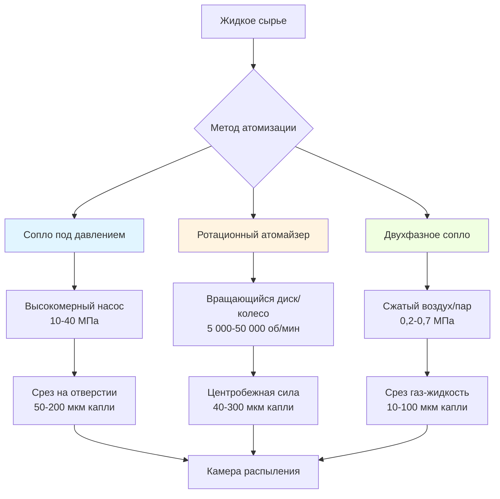

# Технология атомизации сушилок с распылением

Атомизация представляет критический первый этап сушки распылением, преобразуя жидкое сырье в тонкий туман капель, которые обеспечивают максимальную поверхность для быстрого испарения влаги. Физика образования капель, распределение размеров и кинетическая энергия напрямую определяют эффективность сушки, качество продукта и потребление энергии в фармацевтической, пищевой, химической и материалообрабатывающей промышленности.

## Фундаментальная физика атомизации

Атомизация происходит, когда приложенная энергия преодолевает силы поверхностного натяжения, удерживающие молекулы жидкости вместе. Три метода ввода энергии приводят в действие коммерческие системы атомизации:

**Энергия давления:** Высокомерные насосы нагнетают жидкость через небольшие отверстия, преобразуя потенциальную энергию давления в кинетическую энергию, которая разрывает жидкую струю на капли.

**Центробежная энергия:** Вращающиеся диски или колеса ускоряют жидкость радиально наружу, создавая нестабильные жидкие пленки, которые распадаются на капли под воздействием аэродинамических и центробежных сил.

**Передача кинетической энергии:** Высокоскоростные газовые потоки воздействуют на жидкость, передавая импульс, который разлагает жидкость на тонкие капли через силы сдвига.

Критическое число Вебера определяет распад капель:

$$We = \frac{\rho_g v^2 d}{\sigma}$$

Где:
- $\rho_g$ = плотность газа (кг/м³)
- $v$ = относительная скорость между газом и жидкостью (м/с)
- $d$ = характеристический размер жидкости (м)
- $\sigma$ = поверхностное натяжение (Н/м)

Образование капель происходит при $We > 12$ для большинства систем жидкость-газ.

## Прогнозирование размера капель

Средний диаметр Заутера (SMD или $d_{32}$) характеризует распределение размера капель, представляя диаметр капли с одинаковым отношением объема к площади поверхности как весь спрей:

$$d_{32} = \frac{\sum n_i d_i^3}{\sum n_i d_i^2}$$

Для сопел под давлением эмпирические корреляции прогнозируют SMD:

$$d_{32} = 3.08 \cdot Q^{0.25} \cdot \Delta P^{-0.5} \cdot \sigma^{0.25} \cdot \rho_l^{0.25}$$

Где:
- $Q$ = объемный расход (м³/с)
- $\Delta P$ = перепад давления на сопле (Па)
- $\rho_l$ = плотность жидкости (кг/м³)

Для ротационных атомайзеров зависимость следует:

$$d_{32} = \frac{4.5 \cdot \sigma^{0.6} \cdot Q^{0.4}}{\rho_l^{0.2} \cdot \omega^{1.2} \cdot D^{0.6}}$$

Где:
- $\omega$ = угловая скорость (рад/с)
- $D$ = диаметр диска (м)

## Сравнение методов атомизации

## Характеристики типов атомайзеров

| Тип атомайзера | Диапазон размера капель | Диапазон производительности | Потребление энергии | Предел вязкости сырья | Скорость износа |
|---------------|-------------------|----------------|-------------------|---------------------|-----------|
| Сопло под давлением | 50-200 мкм | 10-5 000 л/ч | 0,5-2,0 кВт·ч/кг воды | <200 мПа·с | Высокая (абразия) |
| Ротационный диск | 40-300 мкм | 50-50 000 л/ч | 0,3-1,5 кВт·ч/кг воды | <1 000 мПа·с | Низкая |
| Ротационное колесо | 60-400 мкм | 100-100 000 л/ч | 0,4-1,8 кВт·ч/кг воды | <2 000 мПа·с | Средняя |
| Двухфазное (внутреннее) | 10-60 мкм | 5-500 л/ч | 2,0-8,0 кВт·ч/кг воды | <500 мПа·с | Низкая |
| Двухфазное (внешнее) | 20-100 мкм | 20-2 000 л/ч | 1,5-6,0 кВт·ч/кг воды | <300 мПа·с | Низкая |
| Ультразвуковое | 5-50 мкм | 1-100 л/ч | 3,0-12,0 кВт·ч/кг воды | <50 мПа·с | Очень низкая |

## Критерии отбора и оптимизация производительности

**Системы с соплом под давлением** превосходны в приложениях, требующих узкого распределения размера капель и умеренных расходов сырья. Основное ограничение связано с износом отверстия абразивным сырьем и засорением посторонним материалом. Типичное рабочее давление составляет 10-40 МПа, диаметр отверстия 0,4-2,0 мм.

**Ротационные атомайзеры** доминируют в крупномасштабном производстве благодаря превосходному обращению с большими объемами и допуску вязкого абразивного сырья. Диаметр диска варьируется от 50-300 мм, работая при периферийных скоростях 100-200 м/с. Картина распыления создает характерный горизонтальный диск, перпендикулярный оси вращения.

**Двухфазные атомайзеры** производят самые тонкие капли, но потребляют значительно больше энергии через требования сжатого газа. Массовое отношение газа к жидкости обычно варьируется от 0,2-2,0, с более высокими отношениями, производящими более тонкую атомизацию. Конструкции внутреннего смешивания обеспечивают лучшую эффективность атомизации, чем конфигурации внешнего смешивания.

## Термодинамические соображения

Энергия, необходимая для атомизации, представляет небольшую часть общего потребления энергии при сушке распылением (обычно 1-5%), но напрямую влияет на:

**Скорость испарения:** Более мелкие капли обеспечивают большую поверхность на единицу объема, следуя:

$$\frac{A}{V} = \frac{6}{d}$$

Эта зависимость демонстрирует, что уменьшение диаметра капель вдвое удваивает удельную площадь поверхности, пропорционально ускоряя кинетику сушки.

**Время пребывания:** Траектория капель и конечная скорость определяют время контакта с сухим воздухом. Закон Стокса регулирует скорость осаждения для капель ниже 100 мкм:

$$v_t = \frac{g \cdot d^2 \cdot (\rho_p - \rho_g)}{18 \mu}$$

Где:
- $v_t$ = конечная скорость (м/с)
- $g$ = гравитационное ускорение (9,81 м/с²)
- $\mu$ = динамическая вязкость газа (Па·с)

**Морфология частиц:** Быстрая поверхностная сушка при высоких температурах создает полые частицы через упрочнение оболочки, в то время как более медленное испарение дает плотные частицы. Число Пекле характеризует это поведение:

$$Pe = \frac{k_e \cdot R^2}{D_{eff}}$$

Где:
- $k_e$ = константа скорости испарения (с⁻¹)
- $R$ = радиус капли (м)
- $D_{eff}$ = эффективная диффузивность (м²/с)

Значения $Pe > 1$ указывают на осаждение на поверхности и образование полых частиц.

## Контроль и мониторинг в процессе эксплуатации

Критические параметры процесса, требующие постоянного мониторинга, включают:

- **Стабильность расхода сырья:** Вариации, превышающие ±5%, изменяют распределение размера капель и качество продукта
- **Скорость атомайзера (ротационная):** Поддерживается в пределах ±2% для согласованного размера частиц
- **Колебание давления (сопло):** Должно оставаться ниже ±10% для предотвращения сдвигов распределения размера
- **Отношение воздуха к жидкости (двухфазное):** Контролируется в пределах ±5% для стабильного ввода энергии атомизации

Передовые системы используют лазерную дифракцию или анемометрию фазовой Доплера для измерения размера капель в реальном времени, обеспечивая замкнутое управление параметрами атомизации для поддержания целевых характеристик частиц несмотря на вариации свойств сырья.

Этап атомизации принципиально определяет пределы производительности сушилки с распылением, делая правильный выбор и эксплуатацию атомайзера необходимыми для достижения целевых характеристик продукта при минимизации потребления энергии и максимизации пропускной способности.
