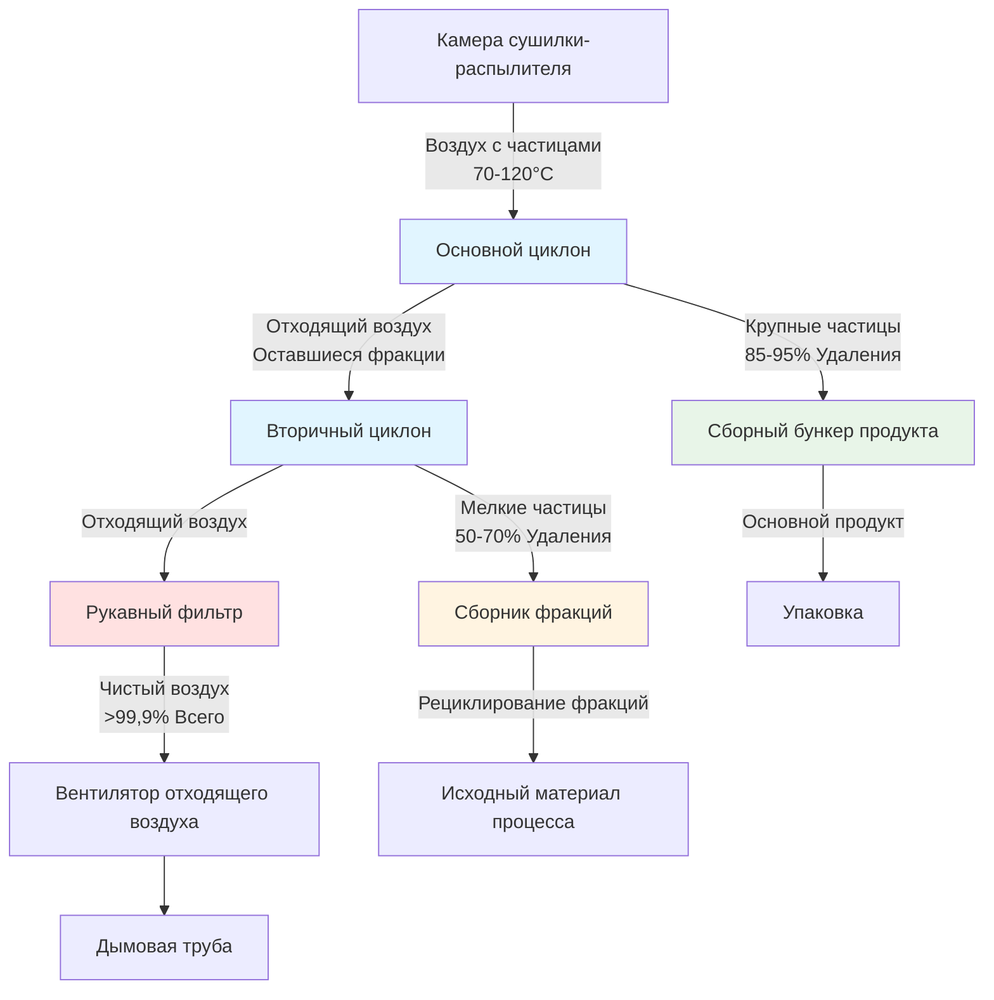

## Основы работы

Отводящие циклоны в системах сушилок-распылителей разделяют частицы продукта из потока отходящего воздуха за счет центробежной силы. Загруженный частицами воздух поступает тангенциально, создавая вихрь, который направляет частицы наружу к стенке циклона, где они спускаются в сборный бункер. Чистый воздух выходит через центральную трубку искателя вихря.

Механизм разделения основан на разнице плотности между частицами и воздухом в сочетании с центробежным ускорением. Частицы испытывают силы в несколько сотен раз больше гравитационного ускорения, обеспечивая эффективное разделение мелких частиц размером 5-10 мкм.

## Физика разделения

### Анализ центробежной силы

Центробежная сила, действующая на частицу в вихре циклона:

$$F_c = \frac{m_p v_t^2}{r}$$

где:
- $m_p$ = масса частицы (кг)
- $v_t$ = тангенциальная скорость (м/с)
- $r$ = радиальное положение (м)

Скорость осаждения частицы в направлении стенки под центробежным ускорением:

$$v_s = \frac{d_p^2 (\rho_p - \rho_g) v_t^2}{18 \mu r}$$

где:
- $d_p$ = диаметр частицы (м)
- $\rho_p$ = плотность частицы (кг/м³)
- $\rho_g$ = плотность газа (кг/м³)
- $\mu$ = динамическая вязкость газа (Па·с)

### Пороговый диаметр

Пороговый диаметр представляет размер частицы, собираемый с эффективностью 50%:

$$d_{50} = \sqrt{\frac{9 \mu b}{2 \pi N_e v_i (\rho_p - \rho_g)}}$$

где:
- $b$ = ширина входа (м)
- $N_e$ = эффективное количество оборотов
- $v_i$ = скорость входа (м/с)

Типичные циклоны сушилок-распылителей достигают пороговых диаметров 5-15 мкм в зависимости от конструкции и условий эксплуатации.

## Эффективность сбора

### Модель градационной эффективности

Фракционная эффективность для заданного размера частицы:

$$\eta(d_p) = \frac{1}{1 + (d_{50}/d_p)^2}$$

Эта зависимость демонстрирует, что эффективность резко возрастает для частиц больше порогового диаметра. Для частиц с удвоенным пороговым диаметром эффективность превышает 80%.

### Общая эффективность

Полная эффективность сбора, интегрированная по распределению размеров частиц:

$$\eta_{total} = \int_0^\infty \eta(d_p) \cdot f(d_p) \, dd_p$$

где $f(d_p)$ — нормализованное распределение размеров частиц от сушилки-распылителя.

Циклоны отходящего воздуха сушилок-распылителей обычно достигают общей эффективности 85-95% для рекупирования продукта, при этом оставшиеся фракции собираются рукавными фильтрами или скрубберами ниже по потоку.

## Конфигурация системы

## Конструктивные конфигурации

| Конфигурация | Отношение диаметров | Отношение высот | Скорость входа | Перепад давления | Эффективность | Применение |
|--------------|------------------|-----------------|----------------|------------------|---------------|-----------|
| Высокая эффективность | D/4 входа | 4D цилиндр | 12-18 м/с | 800-1200 Па | 92-96% | Тонкие порошки, фармацевтика |
| Стандартная | D/4 входа | 3D цилиндр | 15-20 м/с | 600-900 Па | 88-93% | Пищевые продукты, моющие средства |
| Высокая пропускная способность | D/3 входа | 2,5D цилиндр | 18-25 м/с | 500-800 Па | 82-88% | Массовые химикаты, минералы |
| Низкий перепад давления | D/5 входа | 3,5D цилиндр | 10-15 м/с | 400-600 Па | 85-90% | Термочувствительные продукты |
| Мультициклон | Несколько малых | Переменная | 12-20 м/с | 700-1000 Па | 90-94% | Приложения большого объема |

**Отношение диаметров**: Ширина входа относительно диаметра корпуса циклона (D)
**Отношение высот**: Высота цилиндрического сечения относительно диаметра корпуса

## Расчет перепада давления

Перепад давления на циклонном сепараторе:

$$\Delta P = \frac{K \rho_g v_i^2}{2}$$

где $K$ — коэффициент сопротивления циклона (обычно 6-10 для циклонов сушилок-распылителей).

Коэффициент сопротивления зависит от геометрии циклона:

$$K = 16 \left(\frac{a \cdot b}{D_e^2}\right)^2$$

где:
- $a$ = высота входа (м)
- $b$ = ширина входа (м)
- $D_e$ = диаметр выхода (м)

Перепад давления напрямую влияет на требования к мощности вентилятора. Каждое увеличение перепада давления циклона на 100 Па добавляет примерно 10-15 Вт на м³/с расхода воздуха к потреблению мощности вентилятора.

## Рекомендации по проектированию

### Влияние температуры

Температура отходящего газа влияет на эффективность разделения через свойства газа:

- **Увеличение вязкости**: Снижает скорость осаждения частиц на 15-20% при повышении с 27°C до 49°C
- **Снижение плотности**: Снижает центробережную силу примерно на 12% в том же диапазоне
- **Тепловое расширение**: Требует допуска 11-17°C по проектированию для размерной стабильности

Корпусы циклонов требуют изоляции для поддержания температуры газа выше точки росы и предотвращения конденсации, вызывающей прилипание продукта к стенкам.

### Нагрузка по частицам

Высокие нагрузки пыли (>50 г/м³) создают взаимодействия между частицами, которые усиливают сбор через агломерацию, но увеличивают перепад давления. Типичный отходящий воздух сушилки-распылителя содержит 20-80 г/м³ частиц продукта.

Чрезмерная нагрузка вызывает соление в конусе циклона, требуя более крутых углов конуса (60-75° от вертикали) для обеспечения надежного разгрузки.

### Выбор материалов

Конструкция циклона должна сопротивляться:
- Истиранию от ударов частиц (углеродистая сталь толщиной 6-10 мм или износостойкие покрытия)
- Коррозии от влаги и химии продукта (нержавеющая сталь 304/316 для пищевых и фармацевтических применений)
- Циклическому изменению температуры (допуски для теплового расширения, швы с пост-термической обработкой)

Внутренняя чистота поверхности влияет на прилипание частиц. Полированные поверхности (Ra < 3,2 мкм) минимизируют образование наслоений для липких продуктов, таких как сахар или молочный порошок.

## Оптимизация производительности

Эффективность циклона повышается с:
- Увеличением скорости входа (в пределах ограничений перепада давления)
- Уменьшением диаметра циклона (но с снижением пропускной способности)
- Увеличением высоты цилиндрического сечения (больше времени разделения)
- Оптимизированным диаметром искателя вихря (обычно 0,4-0,6 × диаметр корпуса)

Перепад давления снижается с:
- Снижением скорости входа
- Обтекаемой конструкцией входа
- Увеличением диаметра выхода
- Гладкими внутренними поверхностями

Оптимизация конструкции балансирует эти конкурирующие факторы на основе характеристик продукта, требований пропускной способности и затрат энергии.

## Интеграция с сушилкой-распылителем

Система циклона должна соответствовать условиям отходящего воздуха сушилки:

- **Пропускная способность по воздуху**: Циклон рассчитан на 110-120% объема отходящего воздуха сушилки для обработки колебаний процесса
- **Совместимость по температуре**: Материалы и уплотнения рассчитаны на максимальную температуру отходящего воздуха плюс допуск 11-17°C
- **Характеристики продукта**: Пороговый диаметр выбран на основе распределения размеров частиц от системы распыления
- **Бюджет давления**: Перепад давления циклона согласован с общим статическим давлением системы (обычно 2000-3500 Па всего)

Несколько циклонов в параллельном включении обеспечивают резервирование и позволяют проводить техническое обслуживание без остановки системы в критических производственных условиях.

## Требования к техническому обслуживанию

Регулярные интервалы проверки:
- Еженедельно: Разгрузочные клапаны бункера, датчики уровня, образование продукта на стенках
- Ежемесячно: Соединения входного и выходного воздуховодов, структурная целостность, состояние изоляции
- Ежеквартально: Внутреннее обследование на предмет картины эрозии, состояние покрытия, проверка размеров
- Ежегодно: Комплексное обследование с испытанием эффективности, проверка выравнивания

Картины эрозии указывают на проблемы распределения потока. Локализованные области износа требуют установки перегородок или изменения геометрии входа для продления срока службы.

---

*Технический контент, отражающий установленные принципы циклонного разделения и практику интеграции сушилок-распылителей по состоянию на январь 2025 года.*
