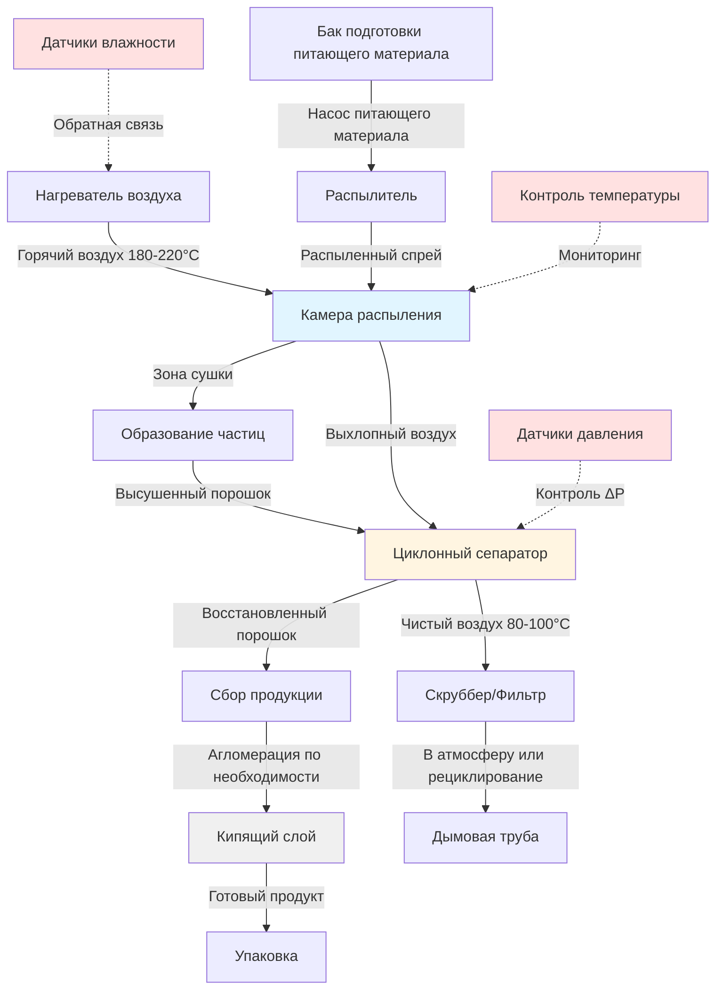

## Физика сушки распылением

Сушка распылением преобразует жидкие питающие материалы в сухие порошки путем распыления и быстрого испарения влаги в контролируемых потоках горячего воздуха. Этот процесс использует большое отношение площади поверхности к объему распыленных капель для достижения скоростей сушки в 100-1000 раз выше, чем при традиционных методах.

### Основы теплопередачи и массопередачи

Скорость сушки зависит от одновременной теплопередачи и массопередачи между горячим воздухом и каплями. В период постоянной скорости влага испаряется с поверхности капли со скоростью, определяемой:

$$\frac{dW}{dt} = -h_m A_s (C_{s} - C_{\infty})$$

Где:
- $\frac{dW}{dt}$ = скорость удаления влаги (кг/с)
- $h_m$ = коэффициент массопередачи (м/с)
- $A_s$ = площадь поверхности капли (м²)
- $C_s$ = концентрация пара на поверхности капли (кг/м³)
- $C_{\infty}$ = концентрация пара в воздухе (кг/м³)

Конвективная теплопередача к капле обеспечивает скрытую теплоту для испарения:

$$q = h A_s (T_{\infty} - T_s) = \frac{dW}{dt} h_{fg}$$

Где:
- $h$ = коэффициент конвективной теплопередачи (Вт/м²·К)
- $T_{\infty}$ = температура воздуха (К)
- $T_s$ = температура поверхности капли (К)
- $h_{fg}$ = скрытая теплота испарения (Дж/кг)

### Время сушки капли

Время, необходимое для сушки капли от начального влагосодержания $X_0$ до конечного влагосодержания $X_f$, подчиняется:

$$t = \frac{\rho_p d_p^2}{8 h_m \rho_g} \ln\left(\frac{X_0 - X_e}{X_f - X_e}\right)$$

Где:
- $\rho_p$ = плотность частицы (кг/м³)
- $d_p$ = диаметр капли (м)
- $\rho_g$ = плотность газа (кг/м³)
- $X_e$ = равновесное влагосодержание (кг/кг сухого остатка)

Это уравнение показывает, почему распыление критично: время сушки увеличивается с квадратом диаметра капли. Снижение размера капли с 200 мкм до 50 мкм сокращает время сушки в 16 раз.

## Системы распыления

### Распыление через напорные форсунки

Напорные форсунки ускоряют жидкость через малые отверстия при давлении 3-30 МПа, образуя капли диаметром 50-200 мкм. Средний диаметр капли определяется:

$$d_{32} = 3.08 \nu^{0.385} \sigma^{0.737} \dot{m}_L^{0.259} \Delta P^{-0.54}$$

Где:
- $d_{32}$ = средний диаметр Заутера (мкм)
- $\nu$ = кинематическая вязкость (м²/с)
- $\sigma$ = поверхностное натяжение (Н/м)
- $\dot{m}_L$ = массовый расход жидкости (кг/с)
- $\Delta P$ = перепад давления на форсунке (Па)

Напорные форсунки подходят для питающих материалов с низкой вязкостью (< 0,3 Па·с), например обезжиренного молока и фармацевтических растворов.

### Ротационный распылитель

Центробежные распылители используют вращающиеся колеса или диски при 5 000-50 000 об/мин. Размер капли коррелирует с:

$$d_{32} = 0.4 \left(\frac{\sigma}{\rho_L \omega^2 D}\right)^{0.6} \left(\frac{\dot{m}_L}{\rho_L \omega D^2}\right)^{0.2}$$

Где:
- $\omega$ = угловая скорость (рад/с)
- $D$ = диаметр колеса (м)
- $\rho_L$ = плотность жидкости (кг/м³)

Ротационные распылители обрабатывают более высокие вязкости (до 5 Па·с) и обеспечивают лучший контроль распределения по размерам частиц, что делает их предпочтительными для производства целого молочного порошка и керамических суспензий.

## Параметры, специфичные для продукции

| Параметр | Молочный порошок | Фармацевтическое АФИ | Химический порошок | Керамический порошок |
|-----------|-------------|-------------------|-----------------|----------------|
| **Температура входящего воздуха** | 180-220°С | 120-180°С | 200-350°С | 250-400°С |
| **Температура выходящего воздуха** | 80-100°С | 60-90°С | 90-120°С | 100-150°С |
| **Содержание сухих веществ в питающем материале** | 45-52% | 20-40% | 30-60% | 50-70% |
| **Метод распыления** | Напорный/Ротационный | Напорный | Напорный/Ротационный | Ротационный |
| **Размер частиц (d₅₀)** | 80-150 мкм | 5-50 мкм | 50-200 мкм | 10-100 мкм |
| **Остаточная влага** | 3-5% | 1-3% | 0,5-2% | 0,1-1% |
| **Объемная плотность** | 500-700 кг/м³ | 300-500 кг/м³ | 400-800 кг/м³ | 800-1500 кг/м³ |
| **Расход воздуха** | 1,5-2,0 кг воздуха/кг воды | 2,0-3,0 кг воздуха/кг воды | 1,5-2,5 кг воздуха/кг воды | 2,5-4,0 кг воздуха/кг воды |

## Конфигурации конструкции камеры

### Прямоток

Горячий воздух и распыление входят сверху, двигаясь вниз вместе. Самый горячий воздух контактирует с самыми влажными каплями, предотвращая тепловое повреждение по мере приближения частиц к начальной температуре мокрого термометра. Температура продукции растет только по мере уменьшения влаги. Эта конфигурация подходит для чувствительных к теплу материалов, таких как молочные белки и фармацевтические биологические препараты.

### Противоток

Воздух входит снизу, а распыление входит сверху. Высушенные частицы встречают самый горячий воздух у выхода конуса. Это расположение максимизирует тепловую эффективность, но рискует деградацией продукции. Используется для термостойких химических веществ и керамики, требующих очень низкой конечной влаги.

### Смешанный поток

Комбинирует прямоток сушки в верхней камере с противотоком в конической основе. Сбалансирует качество продукции с энергоэффективностью. Распространено в крупномасштабном производстве молочного порошка.

## Психрометрическое управление для качества продукции

### Производство молочного порошка

Порошок обезжиренного молока требует строгого контроля влажности выхода для предотвращения:
- Кристаллизации лактозы (избыточная сушка ниже 3% влаги)
- Потемнения по Майяру (избыточные температуры выше 90°С температуры частицы)
- Денатурации белка (температуры входа выше 220°С)

Точка росы воздуха на выходе должна оставаться ниже 15°С для достижения целевого содержания влаги 3-5% при сохранении сухобульбовой температуры 80-100°С.

### Фармацевтическая сушка распылением АФИ

Требования GMP предусматривают HEPA-фильтрованный воздух (класс ISO 5-7) и проверенный температурный контроль ±2°С. Закрытоконтурная сушка распылением азотом предотвращает окисление чувствительных соединений. Концентрация кислорода остается ниже 5% по объему благодаря непрерывной продувке азотом при 1,2× стехиометрическом избытке.

### Системы химических порошков

Системы рекуперации растворителя конденсируют органические пары при сушке распылением химических веществ. Для питающих материалов на основе этанола температура входящего воздуха остается ниже 180°С (значительно ниже температуры самовоспламенения 363°С) с мониторингом НПО, поддерживающим концентрацию растворителя ниже 25% нижнего предела взрываемости.

## Оптимизация энергоэффективности

Удельное потребление энергии (SEC) при сушке распылением составляет 3 000-6 000 кДж/кг испаренной воды. Минимизируйте SEC через:

**Оптимизация температуры воздуха**: Более высокие температуры входа увеличивают движущую силу испарения, но рискуют повредить продукцию. Оптимальный баланс достигается при:

$$T_{in,opt} = T_{product,max} + \frac{h_{fg}}{\rho_{air} c_p v_{air} \tau_{residence}}$$

**Рекуперация тепла выхлопного воздуха**: Восстановление явного тепла из выхлопного воздуха 90°С для предварительного нагрева питающего материала или воздуха горения снижает потребление энергии на 20-30%. Теплообменники должны предотвращать перекрестное загрязнение при производстве пищевых продуктов и фармацевтических препаратов.

**Контроль влагосодержания**: Избыточная сушка сверх спецификации расходует энергию впустую. Каждое снижение целевого содержания влаги на 1% увеличивает SEC примерно на 15%.

## Нормативные стандарты

### Пищевые приложения (молочный порошок)
- **FDA 21 CFR часть 110**: Надлежащая практика изготовления при производстве, упаковке или хранении продуктов питания для человека
- **USDA Grade A PMO**: Требования Постановления о пастеризованном молоке к качеству воздуха
- **3-A Санитарные стандарты**: Конструкция оборудования для очищаемости (3-A Standard 605-03)

### Фармацевтические приложения
- **FDA 21 CFR часть 211**: надлежащая производственная практика готовых фармацевтических препаратов
- **EU GMP Приложение 1**: Производство стерильных лекарственных средств
- **ISO 14644**: Классификация и мониторинг чистых помещений
- **USP <1116>**: Микробиологический контроль и мониторинг сред асептической обработки

### Химические приложения
- **NFPA 654**: Стандарт по предотвращению пожара и взрывов пыли
- **Директива ATEX 2014/34/EU**: Оборудование во взрывоопасных атмосферах
- **OSHA 29 CFR 1910.119**: Управление безопасностью процессов опасных химических веществ

## Метрики качества продукции

Производительность сушилки распылением напрямую связана с характеристиками порошка:

**Распределение по размерам частиц**: Влияет на растворимость, текучесть и биодоступность. Индекс размаха количественно определяет ширину распределения:

$$\text{Размах} = \frac{d_{90} - d_{10}}{d_{50}}$$

Узкие распределения (размах < 2) указывают на согласованное распыление.

**Объемная плотность**: Определяется морфологией частиц. Более высокие температуры воздуха производят полые частицы с меньшей объемной плотностью. Контроль через выбор распылителя и характер воздушного потока.

**Влагосодержание**: Измеряется титрованием по Карлу Фишеру (фармацевтические) или сушкой в печи (пищевые продукты). Напрямую коррелирует с влажностью выходящего воздуха согласно изотермам сорбции.

**Остаточный растворитель**: Для распыления химических/фармацевтических веществ газовая хроматография проверяет уровни растворителя соответственно пределам ICH Q3C (обычно < 0,5% для растворителей класса 2).

---

*Технические спецификации основаны на принципах термодинамики, теории массопередачи и стандартах промышленной сушки распылением, актуальных по состоянию на январь 2025 г.*
