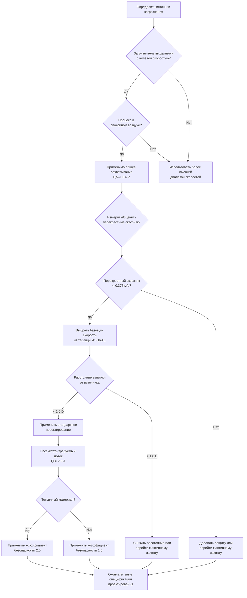

## Обзор общей скорости захвата

Общая скорость захвата в диапазоне 0,5–1,0 м/с представляет самый низкий уровень промышленных систем локального вытяжного воздухообмена, предназначенных для приложений, в которых загрязнители выделяются с минимальной энергией в относительно спокойный воздух. Этот диапазон скоростей решает ситуации, в которых загрязнители рассеиваются постепенно и равномерно, требуя только мягкого движения воздуха для эффективного захвата.

Фундаментальный принцип, определяющий захват на основе общей скорости, заключается в создании постоянной схемы воздушного потока, которая перехватывает загрязнители и транспортирует их до того, как они попадут в дыхательную зону работника или рассеются в общей среде помещения.

## Приложения, требующие захвата 0,5–1,0 м/с

Низкоскоростные системы захвата используются в конкретных промышленных процессах, где выделение загрязнителя происходит с минимальной скоростью или турбулентностью.

### Процессы испарения и диффузии

Операции обезжиривания с использованием маловолатильных растворителей производят пары, которые медленно поднимаются за счет естественной конвекции. Холодное обезжиривание в резервуаре, где детали погружены в растворитель при комнатной температуре, создает облака паров, которые поднимаются со скоростью, обычно ниже 0,42 м/с. Система захвата должна обеспечивать достаточное всасывание для преодоления этого естественного движения, учитывая окружающие воздушные потоки.

Операции поверхностного покрытия с использованием медленно сохнущих материалов, таких как нанесенные кистью лаки или масляные краски, выделяют пары постепенно в течение продолжительного периода. Источник загрязнения фактически становится всей площадью покрытой поверхности, требующей широкоплощадного захвата с мягким, но постоянным воздушным потоком.

### Низкотемпературные процессы

Прерывистые операции сварки, в которых периоды работы позволяют существенное охлаждение между сварками, производят дымовые плюмы с уменьшенной тепловой плавучестью. Начальный высокоскоростной выброс из сварочной дуги быстро уменьшается, оставляя остаточный дым, который рассеивается с низкой скоростью по мере охлаждения.

Операции заполнения резервуара, особенно летучей жидкостью при комнатной температуре, создают выделения паров на поверхности жидкости, которые медленно поднимаются благодаря разности плотностей. Скорость захвата должна учитывать площадь отверстия сосуда и скорость выделения пара, определяемую температурой и летучестью жидкости.

## Характеристики источников низкоскоростного загрязнения

Загрязнители, подходящие для захвата 0,5–1,0 м/с, имеют специфические характеристики выделения.

Загрязнитель выходит из источника практически с нулевой скоростью, полагаясь на тепловую конвекцию, молекулярную диффузию или очень мягкое механическое возмущение для начального движения. Примеры включают испарение при комнатной температуре из открытых контейнеров, оседание пыли с медленно движущихся конвейеров и выделение паров из спокойных жидких поверхностей.

Источник генерирует загрязнители с относительно низкой массовой скоростью потока, измеряемой в граммах в минуту, а не в килограммах в минуту. Эта низкая скорость генерации позволяет захват с скромными объемными расходами.

Условия окружающей среды вокруг источника остаются относительно стабильными, с минимальной турбулентностью, вызванной процессом, механическими вибрациями или быстрыми колебаниями температуры, которые могут ускорить рассеяние загрязнителя.

## Проектирование вытяжки для общего захвата

Эффективное проектирование вытяжки для низкоскоростного захвата подчеркивает площадь охвата и равномерность воздушного потока, а не концентрированную скорость всасывания.

### Принципы конфигурации вытяжки

Навесные вытяжки, расположенные над источниками тепла, используют тепловую стратификацию для улучшения захвата. Периметр вытяжки должен выходить за источник по крайней мере на вертикальное расстояние от источника к вытяжке, следуя соотношению:

$$L_{\text{hood}} = L_{\text{source}} + 2H$$

где $L_{\text{hood}}$ — размер вытяжки, $L_{\text{source}}$ — размер источника и $H$ — вертикальное расстояние от источника к отверстию вытяжки.

Закрывающие вытяжки, которые частично окружают источник, повышают эффективность захвата благодаря уменьшению открытой площади лица, через которую должны быть втянуты загрязнители. Расчет скорости захвата использует только открытую площадь лица:

$$V_{\text{capture}} = \frac{Q}{A_{\text{face}}}$$

где $Q$ — объемный расход (м³/ч) и $A_{\text{face}}$ — площадь отверстия вытяжки (м²).

### Эффекты фланца и перегородок

Добавление фланцев к периметрам вытяжки значительно повышает эффективность захвата, устраняя воздушный поток позади вытяжки. Фланец, выходящий на 15–30 см за пределы отверстия вытяжки, может снизить требуемый воздушный поток на 25–40% по сравнению с конструкциями без фланца.

Боковые перегородки, которые частично закрывают источник загрязнения, уменьшают помехи от перекрестных сквозняков и концентрируют воздушный поток по площади источника. Эффективность следует:

$$\eta_{\text{enclosure}} = \frac{A_{\text{enclosed}}}{A_{\text{total}}}$$

где эффективность закрытия увеличивается с соотношением замкнутой площади поверхности к общей площади поверхности, окружающей источник.

## Эффекты помех воздушных потоков

Системы общего захвата проявляют высокую чувствительность к окружающим воздушным потокам, поскольку скорости захвата близки к типичным скоростям движения воздуха в промышленных средах.

### Воздействие перекрестного сквозняка

Системы вентиляции здания, открытые двери и схемы движения создают воздушные потоки, обычно в диапазоне 0,25–0,5 м/с на промышленных объектах. Когда эти перекрестные сквозняки приближаются или превышают скорость захвата, дымовые плюмы загрязнителя отклоняются от отверстия вытяжки.

Критическая скорость перекрестного сквозняка, которая начинает нарушать эффективность захвата, составляет примерно:

$$V_{\text{critical}} = 0.5 \times V_{\text{capture}}$$

Для скорости захвата 0,75 м/с перекрестные сквозняки, превышающие 0,375 м/с, заметно снизят эффективность захвата, требуя увеличения расходов вытяжки или дополнительной защиты.

### Нарушение тепловой плюмы

Источники тепла создают восходящие воздушные потоки, которые могут помогать или мешать захвату в зависимости от расположения вытяжки. Источник тепла, генерирующий 1000 кДж/ч, создает скорость восходящего потока приблизительно:

$$V_{\text{thermal}} = K \sqrt[3]{Q_{\text{heat}}}$$

где $K$ — эмпирическая константа (приблизительно 50 для типичных условий) и $Q_{\text{heat}}$ — скорость выделения тепла в киловаттах.

## Соображения о расстоянии от источника

Скорость захвата быстро уменьшается с расстоянием от лица вытяжки, следуя обратным квадратичным соотношениям для вытяжек без фланца и более благоприятным характеристикам для конструкций с фланцем или закрытием.

### Взаимосвязь затухания скорости

Для простого отверстия без фланца, центральная скорость на расстоянии от вытяжки следует:

$$V_x = \frac{V_{\text{face}}}{(10x/D + 1)^2}$$

где $V_x$ — скорость на расстоянии $x$, $V_{\text{face}}$ — скорость на лице и $D$ — диаметр вытяжки или эквивалентный диаметр для прямоугольных отверстий.

Это соотношение демонстрирует, что захват загрязнителей даже на скромных расстояниях требует существенно более высоких скоростей на лице. Источник загрязнителя, расположенный в 30 см от вытяжки диаметром 30 см, требует приблизительно в 4 раза большую скорость на лице по сравнению с источником на лице вытяжки.

### Практические ограничения расстояния

Руководящие принципы ASHRAE рекомендуют максимальные расстояния источник-вытяжка для приложений общего захвата:

- Простые навесные вытяжки: источник должен быть в пределах 1,0–1,5 диаметра вытяжки
- Фланцевые щелевые вытяжки: источник в пределах 1,0 ширины щели
- Внешние вытяжки: источник в пределах 0,5 диаметра вытяжки

Превышение этих расстояний переводит приложение в зону активного захвата, требуя скорости 1,0–2,5 м/с или выше.

## Рекомендации ASHRAE для общего захвата

Американская конференция государственных промышленных гигиенистов предоставляет конкретное руководство для приложений с низкоскоростным захватом в своем Руководстве по промышленной вентиляции.

### Критерии выбора скорости

ASHRAE определяет условия общего захвата как:

«Выделение загрязнителя практически с нулевой скоростью в относительно спокойный воздух, требующее захвата и контроля в пределах зоны воздействия без заметных перекрестных сквозняков».

Рекомендуемые скорости в этой категории:

| Тип приложения | Рекомендуемая скорость захвата |
|-----------------|------------------------------|
| Испарение из резервуаров, обезжиривание | 0,5–0,75 м/с |
| Прерывистые низкоскоростные процессы | 0,5–0,75 м/с |
| Заполнение баррелей при комнатной температуре | 0,5–0,75 м/с |
| Загрузка конвейера на низких скоростях | 0,63–0,88 м/с |
| Обработка химикатов в лабораториях | 0,75–1,0 м/с |
| Низкоскоростные кабины | 0,75–1,0 м/с |

### Коэффициенты безопасности конструкции

Конструкции общего захвата должны включать коэффициенты безопасности, учитывающие:

1. Предполагаемые перекрестные сквозняки: умножить базовую скорость на 1,5–2,0
2. Неправильная геометрия источника: увеличить скорость на 25–50%
3. Токсичные материалы: использовать верхний диапазон значений независимо от условий процесса
4. Старые или плохо обслуживаемые воздуховоды: учесть 25% снижение доставленного потока

Окончательная скорость захвата конструкции включает эти коэффициенты:

$$V_{\text{design}} = V_{\text{base}} \times SF_{\text{draft}} \times SF_{\text{geometry}} \times SF_{\text{toxicity}}$$

## Приложения и рекомендуемые скорости

Следующая таблица предоставляет конкретное руководство для распространенных промышленных приложений, требующих скоростей захвата в целом.

| Процесс | Тип загрязнителя | Рекомендуемая скорость (м/с) | Тип вытяжки |
|---------|-----------------|---------------------------|-----------|
| Холодное обезжиривание в резервуаре | Пары растворителя | 0,5–0,63 | Навесная вытяжка с боковыми перегородками |
| Заполнение баррелей (окружающая среда) | Органические пары | 0,5–0,75 | Наружная щелевая вытяжка |
| Нанесение краски кистью | Выбросы ЛОС | 0,63–0,88 | Кабина с задним выхлопом |
| Барабанная полировка (низкая скорость) | Пыль | 0,75–1,0 м/с | Навесная вытяжка |
| Химический перенос | Различные пары | 0,75–1,0 м/с | Закрывающая вытяжка |
| Лабораторный стол для вентиляции | Смешанные химикаты | 0,88–1,0 м/с | Закрытый стол |
| Передача на медленном конвейере | Пыль, волокна | 0,63–0,88 м/с | Навесная вытяжка с фланцами |
| Охлаждающие резервуары | Пар, пары | 0,5–0,63 м/с | Широкая навесная вытяжка |

## Блок-схема проектирования системы

## Проверка производительности

Установленные системы требуют полевой проверки, чтобы обеспечить достижение расчетных скоростей захвата в критических контрольных точках.

Проведите траверс лица вытяжки с помощью анемометра скорости или теплового анемометра в нескольких точках по всему отверстию. Средние показания должны соответствовать или превышать спецификации конструкции, при этом ни один отдельный показатель не должен быть ниже 80% расчетного значения.

Измерьте эффективность захвата, используя трассерный дым или выпуски паров в месте источника загрязнения. Эффективный захват показывает немедленное движение дыма к отверстию вытяжки без видимого выхода в общее рабочее пространство.

Задокументируйте схемы воздушных потоков рядом с установкой, используя дымовые трубки для выявления неожиданных перекрестных сквозняков, которые могут нарушить производительность захвата.

Контролируйте статическое давление системы в вытяжке и сравните с расчетами конструкции. Значительные отклонения указывают на засорение воздуховода, деградацию вентилятора или утечку, требующие исправления.

## Соображения по техническому обслуживанию

Низкоскоростные системы требуют особого внимания к факторам, которые снижают воздушный поток, поскольку небольшие полученные скоростные запасы обеспечивают ограниченный допуск на деградацию.

Забивание фильтра в системах, обрабатывающих загрязнители твердых частиц, может снизить расход потока на 30–50% до замены, если мониторинг неадекватен. Установите максимально допустимые увеличения статического давления и замените фильтры при достижении пороговых значений.

Загрязнение воздуховода от конденсации паров или накопления пыли снижает эффективный диаметр и увеличивает сопротивление. Ежегодная проверка воздуховода и его очистка поддерживают производительность конструкции.

Проскальзывание ремня вентилятора или износ подшипников двигателя снижает доставляемый поток без очевидных симптомов. Ежеквартальное измерение расходов системы выявляет развивающиеся проблемы до того, как они нарушают защиту работника.

Повреждение вытяжки от оборудования для обработки материалов или коррозии может создать отверстия, допускающие поступление окружающего воздуха, снижая скорость на лице. Ежемесячные визуальные осмотры выявляют повреждения, требующие ремонта.
