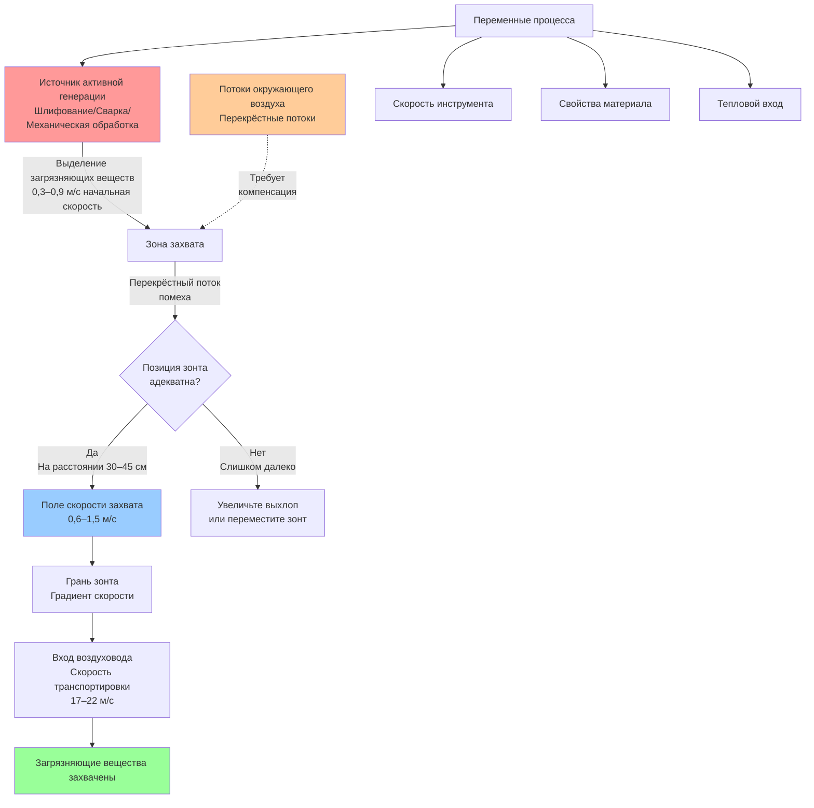

## Источники активной генерации загрязняющих веществ

Источники активной генерации выделяют загрязняющие вещества с заметной начальной скоростью благодаря энергии технологического процесса. Эти операции требуют более высоких скоростей захвата (0,6–1,5 м/с) по сравнению с пассивными источниками, поскольку загрязняющие вещества проецируются в рабочую зону с импульсом.

### Характерные особенности процесса

Активная генерация предполагает механическую или тепловую энергию, которая придаёт скорость загрязняющим веществам:

- **Механические процессы**: Шлифование, полирование, операции механической обработки, где вращающиеся инструменты выбрасывают частицы
- **Тепловые процессы**: Сварка, резка, пайка, где тепло создаёт плюмы плавучести и искры
- **Ударные операции**: Откалывание, абразивная очистка струёй, где сила разбрасывает материал
- **Высокоскоростное удаление материала**: Пиление, фрезерование, где режущее действие создаёт взвешенный мусор

Начальная скорость выделяемых загрязняющих веществ находится в диапазоне 0,3–1,5 м/с в зависимости от интенсивности процесса, что требует систем выхлопа, способных преодолеть этот импульс и любые потоки окружающего воздуха.

## Приложения шлифования

Операции шлифования производят потоки частиц с высокой скоростью, требующие надёжного проектирования захвата вытяжного зонта.

### Плоское шлифование

Плоские шлифовальные машины производят непрерывные потоки частиц, проецируемые перпендикулярно поверхности обработки. Требования к скорости захвата:

$$V_c = V_p + V_d + V_s$$

Где:
- $V_c$ = Требуемая скорость захвата (м/с)
- $V_p$ = Скорость проекции частиц (0,3–0,9 м/с)
- $V_d$ = Компенсация скорости перекрёстного потока (м/с)
- $V_s$ = Скорость коэффициента безопасности (0,15–0,3 м/с)

Типичные проектные значения находятся в диапазоне 0,9–1,5 м/с на периферии шлифовального круга.

### Настольное и ножное шлифование

Настольные шлифовальные машины требуют нисходящих или боковых зонтов, расположенных на расстоянии не более 30 см от круга. Скорость захвата должна преодолеть:

- Эффекты периферийной скорости круга (скорость круга 15–30 м/с создаёт локальную турбулентность)
- Траектория частиц от шлифования
- Эффекты блокировки тела оператора на картины потока воздуха

Проектная скорость захвата: 1,0–1,5 м/с на грани шлифовального круга.

## Сварка и термическая резка

Процессы сварки производят как дымные частицы, так и тепловые плюмы, требующие специализированного подхода к выхлопу.

### Характеристики сварочного дыма

Сварка производит ультратонкие частицы (0,01–1,0 мкм), переносимые вверх тепловой конвекцией со скоростью 0,3–0,6 м/с. Поднимающийся плюм расширяется по мере его движения от дуги:

$$D = D_0 + 2 \alpha z$$

Где:
- $D$ = Диаметр плюма на высоте $z$ (см)
- $D_0$ = Начальный диаметр плюма в источнике (см)
- $\alpha$ = Угол увлечения (обычно 0,15–0,20)
- $z$ = Высота над сварочной дугой (см)

### Требования к позиционированию вытяжного зонта

Эффективный захват сварочного дыма требует:

1. **Расстояние от дуги**: Максимум 30–45 см от источника дыма
2. **Боковое позиционирование**: Центральная ось зонта совмещена с преобладающим направлением дыма
3. **Зона захвата**: Грань зонта должна перехватить расширяющийся плюм до того, как воздух помещения разбавит концентрацию
4. **Избегайте нарушения потока воздуха**: Позиционируйте, чтобы не мешать защитному газу (процессы GMAW, GTAW)

Рекомендуемая скорость захвата: 0,6–1,2 м/с, измеренная в месте расположения источника дыма.

### Операции термической резки

Плазменная и кислородно-топливная резка производят более интенсивные плюмы, чем сварка, из-за более высокого теплового входа. Нисходящие столы со скоростью грани 0,75–1,2 м/с обеспечивают оптимальный захват для горизонтальных операций резки.

## Операции механической обработки

Операции резания металла производят стружку и туман, требующие сдерживания вблизи места генерации.

### Процессы генерации тумана

Точение, фрезерование и сверление с режущими жидкостями распыляют охлаждающую жидкость в вдыхаемый туман (капельки размером 1–10 мкм). Требования захвата:

| Процесс механической обработки | Типичная скорость захвата | Расстояние зонта |
|--------------------------------|---------------------------|------------------|
| Ручное точение | 0,6–0,9 м/с | 30–45 см |
| Фрезерование с ЧПУ | 0,75–1,0 м/с | 20–30 см |
| Сверление с высокой скоростью | 0,9–1,2 м/с | 15–30 см |
| Шлифование (влажное) | 1,0–1,5 м/с | 15–25 см |

### Контроль стружки и частиц

Сухая механическая обработка производит стружку с существенной массой и скоростью. Проектирование зонта должно учитывать:

- Траекторию стружки от режущего инструмента (варьируется со скоростью и геометрией резания)
- Зона захвата, расположенная в пути полёта стружки
- Адекватная скорость транспортировки в воздуховоде (17–22 м/с для металлической стружки)

## Компенсация перекрёстного потока

Перекрёстные потоки от вентиляции здания, открытых дверей или потоков воздуха технологического оборудования препятствуют захвату, отклоняя траектории загрязняющих веществ от грани зонта.

### Методология компенсации

Требуемое увеличение скорости захвата для преодоления перекрёстных потоков:

$$V_{required} = V_{base} + k \cdot V_{draft}$$

Где:
- $V_{required}$ = Отрегулированная скорость захвата (м/с)
- $V_{base}$ = Базовая скорость захвата для процесса (м/с)
- $V_{draft}$ = Измеренная скорость перекрёстного потока (м/с)
- $k$ = Коэффициент компенсации (1,5–2,5 в зависимости от геометрии зонта)

### Стратегии снижения перекрёстного потока

1. **Физические барьеры**: Установите частичные ограждения или перегородки для блокирования воздушных потоков
2. **Увеличение объёма выхлопа**: Повысьте расход через зонт, чтобы расширить зону захвата
3. **Системы push-pull**: Добавьте струи подаваемого воздуха для противодействия перекрёстным потокам
4. **Переместите процесс**: Переместите операции вдали от дверей, воздушных завес или диффузоров подачи

## Обоснование требований более высокой скорости

Источники активной генерации требуют скоростей захвата 0,6–1,5 м/с, основываясь на фундаментальной физике:

### Рассмотрение импульса

Загрязняющие вещества, выделяемые с начальной скоростью, обладают кинетической энергией, которую необходимо преодолеть:

$$E_k = \frac{1}{2} m v_p^2$$

Система выхлопа должна обеспечить достаточный импульсный поток, чтобы перенаправить частицы в зонт против их начальной траектории. Более высокие скорости захвата создают более сильные градиенты скорости вблизи грани зонта, расширяя эффективную зону захвата.

### Эффекты турбулентности

Активные процессы создают локальную турбулентность, которая рассеивает загрязняющие вещества в случайных направлениях. Статистический анализ показывает, что скорость захвата должна превышать среднеквадратичную турбулентную скорость на коэффициент 2–3 для достижения надёжного захвата:

$$V_c \geq (2-3) \cdot v_{rms}$$

Для операций шлифования, где $v_{rms}$ = 0,24–0,45 м/с, это даёт скорости захвата 0,6–1,35 м/с.

### Предотвращение разбавления

Более высокие скорости снижают время пребывания загрязняющих веществ в рабочей зоне перед захватом, минимизируя воздействие:

$$t = \frac{x}{V_c}$$

Где $x$ – расстояние от источника до грани зонта. Удвоение скорости захвата сокращает время пребывания в дыхательной зоне вдвое.

## Руководство Американской конференции государственных промышленных гигиенистов по промышленной вентиляции

Руководство Американской конференции государственных промышленных гигиенистов (ACGIH) по промышленной вентиляции содержит рекомендации по проектированию для источников активной генерации.

### Философия проектирования вытяжных зонтов

ACGIH классифицирует условия выделения загрязняющих веществ:

- **Выделяется без заметной скорости**: 0,15–0,3 м/с (пассивные источники)
- **Выделяется с низкой скоростью**: 0,3–0,6 м/с (испарение, маловатные процессы)
- **Активная генерация в быстрое движение воздуха**: 0,6–1,5 м/с (шлифование, сварка, механическая обработка)
- **Выделяется с высокой начальной скоростью**: 1,5–6,0 м/с (абразивная очистка струёй, высокоскоростное шлифование)

### Рекомендации процедуры проектирования

1. **Определите характеристики выделения**: Определите скорость и направление загрязняющих веществ путём наблюдения процесса
2. **Выберите тип зонта**: Выберите окружающий, наружный или принимающий зонт в зависимости от требований доступа к процессу
3. **Оптимально позиционируйте зонт**: Расположите в пределах рекомендуемого расстояния и ориентации
4. **Рассчитайте требуемый расход**: Используйте коэффициенты потерь входа зонта и желаемую скорость захвата
5. **Учитывайте реальные условия**: Добавьте коэффициенты безопасности для перекрёстных потоков, переменных операций и неопределённостей

### Конкретные проектные значения

ACGIH предоставляет пластины проектирования, специфичные для зонтов, с требованиями к размерам и объёмными расходами. Для активной генерации:

| Приложение | Рекомендуемая скорость захвата ACGIH | Ссылка на пластину проектирования |
|-----------|---------------------------------------|-----------------------------------|
| Настольное шлифование | 1,0–1,5 м/с | VS-15-10 до VS-15-30 |
| Сварочная скамья | 0,6–0,9 м/с | VS-50-10 до VS-50-50 |
| Механическая обработка с охлаждающей жидкостью | 0,75–1,2 м/с | VS-40-05 до VS-40-20 |
| Портативное шлифование | 0,9–1,5 м/с | VS-15-50, VS-15-60 |

## Таблицы проектирования, специфичные для приложения

### Требования к скорости источника активной генерации

| Источник загрязняющих веществ | Скорость выделения | Рекомендуемая скорость захвата | Максимальное расстояние зонта |
|-------------------------------|-------------------|--------------------------------|-------------------------------|
| Плоское шлифование (сухое) | 0,6–1,2 м/с | 1,2–1,5 м/с | 25–30 см |
| Настольное шлифование (круг < 40 см) | 0,45–0,9 м/с | 1,0–1,35 м/с | 20–30 см |
| Сварка MIG/MAG | 0,3–0,6 м/с (тепловая) | 0,75–1,0 м/с | 30–45 см |
| Сварка TIG | 0,24–0,45 м/с (тепловая) | 0,6–0,9 м/с | 25–40 см |
| Плазменная резка | 0,6–1,0 м/с (тепловая + давление) | 0,9–1,35 м/с | 15–30 см (нисходящая) |
| Механическая обработка с ЧПУ (влажная) | 0,3–0,75 м/с | 0,75–1,0 м/с | 20–35 см |
| Ручная механическая обработка (сухая) | 0,24–0,6 м/с | 0,6–0,9 м/с | 30–45 см |
| Портативное шлифование | 0,6–1,35 м/с | 1,2–1,8 м/с | 15–25 см |
| Полирование/буфинг | 0,45–0,9 м/с | 0,9–1,35 м/с | 25–35 см |

### Коэффициенты производительности зонта

| Фактор | Воздействие на требуемую скорость захвата | Корректирующий коэффициент |
|--------|------------------------------------------|---------------------------|
| Перекрёстный поток < 0,15 м/с | Минимальный | 1,0 |
| Перекрёстный поток 0,15–0,3 м/с | Умеренный | 1,2–1,5 |
| Перекрёстный поток > 0,3 м/с | Тяжёлый | 1,5–2,5 |
| Прерывистая работа | Снижение эффективности | 1,1–1,3 |
| Переменное положение источника | Требуется большая зона захвата | 1,2–1,5 |
| Материал высокой токсичности | Консервативное проектирование | 1,3–2,0 |
| Несколько одновременных источников | Эффекты помех | 1,2–1,8 |

## Реализация проектирования

Успешные системы выхлопа активной генерации требуют комплексного рассмотрения геометрии зонта, картин потока воздуха и ограничений процесса. Проверка в полевых условиях путём дымового тестирования и измерений скоростей подтверждает производительность проектирования и определяет модификации, необходимые для оптимального захвата загрязняющих веществ.

Регулярное техническое обслуживание зонтов, воздуховодов и вентиляторов поддерживает скорости захвата в соответствии с проектом. Периодические измерения скорости в месте расположения источника обеспечивают постоянную защиту при изменении процессов или старении оборудования.
