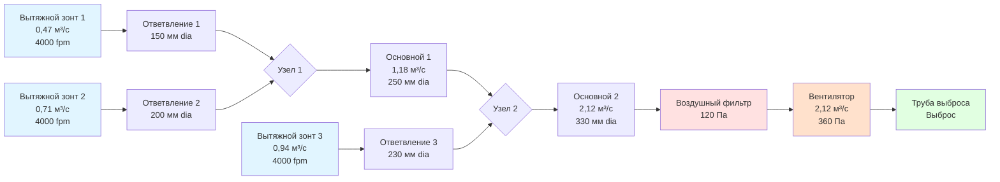

## Физические принципы проектирования вытяжных воздуховодов

Проектирование вытяжных воздуховодов для промышленных систем вентиляции требует сбалансирования трёх основных требований: поддержания достаточной транспортной скорости для предотвращения оседания частиц, минимизации энергопотребления за счёт снижения потерь на трение и обеспечения структурной прочности при рабочих условиях. В отличие от комфортных HVAC-воздуховодов, где скорости редко превышают 6 м/с, промышленные вытяжные воздуховоды должны поддерживать скорости от 6 до 13,7 м/с в зависимости от характеристик частиц, что приводит к значительно более высоким потерям давления и требует тщательного инженерного анализа.

Фундаментальная проблема вытекает из поведения частиц в горизонтальных и наклонных воздуховодах. Когда скорость воздуховода падает ниже минимальной транспортной скорости, частицы оседают под действием гравитации, создавая накопления, которые уменьшают эффективную площадь воздуховода, увеличивают локальные скорости, вызывают дополнительные потери давления и создают опасность пожара или взрыва в зависимости от свойств материала.

## Требования к минимальной транспортной скорости

Транспортная скорость представляет минимальную скорость в воздуховоде, необходимую для поддержания частиц в взвешенном состоянии и предотвращения их оседания. Эта скорость зависит от размера, плотности, формы и концентрации частиц. ACGIH предоставляет эмпирически полученные минимальные транспортные скорости на основе характеристик загрязнителя:

| Тип загрязнителя | Характеристики частиц | Минимальная скорость |
|------------------|--------------------------|------------------|
| Газы и пары | Отсутствие твёрдых частиц | 3–6 м/с |
| Дымы | < 1 микрон, низкая плотность | 6–7,6 м/с |
| Очень тонкая пыль | 1–10 микронов, лёгкая | 7,6–9,1 м/с |
| Сухая пыль и порошки | 10–100 микронов, умеренная плотность | 9,1–10,7 м/с |
| Средняя промышленная пыль | Смешанное распределение размеров | 10,7–12,2 м/с |
| Тяжёлая пыль и стружка | > 100 микронов, высокая плотность, металл | 12,2–13,7 м/с |

Эти значения применяются к горизонтальным и наклонным воздуховодам. Вертикальные воздуховоды, транспортирующие частицы вверх, требуют скоростей, превышающих скорость терминального оседания частиц с коэффициентом безопасности, обычно 1,25–1,5 раза выше указанных выше значений.

### Скорость терминального оседания

Для сферических частиц в ламинарном потоке (Re < 1) скорость терминального оседания следует закону Стокса:

$$V_t = \frac{g d_p^2 (\rho_p - \rho_f)}{18 \mu}$$

Где:
- $V_t$ = скорость терминального оседания (м/с)
- $g$ = ускорение свободного падения (9,81 м/с²)
- $d_p$ = диаметр частицы (м)
- $\rho_p$ = плотность частицы (кг/м³)
- $\rho_f$ = плотность жидкости (воздуха) (кг/м³)
- $\mu$ = динамическая вязкость воздуха (Па·с)

Для более крупных частиц в турбулентном потоке необходимо использование эмпирических корреляций или итеративные решения уравнения сопротивления.

## Расчёты размеров воздуховодов

Диаметр воздуховода (или эквивалентный диаметр для прямоугольных воздуховодов) определяется по требуемому объёмному расходу и минимальной транспортной скорости:

$$D = \sqrt{\frac{4Q}{\pi V}}$$

Где:
- $D$ = диаметр воздуховода (м)
- $Q$ = объёмный расход (м³/ч)
- $V$ = скорость в воздуховоде (м/с)

Для прямоугольных воздуховодов эквивалентный диаметр для расчётов потерь на трение:

$$D_{eq} = 1,30 \frac{(ab)^{0,625}}{(a+b)^{0,25}}$$

Где $a$ и $b$ — размеры воздуховода в сантиметрах.

### Динамическое давление и статическое давление

Динамическое давление представляет кинетическую энергию движущегося воздуха:

$$VP = \frac{\rho V^2}{2g_c \times 1097}$$

В практических единицах при стандартной плотности воздуха (1,2 кг/м³):

$$VP = 0,06 V^2 \text{ Па}$$

Где $V$ в м/с.

Полное давление равно статическому давлению плюс динамическое давление:

$$TP = SP + VP$$

## Потери на трение в прямых воздуховодах

Потери на трение в прямых воздуховодах следуют уравнению Дарси–Вейсбаха:

$$\Delta P_f = f \frac{L}{D} \frac{\rho V^2}{2g_c}$$

Где:
- $\Delta P_f$ = потеря давления на трение (Па)
- $f$ = коэффициент трения (безразмерный)
- $L$ = длина воздуховода (м)
- $D$ = диаметр воздуховода (м)
- $\rho$ = плотность воздуха (кг/м³)
- $V$ = скорость воздуха (м/с)
- $g_c$ = гравитационная постоянная (9,81 м/с²)

Для круглых воздуховодов, упрощённые расчётные диаграммы или следующее приближение для турбулентного потока в металлических воздуховодах:

$$\Delta P_{100m} = 0,103 \frac{Q^{1.9}}{D^{5.02}}$$

Где $Q$ в м³/ч, $D$ в сантиметрах, и $\Delta P_{100m}$ в Па на 100 м.

### Определение коэффициента трения

Для турбулентного потока в коммерческих стальных воздуховодах (абсолютная шероховатость ε ≈ 0,15 мм), коэффициент трения зависит от числа Рейнольдса:

$$Re = \frac{\rho V D}{\mu} = \frac{V D}{\nu}$$

Для полностью развитого турбулентного потока (Re > 4000) применяется уравнение Кулебрука:

$$\frac{1}{\sqrt{f}} = -2 \log_{10}\left(\frac{\varepsilon/D}{3,7} + \frac{2,51}{Re\sqrt{f}}\right)$$

Это требует итеративного решения. Для промышленных вытяжных систем шероховатость увеличивается со временем из-за прилипания частиц, требуя консервативного выбора коэффициента трения или запаса прочности.

## Потери в фитингах и компонентах

Потери через фитинги, переходы и ответвления выражаются как кратные динамическому давлению:

$$\Delta P_{fitting} = C \times VP$$

Где $C$ — коэффициент потерь, специфичный для геометрии фитинга.

### Коэффициенты потерь в типичных фитингах

| Тип фитинга | Конфигурация | Коэффициент потерь C |
|--------------|--------------|-------------------|
| Колено 90° | r/D = 1,5, круглое | 0,27 |
| Колено 90° | r/D = 1,0, круглое | 0,48 |
| Колено 90° | r/D = 0,75, круглое | 0,75 |
| Колено 45° | r/D = 1,5, круглое | 0,17 |
| Вход, раструб | r/D = 0,2 | 0,05 |
| Вход, острый край | Без скругления | 0,50 |
| Выход | Выброс в атмосферу | 1,00 |
| Плавное сужение | Угол 30° | 0,02 |
| Резкое сужение | Плечо 90° | 0,50 |
| Плавное расширение | Угол 15° | 0,15 |
| Резкое расширение | Плечо 90° | 1,00 |

Вход ответвлений требует специального анализа с использованием дроссельных заслонок или балансировочных демпферов для достижения требуемого распределения расхода.

## Выбор материала воздуховода

Выбор материала зависит от характеристик загрязнителя, температуры, требуемой устойчивости к абразии и стоимости.

| Материал | Толщина | Применение | Преимущества | Ограничения |
|----------|---------|-----------|------------|------------|
| Оцинкованная сталь | 0,8–1,6 мм | Общая пыль, некоррозионная | Низкая стоимость, доступность | Коррозия при влажности, химикалии |
| Чёрная сталь | 1,6–2,8 мм | Сварные системы, высокая абразия | Высокая прочность, свариваемость | Ржавчина без покрытия |
| Нержавеющая сталь 304 | 0,8–1,6 мм | Агрессивные среды, продукты питания | Устойчивость к коррозии | Более высокая стоимость |
| Нержавеющая сталь 316 | 0,9–1,6 мм | Агрессивные химикалии | Превосходная устойчивость к коррозии | Самая высокая стоимость |
| ПВХ/ХПВХ | Класс 40/80 | Кислые дымы, выхлоп увлажнителя | Иммунитет к коррозии, гладкая внутренняя поверхность | Температурный предел (60–93°C) |
| Стеклопластик (FRP) | 3–6 мм | Агрессивные газы, прибрежные | Лёгкий, устойчив к коррозии | Более низкая прочность, деградация УФ |
| Алюминий | 0,9–1,6 мм | Чистые применения | Лёгкий, устойчив к коррозии | Реактивен с щелочами, не для искрообразующих опасностей |

### Рассмотрение абразии

Для абразивных частиц (шлифовка металла, литейная пыль, деревообработка) износ воздуховода пропорционален:

$$Износ \propto V^3 \times C \times \rho_p \times H$$

Где:
- $V$ = скорость
- $C$ = концентрация частиц
- $\rho_p$ = плотность частицы
- $H$ = твёрдость

Материалы, устойчивые к абразии, включают:
- Упрочнённая сталь (пластины износа в зонах высокого удара)
- Резиновая накладка, устойчивая к абразии
- Полиэтилен сверхвысокой молекулярной массы (UHMW-PE) облицовка
- Увеличенная толщина материала на коленах и ответвлениях

## Методы изготовления воздуховодов

**Спиральный шов (спиральный замок)**: Заводская непрерывная спиральная конструкция, наиболее распространена для круглых воздуховодов диаметром 75–1500 мм. Герметична с мастикой, подходит для умеренных давлений.

**Продольный шов**: Прямой шов, используется для специальной изготовки, переходов и больших диаметров. Требует усиления для структурной стабильности.

**Сварная конструкция**: Требуется для абразивных материалов, токсичных веществ или высоких температур. Полностью герметична без прокладок. Наиболее дорогая, но наиболее долговечная.

**Фланцевые соединения**: Болтовые фланцы с прокладками в соединениях. Позволяет разборку для инспекции и очистки. Требуется для пластиковых и стеклопластиковых систем.

## Проектирование конфигурации системы

### Принципы балансировки

Каждое ответвление должно достичь расчётного расхода. Поскольку расход распределяется в соответствии с сопротивлением пути, балансировка требует:

1. Расчёт полной потери давления от каждого вытяжного зонта до входа вентилятора
2. Пути с более низким сопротивлением будут иметь избыточный расход
3. Добавьте дроссельные заслонки или балансировочные демпферы для выравнивания потерь давления
4. Измерение скорости в каждом ответвлении подтверждает надлежащее распределение

Сбалансированное условие:

$$SP_{зонт1} + \Delta P_{путь1} = SP_{зонт2} + \Delta P_{путь2} = ... = SP_{вентилятор}$$

## Вертикальная и горизонтальная ориентация воздуховода

Вертикальные воздуховоды, транспортирующие частицы вверх, требуют более высоких скоростей. Эффективная компонента гравитации:

$$V_{вертикальный} = V_{горизонтальный} \times \sqrt{1 + \frac{V_t}{V_{горизонтальный}}}$$

Для потока вниз по вертикали более низкие скорости могут быть приемлемы, но солитация (накопление частиц с последующим потоком пробок) создаёт операционные проблемы. Проектируйте вертикальные потоки вниз для той же скорости, что и горизонтальные участки.

## Доступ для очистки и порты инспекции

NFPA 652 (воспламеняемая пыль) и хорошая практика требуют:

- Люки очистки каждые 4–6 м в горизонтальных участках
- Очистка в основании вертикальных стояков
- Дверцы доступа выше и ниже воздушных фильтров
- Прозрачные секции инспекции для визуального наблюдения
- Правильно уплотнённые и зафиксированные для поддержания целостности системы

## Рассмотрение теплового расширения

Для выхлопа с повышенной температурой (> 65°C) тепловое расширение вызывает:

$$\Delta L = \alpha L \Delta T$$

Где:
- $\Delta L$ = изменение длины
- $\alpha$ = коэффициент теплового расширения (1,17×10⁻⁵ м/м/°C для стали)
- $L$ = длина воздуховода
- $\Delta T$ = изменение температуры

Предусмотрите расширительные суставы каждые 12–30 м в зависимости от температуры для предотвращения потери прочности или растрескивания от напряжений.

## Пример сводки потерь давления

Для 15-метрового участка воздуховода диаметром 300 мм из оцинкованной стали, транспортирующего 1,89 м³/с при скорости 4 м/с с двумя коленами 90° (r/D = 1,5):

**Динамическое давление**:
$$VP = 0,06 \times 4^2 = 0,96 \text{ Па}$$

**Потеря на трение** (использование приближения):
$$\Delta P_f = 0,103 \times \frac{1,89 \times 1,9}{0,3^{5,02}} \times \frac{15}{100} = 41 \text{ Па}$$

**Потери на коленах**:
$$\Delta P_{колена} = 2 \times 0,27 \times 0,96 = 0,52 \text{ Па}$$

**Общая потеря участка**:
$$\Delta P_{всего} = 41 + 0,52 = 41,52 \text{ Па}$$

## Контрольный список проектирования

Надлежащее проектирование вытяжного воздуховода требует:

- Минимальная транспортная скорость поддерживается по всей системе
- Диаметр воздуховода увеличивается на узлах, чтобы ограничить увеличение скорости максимум 20%
- Выбор материала, подходящий для температуры и химического воздействия
- Надлежащая структурная опора каждые 3–4 м для металлических воздуховодов
- Наклонные горизонтальные участки на 1–2% по направлению к люкам очистки там, где это практично
- Плавные переходы с максимальным углом расширения 30°, угол сужения 60°
- Входы ответвлений под углом 30–45° к направлению потока основного воздуховода
- Сварные или герметичные соединения для систем с частицами для предотвращения утечек
- Надлежащее заземление и соединение для воспламеняемой пыли или материалов с чувствительностью к статике

## Заключение

Проектирование вытяжных воздуховодов для промышленной вентиляции представляет специализированную инженерную дисциплину, требующую применения принципов механики жидкостей, эмпирических данных из стандартов ACGIH и практических знаний по изготовлению. Надлежащий размер обеспечивает поддержание минимальных транспортных скоростей для предотвращения оседания при минимизации энергопотребления за счёт тщательного внимания к потерям на трение и выбору фитингов. Выбор материала должен учитывать химическую совместимость, устойчивость к температуре и характеристики абразии, специфичные для каждого применения. Результирующая система обеспечивает надёжный транспорт загрязнителей при проектировании с надлежащими коэффициентами безопасности и поддержании в соответствии с требованиями производителя и нормативами.
