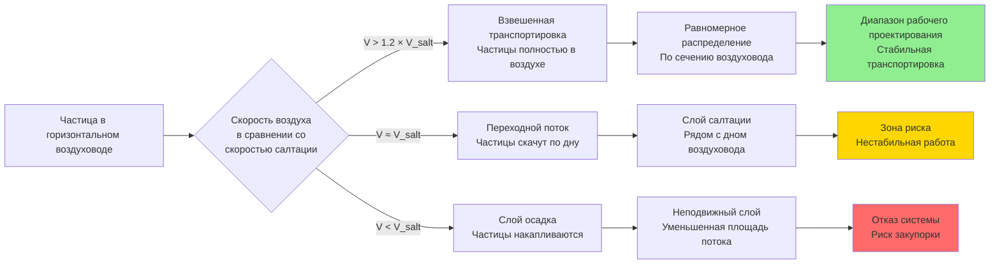

# Транспортировка материалов в вытяжных воздуховодах

Транспортировка материалов в промышленных системах вытяжных воздуховодов включает одновременное движение дисперсных частиц и воздуха через закрытые каналы. Основная проблема заключается в поддержании достаточной скорости воздуха для предотвращения осаждения частиц при минимизации энергопотребления и износа воздуховода. Физика транспортировки зависит от свойств частиц (размер, плотность, форма), свойств воздуха (скорость, плотность, вязкость) и геометрии воздуховода (диаметр, ориентация, шероховатость). Правильное проектирование требует понимания трёх критических скоростей: конечной скорости падения (скорость свободного падения частицы), скорости улавливания (увлечение с поверхностей) и скорости салтации (минимальная горизонтальная скорость транспортировки без осаждения). Справочное руководство ACGIH по промышленной вентиляции предоставляет эмпирические скорости транспортировки от 910 м/ч до 1670 м/ч на основе характеристик материала, что представляет проверенные на практике коэффициенты безопасности выше рассчитанных скоростей салтации.

## Физика транспортировки частиц

### Силы, действующие на частицы

Частицы, взвешенные в движущемся потоке воздуха, испытывают действие многих конкурирующих сил, определяющих поведение при транспортировке.

**Сила сопротивления (противодействующая относительному движению частицы в воздухе):**

$$F_D = \frac{1}{2} \times C_D \times \rho_a \times A_p \times (V_{air} - V_{particle})^2$$

Где:
- $F_D$ = Сила сопротивления (кН)
- $C_D$ = Коэффициент сопротивления (0,44 для сфер при Re > 1000, выше для неправильных частиц)
- $\rho_a$ = Плотность воздуха (1,2 кг/м³ при стандартных условиях)
- $A_p$ = Проекционная площадь частицы перпендикулярно потоку (м²)
- $V_{air}$ = Скорость воздуха (м/с)
- $V_{particle}$ = Скорость частицы (м/с)

**Гравитационная сила (вызывающая осаждение):**

$$F_G = m_p \times g = \frac{\pi \times d_p^3}{6} \times \rho_p \times g$$

Где:
- $m_p$ = Масса частицы (кг)
- $g$ = Ускорение свободного падения (9,81 м/с²)
- $d_p$ = Диаметр частицы (м)
- $\rho_p$ = Плотность материала частицы (кг/м³)

**Выталкивающая сила (противодействующая гравитации):**

$$F_B = \frac{\pi \times d_p^3}{6} \times \rho_a \times g$$

Чистая гравитационная сила равна $F_G - F_B$, однако выталкивающая сила незначительна для типичных промышленных частиц, так как $\rho_p \gg \rho_a$.

### Конечная скорость падения

Конечная скорость падения представляет собой равновесную скорость падения, при которой сила сопротивления уравновешивает гравитационную силу. Это определяет минимальную вертикальную скорость в воздуховоде, необходимую для предотвращения осаждения частиц.

**Уравнение конечной скорости (выведено из баланса сил):**

$$V_t = \sqrt{\frac{4 \times g \times d_p \times (\rho_p - \rho_a)}{3 \times C_D \times \rho_a}}$$

Где:
- $V_t$ = Конечная скорость падения (м/с)
- Все остальные обозначения как указано ранее

Для чисел Рейнольдса Re > 1000 (типично для частиц > 100 мкм в воздухе) коэффициент сопротивления $C_D \approx 0,44$. Для более мелких частиц в ламинарном потоке (Re < 1) применяется закон Стокса с $C_D = 24/Re$.

**Конечные скорости падения для типичных промышленных материалов:**

| Материал | Плотность частиц (кг/м³) | Размер частиц (мкм) | Конечная скорость (м/ч) | Скорость вертикальной транспортировки (м/ч) |
|----------|---------------------------|-------------------|-------------------------|-----------------------------------|
| Мучная пыль | 720 | 50 | 55 | 107-122 |
| Хлопковые волокна | 400 | 100 | 43 | 91-107 |
| Древесная пыль | 640 | 100 | 98 | 152-183 |
| Зерновая пыль | 769 | 75 | 73 | 137-168 |
| Цементная пыль | 1505 | 50 | 85 | 168-198 |
| Пластиковый порошок | 1394 | 80 | 110 | 183-213 |
| Песок | 2643 | 200 | 427 | 671-762 |
| Металлическая стружка (алюминий) | 2689 | 500 | 640 | 976-1097 |
| Металлическая стружка (сталь) | 7849 | 1000 | 1158 | 1677-1829 |
| Минеральная руда | 4002 | 300 | 732 | 1097-1219 |

Скорость вертикальной транспортировки включает коэффициент безопасности 1,5–2,0× конечную скорость падения, чтобы обеспечить надёжную транспортировку при изменяющихся условиях.

### Горизонтальная транспортировка и салтация

Горизонтальная транспортировка в воздуховоде более сложна, чем вертикальная, поскольку частицы взаимодействуют с дном воздуховода. Ниже критической скорости, называемой скоростью салтации, частицы выпадают из взвеси и накапливаются на полу воздуховода.

**Скорость салтации (эмпирическая корреляция Ризка):**

$$V_{salt} = FL \times \sqrt{2 \times g \times D} \times \left(\frac{\rho_p}{\rho_a}\right)^{0.35}$$

Где:
- $V_{salt}$ = Скорость салтации (м/с)
- $FL$ = Коэффициент числа Фруда (1,0–3,5, безразмерный)
- $g$ = 9,81 м/с²
- $D$ = Диаметр воздуховода (м)
- $\rho_p$ = Плотность материала частицы (кг/м³)
- $\rho_a$ = Плотность воздуха (1,2 кг/м³)

**Физическая интерпретация:** Салтация возникает, когда инерция частицы (пропорциональная $\rho_p$) преодолевает силы турбулентной взвеси (пропорциональные скорости воздуха и плотности). Число Фруда ($Fr = V^2/(g \times D)$) представляет отношение инерционных к гравитационным силам. Эмпирический показатель 0,35 для отношения плотностей отражает сложное взаимодействие между столкновениями частиц со стенкой, турбулентным подъёмом и гравитационным осаждением.

**Коэффициенты числа Фруда по категориям материалов:**

| Категория материала | Коэффициент FL | Физические характеристики | Примеры |
|-------------------|-----------|-------------------------|----------|
| Очень лёгкие, связные | 1,0–1,5 | Низкая плотность, большая поверхность, межчастичные силы | Мука, крахмал, тонер, углеродная сажа |
| Лёгкие, сыпучие | 1,5–2,0 | Низкая плотность, сферические или гладкие частицы | Зёрна, пластиковые гранулы, сахар, соль |
| Средняя плотность, неправильная форма | 2,0–2,5 | Умеренная плотность, угловатые формы | Песок, цемент, известняк, летучая зола, древесные щепки |
| Тяжёлые, абразивные | 2,5–3,5 | Высокая плотность, твёрдые частицы | Металлические стружки, формовочный песок, минеральная руда, стеклобой |

Более высокие коэффициенты FL учитывают повышенную инерцию частиц и сниженную взвесь в турбулентных вихрях.

## Требования ACGIH к скорости транспортировки

Справочное руководство ACGIH по промышленной вентиляции таблица 5-2 предоставляет минимальные скорости транспортировки, проверенные десятилетиями промышленного применения. Эти скорости включают коэффициенты безопасности выше расчётных скоростей салтации, чтобы обеспечить надёжную работу при изменяющихся материалах и условиях эксплуатации.

### Стандартные категории скоростей

| Описание материала | Минимальная скорость (м/ч) | Физическая основа | Примеры применения |
|---------------------|------------------------|----------------|----------------------|
| Пары, газы, дым | 305–610 | Нет проблемы гравитационного осаждения | Улавливание сварочного дыма, термические процессы, удаление паров |
| Дымы (< 1 мкм) | 610–762 | Очень низкая конечная скорость | Металлический дым, продукты горения, химические дымы |
| Очень тонкая лёгкая пыль | 914–1067 | Конечная скорость 30–91 м/ч | Ворс ткани, бумажная пыль, хлопковая пыль, косметические порошки |
| Сухая пыль и порошки | 1067–1219 | Конечная скорость 61–152 м/ч | Мукомольные заводы, шлифование дерева, зерновые элеваторы, пластиковые порошки |
| Средняя промышленная пыль | 1219–1372 | Конечная скорость 122–244 м/ч | Шлифовальная пыль, стружка при обработке, полировка |
| Тяжёлая пыль | 1372–1524 | Конечная скорость 244–457 м/ч | Металлические стружки, тяжёлое шлифование, кварцевый песок, формовочная пыль |
| Тяжёлая или влажная пыль | 1524–1676 | Конечная скорость > 457 м/ч, связная | Свинцовая пыль, влажный цемент, формовочный выбой, металлический дробь |

**Практика проектирования:** выбирают минимальную скорость из таблицы ACGIH на основе характеристик материала. Рассчитывают скорость салтации с помощью уравнения Ризка. Проектная скорость равна большему из двух значений плюс коэффициент безопасности 10–15%.

### Скорости транспортировки для конкретных материалов

| Конкретный материал | Плотность частиц (кг/м³) | Типичный размер (мкм) | Минимум ACGIH (м/ч) | Проектная скорость (м/ч) |
|-------------------|---------------------------|-------------------|---------------------|----------------------|
| Алюминиевая пыль | 2689 | 50–200 | 1372 | 1524 |
| Асбестовые волокна | 1505 | 5–50 (длина 100–500) | 1219 | 1372 |
| Цементная пыль | 1505 | 10–100 | 1067 | 1219 |
| Угольная пыль | 1201 | 20–200 | 1219 | 1372 |
| Хлопковые волокна | 400 | Волокнистые (500–2000) | 914 | 1067 |
| Мука | 720 | 20–80 | 1067 | 1219 |
| Гранитная пыль | 2659 | 50–500 | 1372 | 1524 |
| Железная руда | 4002 | 100–1000 | 1524 | 1676 |
| Свинцовая пыль | 11370 | 50–500 | 1676 | 1829 |
| Известняковая пыль | 2689 | 50–300 | 1219 | 1372 |
| Магниевая пыль | 1746 | 50–200 | 1372 | 1524 |
| Мраморная пыль | 2706 | 50–400 | 1372 | 1524 |
| Слюдяная пыль | 2883 | Пластинчатая (50–500) | 1219 | 1372 |
| Пластиковая пыль (ПВХ) | 1394 | 50–300 | 1067 | 1219 |
| Кварцевая пыль (кристаллический кремнезём) | 2643 | 20–500 | 1372 | 1524 |
| Резиновая пыль | 1201 | 100–500 | 1219 | 1372 |
| Мыльный порошок | 801 | 50–200 | 1067 | 1219 |
| Стальная шлифовальная пыль | 7849 | 50–500 | 1524 | 1676 |
| Табачная пыль | 705 | 50–300 | 1067 | 1219 |
| Древесные опилки | 353–641 | 100–1000 | 1067 | 1219 |
| Оксид цинка дым | 5520 | 0,1–1 | 762 | 914 |

## Влияние размера частиц

### Влияние распределения по размерам

Промышленная пыль редко состоит из частиц одинакового размера. Распределение по размерам существенно влияет на поведение при транспортировке, поскольку мелкие и крупные частицы обладают различными аэродинамическими характеристиками.

**Критические размеры частиц:**

| Диапазон размеров | Классификация | Конечная скорость | Поведение при транспортировке | Метод сбора |
|------------|----------------|-------------------|-------------------|-------------------|
| < 1 мкм | Дымы | 0,3–3 м/ч | Следует линиям тока воздуха, длительное время нахождения | Тканевый фильтр, электростатический осадитель |
| 1–10 мкм | Респираторная пыль | 3–30 м/ч | Высокая взвесь, долгое время нахождения | Тканевый фильтр, высокоэффективный циклон |
| 10–100 мкм | Вдыхаемая пыль | 30–305 м/ч | Средняя взвесь, легко салтирует | Циклон, тканевый фильтр |
| 100–1000 мкм | Крупные частицы | 305–1524 м/ч | Низкая взвесь, высокая инерция | Гравитационное осаждение, циклон |
| > 1000 мкм | Очень крупные частицы | > 1524 м/ч | Требует очень высокой скорости | Гравитационный жёлоб, механический конвейер |

**Подход к проектированию для смешанных распределений по размерам:**

1. Определите наибольший размер частиц, требующий транспортировки (d₉₀ или d₉₅)
2. Рассчитайте скорость салтации на основе d₉₀ и объёмной плотности материала
3. Проверьте, что полученная скорость транспортирует более мелкие частицы (обычно выполняется)
4. Рассмотрите предварительный сепаратор циклона для удаления крупных частиц, если d₉₀ > 1000 мкм

### Коэффициент формы частицы

Неправильные по форме частицы обладают более высокими коэффициентами сопротивления и отличным от сфер поведением при осаждении.

**Коррекция коэффициента формы:**

$$C_D = C_{D,sphere} \times \psi$$

Где:
- $\psi$ = Сферичность (отношение площади поверхности сферы того же объёма к действительной поверхности частицы)
- $\psi$ = 1,0 для сфер
- $\psi$ = 0,6–0,8 для угловатых частиц (песок, раздробленная скала)
- $\psi$ = 0,4–0,6 для пластинок (слюда, металлическая фольга)
- $\psi$ = 0,3–0,5 для волокон (хлопок, асбест)

Более низкая сферичность увеличивает коэффициент сопротивления, снижая конечную скорость и скорость салтации. Волокнистые материалы требуют на 15–25% более низкую скорость транспортировки, чем сферические частицы эквивалентной массы.

## Влияние ориентации воздуховода

### Вертикальные воздуховоды

Вертикальный восходящий поток требует скорости воздуха, превышающей конечную скорость падения частицы плюс коэффициент безопасности.

**Минимальная вертикальная скорость:**

$$V_{vertical,min} = 1,5 \times V_t$$

Коэффициент безопасности 1,5 учитывает:
- Вариации скорости по сечению воздуховода (параболический профиль)
- Вариации свойств материала
- Возмущения системы (следы от колен, турбулентность)

Падение давления в вертикальном воздуховоде включает оба компонента: трение воздуха и повышение материала:

$$\Delta P_{vertical} = \Delta P_{air} + \Delta P_{elevation}$$

$$\Delta P_{elevation} = \frac{\rho_p \times h}{12} \times \frac{m_{material}}{m_{air}} \text{ (в мм вод.ст.)}$$

Где:
- $h$ = Вертикальная высота (м)
- Повышение материала составляет примерно 30–150 мм вод.ст. на 3 м высоты для типичных соотношений загрузки

### Горизонтальные воздуховоды

Горизонтальная транспортировка требует скорости, превышающей скорость салтации с адекватным коэффициентом безопасности.

**Минимальная горизонтальная скорость:**

$$V_{horizontal,min} = 1,2 \times V_{salt}$$

Множитель 1,2 обеспечивает запас на:
- Эффекты шероховатости воздуховода
- Вариации материала
- Неравномерное распределение частиц

Горизонтальные воздуководы обладают асимметричным распределением частиц с более высокой концентрацией у дна, что увеличивает износ пола воздуховода.

### Наклонные воздуховоды

Наклонные воздуховоды между горизонтальным и вертикальным требуют промежуточных скоростей.

**Коррекция скорости для угла наклона:**

$$V_{inclined} = V_{horizontal} + (V_{vertical} - V_{horizontal}) \times \sin(\theta)$$

Где:
- $\theta$ = Угол от горизонтали (градусы)
- Для $\theta$ = 0° (горизонтально): $V_{inclined} = V_{horizontal}$
- Для $\theta$ = 90° (вертикально): $V_{inclined} = V_{vertical}$

**Практические руководства по наклону:**

| Угол наклона | Множитель скорости | Подход к проектированию |
|---------------|---------------------|-----------------|
| 0–15° | 1,0 × горизонтально | Рассматривать как горизонтально |
| 15–45° | 1,2 × горизонтально | Интерполировать или использовать горизонтально |
| 45–75° | 1,4 × горизонтально | Интерполировать к вертикальному |
| 75–90° | Использовать вертикальные критерии | Рассматривать как вертикально |

Наклоны ниже 45° ведут себя как горизонтальные воздуховоды с повышенной склонностью к осаждению. Наклоны выше 45° приближаются к поведению вертикальных воздуховодов.

## Влияние диаметра воздуховода

Диаметр воздуховода влияет как на скорость салтации (через уравнение Ризка), так и на динамику взвеси частиц.

### Влияние диаметра на салтацию

Из уравнения Ризка:

$$V_{salt} \propto \sqrt{D}$$

Больший диаметр увеличивает скорость салтации, поскольку:
1. Снижена интенсивность турбулентности в центральной части потока
2. Увеличено время осаждения частиц (большее расстояние от верха к низу)
3. Более низкое напряжение сдвига на стенке для данной средней скорости

**Пример расчёта:**

Материал: Песок ($\rho_p$ = 2643 кг/м³, FL = 2,5)

| Диаметр воздуховода (см) | Скорость салтации (м/ч) | Проектная скорость (м/ч) |
|------------------------|--------------------------|----------------------|
| 10 | 1204 | 1445 |
| 15 | 1477 | 1768 |
| 20 | 1705 | 2042 |
| 25 | 1901 | 2282 |
| 30 | 2084 | 2501 |

Более крупные воздуховоды требуют более высокой скорости для одного и того же материала, но также транспортируют больше материала при данной скорости.

### Эффекты профиля скорости

Турбулентный поток в воздуководах обладает неравномерным распределением скорости с максимумом на оси и минимумом у стенки.

**Отношение скорости (по оси к среднему):**

$$\frac{V_{centerline}}{V_{average}} \approx 1,2 \text{ для турбулентного потока}$$

Минимальная скорость на оси воздуховода составляет 0,7–0,8 средней скорости. Это распределение скорости объясняет, почему проектные скорости должны превышать расчётную салтацию на 15–25% — центр воздуховода должен поддерживать адекватную скорость, даже когда стены имеют более низкую скорость.

## Рассмотрения падения давления

Транспортировка материалов через воздуководы создаёт падение давления сверх трения чистого воздуха.

### Общие компоненты падения давления

$$\Delta P_{total} = \Delta P_{air} + \Delta P_{material} + \Delta P_{acceleration}$$

**Трение воздуха (Дарси–Вейсбах):**

$$\Delta P_{air} = f \times \frac{L}{D} \times \frac{\rho_a \times V^2}{2 \times g_c \times 12}$$

Где:
- $f$ = Коэффициент трения (0,020–0,025 для коммерческой стали)
- $L$ = Длина воздуховода (м)
- $D$ = Диаметр воздуховода (м)
- $V$ = Скорость воздуха (м/с)
- $g_c$ = 1 кг·м/(кг·с²) в системе SI
- Коэффициент преобразования в мм вод.ст.

**Множитель трения материала:**

$$\Delta P_{material} = \phi \times \Delta P_{air}$$

| Соотношение загрузки (кг материала/кг воздуха) | Множитель трения (φ) |
|------------------------------------|-------------------------|
| 0,1 (очень лёгкий) | 1,1 |
| 0,5 | 1,3 |
| 1,0 | 1,5 |
| 2,0 | 1,8 |
| 5,0 | 2,5 |
| 10,0 | 3,5 |

**Падение давления ускорения:**

$$\Delta P_{accel} = \frac{V^2}{2 \times g_c \times 12} \times \rho_a \times \frac{\dot{m}_{material}}{\dot{m}_{air}}$$

Возникает в точке входа материала, где частицы ускоряются от покоя к скорости транспортировки. Обычно составляет 15–60 мм вод.ст. в зависимости от соотношения загрузки.

### Практические значения падения давления

| Скорость в воздуховоде (м/ч) | Тип материала | Падение давления (мм вод.ст. на 30 м) |
|---------------------|---------------|----------------------------------|
| 1067 | Лёгкая пыль (мука) | 60–90 |
| 1219 | Древесная пыль | 90–135 |
| 1219 | Пластиковые гранулы | 107–152 |
| 1372 | Песок, цемент | 152–228 |
| 1524 | Металлические стружки | 244–366 |
| 1676 | Тяжёлые минералы | 305–457 |

Вертикальные воздуховоды демонстрируют 60–75% горизонтального падения давления благодаря сниженному взаимодействию частиц со стенкой.

## Методология проектирования

### Пошаговый процесс проектирования

**1. Характеризация материала:**
- Определить плотность материала ($\rho_p$)
- Установить распределение по размерам частиц (d₅₀, d₉₀)
- Классифицировать материал (лёгкий, средний, тяжёлый)
- Оценить абразивность и влажность

**2. Выбрать эталонную скорость:**
- Найти минимальную скорость в таблице ACGIH 5-2
- Записать рекомендуемый диапазон скоростей

**3. Рассчитать скорость салтации:**
- Выбрать надлежащий коэффициент FL
- Применить уравнение Ризка для диаметра воздуховода
- Рассчитать $V_{salt}$ в м/ч

**4. Определить проектную скорость:**
- $V_{design} = \max(V_{ACGIH}, 1,2 \times V_{salt})$
- Добавить коэффициент безопасности 10–15% для критических применений
- Проверить скорость транспортирует крупнейшие частицы (d₉₀)

**5. Рассчитать диаметр воздуховода:**
- Определить требуемый объёмный расход (м³/ч)
- Применить $Q = V \times A$
- Округлить до следующего стандартного размера воздуховода
- Пересчитать действительную скорость

**6. Проверить проектирование:**
- Подтвердить скорость > 1,2 × салтация
- Проверить соотношение загрузки разумно (< 10:1 для разреженной фазы)
- Оценить падение давления
- Оценить потенциал износа колена

## Стандарты и литература

**Справочное руководство ACGIH по промышленной вентиляции:**
- Таблица 5-2: Минимальные скорости транспортировки для материалов
- Глава 5: Проектирование местной вытяжной вентиляции
- Серия VS-80: Стандарты скорости в воздуховодах

**Справочник ASHRAE - Применение HVAC:**
- Глава по промышленным системам вытяжной вентиляции
- Основы механической обработки материалов

**Проектирование системы воздуховодов SMACNA HVAC:**
- Конструкция воздуховода для потоков, нагруженных материалом
- Требования к опорам для тяжелой службы

**Справочник по пневматической транспортировке (David Mills):**
- Детальные корреляции скорости салтации
- Фазовые диаграммы и процедуры проектирования

**NFPA 654: Стандарт профилактики пожаров и взрывов от пыли:**
- Минимальные скорости транспортировки для взрывоопасных пылей
- Требования к уборке и обслуживанию системы

Правильное проектирование транспортировки материалов обеспечивает нахождение частиц во взвеси по всей системе воздуховода, предотвращая накопление, которое приводит к снижению площади потока, увеличению падения давления, закупорке системы и, в случае взрывоопасных пылей, опасностью взрыва. Сочетание расчётов на основе физики и эмпирического справочника ACGIH обеспечивает надёжные критерии проектирования промышленных систем вытяжной вентиляции, обрабатывающих дисперсные материалы.
