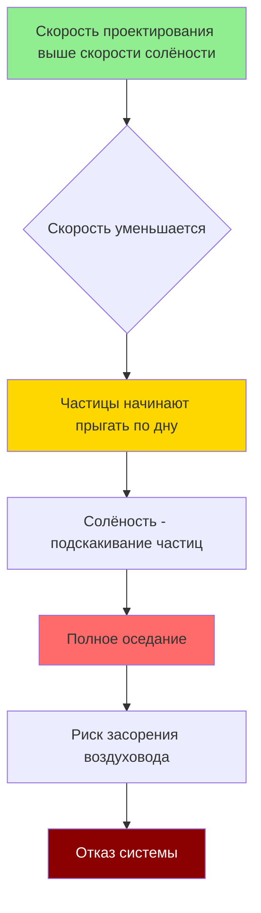

## Основы физики транспортировки

Минимальная скорость транспортировки представляет собой критическую скорость воздуха, необходимую для предотвращения оседания и накопления взвешенных частиц в горизонтальных или близких к горизонтальным воздуховодах. Диапазон 17,7–22,9 м/с рассчитан на промышленные частицы средней и тяжёлой фракции, где силы гравитационного оседания требуют значительной кинетической энергии в воздушном потоке для поддержания взвешивания.

Физический принцип, управляющий транспортировкой частиц, вытекает из баланса между силами сопротивления и гравитационным оседанием:

$$F_d = \frac{1}{2} \rho_{воздух} C_d A_p V^2$$

Где $F_d$ — сила сопротивления (Н), $\rho_{воздух}$ — плотность воздуха (кг/м³), $C_d$ — коэффициент сопротивления (безразмерный), $A_p$ — проектируемая площадь частицы (м²), и $V$ — относительная скорость (м/с).

Для того чтобы частица оставалась во взвешенном состоянии, вертикальная составляющая сопротивления должна превышать силу тяжести:

$$F_d \geq m_p g = \rho_p V_p g$$

Где $m_p$ — масса частицы, $\rho_p$ — плотность частицы, $V_p$ — объём частицы, и $g$ — ускорение свободного падения (9,81 м/с²).

## Концепция скорости солёности

Скорость солёности определяет пороговое значение, ниже которого частицы начинают падать из взвешенного состояния и оседать на дно воздуховода. Это явление происходит в результате характерной последовательности процессов:

Скорость солёности варьируется в зависимости от характеристик частиц в соответствии с эмпирическими зависимостями. Для сферических частиц корреляция Ризка обеспечивает разумные оценки:

$$V_{сол} = 1.8 \sqrt{\frac{gD(\rho_p - \rho_{воздух})}{\rho_{воздух}}}$$

Где $D$ — диаметр частицы (м) и плотности выражены в кг/м³. Эта зависимость демонстрирует, почему требования к скорости возрастают с увеличением размера и плотности частицы.

## Требования к скорости, специфичные для материалов

Руководство ACGIH Industrial Ventilation Manual устанавливает минимальные скорости транспортировки на основе характеристик материалов:

| Категория материала | Характеристики частиц | Минимальная скорость | Классификация ACGIH |
|----------------------|----------------------|----------------------|----------------------|
| Лёгкая древесная пыль | Опилки, пыль шлифовки, <100 мкм | 17,7 м/с | Лёгкая пыль |
| Тяжёлая древесная пыль | Стружка рубанка, крупные частицы | 20,3 м/с | Средняя пыль |
| Металлические частицы | Пыль шлифовки, частицы полировки | 20,3–22,9 м/с | Тяжёлая пыль |
| Тяжёлая пыль шлифовки | Абразивные частицы, плотные материалы | 22,9 м/с | Тяжёлые/липкие материалы |
| Сварочный дым с частицами | Смешанные системы аэрозоль-частица | 17,7–20,3 м/с | Переменная |

### Лёгкая древесная пыль (17,7 м/с)

Тонкая древесная пыль от операций шлифовки обычно имеет следующие характеристики:

- Размер частиц: 10–100 мкм среднемассовый диаметр
- Объёмная плотность: 160–240 кг/м³
- Плотность отдельной частицы: 400–560 кг/м³
- Диапазон чисел Рейнольдса: 1–50 (переходный режим сопротивления)

При скорости 17,7 м/с давление скорости составляет:

$$VP = \frac{\rho V^2}{2g} = \frac{1.2 \times (17.7)^2}{2 \times 9.81} = 19.0 \text{ Па}$$

Используя стандартную плотность воздуха 1,2 кг/м³ и $g = 9,81$ м/с².

### Тяжёлая древесная пыль и металлические частицы (20,3–22,9 м/с)

Более крупные частицы из операций рубанки и шлифовки металла требуют более высоких скоростей из-за:

- Увеличенной массы частицы (объём масштабируется как $d^3$)
- Более высоких скоростей оседания
- Большего импульса, необходимого для смены направления на изгибах
- Риска уплотнения, если происходит оседание

Для скорости 20,3 м/с (66,7 фута/с):

$$VP = \frac{1.2 \times (20.3)^2}{2 \times 9.81} = 24.9 \text{ Па}$$

Для скорости 22,9 м/с (75,0 фута/с):

$$VP = \frac{1.2 \times (22.9)^2}{2 \times 9.81} = 31.4 \text{ Па}$$

Увеличение скорости на 30% с 17,7 до 22,9 м/с приводит к увеличению давления скорости на 65%, напрямую влияя на требуемую мощность вентилятора:

$$P_{вент} \propto Q \times SP \propto V \times V^2 = V^3$$

## Влияние размера частиц на транспортировку

Скорость оседания частицы в неподвижном воздухе следует закону Стокса для малых частиц (Re < 1):

$$V_{терм} = \frac{g d_p^2 (\rho_p - \rho_{воздух})}{18 \mu}$$

Где $\mu$ — динамическая вязкость воздуха (1,8 × 10⁻⁵ Па·с). Эта зависимость демонстрирует квадратичную зависимость от диаметра частицы.

### Масштабирование скорости транспортировки

Эмпирические данные из промышленных установок предполагают, что минимальная скорость транспортировки масштабируется приблизительно как:

$$V_{мин} \approx k \sqrt{d_p}$$

Где $k$ — константа, зависящая от материала, варьирующаяся от 0,64–0,97 м/с для материалов в этом диапазоне скоростей.

## Проектные рекомендации

### Горизонтальные и вертикальные участки воздуховода

Требования минимальной скорости в основном применяются к горизонтальным участкам, где гравитационное оседание максимально. Вертикальные участки могут работать при более низких скоростях, так как сила тяжести действует перпендикулярно направлению потока. Однако проектирование системы обычно поддерживает постоянную скорость на всей длине, чтобы:

- Упростить расчёты балансировки
- Предотвратить зоны накопления при переходах
- Поддерживать коэффициенты безопасности для переменных условий нагрузки

### Компенсация потерь скорости

Потери статического давления в промышленных вытяжных системах снижают скорость по мере удаления от вентилятора. Проектирование должно учитывать деградацию скорости:

$$V_2 = V_1 \sqrt{\frac{VP_1 - \Delta P_{потеря}}{VP_1}}$$

Где $\Delta P_{потеря}$ представляет совокупные потери трения и фитингов между точками 1 и 2.

### Требования к коэффициенту безопасности

ASHRAE и ACGIH рекомендуют поддерживать скорости проектирования на 10–15% выше минимальных значений для учёта:

- Износа системы, увеличивающего шероховатость поверхности
- Частичного засорения фильтра, снижающего доступное статическое давление
- Вариаций плотности материала в производственных процессах
- Неопределённостей при измерении характеристик частиц

## Проверка и ввод в эксплуатацию

Проверка скорости транспортировки требует измерения в наиболее низковелосстном горизонтальном участке:

$$V_{факт} = 2.04 \sqrt{\frac{VP_{измер}}{\rho_{факт}}}$$

Где $VP_{измер}$ выражено в Па, а $\rho_{факт}$ учитывает влияние температуры и высоты на плотность воздуха:

$$\rho_{факт} = \rho_{станд} \times \frac{P_{факт}}{P_{станд}} \times \frac{T_{станд}}{T_{факт}}$$

Системы, не поддерживающие минимальные скорости транспортировки, проявляют характерные признаки:

- Увеличенное статическое давление на выпускном вытяжном устройстве
- Периодические пульсирующие выбросы материала из лицевой стороны вытяжки
- Необычный шум от подскакивающего материала в воздуховоде
- Сниженные расходы, требующие частой очистки вентилятора

---

**Источники:**
- ACGIH Industrial Ventilation Manual, 31-е издание
- ASHRAE Fundamentals Handbook, глава 35: Industrial Ventilation
- SMACNA HVAC Systems Duct Design, 4-е издание
