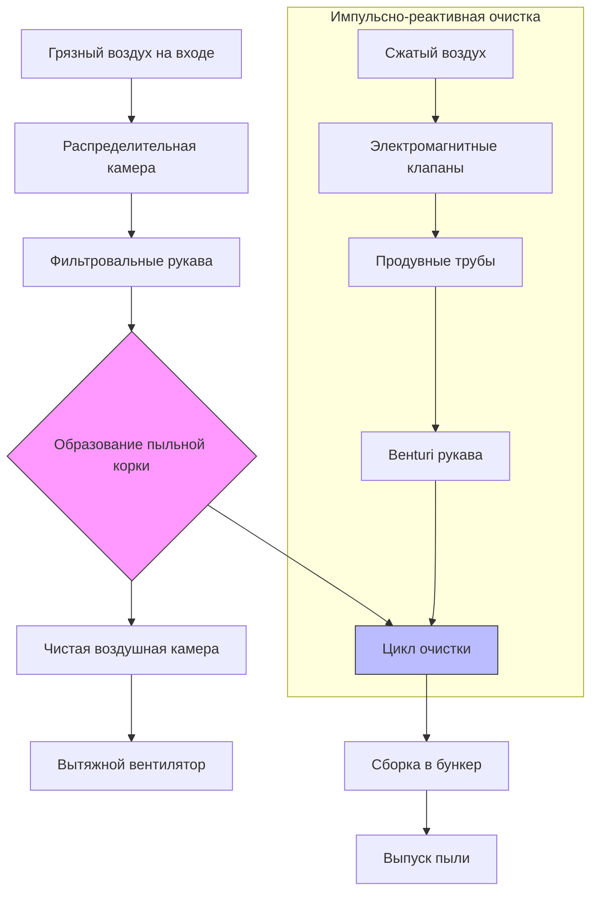

## Принципы работы

Рукавные пылесборники представляют наиболее эффективный метод удаления твёрдых частиц из промышленных выбросов, достигая эффективности сбора, превышающей 99,9% для частиц размером всего 0,5 микрон. Фундаментальный принцип работы заключается в пропускании загрязненного пыльцой воздуха через пористые тканевые рукава, где пыль накапливается на поверхности ткани, образуя слой фильтрующей корки, который повышает эффективность сбора.

Процесс фильтрации происходит в три отдельных фазы. Вначале чистые рукава обеспечивают минимальную эффективность фильтрации, полагаясь исключительно на пористость ткани. При накоплении пыли на поверхности ткани образуется фильтрующая корка, создающая основной механизм фильтрации через глубинную фильтрацию внутри структуры корки. В конечном итоге чрезмерная толщина корки увеличивает перепад давления до неприемлемых уровней, запуская цикл очистки для удаления накопленной пыли при сохранении остаточного слоя корки для продолжения высокоэффективной работы.

## Механизмы очистки

### Импульсно-реактивная очистка

Рукавные фильтры с импульсной очисткой используют короткие порывы сжатого воздуха (414–827 кПа) направленные вниз по внутренней части фильтровальных рукавов для сгибания ткани и удаления пыльной корки. Импульс очистки, обычно длительностью 0,03–0,1 секунды, создает быструю волну давления, которая распространяется вниз по длине рукава. Эффект Венturi на верхней части рукава вызывает вторичный поток воздуха в 5–8 раз больший объема импульсного воздуха, обеспечивая тщательное действие очистки.

Системы с импульсной очисткой работают непрерывно с очисткой в режиме онлайн, исключая необходимость в разделении на отсеки. Последовательности очистки обычно проходят через ряды рукавов каждые 30 секунд до 10 минут, контролируются точками срабатывания дифференциального давления или интервалами таймера. Высокоэнергетическое действие очистки допускает более высокие соотношения воздуха к ткани (4:1 до 12:1) по сравнению с другими методами очистки.

### Реверсивная очистка воздухом

Рукавные фильтры с реверсивной очисткой используют мягкую очистку путем реверса потока воздуха, направляя чистый воздух в обратном направлении через фильтровальные рукава со скоростью 1–2 раза от нормальной скорости на входе. Этот метод требует разделения на отсеки, с отдельными отсеками, отключаемыми последовательно для циклов очистки длительностью 1–3 минуты. Мягкая очистка сохраняет целостность фильтровальных рукавов, значительно продлевая срок их службы по сравнению с приложениями импульсной очистки.

Более низкая энергия очистки требует консервативных соотношений воздуха к ткани (1,5:1 до 3:1), что приводит к большим физическим размерам, но снижает износ рукавов. Системы с реверсивной очисткой отлично работают в приложениях с гигроскопичной или липкой пылью, где агрессивная импульсная очистка может внедрить частицы в волокна ткани.

## Выбор фильтровального материала

Выбор фильтровального материала балансирует эффективность сбора, химическую совместимость, устойчивость к температуре и характеристики отделения корки в соответствии с конкретными требованиями приложения.

| **Тип материала** | **Макс. температура (°C)** | **Химическая стойкость** | **Приложения** |
|---|---|---|---|
| Полиэстер | 135 | Умеренно кислоты, щелочи | Общая пыль, цемент, дерево |
| Полипропилен | 93 | Отличная кислотостойкость | Химическая обработка, кислые газы |
| Номекс | 204 | Хорошая кислотостойкость | Асфальтовые заводы, горячие приложения |
| P84 | 260 | Отличная кислотостойкость | Угольные котлы, мусоропроводы |
| PTFE (Тефлон) | 260 | Отличная кислоты/щелочи | Химические заводы, высокая влажность |
| Стекловолокно | 260 | Хорошая кислотостойкость | Высокая температура, коррозивные газы |
| PPS (Райтон) | 191 | Отличная кислоты/щелочи | Угольные котлы, муниципальные отходы |

Обработка тканевых покрытий улучшает характеристики производительности. Опаленные покрытия сглаживают поверхность волокон для улучшенного отделения корки. Ламинаты мембран (ePTFE) обеспечивают поверхностную фильтрацию для частиц субмикронного размера, одновременно облегчая отделение корки. Антистатические волокна предотвращают генерацию искр в приложениях с взрывоопасной пылью.

## Проектирование соотношения воздуха к ткани

Соотношение воздуха к ткани (А/Т) определяет объемный расход воздуха на единицу площади фильтровальной ткани, выраженный как скорость фильтрации:

$$A/T = \frac{Q}{A_f}$$

где $Q$ = расход воздуха (м³/ч) и $A_f$ = общая площадь ткани (м²).

Расчетные соотношения воздуха к ткани зависят от механизма очистки, характеристик пыли и требуемого перепада давления:

**Системы импульсной очистки:**
$$A/T = 4:1 \text{ до } 12:1 \text{ (м/мин)}$$

**Системы реверсивной очистки:**
$$A/T = 1,5:1 \text{ до } 3:1 \text{ (м/мин)}$$

Требуемая общая площадь ткани рассчитывается:

$$A_f = \frac{Q \times 60}{A/T \times 60} = \frac{Q}{A/T}$$

Для системы импульсной очистки на 33900 м³/ч с соотношением А/Т 6:1:

$$A_f = \frac{33900}{6} = 5650 \text{ м}^2$$

## Управление перепадом давления

Перепад давления в рукавном фильтре состоит из трех компонентов: сопротивления чистого рукава, сопротивления пыльной корки и потерь системы. Общий перепад давления обычно варьируется от 997 до 1996 Па:

$$\Delta P_{total} = \Delta P_{bag} + \Delta P_{cake} + \Delta P_{system}$$

Перепад давления чистого рукава остается относительно постоянным при 124–498 Па. Пыльная корка вносит основную часть сопротивления, увеличиваясь линейно с толщиной корки до срабатывания очистки. Чрезмерный перепад давления указывает на недостаточную частоту очистки, забитые рукава или чрезмерное соотношение воздуха к ткани.

Оптимальная работа поддерживает перепад давления в контролируемом диапазоне, обычно 997–1497 Па, через модулируемые циклы очистки. Передатчики дифференциального давления контролируют сопротивление и запускают очистку при достижении верхних точек срабатывания, затем прекращают очистку на нижних точках срабатывания для сохранения остаточной корки.

## Техническое обслуживание и замена рукавов

Профилактическое техническое обслуживание ориентировано на сохранение срока службы фильтровальных рукавов, который обычно варьируется от 1 до 5 лет в зависимости от тяжести приложения. Ежедневные проверки контролируют тенденции перепада давления, работу системы очистки и выпуск пыли. Еженедельные проверки исследуют качество сжатого воздуха для систем импульсной очистки, обеспечивая сухой и безмасляный воздух предотвращает забивание рукавов.

Индикаторы замены рукавов включают возрастание базового перепада давления, видимые выбросы, снижение эффективности очистки и физическое ухудшение состояния рукавов. Замена отдельных рукавов поддерживает работу системы, в то время как полная замена рукавов происходит во время запланированных остановок. Надлежащая установка требует тщательной подгонки рукава для предотвращения утечек обхода вокруг манжет рукава и поддержания выравнивания каркаса для предотвращения абразива ткани.

Техническое обслуживание системы очистки включает тестирование электромагнитных клапанов, замену диафрагм и проверку выравнивания продувных труб. Механизмы выпуска бункера требуют регулярного осмотра для предотвращения накопления пыли и обеспечения полного удаления материала между циклами очистки.
