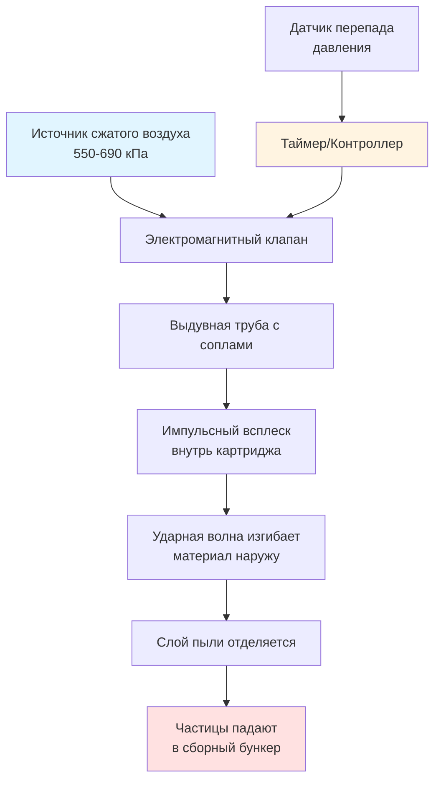

Картриджные фильтры для сбора пыли представляют собой компактный и высокоэффективный подход к улавливанию промышленных частиц. Эти системы используют гофрированный фильтровальный материал, расположенный в цилиндрических картриджах для максимизации площади фильтрации при минимальном занимаемом пространстве, обеспечивая преимущества перед традиционными тканевыми рукавными фильтрами во многих приложениях.

## Конструкция картриджных фильтров и фильтровальный материал

Картриджные фильтры состоят из гофрированного фильтровального материала, намотанного на центральный опорный стержень и заключённого во внешний защитный каркас. Гофрированная конструкция значительно увеличивает эффективную площадь фильтрации по сравнению с плоским материалом.

**Ключевые элементы конструкции:**

- **Фильтровальный материал**: Обычно целлюлоза, смеси целлюлозы и полиэстера, спанбонд полиэстер, материал с покрытием из ПТФЕ или нановолокна
- **Конфигурация гофр**: Равномерные гофры от 20 до 40 на картридж в зависимости от типа материала и приложения
- **Опорная конструкция**: Внутренний перфорированный металлический стержень и наружный проволочный каркас, предотвращающие коллапс под вакуумом
- **Концевые колпачки**: Литые полиуретановые или металлические колпачки с уплотнительными прокладками для герметичного крепления
- **Обработка материала**: Дополнительная обработка, включая огнестойкость, антистатические свойства, водоотталкивающие или олеофобные покрытия

Стандартные размеры картриджа включают диаметр 32,4 см × высоту 66 см (обеспечивающие примерно 21-23 м² площади материала) и более короткие конфигурации для монтажа в ограниченном пространстве.

## Преимущества гофрированного материала

Гофрированная конструкция обеспечивает значительные преимущества в производительности по сравнению с традиционным плоским или трубчатым рукавным материалом.

**Основные преимущества:**

- **Большая площадь материала**: Гофрирование увеличивает площадь фильтрации в 10-15 раз по сравнению с эквивалентными цилиндрическими рукавными фильтрами
- **Компактный размер**: Большая плотность материала сокращает общий размер коллектора на 30-40% по сравнению с рукавными фильтрами
- **Низкий перепад давления**: Большая площадь поверхности распределяет поток воздуха, снижая скорость набегающего потока и начальный перепад давления
- **Улучшенная эффективность**: Улавливание субмикронных частиц с эффективностью свыше 99,9% для частиц >0,3 мкм
- **Увеличенный срок служба**: Более низкие скорости набегающего потока и импульсная очистка снижают износ материала

Современный материал из нановолокна и мембраны ПТФЕ обеспечивают поверхностную фильтрацию вместо глубинной, предотвращая проникновение частиц в структуру материала и обеспечивая более эффективную очистку.

## Расчёт соотношения воздух-материал

Надлежащий расчёт размеров картриджных фильтров требует вычисления соотношения воздух-материал (СВМ), которое определяет скорость набегающего потока и характеристики перепада давления.

**Расчёт соотношения воздух-материал:**

$$\text{СВМ} = \frac{Q}{A_{\text{total}}}$$

Где:
- $\text{СВМ}$ = соотношение воздух-материал (м/мин)
- $Q$ = объёмный расход воздуха (м³/мин)
- $A_{\text{total}}$ = общая площадь фильтрации всех картриджей (м²)

**Рекомендуемые значения СВМ:**

- Общие приложения по пыли: 1,2-1,8 м/мин
- Тонкие частицы (<10 мкм): 0,9-1,2 м/мин
- Горючая пыль: 0,9-1,5 м/мин
- Приложения с высокой нагрузкой: 0,6-0,9 м/мин

**Требуемое количество картриджей:**

$$N = \frac{Q}{\text{СВМ} \times A_{\text{картридж}}}$$

Для системы 16,8 м³/мин с СВМ = 1,2 м/мин и картриджами, обеспечивающими 21 м² каждый:

$$N = \frac{16,8}{1,2 \times 21} = 0,67 \rightarrow 1 \text{ картридж}$$

## Системы импульсной очистки

Картриджные коллекторы используют высокотемпературную импульсную очистку для удаления накопившегося слоя пыли с поверхностей фильтра без прерывания работы коллектора.

**Операция импульсной очистки:**

**Компоненты системы очистки:**

- **Сжатый воздух**: Источник питания 550-690 кПа с достаточным объёмом (минимум 6,8 м³/ч на клапан)
- **Электромагнитные клапаны**: Быстродействующие диафрагменные клапаны (40-80 миллисекунд времени открытия)
- **Выдувные трубы**: Перфорированные трубы, расположенные над рядами картриджей с соплами, выровненными по центрам картриджей
- **Контроллер**: Таймер или система очистки, инициируемая перепадом давления
- **Воздушный резервуар**: Аккумулятор, поддерживающий достаточное давление импульса

Типичная длительность импульса составляет 100-150 миллисекунд на клапан, интервалы очистки составляют от 10 секунд до 5 минут в зависимости от нагрузки пыли.

## Приложения в сравнении с рукавными фильтрами

Картриджные коллекторы предлагают отчётливые преимущества по сравнению с традиционными рукавными системами в конкретных приложениях.

**Сравнение картриджных фильтров:**

| Параметр | Картриджные фильтры | Рукавные фильтры |
|-----------|------------------|-------------|
| **Площадь материала** | 21-23 м²/единица | 2,6-4 м²/рукав |
| **Соотношение воздух-материал** | 0,9-1,8 м/мин | 1,5-3 м/мин |
| **Размер установки** | На 30-40% меньше | Требуется большой корпус |
| **Замена фильтра** | Быстрая замена картриджа | Снятие отдельного рукава |
| **Начальная стоимость** | Выше стоимость картриджа | Ниже стоимость рукава |
| **Трудозатраты на обслуживание** | Ниже (удобнее доступ) | Выше (больше единиц) |
| **Перепад давления** | 100-200 Па начальный | 150-250 Па начальный |
| **Оптимальные приложения** | Тонкая пыль, ограниченное пространство | Высокая нагрузка, абразивная пыль |

**Идеальные приложения для картриджей:**

- Тонкие частицы (<10 мкм) от обработки металла, фармацевтики, порошковой окраски
- Операции с ограниченным полезным пространством или высотой помещения
- Процессы, генерирующие горючую пыль, требующие меньшего корпуса для защиты от дефлаграции
- Приложения, требующие частой замены фильтра, где доступность критична

**Предпочтения рукавных фильтров:**

- Высокая нагрузка пыли (>50 г/м³) с крупными, абразивными частицами
- Высокотемпературные приложения, превышающие пределы картриджного материала (обычно >93°C)
- Ситуации, требующие минимальной начальной стоимости фильтровального материала
- Существующие системы с рукавными фильтрами

## Обслуживание и замена картриджей

Надлежащие методы обслуживания максимизируют срок служба картриджей и производительность системы.

**Плановое обслуживание:**

- **Мониторинг перепада давления**: Заменить картридги при достижении перепада давления 300-400 Па (не может быть очищен ниже 200-250 Па)
- **Система сжатого воздуха**: Проверить достаточное давление, еженедельно сливать влагу из сепараторов, проверить функцию электромагнитных клапанов
- **Эвакуация бункера**: Опорожнять сборные бункеры до того, как пыль достигнет уровня картриджей
- **Импульсная очистка**: Проверить равномерную очистку всех картриджей; отрегулировать время/давление импульса при необходимости

**Индикаторы замены картриджа:**

- Стойкий высокий перепад давления несмотря на очистку
- Видимые повреждения материала, разрывы или ухудшение уплотнительной прокладки
- Снижение эффективности импульсной очистки
- Увеличение выбросов частиц (если контролируется)

Типичный срок служба картриджа составляет 1-3 года в зависимости от характеристик пыли, нагрузки и частоты очистки. Материал из нановолокна и с мембранным покрытием обычно достигает большего срока служба, чем материал из целлюлозы.

**Процедура замены:**

1. Остановить коллектор и отключить электропитание
2. Сбросить давление сжатого воздуха из системы очистки
3. Получить доступ к отделению фильтра через петельные или съёмные панели
4. Вынуть картридги, приподняв их прямо вверх (отсоединить от монтажных штифтов/фиксаторов)
5. Проверить монтажную поверхность и уплотнительные прокладки на наличие повреждений
6. Установить новые картридги, обеспечивая надлежащую посадку уплотнительной прокладки
7. Закрыть панели доступа, проверить целостность уплотнения, восстановить электропитание
8. Записать дату замены, рабочие часы и окончательный перепад давления перед заменой

Надлежащий выбор картриджа, консервативные соотношения воздух-материал и дисциплинированные методы обслуживания обеспечивают надежную, долгосрочную производительность сбора пыли в требовательных промышленных условиях.
