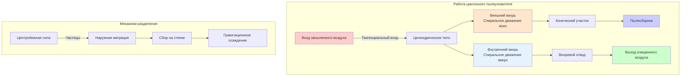

Циклонные пылеуловители отделяют твердые частицы от газовых потоков с помощью центробежной силы, создаваемой вращающимся воздушным потоком. Эти инерционные сепараторы обеспечивают экономичную, малообслуживаемую предварительную фильтрацию или автономный сбор для промышленных применений.

## Принципы работы

Циклоны используют центробежное ускорение для выталкивания частиц наружу к сборочной стенке, в то время как очищенный газ выходит через центр.

**Паттерн потока:**
- Тангенциальный вход придает вращательную скорость газовому потоку
- Внешний вихрь спирально движется вниз вдоль цилиндрических и конических стенок
- Внутренний вихрь спирально движется вверх через центр и выходит в верхней части
- Частицы мигрируют наружу под действием центробежной силы
- Собранное вещество падает в пылесборник

**Силы разделения:**

Центробежная сила, действующая на частицу, определяется формулой:

$$F_c = \frac{m v_t^2}{r}$$

Где:
- $m$ = масса частицы (кг)
- $v_t$ = тангенциальная скорость (м/с)
- $r$ = радиус от оси циклона (м)

Эта сила должна преодолевать силу сопротивления для эффективного сбора:

$$F_d = 3 \pi \mu d_p v_r$$

Где:
- $\mu$ = вязкость газа (Па·с)
- $d_p$ = диаметр частицы (м)
- $v_r$ = радиальная скорость (м/с)

## Стандартные и высокоэффективные циклоны

Конструктивная геометрия значительно влияет на эффективность сбора и перепад давления.

| Тип циклона | Отношение диаметров | Отношение высоты | Входная скорость | Перепад давления | Размер разделения |
|------|----------------|------|----------------|---------------|----------|
| Стандартный (обычный) | D = 0.5-1.0 м | H/D = 4-5 | 15-20 м/с | 4-8 единиц скорости входа | 10-20 мкм |
| Высокой эффективности | D = 0.15-0.6 м | H/D = 6-10 | 20-30 м/с | 6-12 единиц скорости входа | 5-10 мкм |
| Сверхвысокой эффективности | D < 0.15 м | H/D = 8-12 | 25-35 м/с | 10-20 единиц скорости входа | 2-5 мкм |

**Стандартные циклоны:**
- Большой диаметр (0.5-1.0 м)
- Низкие входные скорости (15-20 м/с)
- Умеренный перепад давления (500-1000 Па)
- Экономичны для больших воздушных потоков
- Эффективны для частиц > 20 мкм

**Циклоны высокой эффективности:**
- Малый диаметр (0.15-0.6 м)
- Высокие входные скорости (20-30 м/с)
- Повышенный перепад давления (750-1500 Па)
- Лучшее улавливание мелких частиц
- Эффективны для частиц > 5 мкм

## Кривые эффективности по размеру частиц

Эффективность сбора варьируется в зависимости от размера частиц, следуя характерным кривым.

**Долевая эффективность:**

$$\eta(d_p) = \frac{1}{1 + (d_{50}/d_p)^2}$$

Где:
- $\eta(d_p)$ = долевая эффективность для диаметра частицы $d_p$
- $d_{50}$ = размер разделения (точка 50% эффективности)

**Расчет размера разделения:**

Теоретический размер разделения определяется формулой:

$$d_{50} = \sqrt{\frac{9 \mu W}{2 \pi N_e v_i (\rho_p - \rho_g)}}$$

Где:
- $W$ = ширина входа (м)
- $N_e$ = эффективное число оборотов (обычно 3-5)
- $v_i$ = входная скорость (м/с)
- $\rho_p$ = плотность частицы (кг/м³)
- $\rho_g$ = плотность газа (кг/м³)

**Типичные диапазоны эффективности:**
- Частицы > 50 мкм: 95-99% эффективности
- Частицы 20-50 мкм: 85-95% эффективности
- Частицы 10-20 мкм: 70-85% эффективности
- Частицы 5-10 мкм: 40-70% эффективности
- Частицы < 5 мкм: < 40% эффективности

## Соображения по перепаду давления

Перепад давления представляет собой энергетическую стоимость работы циклона.

**Уравнение перепада давления:**

$$\Delta P = K_c \frac{\rho_g v_i^2}{2}$$

Где:
- $K_c$ = коэффициент перепада давления циклона (3-8)
- $v_i$ = входная скорость (м/с)

**Факторы, влияющие на перепад давления:**
- Входная скорость (квадратичная зависимость)
- Количество оборотов газа
- Потери на трение о стенки
- Конфигурация выходного воздуховода
- Запыленность (обычно незначительный эффект)

**Компромиссы при проектировании:**
- Более высокая эффективность требует более высокой скорости → увеличение перепада давления
- Уменьшение диаметра повышает эффективность → увеличение перепада давления
- Типичный диапазон: 500-2000 Па

## Множественные циклонные установки

Множественные циклоны оптимизируют производительность и мощность.

**Параллельная конфигурация:**
- Несколько циклонов используют общий входной коллектор
- Критически важно равномерное распределение воздушного потока
- Сохраняется индивидуальная эффективность каждого циклона
- Мощность масштабируется линейно
- Применяется для высокопроизводительных систем

**Многосекционные циклоны:**
- Массивы циклонов малого диаметра (50–150 мм)
- Общий корпус с индивидуальными трубами
- Более высокая эффективность по сравнению с одним крупным циклоном
- Типичное падение давления: 1000–1500 Па
- Компактные габариты

**Последовательная конфигурация:**
- Первичный циклон для грубого разделения
- Вторичный циклон или фильтр для улавливания мелких частиц
- Снижение нагрузки на финальный фильтр
- Значительное продление срока службы фильтра

## Области применения и ограничения

**Идеальные области применения:**
- Сбор древесной пыли (опилки, стружка)
- Обработка и транспортировка зерна
- Металлообработка: шлифовка и полировка
- Обработка цемента и заполнителей
- Первичное разделение перед тканевыми фильтрами
- Поток горячих газов (до 450°C)
- Контроль искр и тлеющих частиц

**Ограничения:**
- Низкая эффективность для частиц менее 10 мкм
- Невозможность улавливания липких или волокнистых материалов
- Требуется тщательное проектирование для достижения оптимальной производительности
- Возможна повторная энтранция частиц при неправильном подборе размеров
- Абразивные материалы вызывают износ стенок
- Не подходят в качестве основного уловителя для мелкой пыли

**Конструктивные особенности:**
- Минимальная скорость для предотвращения осаждения: 15 м/с на входе
- Максимальная скорость для предотвращения эрозии: 35 м/с для абразивных материалов
- Пылеприемник должен обеспечивать достаточную ёмкость для хранения
- Ротационный затвор или двойной сбросной клапан для разгрузки пылеприемника
- Гладкие внутренние поверхности минимизируют турбулентность и повторную энтранцию

**Требования к техническому обслуживанию:**
- Периодический осмотр на предмет износа стенок и эрозии
- Мониторинг уровня в пылеприемнике и регулярная разгрузка
- Осмотр входных и выходных воздуховодов на предмет засоров
- Отсутствие движущихся частей снижает нагрузку на обслуживание
- Ожидаемый срок службы: 15–25 лет при правильном проектировании

Циклоны обеспечивают экономически эффективное и надёжное разделение частиц в промышленных процессах, где улавливание мелких частиц не является критическим, или где они служат предочистителями для систем финальной фильтрации.
