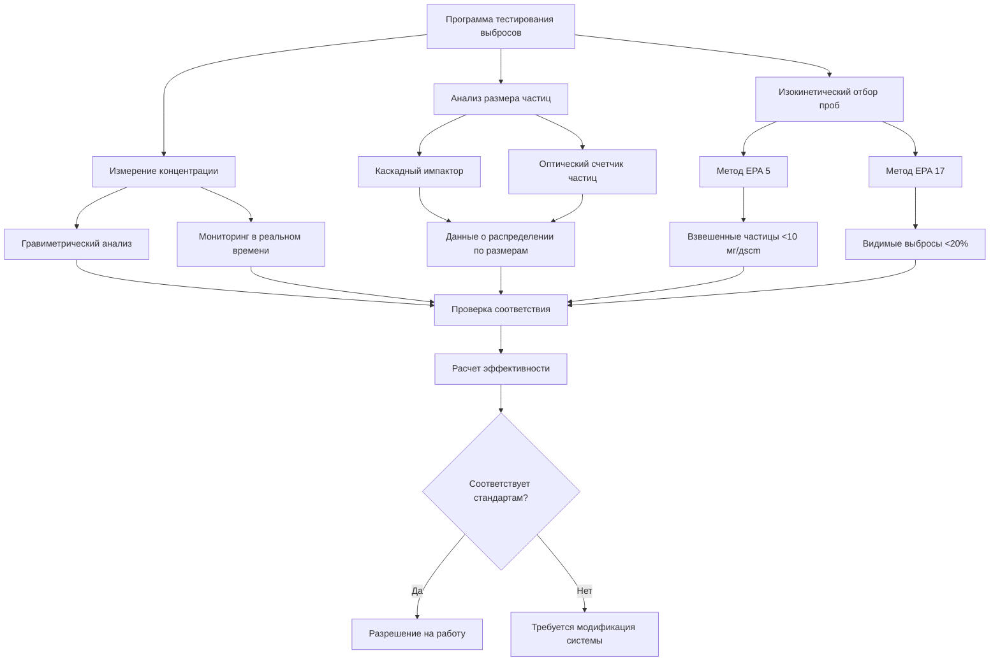

Эффективность системы пылеулавливания количественно определяет способность уловителя удалять взвешенные частицы из воздушного потока. Эффективность значительно варьируется в зависимости от размера частиц, что делает точную характеризацию важной для обеспечения нормативного соответствия и проектирования системы.

## Определения эффективности пылеулавливания

**Общая эффективность пылеулавливания** представляет общую массовую долю удаляемых взвешенных частиц:

$$\eta_{\text{overall}} = \frac{m_{\text{collected}}}{m_{\text{inlet}}} \times 100\%$$

Где:
- $m_{\text{collected}}$ = масса собранной пыли (кг/ч)
- $m_{\text{inlet}}$ = масса пыли, поступающей в уловитель (кг/ч)

Альтернативно, используя измерения концентрации:

$$\eta_{\text{overall}} = \frac{C_{\text{in}} - C_{\text{out}}}{C_{\text{in}}} \times 100\%$$

Где:
- $C_{\text{in}}$ = концентрация пыли на входе (мг/м³)
- $C_{\text{out}}$ = концентрация пыли на выходе (мг/м³)

**Проникновение** выражает долю прошедших частиц:

$$P = 1 - \eta = \frac{C_{\text{out}}}{C_{\text{in}}}$$

Проникновение особенно полезно при работе с высокоэффективными уловителями, где важны небольшие различия.

## Воздействие распределения частиц по размерам

Эффективность пылеулавливания сильно зависит от аэродинамического диаметра частиц. Мелкие частицы (< 1 мкм) трудно улавливаются из-за:

- Низких инерционных сил
- Увеличенного влияния броуновского движения
- Сниженной скорости гравитационного осаждения

**Диаметр Стокса** характеризует поведение частиц:

$$d_{\text{Stokes}} = \sqrt{\frac{18 \mu V_{\text{terminal}}}{\rho_p g}}$$

Где:
- $\mu$ = вязкость воздуха (Па·с)
- $V_{\text{terminal}}$ = скорость конечного падения (м/с)
- $\rho_p$ = плотность частиц (кг/м³)
- $g$ = ускорение свободного падения (9,81 м/с²)

Распределения размеров частиц обычно следуют логнормальным закономерностям. Средний массовый диаметр (MMD) и геометрическое стандартное отклонение характеризуют распределение.

## Кривые фракционной эффективности

Фракционная эффективность (классовая эффективность) показывает производительность пылеулавливания по диапазонам размеров частиц:

$$\eta(d_p) = \frac{m_{\text{collected}}(d_p)}{m_{\text{inlet}}(d_p)}$$

**Характерные параметры эффективности:**

| Параметр | Определение | Значение |
|-----------|------------|----------|
| $d_{50}$ (диаметр отсечки) | Размер частицы, уловленной с эффективностью 50% | Характеризует производительность сепаратора |
| $d_{95}$ | Размер частицы, уловленной с эффективностью 95% | Указывает на почти полный захват |
| Наклон | Крутизна кривой эффективности | Крутые кривые = узкая селективность по размерам |

Зависимость между фракционной и общей эффективностью:

$$\eta_{\text{overall}} = \int_0^\infty \eta(d_p) \cdot f(d_p) \, dd_p$$

Где $f(d_p)$ — функция распределения частиц по размерам, нормированная к единице.

## Расчет общей эффективности системы

Для практических расчетов с дискретными фракциями по размерам:

$$\eta_{\text{overall}} = \sum_{i=1}^{n} \eta_i \cdot w_i$$

Где:
- $\eta_i$ = фракционная эффективность для диапазона размеров $i$
- $w_i$ = массовая доля в диапазоне размеров $i$
- $n$ = количество фракций по размерам

**Пример расчета:**

| Диапазон размеров (мкм) | Массовая доля | Фракционная эффективность | Вклад |
|-----------------|-----------------|----------------------|--------------|
| 0-2 | 0,15 | 0,60 | 0,090 |
| 2-5 | 0,25 | 0,85 | 0,213 |
| 5-10 | 0,30 | 0,95 | 0,285 |
| 10-20 | 0,20 | 0,99 | 0,198 |
| >20 | 0,10 | 0,995 | 0,100 |
| **Итого** | **1,00** | — | **0,886 (88,6%)** |

## Требования к тестированию выбросов

**Метод EPA 5** (выбросы взвешенных частиц):
- Требуется изокинетический отбор проб
- Температура фильтра 120°C ± 14°C
- Минимальный объем образца 0,6 дscm
- Отчетность в мг/дscm, приведенных к стандартным условиям

**Методы EPA 201A/202** (PM₁₀ и PM₂.₅):
- Включает определение размеров частиц
- Более строгие требования для мелких взвешенных частиц
- Требуются для многих промышленных источников

## Стандарты соответствия EPA и OSHA

**Стандарты выбросов EPA:**

| Категория источника | Предел выбросов | Применяемый стандарт |
|-----------------|----------------|---------------------|
| Общая промышленность | 229 мг/дscm | 40 CFR 60 |
| Обработка древесины | 23 мг/дscm | 40 CFR 63 Subpart QQQQ |
| Металлообработка | 11 мг/дscm | 40 CFR 63 Subpart XXXXXX |
| Литейные цехи | 4,6 мг/дscm | 40 CFR 63 Subpart EEEEE |
| Цементные заводы | 0,015 фунта на тонну продукта | 40 CFR 63 Subpart LLL |

**Рабочие стандарты OSHA (29 CFR 1910):**

| Загрязняющее вещество | ПДК | Уровень действия | Примечания |
|-------------|-----|--------------|-------|
| Общая пыль | 15 мг/м³ | 7,5 мг/м³ | 8-часовой TWA |
| Вдыхаемая пыль | 5 мг/м³ | 2,5 мг/м³ | 8-часовой TWA |
| Кристаллический кремнезем | 50 мкг/м³ | 25 мкг/м³ | Новый стандарт (2016) |
| Древесная пыль | 5 мг/м³ | 2,5 мг/м³ | Твердолиственная STEL 10 мг/м³ |
| Металлические пыли (общие) | 10 мг/м³ | 5 мг/м³ | Зависит от типа металла |

**Требуемая минимальная эффективность по применению:**

| Применение | Минимальная эффективность | Основная проблема |
|-------------|-------------------|-----------------|
| Общая уборка помещений | 85-90% | Чистота при работе |
| Соответствие OSHA | 95-98% | Предотвращение воздействия на рабочих |
| Соответствие EPA | 99-99,5% | Выбросы в окружающую среду |
| Опасность взрывоопасной пыли | 99,5-99,9% | Безопасность взрывоопасной пыли |
| Токсичные материалы | 99,9-99,99% | Контроль опасности для здоровья |
| Фармацевтика/пищевая промышленность | 99,97% (HEPA) | Предотвращение загрязнения продукции |

**Мониторинг и документация:**

Объекты должны вести:
- Непрерывный мониторинг непрозрачности (COMS) или периодические наблюдения видимых выбросов
- Ежегодное тестирование стека для крупных источников
- Мониторинг перепада давления через уловители
- Расчеты нагрузки взвешенными частицами
- Журналы обслуживания и проверки

**Проверка производительности:**

$$\text{Требуемая частота тестирования} = f(\text{категория источника, уровень выбросов, история соответствия})$$

Типичные требования:
- Начальное испытание производительности при запуске
- Ежегодное тестирование для крупных источников
- Полугодовое для проблемных операций
- После любых модификаций технологии

Правильно спроектированные системы, работающие в пределах проектных параметров, последовательно достигают заданной эффективности. Регулярный мониторинг, профилактическое обслуживание и своевременные корректирующие действия обеспечивают устойчивое соответствие и защищают здоровье рабочих и качество окружающей среды.
