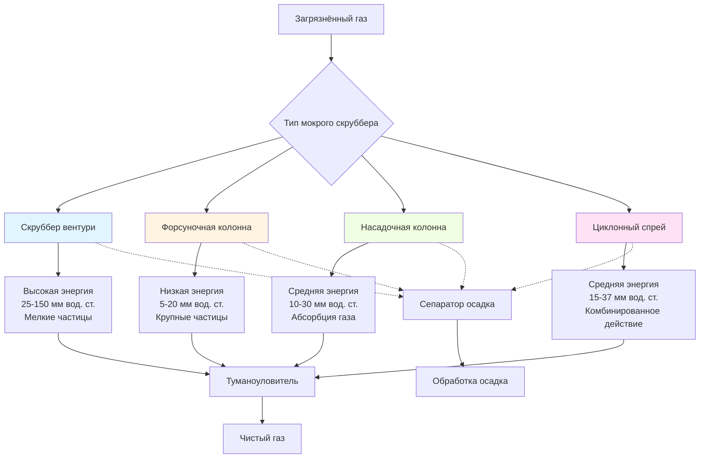

Мокрые скрубберы используют жидкость (обычно воду) для захвата твёрдых частиц и газообразных загрязнителей из промышленных выбросов. Эти устройства достигают одновременного удаления частиц и абсорбции газов через тесный контакт между загрязнённым воздухом и скруббирующей жидкостью, что делает их незаменимыми для приложений, где сухие методы сбора непригодны из-за горючей пыли, высоких температур или комбинированных требований по контролю частиц и газов.

## Принципы работы

Мокрые скрубберы удаляют частицы через несколько механизмов, действующих параллельно. **Инерционный удар** возникает, когда частицы с достаточной инертностью не могут следовать линиям потока газа вокруг капель жидкости и сталкиваются с поверхностью капли. **Перехват** захватывает частицы, находящиеся в пределах одного радиуса частицы от капли. **Диффузия** преобладает для субмикронных частиц, которые подвергаются броуновскому движению и контактируют с каплями во время своего случайного движения.

Общая эффективность сбора зависит от контактной мощности — энергии, затрачиваемой на создание поверхности жидкости и контакта частица-капля. Более высокий перепад давления на скруббере обычно коррелирует с улучшенной эффективностью сбора, особенно для мелких частиц размером ниже 2 мкм.

Фракционную эффективность сбора для одной капли можно оценить по формуле:

$$\eta = 1 - \exp\left(-\frac{3 \cdot E_t \cdot V_g \cdot L}{2 \cdot d_d \cdot V_d}\right)$$

Где $\eta$ — эффективность сбора, $E_t$ — параметр общей эффективности сбора (включающий инерционный удар, перехват, диффузию), $V_g$ — скорость газа, $L$ — длина скруббера, $d_d$ — диаметр капли, $V_d$ — скорость капли.

## Конструкция скруббера вентури

Скрубберы вентури достигают высокой эффективности сбора (95-99% для частиц >1 мкм), ускоряя поток газа до 3600-7300 м/ч через суженное горловое сечение. На входе в горловину жидкость впрыскивается и распыляется в мелкие капли высокоскоростным потоком газа.

Перепад давления на скруббере вентури варьируется от 25-150 мм вод. ст., причём более высокие перепады дают лучший захват субмикронных частиц. Зависимость между перепадом давления и отношением жидкость-газ выражается формулой:

$$\Delta P = \frac{V_t^2 \cdot \rho_g}{2g} \left[1 + \frac{L}{G} \cdot \frac{\rho_g}{\rho_L}\right]^2$$

Где $\Delta P$ — перепад давления, $V_t$ — скорость в горловине, $\rho_g$ — плотность газа, $\rho_L$ — плотность жидкости, $g$ — ускорение свободного падения, $L/G$ — отношение жидкость-газ (типично 0,8-3,4 л/(м³/ч)).

Ключевые компоненты вентури включают:

- **Сходящееся сечение**: ускоряет газ до скорости в горловине
- **Горловинное сечение**: основная зона контакта частица-капля (длина 10-20 см)
- **Расходящееся сечение**: восстанавливает статическое давление (угол расхождения 5-7°)
- **Сепаратор**: удаляет захваченные жидкие капли из очищенного газа

## Конструкция форсуночной колонны

Форсуночные колонны работают при более низких перепадах давления (5-20 мм вод. ст.) и достигают эффективности 80-95% для частиц >5 мкм. Загрязнённый газ流 вверх (противотоком) или вниз (прямотоком) через несколько банков форсунок, производящих капли диаметром 500-2000 мкм.

Параметры конструкции колонны:

- Скорость газа: 60-240 м/ч (ограничена для предотвращения увлечения капель)
- Отношение жидкость-газ: 0,8-2,5 л/(м³/ч)
- Высота колонны: 3-12 м в зависимости от требуемого времени пребывания
- Расстояние между форсунками: 0,9-1,8 м по вертикали, 1,2-2,4 м по горизонтали

Форсуночные колонны отлично удаляют крупные частицы и поглощают водорастворимые газы, но показывают слабые результаты при работе с субмикронной дисперсией из-за ограниченной контактной мощности.

## Системы рециркуляции воды

Мокрые скрубберы используют закрытые системы рециркуляции для минимизации потребления воды. Критические компоненты системы рециркуляции включают:

**Резервуар-отстойник**: рассчитан на время пребывания жидкости 1-3 минуты при скорости циркуляции. Обеспечивает время осаждения для грубых твёрдых веществ и стабилизацию температуры.

**Циркуляционный насос**: обычно центробежные насосы с открытыми или полуоткрытыми рабочими колесами для пропуска твёрдых веществ размером 0,5-2 см. Материалы насоса выбираются для работы в условиях пульпы — нержавеющая сталь 316, резиновое покрытие на углеродистой стали или высокохромовые сплавы.

**Подпиточная вода**: компенсирует потери от испарения (0,5-2% от потока газа), увлечения и продувки. Скорость испарения рассчитывается по формуле:

$$W_{evap} = \frac{Q \cdot \Delta T \cdot c_p}{\lambda}$$

Где $W_{evap}$ — скорость испарения, $Q$ — расход газа, $\Delta T$ — перепад температуры на скруббере, $c_p$ — удельная теплоёмкость газа, $\lambda$ — скрытая теплота парообразования.

**Управление продувкой**: поддерживает приемлемую концентрацию растворённых твёрдых веществ (типично <5000 мг/л) для предотвращения образования отложений и обеспечения стабильной работы.

## Сравнение конфигураций мокрых скруббсеров

| Параметр | Вентури | Форсуночная колонна | Насадочная колонна | Циклонный спрей |
|----------|---------|-------------------|-------------------|-----------------|
| Перепад давления | 25-150 мм вод. ст. | 5-20 мм вод. ст. | 10-30 мм вод. ст. | 15-37 мм вод. ст. |
| Эффективность (>1 мкм) | 95-99% | 80-95% | 85-95% | 90-97% |
| Эффективность (<1 мкм) | 90-95% | 50-70% | 60-80% | 75-85% |
| Отношение Ж/Г (л/(м³/ч)) | 0,8-3,4 | 0,8-2,5 | 1,7-5,1 | 1,4-4,2 |
| Тенденция к закупорке | Низкая | Низкая | Высокая | Средняя |
| Абсорбция газа | Слабая | Хорошая | Отличная | Удовлетворительная |
| Коэффициент гибкости | 3:1 | 4:1 | 3:1 | 2:1 |
| Капитальные затраты | Средние | Низкие | Высокие | Средние-высокие |
| Операционные затраты | Высокие | Низкие | Средние | Средние |

## Эффективность сбора частиц

Эффективность сбора варьируется в зависимости от размера частиц в соответствии с кривой селективной эффективности. Мокрые скрубберы демонстрируют характерный минимум эффективности при 0,2-0,5 мкм, где механизмы диффузии и инерционного удара одновременно слабы.

Общее проникновение (доля прошедших частиц) для полидисперсных аэрозолей:

$$P_{total} = \sum_{i=1}^{n} f_i \cdot P_i$$

Где $f_i$ — массовая доля в диапазоне размеров $i$, $P_i$ — проникновение для этого диапазона размеров. Общая эффективность: $\eta_{total} = 1 - P_{total}$.

Для скруббсеров вентури диаметр разделения (эффективность сбора 50%) обычно составляет 0,5-1,5 мкм в зависимости от перепада давления. Форсуночные колонны имеют диаметры разделения 3-10 мкм.

## Требования к обработке осадка

Мокрые скрубберы генерируют потоки жидких отходов, содержащие собранные твёрдые частицы, требующие специальных систем управления осадком. Характеристики осадка зависят от свойств пыли и химии скруббирующей жидкости.

**Прояснение**: гравитационные сгустители или наклонные пластинчатые отстойники сгущают твёрдые вещества с 2-10% до 15-35% по весу. Скорость осаждения дискретных частиц следует закону Стокса:

$$V_s = \frac{g \cdot d_p^2 \cdot (\rho_p - \rho_L)}{18 \cdot \mu}$$

Где $V_s$ — скорость осаждения, $d_p$ — диаметр частицы, $\rho_p$ — плотность частицы, $\mu$ — вязкость жидкости.

**Обезвоживание**: вакуумные фильтры, фильтр-прессы или центрифуги снижают влажность до 40-60% для захоронения на полигоне или дальнейшей переработки. Ленточные фильтр-прессы обрабатывают 3,2-32 л/мин при 1-5% содержании твёрдых веществ на входе.

**Утилизация/восстановление**: высушенный осадок может быть вывезен на полигон, переработан обратно в процесс или подвергнут дальнейшей обработке в зависимости от состава и нормативных требований.

## Коррозия и выбор материалов

Материалы мокрых скруббсеров должны выдерживать одновременное химическое воздействие и абразивный износ от нагруженной частицами пульпы.

**Металлические материалы**:
- Нержавеющая сталь 316L: универсальное применение, pH 5-9, хлориды <200 мг/л
- Хастеллой C-276: сильная коррозия, кислые газы, хлорсодержащие соединения
- Титан: высокохлоридные среды, окисляющие кислоты
- Дуплексная нержавеющая сталь: высокопрочная альтернатива 316L с улучшенной устойчивостью к питтингу

**Неметаллические материалы**:
- Стеклопластик (FRP): экономичен для больших колонн, ограничен 80-100°C
- Полипропиленовое покрытие: кислотное обслуживание, температура <80°C
- Резиновое покрытие: устойчивость к абразии, pH 2-12, температура <70°C
- Керамическая плитка: максимальная устойчивость к абразии для высокоскоростных приложений

**Критерии выбора материала**:

1. Химический состав газового потока (кислоты, щёлочи, окислители)
2. Диапазон рабочих температур
3. Абразивность частиц (твёрдость по шкале Мооса)
4. Экономические соображения (капитальные против срока службы)
5. Требования к изготовлению (сварка, полевая установка)

Критические зоны износа включают горловины вентури, форсунки, рабочие колёса и углы резервуара. Эти участки могут потребовать модернизированных материалов, заменяемых облицовок от истирания или периодических графиков проверки и замены.

Надлежащий выбор материалов продлевает срок службы скруббера с 5-10 лет (неадекватные материалы) до 15-25 лет (правильно спецификацированная конструкция) в требовательных промышленных приложениях.
