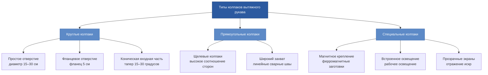

Местные вытяжные рукава обеспечивают гибкий захват газов в точке использования для сварки, пайки, шлифования и других операций, производящих опасные летучие загрязнители. Эти сочлененные системы воздуховодов позволяют операторам позиционировать колпаки захвата точно в источниках выбросов, сохраняя при этом неограниченный доступ к рабочему пространству. Надлежащая конструкция рукава сбалансирована между структурной жесткостью, гибкостью позиционирования и аэродинамической производительностью для достижения эффективности захвата, превышающей 95%.

## Конструкция и особенности сочленённых рукавов

Сочлененные вытяжные рукава состоят из сегментированных жестких секций, соединённых фрикционными шарнирами или пружинно-уравновешенными поворотными соединениями. Конструкция рукава должна поддерживать собственный вес плюс аэродинамическую нагрузку от отрицательного внутреннего давления без провисания во время работы. Рукава высокого качества сохраняют положение неопределённо долго без дрейфа или ползучести.

**Элементы конструктивного исполнения:**

- **Длина сегмента**: 46–91 см на одну секцию для оптимального баланса между достигаемостью и устойчивостью
- **Трение в шарнирах**: Регулируемые фрикционные манжеты сохраняют положение при внешнем усилии ±22 Н
- **Внутренние воздуховоды**: Конструкция с гладкими стенками минимизирует перепад давления и отложение частиц
- **Способность поворота**: Полный поворот на 360 градусов в горизонтальной плоскости на базовых и промежуточных шарнирах
- **Вертикальный диапазон**: ±60 градусов от горизонтали в каждой точке сочленения

Момент инерции рукава определяет усилие позиционирования. Чрезмерный вес требует двухручного управления, в то время как недостаточная масса вызывает перелёт при позиционировании. Целевой общей массе рукава между 7–14 кг для одноручного управления пользователями 95-го процентиля.

**Механизмы уравновешивания:**

Рукава с пружинным уравновешиванием используют кручение пружин в каждом шарнире для компенсации гравитационных моментов. Правильно откалиброванные пружины позволяют позиционировать на кончиках пальцев по всему рабочему пространству. Газовые пружины обеспечивают постоянное усилие по диапазону расширения, но добавляют сложность и требования к обслуживанию.

Внешние противовесы, установленные на параллелограммных рычагах, сохраняют ориентацию колпака независимо от положения рукава. Эта конфигурация сохраняет отверстие колпака перпендикулярным рабочей поверхности по мере сочленения рукава, оптимизируя геометрию захвата без ручной регулировки.

## Расходы воздуха и скорости захвата

Расход вытяжного воздуха рукава должен удовлетворять двум конкурирующим требованиям: достаточная скорость захвата на отверстии колпака и адекватная скорость в воздуховоде для транспортировки частиц. Скорость захвата колпака зависит от характеристик производства загрязнителя и помех от перекрёстных сквозняков.

**Расчет объемного расхода для круглых колпаков:**

$$Q = 60 \times V_f \times A_h = 60 \times V_f \times \frac{\pi d^2}{4}$$

Где:
- $Q$ = объемный расход (м³/ч)
- $V_f$ = скорость потока на входе колпака (м/мин)
- $A_h$ = площадь входа колпака (м²)
- $d$ = диаметр колпака (м)

Для колпака диаметром 15 см (0,15 м) с целевой скоростью входа 46 м/мин:

$$Q = 60 \times 46 \times \frac{\pi \times 0,15^2}{4} = 2760 \text{ м/мин} \times 0,0177 \text{ м}^2 = 48,8 \text{ м}^3\text{/ч}$$

Скорость во внутреннем воздуховоде должна превышать минимальную скорость транспортировки, чтобы предотвратить осаждение и накопление частиц. Для сварных газов поддерживайте скорость воздуховода 18–23 м/с.

**Проверка диаметра воздуховода:**

$$d_{duct} = \sqrt{\frac{4Q}{\pi V_{duct} \times 60}}$$

Для 63 м³/ч при скорости транспортировки 20 м/с:

$$d_{duct} = \sqrt{\frac{4 \times 63}{\pi \times 20 \times 60}} = \sqrt{\frac{252}{3769.9}} = 0,259 \text{ м} = 25,9 \text{ см}$$

Это подтверждает, что воздуховод диаметром 25 см обеспечивает адекватное сечение для транспортировки частиц без чрезмерного перепада давления.

## Конфигурации колпаков для вытяжных рукавов

Конструкция колпака драматически влияет на эффективность захвата и приемлемость оператором. Колпак должен перехватывать траектории загрязнителей, минимизируя препятствия рабочему пространству и обеспечивая четкие линии видимости изделия.

**Характеристики конфигурации колпака:**

| Тип колпака | Диаметр/размер | Расход воздуха | Расстояние захвата | Применение |
|-----------|---------------|-----------|------------------|-------------|
| Простой круглый | 15 см | 51–68 м³/ч | 30–38 см | Лёгкая сварка, пайка |
| Простой круглый | 20 см | 85–119 м³/ч | 38–46 см | Средняя сварка, шлифование |
| Простой круглый | 25 см | 136–170 м³/ч | 46–61 см | Тяжёлая сварка, плазменная резка |
| Круглый с фланцем | 15 см | 43–60 м³/ч | 30–38 см | Замкнутые пространства |
| Щелевой прямоугольный | 10 × 30 см | 68–102 м³/ч | 25–36 см | Линейные швы |
| Широкий захват | 20 × 30 см | 136–204 м³/ч | 46–61 см | Роботизированные сварные станции |

Фланцевые колпаки увеличивают эффективность захвата на 20–25% по сравнению с простыми отверстиями при эквивалентных расходах. Фланец направляет воздушный поток перпендикулярно поверхности колпака, снижая периферийный выход. Указывайте фланцы, расширяющиеся на 1,5–2,0 раза больше диаметра или ширины колпака.

Прозрачные защитные экраны колпака защищают операторов от УФ излучения и искр, сохраняя видимость. Поликарбонатные или акриловые экраны выдерживают температуры до 121 °C и устойчивы к ударным повреждениям. Заменяйте экраны ежегодно или когда прозрачность деградирует ниже 80% передачи.

## Самоподдерживающиеся и внешне поддерживаемые рукава

Метод поддержки рукава влияет на гибкость позиционирования, зазор рабочего пространства и требования к установке. Самоподдерживающиеся рукава крепятся к скамьям, стенам или напольным стойкам без потолочного крепления. Внешне поддерживаемые рукава подвешиваются от потолка или конструктивных опор.

**Характеристики самоподдерживающегося рукава:**

- **Крепление на скамью**: Зажим или болт к краю рабочей поверхности, требуется грузоподъёмность скамьи 227–363 кг
- **Напольная стойка**: Утяжелённое основание или якорь пола, занимает площадь 0,4–0,7 м²
- **Настенный кронштейн**: Консольная поддержка, крепление к стойкам или бетону
- **Максимальный вылет**: 2,4–3 м от точки крепления
- **Устойчивость**: Требует более широкого основания при увеличении вылета, ограничивает размещение рядом с проходами

Самоподдерживающиеся установки подходят для постоянных рабочих станций с выделенными системами очистки. Высота крепления рукава обычно позиционирует на 91–122 см выше рабочей поверхности, позволяя регулировать колпак захвата от уровня стола до 183 см высоты.

**Характеристики внешне поддерживаемого рукава:**

- **Подвеска с потолка**: Кабель или жесткий спуск от верхней конструкции
- **Крепление к балке**: Крепление к открытой конструктивной стали или армированным фермам
- **Рельсовые системы**: Скользящая каретка на верхнем рельсе для расширенного охвата
- **Максимальный вылет**: 3–4,6 м от точки подвески
- **Устойчивость**: Превосходит напольное крепление, без требования к напольному пространству

Внешние опоры устраняют препятствия на полу и обеспечивают большший диапазон позиционирования. Системы с рельсовым монтажом позволяют одному рукаву обслуживать несколько рабочих станций вдоль производственной линии. Точка подвески должна поддерживать статическую нагрузку 91–136 кг плюс динамические силы при переположении.

## Требования к гибкости позиционирования

Операторы должны часто переположить вытяжные рукава при изменении конфигурации работы. Усилие позиционирования, скорость и точность напрямую влияют на коэффициент использования системы. Рукава, требующие чрезмерного усилия или времени, остаются в неоптимальных положениях, снижая эффективность захвата.

**Эргономические критерии позиционирования:**

- **Усилие управления**: Максимум 13–36 Н для одноручного управления
- **Время позиционирования**: 5 секунд или менее от хранения к рабочему положению
- **Стабильность положения**: Менее 1,3 см дрейфа в час при номинальном расходе
- **Диапазон достижения**: Охватывает 95% типичной рабочей зоны от одного места крепления
- **Частота регулировки**: Проектирование на 50+ переположений за смену без усталости

Регулировка трения в шарнирах учитывает вариации нагрузки рукава при накоплении мусора в воздуховодах или добавлении дополнительных аксессуаров. Доступные фрикционные манжеты позволяют персоналу обслуживания восстановить надлежащее усилие позиционирования без разборки рукава.

**Анализ модели покрытия:**

Эффективное рабочее пространство рукава образует эллипсоид, центрированный на точке крепления. Для рукава 3 м с вертикальной артикуляцией ±60 градусов:

- Горизонтальный вылет: радиус 3 м (площадь охвата 28,3 м²)
- Вертикальный диапазон: 2,6 м (3 м × sin 60°)
- Полезный объём: ~71 м³ с учётом конструктивного препятствия

Расположите точки крепления так, чтобы минимизировать вытягивание рукава во время типичных операций. Максимальная эффективность захвата достигается в пределах 70% полного вытягивания рукава, где нагрузки на момент остаются скромными, а контроль позиционирования остаётся точным.

## Установка и техническое обслуживание

Надлежащая установка обеспечивает конструктивную целостность и оптимальную производительность воздушного потока. Конструкция крепления должна поддерживать вес рукава плюс аэродинамические нагрузки без отклонения, превышающего 0,6 см при полном разреживании.

**Последовательность установки:**

1. **Проверьте конструктивную пропускную способность**: Подтвердите, что поверхность крепления или точка подвески поддерживает статическую нагрузку 136 кг с коэффициентом безопасности 3:1
2. **Расположите крепёжное оборудование**: Расположите для минимизации трасс воздуховодов и избегания препятствий обработке материала
3. **Установите соединения воздуховодов**: Используйте гибкие соединители у основания рукава для приёма ротации и вибрации
4. **Подключитесь к системе очистки**: Проверьте, что ручной демпфер или взрывная заслонка регулируют индивидуальный расход воздуха рукава
5. **Сбалансируйте расход системы**: Измерьте статическое давление колпака и отрегулируйте демпферы для распределения расхода по проекту
6. **Протестируйте функцию позиционирования**: Проверьте гладкую артикуляцию через полный диапазон движения без заедания

Основные соединения воздуховодов требуют гибкого воздуховода 15–20 см диаметра с армированием проволокой для предотвращения коллапса под разреживанием. Ограничьте длину гибкого воздуховода максимум 91 см; чрезмерная длина увеличивает перепад давления и снижает эффективность системы. Защитите соединения хомутами с червячным приводом при крутящем моменте 2,26 Н·м.

**График предупредительного обслуживания:**

| Задача | Частота | Процедура |
|------|-----------|-----------|
| Визуальный осмотр | Ежедневно | Проверьте физическое повреждение, ослабленные соединения, необычный шум |
| Очистка колпака | Еженедельно | Удалите брызги, накопление пыли, снижающее площадь захвата |
| Осмотр внутренней части воздуховода | Ежемесячно | Осмотрите накопление частиц, повреждение внутреннего воздуховода |
| Регулировка трения в шарнирах | Ежеквартально | Восстановите надлежащее усилие позиционирования, смажьте подшипники |
| Замена гибкого воздуховода | Ежегодно | Заменяйте деградировавшие секции, проверяйте герметичное соединение |
| Полная перебалансировка системы | Ежегодно | Измерьте статические давления, расходы воздуха всех рукавов |

Накопление сварных брызг на поверхностях колпака снижает эффективную площадь захвата на 10–30% за несколько недель. Внедрите еженедельные протоколы очистки, удаляющие отложения щётками из проволоки или инструментами для скребания. Магнитные колпаки быстро накапливают ферромагнитные частицы; ежедневная очистка сохраняет производительность.

Осмотр воздуховода требует разборки на стыках секций. Допустимое накопление частиц измеряет менее 0,6 см глубины на дне воздуховода. Более тяжелое накопление указывает на неадекватную скорость транспортировки или чрезмерную нагрузку на частицы, требующие увеличения частоты очистки или модификации системы.

Механизмы трения в шарнирах изнашиваются от повторяющейся артикуляции. Ослабленные шарниры, позволяющие неконтролируемое движение рукава, указывают на изношенные фрикционные поверхности или усталость пружины. Заменяйте фрикционные манжеты или пружины, когда диапазон регулировки больше не обеспечивает стабильное позиционирование по всему рабочему пространству.

**Тестирование проверки производительности:**

Проводите ежеквартальные измерения статического давления в колпаке, подтверждая уровни разреживания по проекту:

$$SP_{hood} = -1000 \text{ до } -2000 \text{ Па}$$

Статическое давление вне этого диапазона указывает на деградацию системы. Недостаточное разреживание является результатом утечек в воздуховодах, деградации вентилятора или загрязнения фильтра. Чрезмерное разреживание указывает на неправильную регулировку демпфера или засоры в других ветвях системы.

Дымовое тестирование проверяет модели захвата во время фактических операций сварки. Выпустите театральный дым или видимый аэрозоль на расстоянии 30–46 см от отверстия колпака при наблюдении за траекторией захвата. Эффективные системы захватывают 90%+ видимого дыма без выхода за пределы периферии колпака. Перекрёстные сквозняки, превышающие 25 см/с на рабочей поверхности, компрометируют захват независимо от позиционирования рукава.
