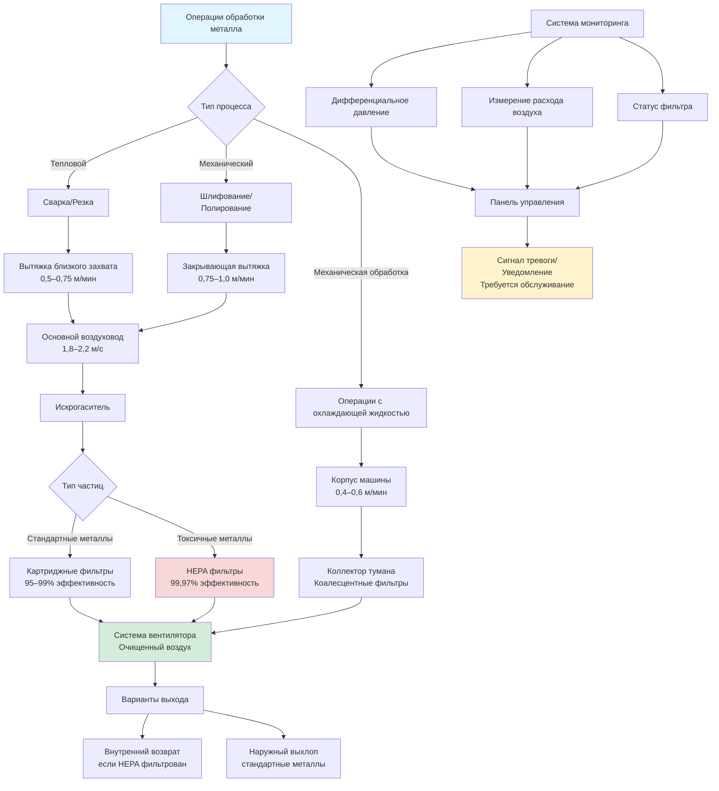

## Характеристики и опасности металлических дымов

Операции обработки металла генерируют опасные загрязняющие вещества в воздухе, требующие эффективной локальной вытяжной вентиляции. Эти загрязняющие вещества включают металлические дымы от тепловых процессов, частицы от механических операций и масляный туман от систем охлаждающей жидкости.

**Основные типы загрязняющих веществ:**

- **Металлические дымы**: Субмикронные частицы (0,001–1,0 мкм) от сварки, пайки и плазменной резки
- **Металлическая пыль**: Крупные частицы (1–100 мкм) от шлифования, шлифовки и полирования
- **Туман охлаждающей жидкости**: Масляные аэрозоли и туман водорастворимой жидкости от операций механической обработки
- **Комбинированные выбросы**: Комбинации дымов, пыли и тумана от комплексных процессов

Металлические дымы представляют значительные риски для здоровья, включая металлическую лихорадку, респираторную сенсибилизацию и хронические заболевания легких. Шестивалентный хром от сварки нержавеющей стали и бериллий из сплавов для аэрокосмической промышленности представляют особенно серьезные опасности, требующие строгого контроля воздействия.

## Дымы от резки, шлифования и полирования

Механические процессы обработки металла генерируют отличающиеся профили выбросов, требующие адаптированные подходы к вентиляции.

**Операции термической резки:**

Плазменная, лазерная и кислородно-ацетиленовая резка производят высокие концентрации металлических дымов. Плазменная резка мягкой стали генерирует оксиды железа со скоростью 50–150 мг/мин. Столы с нисходящим потоком или вытяжки с близким захватом, расположенные на расстоянии 15–30 см от зоны резки, обеспечивают оптимальный контроль.

**Операции шлифования и абразивной обработки:**

Шлифовальные круги, ленточные шлифовальные машины и дисковые шлифовальные машины создают значительные выбросы частиц. Скорость генерирования зависит от твердости материала, скорости круга и применяемого давления. Типичные операции шлифования производят 10–50 мг/мин вдыхаемых частиц.

**Полирование и финишная обработка:**

Эти завершающие операции генерируют мелкие частицы, смешанные с остатками полировочного состава. Более низкие скорости выбросов (5–20 мг/мин) по-прежнему требуют эффективного захвата из-за распределения мелких частиц по размеру и потенциала рассеивания.

## Требования к вытяжкам и захвату

Эффективный захват выбросов при обработке металла требует правильно спроектированных и расположенных вытяжек. Требуемая скорость захвата зависит от скорости генерирования загрязняющих веществ, термических эффектов и близости оператора.

**Расчет скорости захвата:**

Минимальный расход воздуха для боковых щелевых вытяжек следует:

$$Q = V_c \cdot L \cdot \left(10X^2 + A\right)$$

Где:
- $Q$ = расход воздуха (CFM)
- $V_c$ = скорость захвата у источника (м/мин, типично 0,5–1,0 м/мин)
- $L$ = длина щели (м)
- $X$ = расстояние от щели до источника (м)
- $A$ = площадь лица вытяжки (м²)

**Параметры конструкции вытяжки:**

| Операция | Тип вытяжки | Скорость захвата | Минимальная скорость транспорта |
|-----------|-----------|------------------|---------------------------|
| Сварочный стол | Боковой выхлоп | 0,5–0,75 м/мин | 1,8–2,0 м/с |
| Шлифование | Закрывающая вытяжка | 0,75–1,0 м/мин | 2,0–2,2 м/с |
| Полирование | Стол с нисходящим потоком | 0,4–0,6 м/мин | 1,5–1,8 м/с |
| Плазменная резка | Стол с нисходящим потоком | 0,5–0,75 м/мин | 1,8–2,0 м/с |

**Требования к позиционированию:**

Расположение вытяжки критически влияет на эффективность захвата. Позиционируйте вытяжки для:
- Перехвата потока загрязняющих веществ между источником и зоной дыхания оператора
- Минимизации сквозняков, которые рассеивают выбросы (ограничьте скорость окружающего воздуха до <0,25 м/с)
- Сохранения рекомендуемых расстояний работы (типично 15–45 см от источника)
- Учета термических восходящих потоков от горячих процессов

## Фильтрация металлических частиц

Системы фильтрации металлических частиц должны адресовывать широкое распределение размеров частиц и потенциальные пожарные опасности от генерирования искр.

**Выбор технологии фильтрации:**

- **Картриджные фильтры**: Гофрированный материал, предоставляющий 0,9–1,9 м²/картридж, эффективность 95–99,9% для частиц >0,3 мкм
- **Рукавные коллекторы**: Мешки из фильтровальной ткани, эффективность >99% для частиц >1 мкм, подходят для высокой нагрузки пыли
- **HEPA фильтры**: Требуются для токсичных металлов (шестивалентный хром, бериллий), эффективность 99,97% при 0,3 мкм
- **Мокрые коллекторы**: Водяное орошение для операций, генерирующих искры, предотвращает риск пожара

**Рассмотрение падения давления:**

Падение давления фильтра увеличивается с накоплением пыли:

$$\Delta P = \Delta P_0 + K \cdot C \cdot t \cdot V$$

Где:
- $\Delta P$ = полное падение давления (см вод. ст.)
- $\Delta P_0$ = падение давления чистого фильтра
- $K$ = коэффициент проницаемости пыльного слоя
- $C$ = входная концентрация пыли (г/м³)
- $t$ = время после очистки (часы)
- $V$ = скорость потока на лице (м/мин)

Автоматизированная импульсная очистка поддерживает приемлемое падение давления (10–20 см вод. ст.) при продлении срока службы фильтра.

## Сбор тумана охлаждающей жидкости

Операции механической обработки с использованием режущих жидкостей генерируют масляный туман и водорастворимые аэрозоли, требующие специализированной сборки.

**Механизмы генерирования тумана:**

- **Механическое**: Высокоскоростное вращение инструмента разбрасывает охлаждающую жидкость в мелкие капли
- **Испарительное**: Тепло испаряет компоненты жидкости, создавая субмикронные аэрозоли
- **Гидравлическое**: Высокопрессионные потоки жидкости атомизируют в вдыхаемые капли

**Методы сборки:**

| Метод | Диапазон размеров частиц | Эффективность | Применение |
|--------|-------------------|------------|-------------|
| Механическое разделение | >10 мкм | 70–85% | Предварительная фильтрация |
| Коалесцентные фильтры | 0,5–10 мкм | 95–99% | Первичная сборка |
| HEPA фильтрация | 0,01–0,5 мкм | 99,97% | Финальная фильтрация |
| Электростатическая | 0,01–10 мкм | 90–98% | Субмикронный туман |

**Конструкция системы:**

Коллекторы тумана охлаждающей жидкости монтируются непосредственно на корпусы машин или подключаются через воздуховоды. Требования к расходу захвата воздуха:

$$Q = 50 \text{ to } 100 \times A_{opening}$$

Где $Q$ в CFM (м³/ч), а $A_{opening}$ — площадь отверстия корпуса в м². Более высокие скорости потока на лице (0,5–0,75 м/с) требуются для открытых машин без корпусов.

## Соответствие требованиям OSHA PEL

Операции обработки металла должны соответствовать Предельно допустимым концентрациям (PEL) OSHA для различных металлических видов.

**Ключевые пределы воздействия металлов:**

| Металл/соединение | OSHA PEL (8-ч ПДК) | ACGIH TLV | Основная проблема здоровья |
|----------------|---------------------|-----------|------------------------|
| Оксид железа (сварочный дым) | 10 мг/м³ | 5 мг/м³ | Сидероз, раздражение дыхательных путей |
| Хром (шестивалентный) | 5 мкг/м³ | 0,5 мкг/м³ | Рак легких, респираторная сенсибилизация |
| Марганец (дым) | 5 мг/м³ (потолок) | 0,02 мг/м³ | Неврологические эффекты, паркинсонизм |
| Никель (металл, растворимый) | 1 мг/м³ | 1,5 мг/м³ | Респираторная сенсибилизация, рак |
| Бериллий | 0,2 мкг/м³ | 0,05 мкг/м³ | Хроническая болезнь бериллия |
| Алюминий (дым) | 15 мг/м³ (всего) | 1 мг/м³ | Раздражение дыхательных путей |

**Проверка соответствия:**

Персональный мониторинг воздействия устанавливает уровни фактического воздействия на работника. Сбор проб использует калиброванные насосы (0,06 л/мин) с подходящими фильтровальными материалами на протяжении всей рабочей смены. Анализ методом индуктивно связанной плазмы (ICP) спектроскопия предоставляет количественные концентрации металлов.

**Иерархия контроля:**

1. **Инженерные контрольные меры**: Локальная вытяжная вентиляция — первая линия защиты
2. **Административные контрольные меры**: Модификации производственной практики, ротация воздействия
3. **Личные защитные средства**: Респираторная защита, когда инженерные контрольные меры недостаточны

Эффективно спроектированные системы локальной вытяжки, обслуживающие контаминацию на уровне ниже 50% PEL, предоставляют адекватный запас безопасности, учитывающий вариативность системы.

## Рассмотрение конструкции системы

**Размеры воздуховодов:**

Поддерживайте минимальные скорости транспорта для предотвращения осаждения частиц. Для металлической пыли и дымов:

$$V_{transport} = 4 \sqrt{\frac{\rho_p}{\rho_{air}}}$$

Где $\rho_p$ — плотность частиц, а $\rho_{air}$ — плотность воздуха. Металлические частицы требуют 1,8–2,2 м/с скорость транспорта.

**Выбор вентилятора:**

Укажите вентиляторы для работы с грязным воздухом с износостойкой конструкцией. Требуемое статическое давление преодолевает сопротивление системы:

$$SP_{total} = \Delta P_{hood} + \Delta P_{duct} + \Delta P_{filter} + \Delta P_{accessories}$$

Включите коэффициент безопасности 25–30% для нагрузки фильтра и деградации системы.

**Выбор материалов:**

Используйте взрывозащищенные алюминиевые или нержавеющие стальные воздуховоды для операций, генерирующих горючую металлическую пыль (алюминий, магний, титан). Заземлите все металлические компоненты для предотвращения статического накопления.

Эффективное извлечение дымов при обработке металла защищает здоровье работников, обеспечивает соответствие нормативным требованиям и поддерживает производительные производственные среды в различных операциях по изготовлению.
