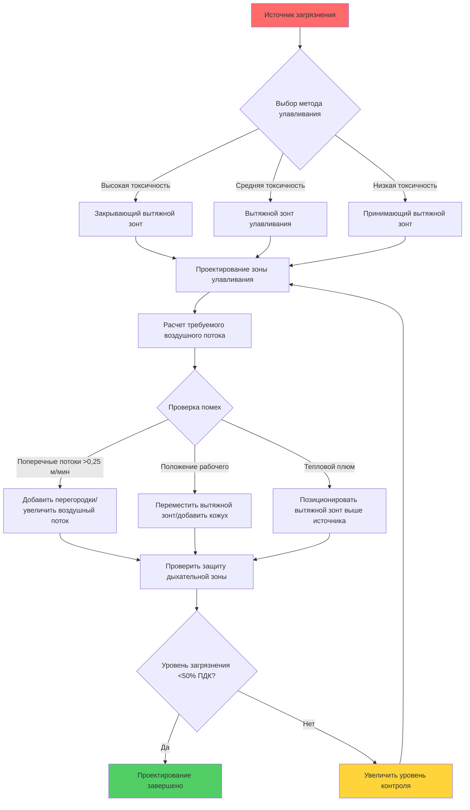

Улавливание загрязнений в источнике представляет наиболее эффективный подход к контролю промышленных дымов в точке их образования. Этот метод перехватывает загрязнения до того, как они попадут в дыхательную зону рабочего или общую атмосферу рабочего места, обеспечивая превосходную защиту по сравнению со стратегиями разбавления загрязненного воздуха.

## Улавливание загрязнений в сравнении с разбавлением воздуха

Улавливание загрязнений в источнике и разбавление воздуха представляют принципиально различные подходы к контролю качества воздуха.

**Характеристики улавливания в источнике:**
- Улавливание загрязнений в точке образования
- Требует меньшего объема воздушного потока (100-1700 м³/ч (100-1,000 CFM) на источник)
- Достигает концентраций загрязнений на уровне 5-10% от уровней при разбавлении
- Подходит для токсичных выбросов с высокой концентрацией
- Выше первоначальные затраты, но ниже энергопотребление при эксплуатации
- Предотвращает распространение загрязнений в рабочее пространство

**Характеристики разбавления воздуха:**
- Смешивание загрязнений с большими объемами воздуха
- Требует в 10-100 раз больше воздушного потока, чем улавливание в источнике
- Приемлемо только для материалов низкой токсичности
- Не может справиться с высокими скоростями образования загрязнений
- Ниже стоимость установки, но выше энергопотребление
- Допускает временное воздействие во время смешивания

Руководство ACGIH по промышленной вентиляции устанавливает, что улавливание в источнике обеспечивает эффективность контроля 90-99%, в то время как разбавление воздуха обычно достигает только 50-70% эффективности для точечных источников.

## Зона улавливания и эффективность

Зона улавливания определяет трехмерный регион, где скорость всасывания вытяжного зонта превышает скорость дисперсии загрязнений. Понимание этой зоны критично для эффективного позиционирования вытяжного зонта.

**Геометрия зоны улавливания:**

Для открытого отверстия (фланцевого вытяжного зонта) скорость улавливания на расстоянии $X$ от лица вытяжного зонта подчиняется формуле:

$$V_x = \frac{Q}{10X^2 + A}$$

Где:
- $V_x$ = скорость на расстоянии $X$ (м/мин)
- $Q$ = объемный расход воздуха (м³/ч)
- $X$ = расстояние от лица вытяжного зонта (м)
- $A$ = площадь лица вытяжного зонта (м²)

Для нефланцевого круглого отверстия:

$$V_x = \frac{Q}{\pi(X + 0.564\sqrt{A/\pi})^2}$$

**Эффективное расстояние улавливания:**

Максимальный эффективный радиус действия вытяжного зонта — это расстояние, где скорость улавливания равна минимально необходимому значению (обычно 0,08-0,3 м/мин в зависимости от загрязнения):

$$X_{max} = \sqrt{\frac{Q - A \cdot V_{capture}}{10 \cdot V_{capture}}}$$

Эффективность улавливания быстро снижается с расстоянием. На расстояниях, равных одному диаметру вытяжного зонта от лица, скорость падает до примерно 10% от скорости на лице зонта.

## Позиционирование вытяжного зонта относительно источника

Оптимальное позиционирование вытяжного зонта максимизирует улавливание при минимизации требований к воздушному потоку.

**Принципы позиционирования:**

1. **Приоритет заключения в кожух:** Заключить источник в кожух максимально возможно (эффективность улавливания увеличивается в 5-10 раз)
2. **Минимальное расстояние:** Позиционировать вытяжной зонт в пределах 0,3-0,6 м от источника (на расстоянии 1-2 диаметров вытяжного зонта)
3. **Вертикальное размещение:** Размещать вытяжные зонты выше источников тепла для использования термической плавучести (снижает требуемый воздушный поток на 30-50%)
4. **Боковое покрытие:** Убедитесь, что ширина вытяжного зонта превышает ширину источника минимум на 15 см с каждой стороны
5. **Зазор для доступа:** Сохраняйте доступ рабочего, одновременно сохраняя целостность зоны улавливания

**Зависимость расстояния от воздушного потока:**

Удвоение расстояния от вытяжного зонта до источника увеличивает требуемый воздушный поток примерно в 4 раза для эквивалентного улавливания. Вытяжной зонт на расстоянии 15 см требует примерно 680 м³/ч, в то время как такой же вытяжной зонт на расстоянии 30 см требует примерно 2720 м³/ч для идентичной скорости улавливания.

## Картины воздушных потоков и помехи

Понимание картин воздушных потоков предотвращает распространенные отказы системы улавливания.

**Источники помех:**

- **Поперечные потоки:** Воздушные потоки в помещении >0,25 м/мин могут отклонить зону улавливания
- **Положение рабочего:** Персонал между вытяжным зонтом и источником блокирует воздушный поток
- **Движение процесса:** Обработка материалов нарушает установившиеся картины потока
- **Тепловые потоки:** Источники тепла создают восходящие плюмы (0,3-0,6 м/мин)
- **Несколько вытяжных зонтов:** Соседние вытяжки могут создать мертвые зоны

**Стратегии смягчения:**

- Ориентировать вытяжные зонты перпендикулярно доминирующим воздушным потокам
- Установить частичные кожухи или перегородки (увеличивают эффективность в 2-3 раза)
- Увеличить воздушный поток на 25-50% при наличии поперечных потоков >0,3 м/мин
- Использовать толкающе-вытяжную вентиляцию для широких источников
- Координировать позиционирование вытяжных зонтов для предотвращения зон помех

## Защита дыхательной зоны рабочего

Конечная цель улавливания загрязнений в источнике — защита дыхательной зоны рабочего (определяется как полусфера радиусом 30 см от носа/рта).

**Критерии защиты:**

- Концентрация загрязнения <50% предельно допустимой концентрации (ПДК)
- Вытяжной зонт позиционирован для предотвращения пути загрязнения через дыхательную зону
- Рабочий позиционирован за пределами траектории выхлопа вытяжного зонта
- Мониторирование дыхательной зоны подтверждает предположения проектирования

**Конфигурации высокого риска:**

1. Рабочий позиционирован между источником и вытяжным зонтом (поток загрязнения проходит через дыхательную зону)
2. Источник ниже дыхательной зоны с вытяжным зонтом над головой (требует чрезмерного воздушного потока)
3. Несколько источников, требующих позиционирования тела рядом с неконтролируемыми выбросами

## Иерархия контроля ACGIH

Американская конференция государственных промышленных гигиенистов устанавливает иерархию контроля, приоритизирующую эффективность:

| Уровень контроля | Метод | Эффективность | Применение к улавливанию в источнике |
|------------------|-------|---------------|--------------------------------------|
| 1. Устранение | Удалить опасность | 100% | Замена процесса без образования дымов |
| 2. Замена | Замена на менее опасное | 90-100% | Использование процесса с более низкой температурой |
| 3. Инженерные средства контроля | Улавливание в источнике LEV | 85-99% | Основной метод вытяжки дымов |
| 4. Административные меры | Процедуры, ротация | 50-80% | Дополнение к инженерным средствам контроля |
| 5. СИЗ | Респираторы | 50-95% | Последняя мера, когда инженерные средства недостаточны |

Улавливание загрязнений в источнике локальная вытяжная вентиляция представляет третий уровень и наиболее эффективный практический контроль для процессов, которые не могут устранить образование дымов. Надлежащее проектирование достигает 90-99% снижения загрязнений, значительно превосходя административные меры контроля или полаганию на СИЗ.

**Приоритеты инженерного контроля в пределах улавливания в источнике:**

1. **Закрывающие вытяжные зонты:** Максимальное заключение в кожух (кабина, шкаф) - 95-99% эффективность
2. **Вытяжные зонты улавливания:** Частичное заключение в кожух с направленным улавливанием - 85-95% эффективность
3. **Принимающие вытяжные зонты:** Позиционирование для приема естественно поднимающихся загрязнений - 70-90% эффективность
4. **Наружные вытяжные зонты:** Открытое улавливание без кожуха - 60-85% эффективность

## Сравнение методов улавливания

| Метод | Типовой Q/A (м³/ч/м²) | Максимальное расстояние | Эффективность контроля | Лучшее применение |
|-------|---------------------------|-------------------------|------------------------|--------------------|
| Закрывающий вытяжной зонт (4-сторонний) | 300-500 | N/A (закрыто) | 95-99% | Токсичные дымы, высокое образование |
| Щелевой вытяжной зонт (фланцевый) | 500-750 | 0,15-0,3 м | 85-95% | Линейные источники, сварочные столы |
| Навесной вытяжной зонт (над источником) | 375-625 | 0,45 м | 70-85% | Тепловые процессы, термическое поднятие |
| Вытяжной стол | 750-1250 | 30-45 см | 85-95% | Шлифование, легкие взвешенные частицы |
| Наружный вытяжной зонт (нефланцевый) | 1000-2000 | 0,08-0,15 м | 60-75% | Крупные объекты, низкая токсичность |
| Подвижный вытяжной рукав | 500-1000 | 0,6-0,9 м | 70-90% | Прерывистые операции |

Выбор зависит от токсичности загрязнений, скорости образования, требований рабочего процесса и экономических соображений. Более высокая эффективность контроля оправдывает более высокую стоимость установки для токсичных материалов.

Эффективное улавливание загрязнений в источнике требует комплексного рассмотрения типа вытяжного зонта, позиционирования, расчетов воздушного потока и факторов помех для достижения надежной защиты дыхательной зоны при одновременной минимизации энергопотребления.
