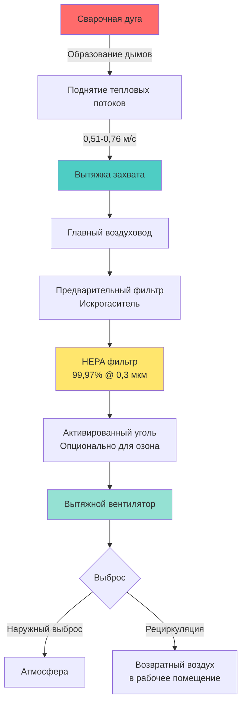

## Состав сварочных дымов и опасности

Сварочные дымы представляют собой сложную смесь окислов металлов, фторидов и силикатов, образующихся при сплавлении основных металлов и присадочных материалов. Состав значительно варьируется в зависимости от процесса сварки, основного металла, электродов и покрытий.

Основные опасные компоненты включают:

- **Окись железа** - преобладающий компонент при сварке большинства черных металлов
- **Марганец** - нейротоксичный металл, вызывающий симптомы, похожие на паркинсонизм
- **Шестивалентный хром (Cr VI)** - канцерогенное соединение при сварке нержавеющей стали
- **Никель** - респираторный сенсибилизатор и канцероген
- **Кадмий** - из гальванизированных материалов, высокотоксичный
- **Окись цинка** - вызывает лихорадку металлических дымов
- **Озон и окислы азота** - от дуговых процессов

Размер частиц варьируется от 0,01 до 1,0 микрометра, большинство частиц меньше 0,5 микрометра. Эти респируемые частицы проникают глубоко в легкие, увеличивая риск пневмокониоза, рака легких и системной токсичности.

## Требования к скорости захвата

Эффективное извлечение дымов требует достаточной скорости захвата, чтобы преодолеть тепловые восходящие потоки и боковые воздушные потоки в источнике сварки. Требуемая скорость захвата зависит от конструкции вытяжки и рабочего расстояния.

Для сварочных операций ACGIH рекомендует:

- **Навесные вытяжки**: 0,51–0,76 м/с в самой дальней точке образования дымов
- **Боковые вытяжки**: 0,51–1,02 м/с в точке работы
- **Столы с нижней вытяжкой**: 0,25–0,51 м/с через рабочую поверхность
- **Переносные рукава извлечения**: 0,76–1,27 м/с на входе вытяжки

Объемный расход для прямоугольной вытяжки рассчитывается как:

$$Q = V \times A = V \times W \times H$$

Где:
- $Q$ = объемный расход (м³/ч)
- $V$ = скорость захвата (м/с)
- $A$ = площадь входа вытяжки (м²)
- $W$ = ширина вытяжки (м)
- $H$ = высота вытяжки (м)

Для круглых вытяжек или рукавов извлечения:

$$Q = V \times \frac{\pi D^2}{4}$$

Где $D$ — диаметр вытяжки в метрах.

Требуемый расход увеличивается с расстоянием от источника согласно:

$$Q = V \times (10X^2 + A)$$

Где:
- $X$ = расстояние от источника до входа вытяжки (м)
- $A$ = площадь входа вытяжки (м²)

## Типы вытяжек для сварочных операций

### Стационарные вытяжки

**Столы с нижней вытяжкой**: Перфорированные рабочие поверхности с камерами под ними вытягивают дымы вниз. Рекомендуются для небольших деталей и сборочной сварки. Скорость на входе через рабочую поверхность должна быть 0,25–0,51 м/с.

**Навесные вытяжки**: Расположенные над рабочей зоной для захвата поднимающихся тепловых потоков. Эффективны только при монтаже в пределах 0,9–1,2 м от точки сварки. Минимальная скорость захвата 0,51 м/с в самой дальней точке сварки.

**Боковые вытяжные кабины**: Вертикальные или наклонные задние стенки с вытяжными камерами захватывают дымы горизонтально. Подходят для крупных сварочных работ. Скорость на входе должна быть 0,51–0,76 м/с в рабочей зоне.

### Переносные системы извлечения

**Гибкие рукава**: Гибкие воздуховодные рукава с вытяжками, расположенные на расстоянии 15–30 см от точки сварки. Обеспечивают расход 28–57 м³/ч на один рукав. Наиболее универсальное решение для различных мест сварки.

**Извлечение, встроенное в горелку**: Встроено непосредственно в сварочные горелки MIG, обеспечивая захват в точке образования. Требуют расход 17–34 м³/ч на одну горелку. Высокоэффективны, но ограничены конкретными процессами.

**Столы с задней вытяжкой**: Автономные рабочие станции с задней вытяжной камерой и рециркуляционной фильтрацией. Скорость на входе 0,30–0,51 м/с через рабочий проем.

## Стационарные системы и переносные системы извлечения

**Стационарные системы** обеспечивают постоянный захват источника для выделенных сварочных станций. Преимущества включают постоянную производительность, интеграцию со зданием HVAC и минимальное вмешательство работника. Конструкция воздуховодов следует стандартным принципам промышленной вентиляции с минимальными транспортными скоростями 1,8–2,0 м/с для предотвращения осаждения частиц.

Общее статическое давление системы:

$$SP_{total} = SP_{hood} + SP_{duct} + SP_{filter} + VP_{fan}$$

Где давление скорости $VP = \left(\frac{V}{2}{}\right)^2$ Па для стандартного воздуха.

**Переносные системы** обеспечивают гибкость при изменении мест работы и в цеховых условиях. Автономные агрегаты с встроенной фильтрацией исключают необходимость в воздуховодах. Ограничения включают более высокие требования к техническому обслуживанию, регулярную замену фильтров и возможность обхода системы оператором.

## Требования к фильтрации для сварочных дымов

Многоступенчатая фильтрация учитывает распределение размера частиц и химический состав сварочных дымов:

### Первичная ступень
Механические предварительные фильтры или циклонные сепараторы удаляют крупные частицы (>5 микрометров) и предотвращают попадание искр в последующие ступени фильтрации. Эффективность сбора 80–90% по массе.

### Вторичная ступень
HEPA фильтры захватывают респируемые частицы с эффективностью 99,97% при 0,3 микрометра. Обязательны для контроля шестивалентного хрома и марганца. Индикаторы перепада давления должны сигнализировать о замене при 1,0–1,5 кПа.

Требуемая площадь фильтра:

$$A_{filter} = \frac{Q}{v_{face}}$$

Где типичные лицевые скорости HEPA составляют 1,3–1,8 м/с.

### Третичная ступень
Адсорбция на активированном угле удаляет газообразные загрязнители, включая озон и летучие органические соединения. Требуется для алюминиевой сварки и процессов, генерирующих значительное озоноудаление (>0,1 ppm).

## Допустимые нормы воздействия OSHA и соответствие требованиям

OSHA предписывает строгие допустимые пределы воздействия (PEL) для компонентов сварочных дымов:

| Загрязнитель | 8-часовой средневзвешенный PEL | STEL | Требуется мониторинг |
|-------------|--------------------------------|------|----------------------|
| Марганец (дым) | 5 мг/м³ (потолок) | - | Первоначальный и периодический |
| Шестивалентный хром | 5 мкг/м³ | - | Да, если потенциал >2,5 мкг/м³ |
| Общий сварочный дым | 5 мг/м³ | - | Первоначальная оценка |
| Окись железа | 10 мг/м³ | - | При воздействии работника |
| Никель | 1 мг/м³ | - | Сварка нержавеющей стали |
| Кадмий | 5 мкг/м³ | - | Гальванизированные материалы |
| Озон | 0,1 ppm | - | Дуговые процессы сварки |
| Диоксид азота | 5 ppm | - | Газозащитные процессы |

Стандарт OSHA от 2006 г. по шестивалентному хрому (29 CFR 1910.1026) значительно снизил предыдущий PEL с 52 мкг/м³ до 5 мкг/м³, требуя технических средств контроля для большинства операций сварки нержавеющей стали.

Для марганца OSHA снизила потолочный лимит до 5 мг/м³ в 2013 году, с постоянным рассмотрением дальнейшего снижения на основе исследований нейротоксичности. Одной респираторной защиты недостаточно; технические средства контроля должны снижать воздействие до самого низкого достижимого уровня.

Методология отбора воздуха следует методам NIOSH 7300 (элементы по ICP) и 7604 (шестивалентный хром). Образцы из персональной зоны дыхания определяют фактическое воздействие на работника в сравнении с образцами воздуха в помещении, которые могут недооценивать истинное воздействие.

Эффективные системы извлечения сварочных дымов объединяют надлежащую конструкцию вытяжки, адекватную скорость захвата, надлежащую конструкцию транспортных воздуховодов и многоступенчатую фильтрацию для поддержания воздействия ниже нормативных пределов при защите здоровья рабочих.
