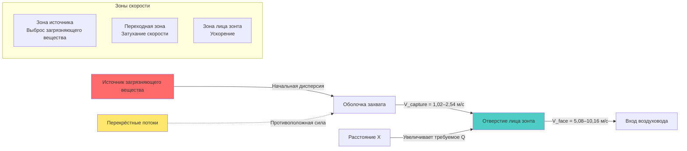

## Определение скорости захвата

Скорость захвата — это минимальная скорость воздуха, индуцируемая вытяжным зонтом в самой удалённой точке образования загрязняющего вещества, достаточная для преодоления противоположных воздушных потоков и сил дисперсии загрязняющего вещества, чтобы втянуть загрязнение в отверстие зонта. Эта скорость представляет критический параметр проектирования для внешних (захватывающих) зонтов, позиционируемых вне загрязнённой зоны.

Скорость захвата должна быть установлена в месте источника, а не на лице зонта. Для внешних зонтов требуемый объёмный расход воздуха резко увеличивается с расстоянием между зонтом и источником из-за быстрого затухания скорости на открытом воздухе.

**Принципы измерения:**
- Измеряется тепловым анемометром или лопастным анемометром в месте источника
- Измерение траверса требуется для распределённых источников
- Измерение проводится при включённых всех сквозняках и рабочих условиях процесса
- Минимально приемлемая скорость применяется в наихудшей позиции источника

## Фундаментальное соотношение расходов воздуха

Базовое соотношение, управляющее проектированием вытяжного зонта, связывает объёмный расход воздуха, скорость и площадь поперечного сечения:

$Q = V \times A$

Где:
- $Q$ = объёмный расход воздуха (м³/ч)
- $V$ = скорость воздуха (м/мин)
- $A$ = площадь поперечного сечения (м²)

Для расчётов лица зонта:

$Q = V_{face} \times A_{face}$

Для расчётов точки захвата (внешние зонты):

$Q = V_{capture} \times A_{envelope}$

Площадь оболочки представляет воображаемую поверхность на расстоянии захвата, охватывающую все источники загрязняющих веществ. Скорость должна равняться или превышать требуемую скорость захвата по всей этой оболочке.

## Критерии выбора скорости захвата ACGIH

Руководство по промышленной вентиляции Американской конференции государственных специалистов по промышленной гигиене (ACGIH) устанавливает диапазоны скорости захвата на основе условий выброса загрязняющих веществ и движения окружающего воздуха. Эти критерии представляют фундаментальное руководство по проектированию промышленных выхлопных систем.

| Условие выброса | Характеристики движения воздуха | Диапазон скорости захвата | Примеры проектирования |
|------------------|----------------------------|----------------------|-----------------|
| Выброс практически без скорости в спокойный воздух | Минимальное движение воздуха в помещении, испарение из резервуаров, обезжиривание | 0,25–0,51 м/с | Резервуары с растворителем для обезжиривания, хранение жидкостей |
| Выброс с низкой скоростью в относительно спокойный воздух | Оборудование с низкой скоростью, периодические выбросы | 0,51–1,02 м/с | Заполнение контейнеров, точки передачи на конвейере низкой скорости |
| Активное образование в зоне быстрого движения воздуха | Активное шлифование, дробление, скольжение, выделение газов | 1,02–2,54 м/с | Абразивная очистка, заполнение бочек, просеивание операции |
| Выброс с высокой начальной скоростью в очень быстрое движение воздуха | Высокоскоростное шлифование, абразивная очистка в турбулентной среде | 2,54–10,16 м/с | Высокоскоростные шлифовальные машины, пневматический выброс материалов |

**Факторы выбора:**

1. **Скорость перекрёстного потока:** Если скорость перекрёстного потока в окружающей среде превышает 50% скорости захвата, эффективность значительно снижается. Скорость захвата при проектировании должна быть в 2–3 раза больше максимальной ожидаемой скорости перекрёстного потока.

2. **Опасность загрязняющего вещества:** Вещества с более высокой токсичностью требуют более высоких скоростей проектирования (верхний предел диапазона) для обеспечения надёжного захвата.

3. **Скорость выброса:** Загрязняющие вещества, выпускаемые с высокой начальной скоростью, требуют более высоких скоростей захвата для преодоления импульса.

4. **Тенденция дисперсии:** Тонкие частицы и низкоплотные дымы быстро дисперсируются, требуя более высоких скоростей захвата, чем крупные частицы или плотные пары.

## Соотношение затухания скорости и расстояния

Скорость воздуха, индуцируемая вытяжным зонтом, быстро уменьшается с расстоянием от отверстия зонта, следуя соотношениям обратного квадрата. Это затухание скорости принципиально ограничивает эффективный диапазон захвата внешних зонтов.

**Для нефланцевых круглых или квадратных отверстий:**

$V_x = \frac{Q}{10X^2 + A}$

Где:
- $V_x$ = скорость на расстоянии $X$ от лица зонта (м/мин)
- $Q$ = объёмный расход вытяжного зонта (м³/ч)
- $X$ = расстояние от лица зонта (м)
- $A$ = площадь лица зонта (м²)

**Для фланцевых отверстий (фланец расширяется ≥ диаметра зонта):**

$V_x = \frac{Q}{0,75(10X^2 + A)}$

Фланец уменьшает эффективную константу площади на приблизительно 25%, увеличивая скорость для эквивалентного расхода воздуха.

**Для щелевых прямоугольных отверстий (длина >> ширина):**

$V_x = \frac{3,7 \times V_{slot} \times L \times W}{X \times (L + 1,4X)}$

Где:
- $V_{slot}$ = скорость щели (м/мин)
- $L$ = длина щели (м)
- $W$ = ширина щели (м)
- $X$ = расстояние от щели (м)

**Критические последствия для проектирования:**

- Удвоение расстояния захвата требует приблизительно в 4 раза больше расхода воздуха
- Эффективный диапазон захвата редко превышает 1–2 диаметра зонта для внешних зонтов
- Расстояние от зонта до источника представляет наиболее значимую переменную проектирования
- Минимизация расстояния захвата обеспечивает наибольшее улучшение энергоэффективности

## Влияние характеристик загрязняющих веществ

Физические и химические свойства загрязняющих веществ напрямую влияют на требуемую скорость захвата через их влияние на поведение дисперсии и опасность для здоровья.

**Влияние размера частиц:**

- **Крупные частицы (>100 мкм):** Быстро оседают под действием гравитации, более низкие скорости захвата адекватны для частиц в покое, более высокие скорости необходимы для преодоления начального проецирования
- **Мелкие частицы (10–100 мкм):** Остаются взвешенными в течение продолжительного периода, легко дисперсируются воздушными потоками, требуют скоростей захвата среднего диапазона
- **Респирабельные частицы (<10 мкм):** Следуют линиям тока воздуха тесно, широко дисперсируются, требуют более высоких скоростей захвата для надёжного захвата

**Влияние плотности пара:**

- **Плотные пары (удельный вес >1):** Имеют тенденцию оседать и скапливаться, может требоваться захват на уровне пола или низкого уровня, более низкие скорости достаточны для защищённых областей
- **Пары нейтральной плотности:** Равномерно дисперсируются с воздухом, следуют воздушным потокам в помещении, требуют стандартных скоростей захвата
- **Лёгкие пары (удельный вес <1):** Поднимаются за счёт плавучести, могут быть захвачены потолочными зонтами с более низкими индуцируемыми скоростями, если тепловая конвекция способствует

**Влияние температуры:**

- **Горячие процессы:** Тепловая плавучесть обеспечивает восходящую скорость, помогая захвату верхними зонтами, может снизить требуемую индуцируемую скорость
- **Холодные процессы:** Нет тепловой помощи, полная скорость захвата должна быть индуцирована механически
- **Нагретые загрязняющие вещества:** Тепловое расширение увеличивает требования к объёмному расходу при температуре

**Классификация по токсичности:**

- **Высокотоксичные материалы (ПДК <10 ppm или <0,1 мг/м³):** Требуют скоростей захвата в верхнем диапазоне, применяются коэффициенты безопасности 2–4
- **Умеренная токсичность (ПДК 10–100 ppm):** Стандартные скорости захвата с коэффициентом безопасности 1,5–2
- **Низкая токсичность (ПДК >100 ppm):** Приемлемы минимально рекомендуемые скорости

## Коэффициенты безопасности при проектировании

Инженерные коэффициенты безопасности компенсируют неопределённость в параметрах проектирования, вариабельность в рабочих условиях и деградацию во времени. Расчёты скорости захвата должны включать надлежащие коэффициенты безопасности на основе критичности приложения.

**Рекомендуемые коэффициенты безопасности:**

| Фактор приложения | Множитель | Обоснование |
|-------------------|-----------|---------------|
| Высокотоксичные загрязняющие вещества | 2,0–4,0 | Минимальный допуск воздействия |
| Неопределённые условия перекрёстного потока | 1,5–2,0 | Фактические перекрёстные потоки могут превышать оценки |
| Переменная позиция источника | 1,5–2,5 | Проектирование должно вмещать наихудшую позицию |
| Периодические выбросы высокой скорости | 1,5–2,0 | Пиковые условия управляют проектированием |
| Будущие изменения процесса | 1,25–1,5 | Вмещение увеличения производства |
| Старение системы и загрязнение | 1,25–1,5 | Деградация производительности во времени |

**Применение кумулятивного коэффициента:**

Коэффициенты безопасности не должны слепо умножаться. Вместо этого определите основную неопределённость и примените соответствующий коэффициент, затем добавьте 10–25% для вторичных неопределённостей:

$Q_{design} = Q_{calculated} \times SF_{primary} \times (1 + 0,1 \text{ to } 0,25)$

**Последствия избыточного проектирования:**

Чрезмерные коэффициенты безопасности создают проблемы:
- Повышенное энергопотребление на протяжении всего жизненного цикла системы
- Более высокие первоначальные затраты на оборудование (большие вентиляторы, воздуховоды, коллекторы)
- Вероятность чрезмерных скоростей, вызывающих повторное увлечение материала
- Проблемы с шумом и вибрацией от высокоскоростного воздушного потока

**Последствия недостаточного проектирования:**

Недостаточный расход воздуха приводит к:
- Неадекватному захвату загрязняющих веществ и воздействию на работника
- Несоответствию нормативным требованиям
- Сложности достижения производительности проектирования в фактических условиях
- Необходимости в дорогостоящих модификациях системы

## Практическая процедура проектирования

1. **Определите условия выброса загрязняющего вещества:** Определите скорость выброса, характеристики движения воздуха и свойства загрязняющего вещества
2. **Выберите базовую скорость захвата:** Используйте таблицу ACGIH, соответствующую условиям выброса
3. **Определите расстояние захвата:** Установите максимальное расстояние от зонта к источнику на основе физических ограничений
4. **Рассчитайте площадь оболочки:** Определите воображаемую поверхность на расстоянии захвата, охватывающую все источники
5. **Рассчитайте требуемый расход воздуха:** $Q = V_{capture} \times A_{envelope}$
6. **Примените коэффициенты безопасности:** Отрегулируйте для неопределённостей, специфичных для приложения
7. **Проверьте условия перекрёстного потока:** Убедитесь в том, что $V_{capture} \geq 2 \times V_{cross-draft}$
8. **Оптимизируйте размещение зонта:** Минимизируйте расстояние захвата для снижения требуемого расхода воздуха

Наиболее эффективное улучшение проектирования включает сокращение расстояния от зонта к источнику, часто обеспечивая 50–75% снижение расхода воздуха для каждого сокращения расстояния вдвое. При разрешении физических ограничений процесса, размещение зонтов как можно ближе к источникам загрязняющих веществ представляет оптимальную практику проектирования.

## Проверка производительности

После установки проверка подтверждает достижение проектной скорости захвата:

- **Точечное измерение:** Показания анемометра в определённых местах источников при рабочих условиях
- **Тестирование дымовой трубкой:** Визуальное подтверждение моделей воздушного потока, втягивающих дым из всех позиций источников в зонт
- **Тестирование газом-трассером:** Количественное измерение эффективности захвата с использованием контролируемого выброса трассера
- **Непрерывный мониторинг:** Постоянные станции измерения скорости для критических приложений

Измеренные скорости захвата ниже проектных значений указывают на недостатки системы, требующие исправления перед началом работы.
