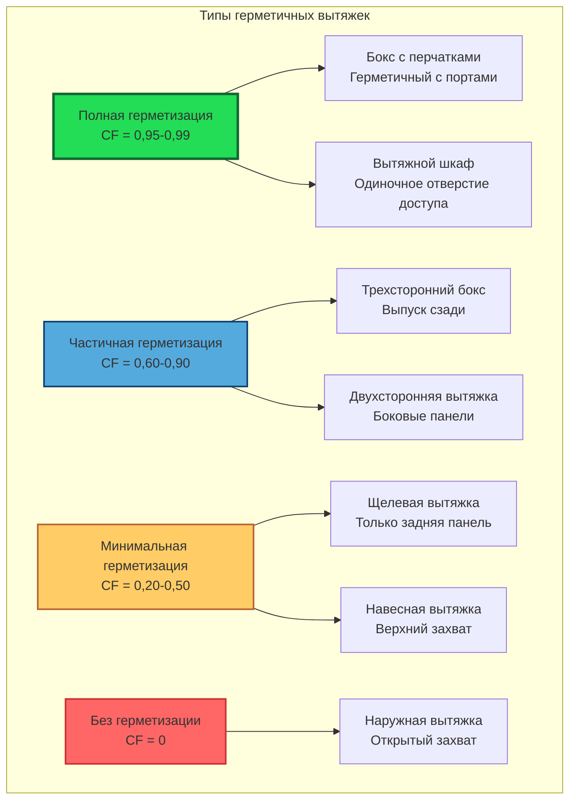

Герметизация представляет основную стратегию контроля загрязнений воздуха у источника. Основной принцип заключается в физическом ограничении объема, из которого может выходить загрязненный воздух, что позволяет снизить требуемый расход вытяжного воздуха для эффективного контроля, одновременно повышая общую производительность системы.

## Концепции герметичных и захватывающих вытяжек

Промышленные вытяжные системы работают по двум различным принципам: герметизация и захват. Герметичные вытяжки частично или полностью окружают источник загрязнения, создавая физический барьер, который ограничивает распространение. Вытяжка системы удаляет загрязненный воздух из ограниченного пространства. Захватывающие вытяжки, напротив, полагаются на скорость воздуха для втягивания загрязнений из открытого источника в патрубок вытяжки без физических барьеров.

Разница в эффективности существенна. Герметичная вытяжка требует только достаточного расхода воздуха для поддержания небольшого отрицательного давления и преодоления тепловых или технологических воздушных потоков. Захватывающая вытяжка должна создавать адекватную скорость захвата у источника загрязнения, что обычно требует в 10–100 раз больше вытяжного воздуха в зависимости от расстояния от фронта вытяжки.

Для захватывающей вытяжки требуемый объемный расход следует формуле:

$$Q = V_c \cdot A_s$$

где $Q$ — объемный расход (м³/ч), $V_c$ — скорость захвата у источника (м/с), и $A_s$ — площадь поверхности на расстоянии захвата (м²). Поскольку площадь увеличивается пропорционально квадрату расстояния, удвоение расстояния от вытяжки до источника увеличивает требуемый расход воздуха в четыре раза.

Герметичная вытяжка требует только:

$$Q_e = V_f \cdot A_o + Q_p$$

где $Q_e$ — расход вытяжного воздуха (м³/ч), $V_f$ — скорость воздуха на отверстиях (обычно 0,3–1,0 м/с), $A_o$ — общая открытая площадь (м²), и $Q_p$ представляет воздух процесса, добавляемый из тепловых факелов или механических возмущений.

## Частичная и полная герметизация

Полные герметизации полностью окружают источник загрязнения, за исключением необходимых отверстий доступа. Примеры включают лабораторные вытяжные шкафы, боксы с перчатками и пескоструйные кабины. Они обеспечивают максимальную герметизацию, но ограничивают доступность и могут не подходить для всех процессов.

Частичные герметизации используют стены, перегородки или барьеры с трех и более сторон для ограничения распространения загрязнений при сохранении операционного доступа. Трехсторонний бокс с выпуском на задней стене представляет собой обычную частичную герметизацию. Коэффициент герметизации (CF) количественно определяет эффективность:

$$CF = \frac{A_t - A_o}{A_t}$$

где $A_t$ — общая площадь, которая была бы открыта без герметизации, и $A_o$ — фактическая открытая площадь. Коэффициент герметизации 0,75 указывает на то, что 75% потенциальных отверстий закрыты, что обычно снижает требуемый расход воздуха на 60–80% по сравнению с захватывающей вытяжкой.

## Факторы эффективности герметизации

Множество факторов определяют фактическую производительность герметизации помимо геометрической конфигурации:

**Поперечные потоки** представляют основное препятствие для герметизации. Комнатные воздушные потоки, превышающие 0,25–0,50 м/с, могут преодолеть вытяжку при типовых скоростях на фронте, позволяя загрязнениям уходить. Расположение вытяжек вдали от дверей, окон и диффузоров HVAC здания имеет решающее значение.

**Тепловые эффекты** от горячих процессов создают плавучие факелы с существенным импульсом. Индуцированный объемный расход в тепловом факеле составляет:

$$Q_t = 0,00265 \cdot T_p^{1/3} \cdot H^{5/3}$$

где $Q_t$ — расход факела (м³/ч), $T_p$ — тепловыделение (кДж/мин), и $H$ — высота над источником (м). Вытяжка должна превышать расход факела для поддержания герметизации.

**Импульс процесса** от шлифования, операций распыления или обработки материалов придает частицам и парам направленную скорость. Стены герметизации, расположенные перпендикулярно доминирующему вектору импульса, обеспечивают максимальную эффективность.

**Турбулентность** в герметизации может создавать вихри, которые переносят загрязнения к отверстиям. Гладкие воздушные потоки с минимальными препятствиями улучшают герметизацию.

## Воздушные завесы и перегородки

Воздушные завесы создают движущуюся плоскость воздуха поперек отверстия для дополнения физической герметизации. Подаваемый воздух, выбрасываемый через щель, создает высокоскоростной поток, который отклоняет загрязнения обратно в закрытое пространство. Требуемая скорость воздушной завесы составляет:

$$V_{ac} = 1,5 \cdot V_d + V_{cross}$$

где $V_{ac}$ — скорость воздушной завесы (м/с), $V_d$ — скорость рассеивания загрязнений (м/с), и $V_{cross}$ представляет скорость поперечного потока (м/с). Коэффициент 1,5 обеспечивает запас прочности.

Воздушные завесы потребляют значительную энергию и вводят дополнительный расход воздуха, который должна обрабатывать вытяжная система. Они наиболее эффективны для поддержания тепловой защиты или исключения внешних потоков, а не для первичной герметизации.

Перегородки — неподвижные пластины или регулируемые панели в герметизации — направляют воздушный поток и повышают эффективность захвата. Перегородка, расположенная за источником загрязнения, создает зону низкого давления, которая втягивает воздух через источник к вытяжке. Перегородки также снижают турбулентность и мертвые зоны, где могут накапливаться загрязнения.

## Вентиляция боксов и герметизаций

Распылительные боксы и аналогичные герметизации требуют равномерного распределения расхода воздуха для предотвращения накопления загрязнений и обеспечения последовательного захвата. Ключевые параметры проектирования включают:

| Параметр | Малярный бокс | Нанесение порошка | Сварочный бокс | Лабораторный шкаф |
|-----------|---------------|-------------------|-----------------|-------------------|
| Скорость на фронте (м/с) | 0,5–0,75 | 0,75–1,0 | 0,5–0,75 | 0,4–0,6 |
| Распределение воздуха | Нисходящий или боковой | Нисходящий предпочтителен | Выпуск сзади | Выпуск сзади |
| Фильтрация | Сухая или водяная промывка | Картридж фильтры | Дымовые фильтры | HEPA при необходимости |
| Приточный воздух | Отапливаемый, 100% замена | Отапливаемый, 100% замена | Кондиционированный, 90–100% | Отсутствует (общая HVAC) |
| Защита от взрыва | Класс I Подразделение 2 | Требуется заземление | Обычно не требуется | Специфичная для химикатов |

Боксы с нисходящим воздушным потоком выпускают через напольные решетки, обеспечивая отличное управление более тяжелыми чем воздух парами и избыточным распылением. Конструкции с боковым потоком выпускают через одну стену, приточный воздух подается с противоположной стороны, создавая горизонтальный воздушный поток, подходящий для крупных предметов или проходных конфигураций.

## Рабочие процессы и герметизация

Даже оптимальное проектирование вытяжки дает сбой без надлежащих рабочих процессов. Оператор должен:

**Позиционировать работу в пределах герметизации**, а не на плоскости фронта. Каждый сантиметр, на который источник смещается к отверстию, снижает эффективность герметизации. Как руководство, работа должна оставаться на расстоянии не менее 15 см внутри фронта вытяжки.

**Минимизировать препятствия** между источником и вытяжкой. Каждое препятствие создает турбулентность и мертвые зоны. Инструменты и материалы должны храниться вне пути прямого воздушного потока.

**Контролировать переменные процесса**, влияющие на генерацию загрязнений. Более низкие температуры, сниженная агитация и закрытые контейнеры все снижают нагрузку на систему вентиляции.

**Проверять производительность вытяжки** регулярно, используя дымовые трубки, анемометры или электронные мониторы. Измерения статического давления в стандартизированных местоположениях обеспечивают постоянную проверку того, что расход вытяжки остается адекватным.

Взаимосвязь между герметизацией и рабочим процессом является мультипликативной, а не аддитивной. Хорошо спроектированная вытяжка, работающая неправильно, работает хуже, чем маргинальная вытяжка, используемая правильно. Программы обучения должны подчеркивать, что вытяжка является компонентом системы, требующим активного взаимодействия оператора, а не пассивным устройством безопасности, которое работает автоматически независимо от особенностей использования.

Принципы герметизации обеспечивают основу для энергоэффективной и эффективной промышленной вытяжной вентиляции. Путем минимизации объема, из которого загрязнения могут выходить через физические барьеры, требования к расходу воздуха снижаются драматически, одновременно повышая надежность контроля существенно.
