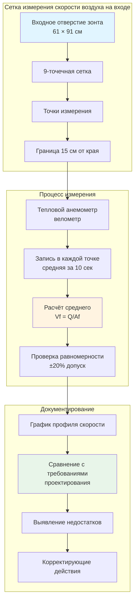

Скорость воздуха на входе представляет собой среднюю скорость воздуха, измеренную на входном отверстии зонта перпендикулярно плоскости входа. Этот критический параметр определяет способность зонта улавливать и содержать загрязнители в источнике. Скорость воздуха на входе непосредственно влияет как на эффективность улавливания, так и на энергопотребление, что делает её фундаментальным параметром проектирования для промышленных систем локальной вытяжной вентиляции.

## Определение и измерение скорости воздуха на входе

Скорость воздуха на входе ($V_f$) рассчитывается как объёмный расход разделённый на площадь входного отверстия зонта:

$$V_f = \frac{Q}{A_f}$$

где $Q$ — расход вытяжного воздуха (CFM) и $A_f$ — площадь входного отверстия зонта (м²).

Измерение требует разделения входного отверстия зонта на равные площади с использованием сетки, при этом показания снимаются в центре каждого сегмента сетки. Минимальное количество точек измерения зависит от размера зонта, обычно колеблется от 9 точек для малых зонтов до 25 и более точек для больших отверстий. Измерения должны выполняться на расстоянии не менее 15 см от краёв зонта во избежание краевых эффектов и турбулентности.

## Рекомендуемые скорости воздуха на входе по приложениям

Требования к скорости воздуха на входе значительно варьируются в зависимости от характеристик загрязнителя, интенсивности образования и токсичности. Руководство ACGIH Industrial Ventilation Manual предоставляет руководство по различным приложениям.

| Тип зонта | Приложение | Скорость воздуха на входе (м/с) | Обоснование |
|-----------|-----------|----------------------------------|-------------|
| Настольный зонт с ограждением | Лёгкие пары, низкая токсичность | 0,30–0,51 | Минимальные воздушные потоки, низкий уровень образования |
| Лабораторный вытяжной шкаф | Обращение с химикатами | 0,41–0,61 | Стандартное требование ANSI/AIHA Z9.5 |
| Высокоопасный вытяжной шкаф | Высокотоксичные материалы | 0,51–0,76 | Улучшенное содержание токсичных веществ |
| Окрасочная камера (открытое отверстие) | Распыление растворителя | 0,51–0,76 | Улавливание избыточного распыла, умеренная токсичность |
| Шлифовальный/полировальный зонт | Образование частиц | 0,76–1,02 | Высокоскоростные частицы требуют повышенного улавливания |
| Сварочный зонт | Дым и частицы | 0,51–0,76 | Помощь от горячего теплового шлейфа |
| Зонт для кислот/коррозионных веществ | Обращение с коррозионными парами | 0,51–0,64 | Улучшенное содержание, защита материала |
| Радиоизотопный зонт | Радиоактивный материал | 0,64–0,76 | Максимальное требуемое содержание |

Эти значения предполагают минимальные перекрёстные потоки воздуха. Более высокие скорости воздуха на входе могут потребоваться, когда потоки окружающего воздуха превышают 0,25 м/с или когда размещение зонта не может избежать интенсивного движения.

## Равномерность скорости воздуха на входе

Равномерное распределение скорости воздуха на входе обеспечивает согласованную производительность улавливания на всём входном отверстии зонта. ANSI/AIHA Z9.5 определяет, что ни одна отдельная точка измерения не должна отклоняться более чем на ±20% от средней скорости воздуха на входе. Это требование предотвращает мёртвые зоны и предпочтительные пути потока, которые нарушают содержание.

Неравномерные профили скорости обычно результируют из:

- Неправильного проектирования секции всасывания с недостаточным распределением потока
- Асимметричных подключений воздуховодов, создающих несбалансированный поток
- Препятствий вблизи входного отверстия зонта (оборудование, хранящиеся материалы)
- Повреждённых или отсутствующих дефлекторов в секции всасывания
- Чрезмерной скорости в воздуховоде, вызывающей дисбаланс потока при подключении

Коэффициент равномерности ($U_c$) количественно определяет распределение скорости:

$$U_c = 1 - \frac{\sqrt{\sum_{i=1}^{n}(V_i - V_{avg})^2/n}}{V_{avg}}$$

где $V_i$ представляет отдельные измерения скорости и $V_{avg}$ — среднюю скорость воздуха на входе. Коэффициент равномерности выше 0,80 указывает на приемлемую производительность.

## Связь с эффективностью улавливания

Скорость воздуха на входе непосредственно влияет на эффективность улавливания через её влияние на поле скорости, распространяющееся от входного отверстия зонта. Эффективная зона улавливания простирается примерно на 1,0–1,5 диаметра зонта впереди отверстия для фланцевых зонтов, причём более высокие скорости воздуха на входе расширяют эту зону дальше.

Эффективность улавливания ($\eta_c$) увеличивается со скоростью воздуха на входе в соответствии с эмпирическими соотношениями, однако чрезмерные скорости создают турбулентность, которая может нарушить закономерности улавливания. Оптимальная скорость воздуха на входе уравновешивает адекватное улавливание с энергоэффективностью и совместимостью процесса.

Для щелевых зонтов связь между скоростью воздуха на входе и расстоянием улавливания следует:

$$V_x = V_f \left(\frac{A_f}{A_x}\right)$$

где $V_x$ — скорость на расстоянии $x$ от зонта и $A_x$ — поперечная площадь поля потока на этом расстоянии.

## Диаграмма измерения скорости воздуха на входе

## Методы тестирования и проверки

ANSI/ASHRAE Standard 110 предоставляет стандартизированный метод тестирования для производительности лабораторного вытяжного шкафа, включая измерение скорости воздуха на входе. Ключевые протоколы тестирования включают:

**Первичное приёмочное тестирование**: Проводится при установке со всеми системами сбалансированными и введёнными в эксплуатацию. Требует тестирования при расчётной скорости воздуха на входе с проверкой равномерности на всём входном отверстии.

**Периодическое тестирование производительности**: Ежегодное тестирование рекомендуется для обычных приложений, ежеквартальное для высокоопасных операций. Включает измерение скорости воздуха на входе, визуализацию дымового узора и тестирование содержания газа-трассера.

**Непрерывный мониторинг**: Современные системы используют постоянные датчики скорости с системами сигнализации для оповещения пользователей при падении скорости воздуха на входе ниже допустимых пределов. Датчики должны размещаться для измерения репрезентативного потока без препятствования входному отверстию зонта.

## Требования OSHA и ANSI

OSHA 29 CFR 1910.1450 (Laboratory Standard) требует от работодателей обеспечения надлежащего функционирования лабораторных вытяжных шкафов, но не указывает численные значения скорости воздуха на входе. OSHA полагается на согласованные стандарты для технических требований.

ANSI/AIHA Z9.5 устанавливает 0,41–0,61 м/с как рекомендуемый диапазон скорости воздуха на входе для лабораторных вытяжных шкафов общего назначения, при этом конкретное значение определяется:

- Токсичностью загрязнителя и пределами профессиональной экспозиции
- Количеством обрабатываемого материала
- Тепловыделением от процессов внутри шкафа
- Наличием перекрёстных потоков и воздушных течений
- Практикой пользователя и конфигурацией зонта

Стандарт требует проверки того, что скорость воздуха на входе остаётся в пределах ±20% от целевого значения на всех точках измерения и что системы непрерывного мониторинга обеспечивают сигнализацию тревоги при отклонении скорости за допустимые пределы.

NFPA 45 (Fire Protection for Laboratories Using Chemicals) ссылается на тот же диапазон 0,41–0,61 м/с и требует ежегодного тестирования производительности для проверки продолжающегося соответствия. Документирование всех тестирований должно сохраняться для проверки и подтверждения соответствия нормативно-правовым требованиям.

Надлежащий выбор скорости воздуха на входе, измерение и техническое обслуживание обеспечивают эффективную защиту рабочих промышленными вытяжными зонтами при одновременной оптимизации энергопотребления и производительности системы на протяжении всего жизненного цикла эксплуатации.
