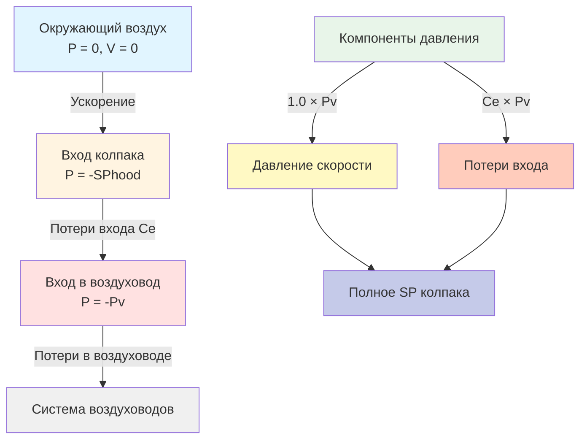

# Статическое давление вытяжного колпака в промышленных системах вытяжной вентиляции

Статическое давление вытяжного колпака представляет собой фундаментальный перепад давления, необходимый для индукции воздушного потока из окружающей среды в вытяжной колпак системы локальной вытяжной вентиляции (ЛЭВ). Этот параметр непосредственно определяет эффективность улавливания и необходимую энергию для контроля загрязняющих веществ. Понимание статического давления колпака на основе первых принципов позволяет выполнить точное проектирование системы и диагностику неисправностей.

## Физические принципы статического давления вытяжного колпака

Статическое давление в точке входа колпака отражает сумму всех потерь энергии при ускорении воздуха из неподвижного состояния в систему воздуховодов. В соответствии с уравнением Бернулли применительно к данному сценарию потока:

$$P_{hood} = P_{velocity} + P_{loss}$$

где давление скорости преобразует требования кинетической энергии в давление:

$$P_{velocity} = \frac{\rho V^2}{2}$$

Для стандартного воздуха при 21°C и на уровне моря это упрощается до:

$$P_{v} = \left(\frac{V}{1336}\right)^2 \text{ Па}$$

где $V$ в метрах в минуту.

Коэффициент потерь на входе в колпак количественно определяет эффективность перехода от условий окружающей среды к потоку в воздуховоде. Полное уравнение статического давления колпака имеет вид:

$$SP_{hood} = P_{v} \left(1 + C_{e}\right)$$

где $C_{e}$ представляет коэффициент потерь на входе в колпак, безразмерный параметр, варьирующийся от 0,05 для хорошо спроектированных сужающихся входов до 1,78 для входов с острыми кромками.

## Методология определения статического давления колпака по ACGIH

Американская конференция государственных промышленных гигиенистов (ACGIH) устанавливает стандартный отраслевой подход к определению статического давления вытяжного колпака. Эта методология учитывает геометрию колпака, условия подхода и характеристики потока.

Для нефланцевых круглых отверстий коэффициент потерь на входе составляет 0,93, отражая значительную турбулентность на острых кромках. Добавление фланца снижает это значение до 0,82 путём исключения отделения потока на периметре колпака. Сужающиеся входы с углами раствора менее 60 градусов достигают коэффициентов уже 0,05, что представляет почти идеальные условия потока.

Щелевые колпаки представляют дополнительную сложность из-за эффектов коэффициента формы. Руководство ACGIH по промышленной вентиляции содержит поправочные коэффициенты для соотношений длины к ширине щели, превышающих 4:1, где распределение потока становится неравномерным.

## Анализ компонентов давления

Статическое давление колпака состоит из трёх отдельных физических механизмов:

**Давление ускорения**: Энергия, необходимая для ускорения неподвижного воздуха до скорости в воздуховоде. Этот компонент равен одному давлению скорости и неизбежен при любом проектировании колпака.

**Потери на форму**: Энергия, рассеиваемая турбулентностью из-за отделения потока и образования вихрей на границах колпака. Острые кромки создают максимальные потери на форму, в то время как обтекаемые формы минимизируют этот компонент.

**Потери на трение**: Энергия, теряемая при вязком сдвиге в области входа колпака. Для правильно спроектированных колпаков с соотношением длины к диаметру менее 1,0 потери на трение остаются незначительными по сравнению с потерями на форму.

## Сравнение потерь давления различных типов колпаков

Различные конфигурации колпаков создают значительно различающиеся требования к давлению для эквивалентных скоростей захвата. Следующая таблица количественно определяет эти различия на основе данных ACGIH:

| Тип колпака | Коэффициент входа (Ce) | Коэффициент полного SP | Относительная энергия |
|-----------|------------------------|-----------------|-----------------|
| Простое отверстие (без фланца) | 0,93 | 1,93 | 100% |
| Простое отверстие (с фланцем) | 0,82 | 1,82 | 94% |
| Сужающийся вход (угол раствора 60°) | 0,25 | 1,25 | 65% |
| Вход типа "колокол" (r/D = 0,2) | 0,05 | 1,05 | 54% |
| Щелевой колпак (без фланца, AR < 4) | 1,78 | 2,78 | 144% |
| Щелевой колпак (с фланцем, AR < 4) | 1,30 | 2,30 | 119% |
| Навесной колпак (открыт с боков) | 0,40 | 1,40 | 73% |
| Закрывающий колпак (закрыт на 80%) | 0,50 | 1,50 | 78% |

Столбец относительной энергии указывает требования мощности вентилятора, нормализованные на простое отверстие без фланца, при условии идентичных расходов воздуха. Вход типа "колокол" снижает энергию вентилятора на 46% по сравнению с отверстием с острой кромкой.

## Методология расчёта

Определение статического давления колпака следует этому систематическому подходу:

1. **Рассчитайте скорость в воздуховоде** на основе требуемого объёмного расхода и площади воздуховода: $V = Q / A$

2. **Определите давление скорости**, используя соотношение для стандартного воздуха: $P_{v} = (V/1336)^2$

3. **Выберите коэффициент входа в колпак** из таблиц ACGIH на основе геометрии колпака и граничных условий

4. **Вычислите статическое давление колпака**: $SP_{hood} = P_{v}(1 + C_{e})$

5. **Проверьте скорость на входе колпака** соответствует требованиям захвата для конкретного загрязняющего вещества и скорости выделения

Например, рассмотрим фланцевый круглый колпак, требующий 1 000 CFM (1 699 м³/ч) через воздуховод диаметром 20 см (8 дюймов):

$$V = \frac{1699 \text{ м}^3\text{/ч}}{(\pi/4)(0,2)^2 \text{ м}^2} = 53,8 \text{ м/с}$$

$$P_{v} = \left(\frac{53,8}{1336}\right)^2 = 0,0016 \text{ МПа} = 1,6 \text{ кПа}$$

$$SP_{hood} = 1,6(1 + 0,82) = 2,9 \text{ кПа}$$

## Практические последствия проектирования

Статическое давление колпака напрямую влияет на производительность системы и эксплуатационные расходы. Снижение статического давления колпака на 0,6 кПа примерно соответствует экономии энергии вентилятора на 12% для типичных систем ЛЭВ, работающих при полном статическом давлении 5-10 кПа.

Стратегии проектирования для минимизации статического давления колпака включают:

- Внедрение сужающихся или входов типа "колокол", где позволяют пространственные ограничения
- Добавление фланцев ко всем входам колпака для исключения отделения потока на кромках
- Обеспечение плавных переходов без резких изменений площади сечения
- Размер входов колпака для достижения целевых скоростей входа при минимальных объёмных расходах

Балансировка системы должна учитывать вариации статического давления колпака между несколькими колпаками на общем коллекторе. Колпаки с более высокими потерями входа требуют пропорционально более высоких статических давлений в ветвях для поддержания расчётного воздушного потока.

Измерение фактического статического давления колпака предоставляет критическую диагностическую информацию. Измеренные значения, превышающие расчётные предсказания более чем на 15%, указывают на закупорку потока, неправильную геометрию колпака или утечку воздуховода выше точки измерения.

## Заключение

Расчёт статического давления колпака образует основу проектирования промышленных систем вытяжной вентиляции. Подход на основе физики количественно определяет требования к энергии на основе фундаментальных принципов механики жидкости, обеспечивая оптимизацию как эффективности улавливания, так и энергоэффективности. Правильное применение методологии ACGIH обеспечивает надёжную производительность системы в широком спектре промышленных применений.
