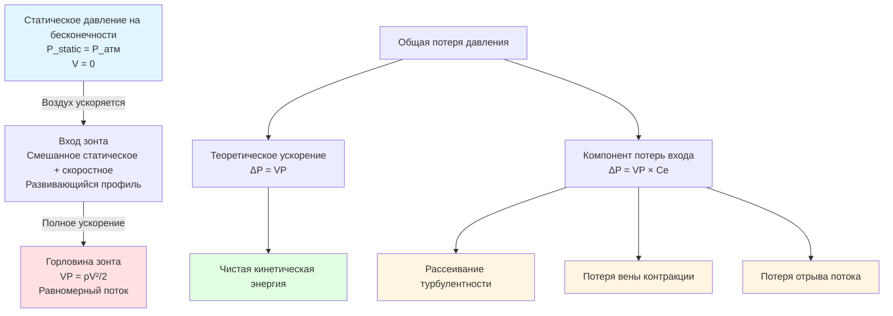

## Физические основы потерь при ускорении

Когда воздух входит в промышленный вытяжной зонт, он ускоряется из практически нулевой скорости в окружающем рабочем пространстве до скорости захвата, необходимой для контроля загрязняющих веществ. Это ускорение требует энергозатрат от вентиляционной системы, проявляясь как компонент потерь давления при расчете статического давления зонта.

Потери при ускорении представляют кинетическую энергию, передаваемую воздушному потоку. В отличие от потерь на трение, преобразующих механическую энергию в тепло, потери при ускорении преобразуют статическое давление в скоростное давление. Это фундаментальное различие влияет на способ расчета общих потерь в системе.

## Соотношение скоростного давления

Скоростное давление представляет кинетическую энергию на единицу объема движущегося воздушного потока:

$$VP = \frac{\rho V^2}{2}$$

Где:
- $VP$ = скоростное давление (Па)
- $\rho$ = плотность воздуха (кг/м³)
- $V$ = скорость воздуха (м/с)

Для стандартного воздуха при 20°C и атмосферном давлении это упрощается до:

$$VP = \left(\frac{V}{4005}\right)^2 \text{ (в единицах СИ, V в м/с)}$$

Точная константа зависит от выбранной системы единиц. В практике промышленной вентиляции с использованием метров в секунду и паскалей:

$$VP = \left(\frac{V}{4005}\right)^2$$

## Компоненты потерь на входе в зонт

Общая потеря давления на входе в зонт состоит из двух компонентов:

$$\Delta P_{entry} = VP + VP \cdot C_e$$

Где:
- $\Delta P_{entry}$ = общая потеря давления на входе в зонт
- $VP$ = скоростное давление на горловине зонта
- $C_e$ = коэффициент потерь на входе (безразмерный)

Это можно переписать как:

$$\Delta P_{entry} = VP(1 + C_e)$$

Первый член ($VP$) представляет чистые потери при ускорении — минимальную теоретическую энергию, необходимую для ускорения воздуха из неподвижного состояния. Второй член ($VP \cdot C_e$) представляет дополнительные потери из-за турбулентности, отрыва потока и неравномерности профиля скорости на входе в зонт.

## Коэффициенты потерь на входе в зависимости от типа зонта

Руководство ACGIH по промышленной вентиляции предоставляет коэффициенты потерь на входе в зависимости от геометрии и конструкции зонта:

| Тип зонта | Коэффициент входа ($C_e$) | Общий множитель $(1 + C_e)$ | Характеристики потока |
|-----------|---------------------------|--------------------------|----------------------|
| Открытое отверстие (острый край) | 0,93 | 1,93 | Сильный отрыв потока у краев |
| Фланцевое отверстие | 0,49 | 1,49 | Уменьшенный отрыв с фланцем |
| Колокольный вход (r/D = 0,2) | 0,04 | 1,04 | Плавное ускорение, минимальный отрыв |
| Сужающийся вход (угол 60°) | 0,25 | 1,25 | Постепенное ускорение |
| Щелевой зонт (без фланца) | 1,78 | 2,78 | Высокая турбулентность у краев щели |
| Щелевой зонт (с фланцем) | 0,49 | 1,49 | Фланец снижает потери у краев |

Эти коэффициенты отражают экспериментальные данные полномасштабных испытаний зонтов. Открытое отверстие представляет наихудший случай, когда острые края создают вихри и отрыв потока. Колокольный вход приближается к теоретическому минимуму, с небольшими дополнительными потерями из-за развития пограничного слоя.

## Физическая интерпретация коэффициентов входа

Коэффициент входа количественно определяет механизмы рассеивания энергии:

**Формирование вены контракции**: На входах с острыми краями линии тока не могут повернуть за угол. Поток сужается до меньшей эффективной площади внутри зонта, а затем расширяется снова. Этот цикл сужения-расширения рассеивает энергию через турбулентное смешивание.

**Отрыв потока**: Плохая геометрия входа вызывает отрыв потока от поверхностей зонта, создавая зоны циркуляции. Энергия рассеивается в этих турбулентных областях.

**Неравномерность профиля скорости**: Идеальное ускорение предполагает равномерную скорость. Реальные потоки развивают неравномерные профили с более высокими скоростями вблизи центра. Эта неравномерность увеличивает кинетическую энергию на единицу массового расхода по сравнению с равномерным потоком.

## Диаграмма потерь давления при ускорении

## Пример расчета

Рассмотрим круглый открытый зонт диаметром 30 см, отводящий 3400 CFM (1,6 м³/ч):

**Шаг 1**: Расчет скорости на горловине:

$$V = \frac{Q}{A} = \frac{3400 \text{ CFM}}{\pi(0,15)^2} = \frac{3400}{0,0707} = 48085 \text{ м³/ч} = 4,78 \text{ м/с}$$

**Шаг 2**: Расчет скоростного давления:

$$VP = \frac{\rho V^2}{2} = \frac{1,2 \times 4,78^2}{2} = 13,7 \text{ Па}$$

**Шаг 3**: Применение коэффициента потерь входа ($C_e = 0,93$ для открытого отверстия):

$$\Delta P_{entry} = VP(1 + C_e) = 13,7(1 + 0,93) = 26,4 \text{ Па}$$

Компонент ускорения ($VP$) составляет 13,7 Па, в то время как потеря входа добавляет еще 12,7 Па, почти удваивая общую потерю входа.

## Последствия для проектирования

**Влияние выбора зонта**: Выбор фланцевого зонта вместо открытого снижает коэффициент потерь входа с 0,93 до 0,49. Для приведенного выше примера это снижает общую потерю входа с 26,4 Па до 20,4 Па, что составляет 23%-ное снижение. В течение срока эксплуатации системы это приводит к значительной экономии энергии.

**Оптимизация колокольного входа**: Когда позволяет место, колокольные входы приближаются к теоретической эффективности. Коэффициент снижается до 0,04, делая потерю входа практически равной неизбежному скоростному давлению. Такая конструкция критична для зонтов с высокой скоростью, где потери входа могут доминировать в сопротивлении системы.

**Рассмотрение щелевых зонтов**: Щелевые зонты без фланца демонстрируют наивысшие коэффициенты входа (1,78) из-за трехмерного отрыва потока по периметру щели. Всегда указывайте фланцы для щелевых зонтов, чтобы снизить этот коэффициент до 0,49.

## Связь с общим статическим давлением зонта

Потеря при ускорении составляет часть статического давления зонта (HSP):

$$HSP = VP(1 + C_e + \sum C_{duct})$$

Где $\sum C_{duct}$ включает потери ниже по потоку от входа в воздуховод, расширений и других переходов. Термин ускорения $(1 + C_e)$ обычно представляет 60-80% общего HSP для хорошо спроектированных зонтов с короткими отводами.

## Применение метода проектирования ACGIH

Таблицы проектирования зонтов ACGIH включают эти коэффициенты ускорения в значения статического давления зонта. При выборе зонта из таблиц ACGIH указанное значение HSP уже включает соответствующий коэффициент потерь входа для этого типа зонта. Дополнительные потери от переходов воздуховодов или нестандартных конфигураций должны добавляться отдельно.

Для нестандартных конструкций зонтов явно рассчитывайте потери при ускорении, используя приведенные выше коэффициенты, проверенные по экспериментальным данным ACGIH где возможно. Всегда учитывайте фактические условия установки, так как близлежащие препятствия или нестандартные ориентации могут увеличить эффективные коэффициенты входа сверх табулированных значений.
