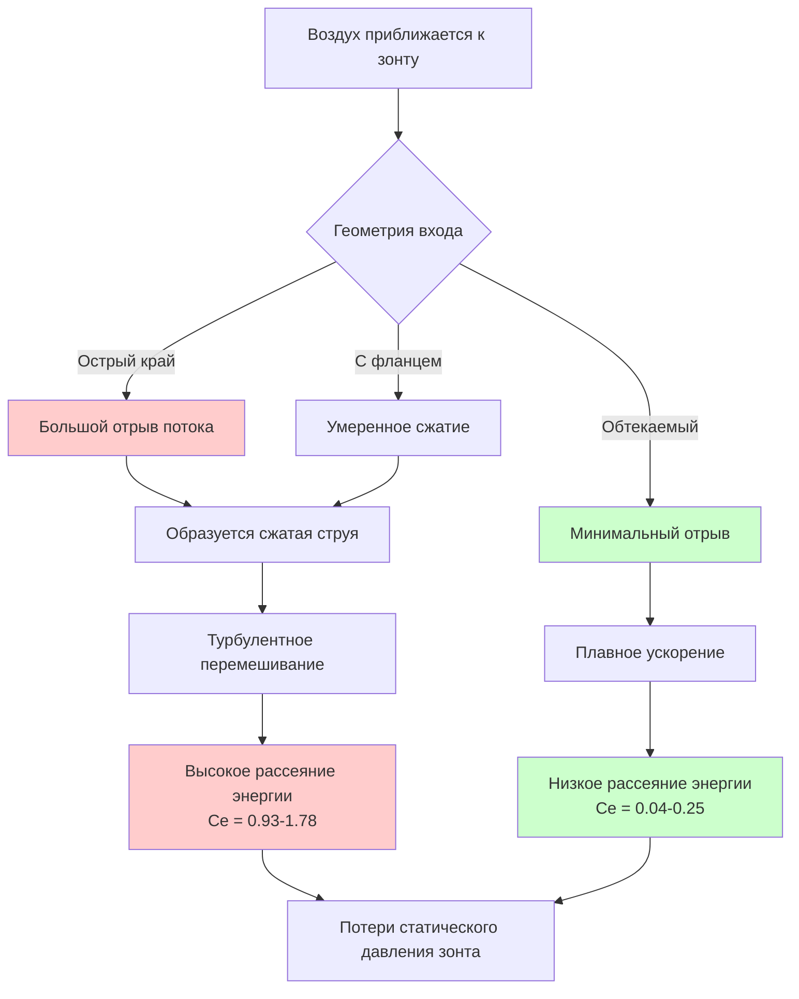

## Физическая основа потерь на входе в вытяжной зонт

Потери на входе в вытяжной зонт представляют собой статическое давление, необходимое для ускорения воздуха из состояния покоя до входа в зонт. Эти потери на ускорение являются фундаментальным применением уравнения Бернулли, где кинетическая энергия, приобретаемая воздухом, должна быть обеспечена за счет снижения статического давления. Величина этих потерь критически зависит от геометрии входа в зонт, которая определяет поле потока и связанные с ним необратимые потери.

Когда воздух входит в отверстие зонта, он не может совершить резкий поворот на 90 градусов. Линии тока сжимаются внутрь, образуя область минимальной площади потока ниже по течению от входа, называемую сжатой струей (vena contracta). Это сжатие создает зоны отрыва, вихри и турбулентное перемешивание, которые необратимо рассеивают энергию. Коэффициент потерь на входе количественно оценивает эти потери как кратное динамическому давлению на лицевой стороне зонта.

## Основы коэффициента потерь на входе

Потери статического давления на входе в зонт выражаются как:

$$\Delta P_{entry} = C_e \times VP_{face}$$

где:
- $\Delta P_{entry}$ = потери на входе в зонт (Па)
- $C_e$ = безразмерный коэффициент потерь на входе
- $VP_{face}$ = динамическое давление на лицевой стороне зонта (Па)

Динамическое давление рассчитывается по скорости на лицевой стороне:

$$VP_{face} = \left(\frac{V_{face}}{2.032}\right)^2$$

для скорости в футах в минуту и давления в дюймах водяного столба, или:

$$VP_{face} = \frac{\rho V_{face}^2}{2}$$

в единицах СИ (Па, кг/м³, м/с).

Общее статическое давление зонта складывается из потерь на входе и динамического давления в воздуховоде:

$$SP_{hood} = VP_{duct}\left(1 + C_e \frac{A_{duct}^2}{A_{face}^2}\right)$$

Для зонтов, где площадь воздуховода равна площади лицевой стороны, это упрощается до:

$$SP_{hood} = VP_{duct}(1 + C_e)$$

## Коэффициенты потерь на входе ACGIH

Американская конференция правительственных промышленных гигиенистов (ACGIH) предоставляет стандартизированные коэффициенты потерь на входе на основе обширных экспериментальных испытаний. Эти значения учитывают как эффект сжатой струи, так и геометрию зонта.

| Тип зонта | Описание входа | Коэффициент потерь на входе (Ce) | Примечания по применению |
|------|---|---|-----|
| Простое отверстие | Острый край, без фланца | 0.93 | Наихудший случай, максимальная турбулентность |
| Простое отверстие | С фланцем (ширина фланца ≥ диаметра зонта) | 0.49 | Снижение на 47% по сравнению с зонтом без фланца |
| Конический вход | Уклон 45°, длина = 0.5D | 0.25 | Постепенное ускорение снижает потери |
| Горловина (Bell mouth) | Радиус = 0.2D или более | 0.04 | Оптимальный дизайн, минимальный отрыв |
| Щелевой зонт | Острый край, без фланца, L/W > 2 | 1.78 | Наибольшие потери из-за соотношения сторон |
| Щелевой зонт | С фланцем с трех сторон | 0.82 | Значительное улучшение |
| Конический вход | Угол включения 60° | 0.50 | Умеренное обтекание |
| Обтекаемый плафон | Постепенное сжатие к воздуховоду | 0.08 | Почти оптимально для больших зонтов |

## Эффект сжатой струи

Сжатая струя образуется потому, что линии тока воздуха обладают инерцией и не могут мгновенно изменить направление. На отверстии с острым краем поток отрывается от края, образуя сжатую струю с площадью примерно от 0.61 до 0.65 от геометрической площади отверстия.

Коэффициент сжатия определяется как:

$$C_c = \frac{A_{vena contracta}}{A_{opening}}$$

После сжатой струи поток должен снова расшириться, чтобы заполнить воздуховод, создавая дополнительное турбулентное перемешивание. Общие потери давления от сжатия и повторного расширения составляют:

$$\Delta P_{total} = \left(\frac{1}{C_c^2} - 1\right) VP_{opening}$$

Для острокромочного круглого отверстия с $C_c \approx 0.62$:

$$\Delta P_{total} = \left(\frac{1}{0.62^2} - 1\right) VP = 1.60 \times VP$$

Это теоретическое значение хорошо согласуется с измеренными коэффициентами ACGIH 0.93–1.78 для острокромочных входов.

## Принципы проектирования обтекаемых входов

Обтекаемые входы минимизируют отрыв потока, обеспечивая плавный переход, который позволяет линиям тока следовать поверхности вытяжного колпака. Ключевые параметры проектирования:

**Радиус горловины (Bell Mouth):** Оптимальный радиус составляет 0.2 диаметра воздуховода или более. Это создает пристенный поток с минимальным отрывом пограничного слоя. Коэффициент входа снижается до 0.04, что соответствует только потерям на трение поверхности.

**Угол конусности:** Для конических входов полный угол не должен превышать 60 градусов. Более крутые конусы вызывают отрыв потока. Конус с углом 45 градусов и длиной, равной 0.5 диаметра, обеспечивает $C_e = 0.25$.

**Фланцы:** Установка фланца на обычное отверстие эффективно увеличивает площадь потока, приближающегося к колпаку, снижая скорость подхода и связанное изменение импульса. Ширина фланца, равная диаметру колпака, снижает $C_e$ с 0.93 до 0.49.

## Пример практического расчета

Рассмотрим колпак диаметром 305 мм (12 дюймов) со скоростью воздуха на лицевой поверхности 10.16 м/с (2000 фут/мин):

**Острокромочный вход без фланца:**

$$VP_{face} = \left(\frac{10.16}{2.03}\right)^2 = 25.3 \text{ Па}$$

$$\Delta P_{entry} = 0.93 \times 25.3 = 23.5 \text{ Па}$$

**Вход типа горловина (r = 0.2D):**

$$\Delta P_{entry} = 0.04 \times 25.3 = 1.0 \text{ Па}$$

Обтекаемый вход снижает потери давления на 95%, демонстрируя значительную экономию энергии, достижимую при правильном проектировании колпака. Для системы производительностью 4719 л/с (10 000 куб. фут/мин), работающей непрерывно, снижение давления на 55.5 Па (0.223 дюйма вод. ст.) экономит примерно 250 Вт мощности вентилятора.

## Рекомендации по проектированию

Выбирайте геометрию входа колпака исходя из ограничений по пространству, стоимости и требований к энергоэффективности. Входы типа горловина обеспечивают оптимальную производительность, но требуют большей сложности изготовления. Обычные отверстия с фланцами представляют собой экономически эффективный компромисс, обеспечивающий снижение потерь на 47% по сравнению с неокантованными острокромочными входами.

Для щелевых колпаков всегда предусматривайте фланцы как минимум с трех сторон, чтобы снизить коэффициент входа с 1.78 до 0.82. Рассмотрите возможность использования конических камер статического давления для крупных улавливающих колпаков, где применение горловин нецелесообразно.

Учитывайте потери на входе при расчете общего статического давления системы для обеспечения правильного выбора вентилятора и предотвращения недостаточных скоростей улавливания, которые могут нарушить контроль над загрязнителями.
