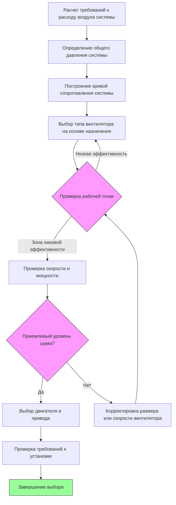

# Выбор вентилятора для промышленных систем вытяжной вентиляции

Выбор подходящего вентилятора для локальной промышленной системы вытяжной вентиляции требует согласования характеристик производительности вентилятора с требованиями системы при оптимизации по эффективности, уровню шума и эксплуатационным расходам. Процесс выбора фундаментально заключается в нахождении точки пересечения кривой сопротивления системы и кривой производительности вентилятора.

## Требования к давлению системы

Общее давление системы, которое должен преодолеть вентилятор, состоит из компонентов статического и скоростного давления на всем пути вытяжки:

$$P_{fan} = P_{hood} + P_{duct} + P_{fittings} + P_{outlet} + P_{device}$$

где:
- $P_{hood}$ = потери на входе в приемник
- $P_{duct}$ = потери на трение в прямых участках воздуховодов
- $P_{fittings}$ = потери в отводах, переходах и ответвлениях
- $P_{outlet}$ = потери на выходе
- $P_{device}$ = перепад давления на устройствах очистки воздуха

Кривая сопротивления системы подчиняется зависимости:

$$P_{system} = K \cdot Q^2$$

где $K$ представляет собой коэффициент сопротивления системы, а $Q$ — объемный расход воздуха. Эта квадратичная зависимость означает, что удвоение расхода воздуха требует четырехкратного увеличения давления.

## Основы производительности вентилятора

Производительность вентилятора характеризуется зависимостью между развиваемым статическим давлением и подаваемым объемным расходом. Рабочая точка вентилятора возникает там, где кривая вентилятора пересекает кривую системы:

$$P_{fan}(Q) = P_{system}(Q)$$

Эффективность вентилятора в этой рабочей точке определяет потребление мощности:

$$\eta_{fan} = \frac{Q \cdot P_{total}}{6356 \cdot BHP}$$

где эффективность $\eta$ выражается в долях единицы, $Q$ в кубических футах в минуту (CFM), $P_{total}$ в дюймах водяного столба, а $BHP$ — это мощность на валу (л.с.).

Мощность двигателя, необходимая для привода, учитывает как эффективность вентилятора, так и эффективность двигателя:

$$P_{motor} = \frac{Q \cdot P_{total}}{6356 \cdot \eta_{fan} \cdot \eta_{motor}}$$

## Процесс выбора вентилятора

## Критерии выбора типа вентилятора

Различные конфигурации вентиляторов предлагают уникальные преимущества для промышленных применений вытяжной вентиляции:

| Тип вентилятора | Диапазон давления | Эффективность | Работа с частицами | Требования к пространству | Типичные применения |
|------|---------------|-----|----|----|----|
| **Центробежный с загнутыми назад лопатками** | 102–381 мм вод. ст. | 75–85% | Только легкая пыль | Большое | Чистый воздух, требуется высокая эффективность |
| **Центробежный с радиальными лопатками** | 152–508 мм вод. ст. | 60–70% | Отличная | Среднее | Тяжелая пыль, абразивные материалы |
| **Центробежный с загнутыми вперед лопатками** | 51–203 мм вод. ст. | 55–65% | Плохая | Компактный | Низкое давление, чистый воздух |
| **Осевый трубчатый** | 25–152 мм вод. ст. | 65–75% | Только легкая | Минимальное | Встраиваемая установка, ограниченное пространство |
| **Осевый с направляющим аппаратом** | 51–254 мм вод. ст. | 70–80% | Только легкая | Минимальное | Приложения с более высоким давлением в линии |
| **Вентилятор типа "Plug"** | 76–305 мм вод. ст. | 70–82% | Умеренная | Очень компактный | Крышные установки, ограниченное пространство |

## Применение стандартов AMCA

Стандарт AMCA 210 определяет стандартизированные процедуры испытаний для оценки производительности вентиляторов. Ключевые аспекты включают:

**Коэффициенты системного эффекта**: Условия установки, отклоняющиеся от идеальных условий испытаний, создают дополнительное сопротивление. AMCA 201 предоставляет кривые системного эффекта, которые должны быть добавлены к рассчитанному давлению системы:

$$P_{design} = P_{calculated} + SEF$$

где $SEF$ — коэффициент системного эффекта, учитывающий ограничения на входе/выходе, неравномерное распределение потока и завихрения.

**Диапазон работы вентилятора**: Выбирайте вентиляторы для работы в диапазоне 50–80% от расхода при полностью открытом затворе для обеспечения стабильности. Работа вблизи точки отсечки или при свободной подаче приводит к нестабильной работе и чрезмерному шуму.

**Коррекция температуры**: Номинальные характеристики вентиляторов предполагают стандартный воздух (21°C, 1,2 кг/м³). Для повышенных температур, характерных для промышленных вытяжных систем:

$$P_{actual} = P_{standard} \cdot \frac{\rho_{actual}}{\rho_{standard}}$$

$$BHP_{actual} = BHP_{standard} \cdot \frac{\rho_{actual}}{\rho_{standard}}$$

## Оптимизация эффективности

Пиковая эффективность вентилятора обычно достигается при 75-85% от максимальной производительности по расходу воздуха. Работа в этом режиме минимизирует энергопотребление:

$$Energy_{annual} = BHP \cdot 0.746 \cdot hours_{operation} \cdot cost_{kWh}$$

Улучшение эффективности вентилятора на 5% для вентилятора мощностью 37 кВт, работающего 4000 часов в год при стоимости электроэнергии 0,12 $/кВт, позволяет сэкономить примерно 900 $/год.

## Учет загрузки частицами

Промышленные вытяжные системы, содержащие частицы, требуют специфических конфигураций вентиляторов:

- **Вентиляторы с радиальными лопатками**: Самоочищающее действие предотвращает накопление отложений
- **Открытые рабочие колеса**: Облегченный доступ для обслуживания и очистки
- **Конструкция, устойчивая к абразивному износу**: Упрочненные покрытия или сменные износостойкие вкладыши
- **Взрывозащищенное исполнение**: Требуется для горючей пыли согласно NFPA 652

Накопление материала на лопатках вентилятора создает дисбаланс и смещает рабочую точку. Проектирование должно предусматривать периодический осмотр и очистку в зависимости от концентрации загрязняющих веществ.

## Коэффициенты запаса при выборе

Применяйте соответствующие коэффициенты запаса для учета неопределенностей системы:

- **Расход воздуха**: на 10-15% выше расчетного требования
- **Давление**: на 15-20% выше расчетного сопротивления системы
- **Двигатель**: следующий стандартный размер выше расчетной мощности

Эти факторы предотвращают недостаточный размер, но не должны быть чрезмерными, так как избыточно большие вентиляторы работают неэффективно и создают ненужный шум.

Процесс выбора вентилятора требует баланса конкурирующих приоритетов: первоначальной стоимости, эксплуатационной эффективности, требований к обслуживанию, уровня шума и физических ограничений. Правильный выбор на основе тщательного анализа системы обеспечивает надежную и эффективную работу на протяжении всего жизненного цикла системы.
