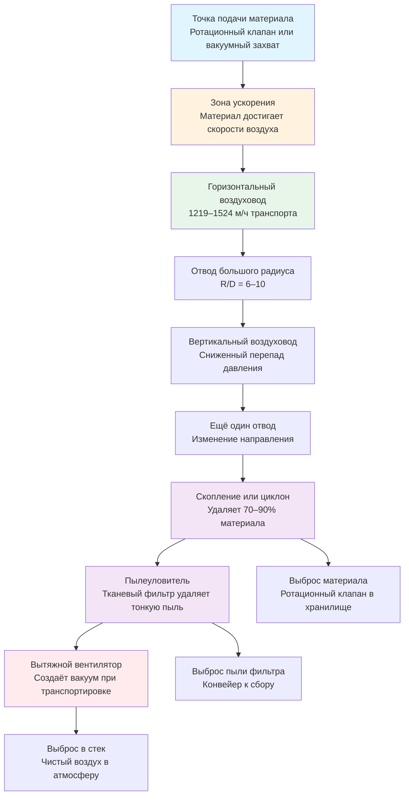

# Пневматические системы транспортировки материалов

Пневматические системы транспортировки перемещают сыпучие материалы через закрытые воздуховоды, используя воздух в качестве транспортирующей среды. Эти системы объединяют обработку материалов с подавлением пыли, обеспечивая важную функцию промышленной вентиляции выхлопных газов при одновременной транспортировке материалов из процесса в процесс. Скорость транспорта должна превышать критическую скорость осаждения, чтобы предотвратить оседание частиц в горизонтальных участках, обычно требуя 1066–1676 м/ч в зависимости от плотности материала и характеристик частиц. Проектирование системы включает балансировку соотношений воздуха к материалу, управление перепадом давления через зоны ускорения и потери трения, а также интеграцию оборудования пылеудаления для отделения транспортируемого материала от транспортного воздуха.

## Основы пневматической транспортировки

### Механизмы транспорта

Транспортировка материала в пневматических системах зависит от поддержания достаточной скорости воздуха для взвешивания и транспортировки частиц. Физика включает силу сопротивления, преодолевающую гравитационное оседание и взаимодействие частиц со стенками.

**Сила сопротивления частицы в турбулентном потоке:**

$$F_D = \frac{1}{2} \times C_D \times \rho_a \times A_p \times (V_{air} - V_{particle})^2$$

Где:
- $F_D$ = Сила сопротивления (Н)
- $C_D$ = Коэффициент сопротивления (безразмерный, 0,4–0,5 для сфер в турбулентном потоке)
- $\rho_a$ = Плотность воздуха (кг/м³, стандартная = 1,2 кг/м³)
- $A_p$ = Проектируемая площадь частицы (м²)
- $V_{air}$ = Скорость воздуха (м/с)
- $V_{particle}$ = Скорость частицы (м/с)

**Гравитационная сила на частицу:**

$$F_G = m_p \times g = \frac{\pi \times d_p^3}{6} \times \rho_p \times g$$

Где:
- $m_p$ = Масса частицы (кг)
- $g$ = Ускорение свободного падения (9,81 м/с²)
- $d_p$ = Диаметр частицы (м)
- $\rho_p$ = Плотность частицы (кг/м³)

При равновесии (предельная скорость) сила сопротивления равна гравитационной силе. Для вертикального транспорта скорость воздуха должна превышать предельную скорость падения частицы. Для горизонтального транспорта скорость осаждения учитывает дополнительные взаимодействия частиц со стенками.

### Расчет предельной скорости

Предельная скорость представляет скорость падения, при которой сила сопротивления равна гравитационной силе для частицы в неподвижном воздухе.

$$V_t = \sqrt{\frac{4 \times g \times d_p \times (\rho_p - \rho_a)}{3 \times C_D \times \rho_a}}$$

Где:
- $V_t$ = Предельная скорость (м/с)
- $g$ = 9,81 м/с²
- $d_p$ = Диаметр частицы (м)
- $\rho_p$ = Плотность частицы (кг/м³)
- $\rho_a$ = Плотность воздуха (1,2 кг/м³ при стандартных условиях)
- $C_D$ = Коэффициент сопротивления (0,44 для сфер при Re > 1000)

**Практические предельные скорости:**

| Материал | Плотность частицы (кг/м³) | Размер частицы (мкм) | Предельная скорость (м/ч) |
|----------|---------------------------|---------------------|---------------------------|
| Мучная пыль | 721 | 50 | 55 |
| Древесная пыль | 641 | 100 | 98 |
| Цементная пыль | 1506 | 50 | 85 |
| Песок | 2643 | 200 | 427 |
| Металлическая стружка (сталь) | 7849 | 1000 | 1158 |
| Зерно (пшеница) | 769 | 3000 | 671 |

Предельная скорость определяет минимальную скорость воздуха для вертикального транспорта. Горизонтальный транспорт требует значительно более высоких скоростей из-за явления осаждения.

### Режимы транспортировки

**Разреженнофазная транспортировка:**
- Скорость: 1066–1829 м/ч
- Сыпучесть твёрдого вещества: 0,1–15 кг материала на кг воздуха
- Материал полностью взвешен на всём протяжении транспорта
- Непрерывный равномерный поток
- Применение: Большинство сыпучих материалов, пыльные операции
- Преимущества: Простое оборудование, множество точек захвата, самоочищение
- Недостатки: Более высокое потребление воздуха, деградация частиц при высокой скорости

**Плотнофазная транспортировка:**
- Скорость: 244–914 м/ч
- Сыпучесть твёрдого вещества: 15–200 кг материала на кг воздуха
- Материал образует движущиеся пробки или дюны
- Прерывистый или импульсный поток
- Применение: Хрупкие материалы, абразивные материалы, высокая производительность на коротком расстоянии
- Преимущества: Снижено потребление воздуха, меньше деградация частиц, снижено износ отводов
- Недостатки: Специализированное оборудование, ограничено сыпучими материалами, сложное управление

ACGIH Industrial Ventilation Manual подчеркивает системы разреженнофазной транспортировки для приложений промышленного управления пылью, когда транспортировка материала совпадает с требованиями вентиляции выхлопных газов.

## Скорость осаждения

### Определение и критическая важность

Скорость осаждения ($V_{salt}$) представляет минимальную скорость воздуха в горизонтальных воздуховодах, необходимую для предотвращения оседания частиц и их накопления. Ниже скорости осаждения частицы выпадают из взвеси, накапливаясь на дне воздуховода. Это накопление уменьшает эффективную площадь потока, увеличивает перепад давления и может привести к полной блокировке.

**Характеристики осаждения:**
- Происходит в основном в горизонтальных и слегка наклоненных воздуховодах
- Скорость в 3–15 раз выше предельной скорости
- Зависит от плотности частиц, распределения по размерам, формы и диаметра воздуховода
- Специфична для каждого материала на основе характеристик потока и связности

### Расчеты скорости осаждения

**Эмпирическая корреляция Rizkа (широко используется в промышленных приложениях):**

$$V_{salt} = FL \times \sqrt{2 \times g \times D} \times \left(\frac{\rho_p}{\rho_a}\right)^{0.35}$$

Где:
- $V_{salt}$ = Скорость осаждения (м/с)
- $FL$ = Фактор Фруда-нагрузки (безразмерный, 1,0–3,5)
- $g$ = 9,81 м/с²
- $D$ = Диаметр воздуховода (м)
- $\rho_p$ = Плотность материала частицы (кг/м³)
- $\rho_a$ = Плотность воздуха (1,2 кг/м³)

**Альтернативная корреляция (Rabinovich-Kalman) для более тонких материалов:**

$$V_{salt} = 7.0 \times \sqrt{g \times D} \times \left(\frac{\rho_p}{\rho_a}\right)^{0.25} \times \left(\frac{d_{50}}{D}\right)^{0.15}$$

Где:
- $d_{50}$ = Средний диаметр частицы (м)
- Остальные члены определены ранее

**Выбор фактора Фруда-нагрузки:**

| Категория материала | Фактор FL | Характеристики | Примеры |
|---------------------|-----------|-----------------|---------|
| Очень лёгкие, пушистые | 1,0–1,5 | Низкая плотность, большая площадь поверхности, связные | Мука, крахмал, пластиковый порошок, хлопковый ворс |
| Лёгкие гранулированные | 1,5–2,0 | Низкая плотность, сыпучие | Зерно, сахар, соль, деревянные гранулы |
| Средняя плотность | 2,0–2,5 | Средняя плотность, угловатые частицы | Песок, цемент, летучая зола, молотый известняк |
| Тяжёлые абразивные | 2,5–3,5 | Высокая плотность, твёрдые частицы | Металлическая стружка, доменный песок, минеральная руда |

### Рекомендуемые скорости транспорта ACGIH

ACGIH Industrial Ventilation Manual (таблица 5-2) содержит минимальные скорости транспорта, включающие коэффициенты безопасности выше скорости осаждения для различных категорий материалов:

| Описание материала | Минимальная скорость (м/ч) | Типичные применения |
|-------------------|---------------------------|----------------------|
| Газы, пары, дымы | 305–610 | Сварочный дым, тепловые процессы |
| Тонкая лёгкая пыль | 914–1066 | Волокна ткани, бумажная пыль, лёгкая пластиковая пыль |
| Сухая пыль и порошки | 1066–1219 | Мука, цемент, зерновая пыль, древесная пыль от шлифования |
| Средняя промышленная пыль | 1219–1372 | Пыль от шлифования, полировочная пыль, операции обработки |
| Тяжёлая пыль, маленькие стружки | 1372–1524 | Металлические стружки, тяжёлое шлифование, силикатная пыль |
| Тяжёлая или влажная пыль | 1524–1676 | Свинцовая пыль, влажный цемент, доменные операции |

**Подход к проектированию:** Используйте рекомендуемые ACGIH скорости в качестве начальных значений, проверьте против рассчитанной скорости осаждения и применяйте коэффициент безопасности 10–20% для критичных приложений или материалов с широким распределением по размерам частиц.

### Скорость захвата

Скорость захвата представляет минимальную скорость воздуха, необходимую для захвата неподвижных частиц с поверхности или бункера в воздушный поток. Это происходит в точках подачи материала и отличается от скорости транспорта.

**Расчёт скорости захвата (эмпирический):**

$$V_{pickup} = K_{pickup} \times \sqrt{\frac{\rho_p}{\rho_a}} \times \sqrt{g \times d_p}$$

Где:
- $V_{pickup}$ = Скорость захвата (м/с)
- $K_{pickup}$ = Коэффициент захвата (1,5–3,0, выше для связных материалов)
- $\rho_p$ = Плотность частицы (кг/м³)
- $\rho_a$ = Плотность воздуха (1,2 кг/м³)
- $g$ = 9,81 м/с²
- $d_p$ = Характерный диаметр частицы (м)

**Скорость захвата обычно составляет 150–200% от скорости осаждения.**

**Скорости захвата по конструкции вытяжного зонта:**

| Тип материала | Скорость захвата (м/ч) | Скорость на лице зонта (м/ч) |
|---------------|------------------------|------------------------------|
| Тонкая пыль (неподвижная) | 1066–1372 | 46–76 |
| Рыхлая пыль в движении | 1219–1524 | 61–107 |
| Тяжёлая пыль, стружки | 1524–1829 | 91–152 |
| Движущийся сыпучий материал | 1676–2134 | 122–183 |

Вытяжные зонты переходят от низкой скорости захвата на лице зонта к полной скорости транспорта в воздуховоде, требуя длину ускорения 10–20 диаметров воздуховода.

## Проектирование разреженнофазной и плотнофазной систем

### Характеристики разреженнофазной транспортировки

**Рабочие параметры:**
- Скорость воздуха: 1066–1829 м/ч
- Коэффициент нагрузки твёрдого вещества: 0,1–15 кг материала/кг воздуха
- Фазовое соотношение (по весу): обычно 1:1 до 15:1
- Перепад давления: 49–74 Па на 30 м эквивалентной длины
- Скорость материала: 70–85% от скорости воздуха

**Преимущества:**
- Простой дизайн и управление системой
- Несколько точек подачи и выброса легко размещаются
- Самоочищающаяся операция предотвращает накопление материала
- Подходит для широкого диапазона материалов
- Вертикальные и горизонтальные участки без ограничений
- Стандартные промышленные компоненты

**Недостатки:**
- Высокое потребление воздуха (большой воздуховод, вентилятор и пылеуловитель)
- Деградация частиц от высокоскоростных ударов
- Износ отводов при абразивной работе
- Более высокие эксплуатационные расходы (мощность вентилятора)

**Типичные применения:**
- Сбор и транспортировка древесной пыли
- Объекты обработки зерна
- Трансфер пластиковых гранул
- Операции порошкового напыления
- Обработка цемента и летучей золы
- Общее управление промышленной пылью

### Характеристики плотнофазной транспортировки

**Рабочие параметры:**
- Скорость воздуха: 244–914 м/ч (ниже скорости осаждения в горизонтальных участках)
- Коэффициент нагрузки твёрдого вещества: 15–200 кг материала/кг воздуха
- Фазовое соотношение: 15:1 до 200:1
- Перепад давления: 103–345 кПа (очень высокий)
- Скорость материала: 10–50% от скорости воздуха
- Режим транспорта: Пробочный поток, пробковый поток или волновой поток

**Преимущества:**
- Снижено потребление воздуха (меньший вентилятор и пылеуловитель)
- Минимальная деградация частиц
- Сниженный износ отводов и воздуховода
- Сниженные уровни шума
- Пониженное загрязнение продукта

**Недостатки:**
- Сложные системы управления (датчики давления, импульсы)
- Ограничено сыпучими, некосвязными материалами
- Специализированное оборудование (высокого давления воздуходувки, резервуары давления)
- Одна точка подачи и выброса (пакетная операция)
- Требует обширное тестирование для каждого материала
- Более высокая стоимость капитального оборудования

**Типичные применения:**
- Хрупкие пищевые продукты (крекеры, злаки)
- Фармацевтические порошки
- Пластиковые гранулы и смолы
- Абразивные материалы (глинозём, силикат)
- Высокопроизводительная передача цемента

## Оценка перепада давления

### Полный перепад давления системы

Полный перепад давления через пневматическую систему транспортировки включает несколько компонентов:

$$\Delta P_{total} = \Delta P_{accel} + \Delta P_{air} + \Delta P_{material} + \Delta P_{fittings} + \Delta P_{collector}$$

Каждый компонент вносит вклад в общее требование статического давления для выбора вентилятора.

### Перепад давления при ускорении

Материал, поступающий в воздушный поток, должен быть ускорен с покоя (или низкой скорости) до скорости транспорта. Это ускорение потребляет энергию и создает перепад давления.

$$\Delta P_{accel} = \frac{\rho_a \times V^2}{2 \times g_c} \times \left(1 + \frac{\dot{m}_{material}}{\dot{m}_{air}}\right)$$

Где:
- $\Delta P_{accel}$ = Перепад давления при ускорении (Па)
- $\rho_a$ = Плотность воздуха (1,2 кг/м³)
- $V$ = Скорость транспорта (м/с)
- $g_c$ = Гравитационная константа (9,81 м/с²)
- $\dot{m}_{material}$ = Массовая производительность материала (кг/ч)
- $\dot{m}_{air}$ = Массовая производительность воздуха (кг/ч)

**Типичный перепад давления при ускорении: 24–123 Па**

Более высокие коэффициенты нагрузки увеличивают перепад давления при ускорении пропорционально.

### Перепад давления при трении воздуха

Трение воздуха в пустом воздуховоде рассчитывается с использованием уравнения Дарси-Вайсбаха:

$$\Delta P_{air} = f \times \frac{L}{D} \times \frac{\rho_a \times V^2}{2 \times g_c}$$

Где:
- $\Delta P_{air}$ = Потеря при трении воздуха (Па)
- $f$ = Коэффициент трения Дарси (безразмерный)
- $L$ = Длина воздуховода (м)
- $D$ = Диаметр воздуховода (м)
- $V$ = Скорость воздуха (м/с)

**Коэффициент трения для турбулентного потока (Re > 4000):**

$$f = \frac{0.25}{\left[\log_{10}\left(\frac{\varepsilon}{3.7D} + \frac{5.74}{Re^{0.9}}\right)\right]^2}$$

Для коммерческого стального воздуховода с $\varepsilon$ = 0,000046 м и высокого числа Рейнольдса $f \approx 0,022$

**Упрощено для воздуха при транспортировке 1219 м/ч в стальном воздуховоде:**

| Диаметр воздуховода (см) | Перепад давления (Па на 30 м) |
|-------------------------|------------------------------|
| 10 | 157 |
| 15 | 88 |
| 20 | 54 |
| 25 | 37 |
| 30 | 27 |

### Перепад давления при трении материала

Частицы в воздушном потоке увеличивают трение через столкновения частиц со стенками и повышенную турбулентность. Трение материала эмпирически оценивается как множитель на трение воздуха:

$$\Delta P_{material} = \phi \times \Delta P_{air}$$

Где:
- $\phi$ = Множитель трения материала (безразмерный)

**Множители трения материала:**

| Коэффициент нагрузки (материал:воздух по весу) | Множитель трения (φ) |
|---------------------------------------------|----------------------|
| 0,5:1 (очень разреженный) | 1,2 |
| 1:1 (лёгкая нагрузка) | 1,5 |
| 3:1 (средняя нагрузка) | 2,0 |
| 5:1 (средне-тяжёлая нагрузка) | 2,5 |
| 10:1 (тяжёлая нагрузка) | 3,5 |
| 15:1 (очень тяжёлая нагрузка) | 5,0 |

**Объединённый перепад давления горизонтального воздуховода воздуха и материала (эмпирический):**

| Тип материала | Скорость (м/ч) | Перепад давления (Па на 30 м) |
|---------------|----------------|-------------------------------|
| Лёгкая пыль (мука, крахмал) | 1066 | 98–147 |
| Древесная пыль и стружки | 1219 | 147–245 |
| Зерно, пластики | 1219 | 196–294 |
| Песок, цемент | 1372 | 245–392 |
| Тяжёлые минералы | 1524 | 392–588 |
| Металлическая стружка, плотные материалы | 1676 | 490–735 |

Перепад давления в вертикальном воздуховоде составляет 60–75% от горизонтальных значений из-за сниженного взаимодействия частиц со стенками.

### Перепад давления на фасонных частях

Отводы, тройники и переходы создают дополнительный перепад давления через турбулентность и изменение направления.

**Перепад давления на отводе:**

$$\Delta P_{elbow} = K_{elbow} \times \frac{\rho_a \times V^2}{2 \times g_c}$$

Где:
- $K_{elbow}$ = Коэффициент потери отвода (безразмерный)

**Коэффициенты потери отводов:**

| Тип отвода | Соотношение R/D | K для чистого воздуха | K для груженного материалом воздуха |
|------------|----------------|----------------------|--------------------------------------|
| Короткий радиус | 1,5 | 0,5 | 1,5–3,0 |
| Стандартный радиус | 3,0 | 0,4 | 1,2–2,5 |
| Большой радиус | 6,0 | 0,25 | 0,8–1,5 |
| Очень большой радиус | 10,0 | 0,15 | 0,5–1,0 |

При 1219 м/ч один короткорадиусный отвод создаёт перепад давления 39–73 Па в груженном материалом потоке.

**Практика проектирования:** Используйте отводы большого радиуса (R/D ≥ 6) для минимизации как перепада давления, так и абразивного износа. Каждый отвод удваивает проблемы обслуживания при абразивных материалах.

### Пример полного перепада давления системы

**Конфигурация системы:**
- 24 м горизонтального воздуховода, диаметр 20 см
- 9 м вертикального воздуховода, диаметр 20 см
- 4 отвода большого радиуса (R/D = 6)
- Скорость транспорта: 1372 м/ч
- Материал: Песок при 363 кг/ч
- Воздушный поток: 1700 CFM = 48 м³/ч (массовый расход воздуха = 3469 кг/ч)
- Коэффициент нагрузки: 363/3469 = 0,105 (лёгкая нагрузка)

**Расчеты:**

1. Ускорение: 59 Па
2. Горизонтальный воздуховод: 24 м × 1,76 Па/м = 42 Па
3. Вертикальный воздуховод: 9 м × 1,18 Па/м = 11 Па
4. Отводы: 4 × 49 Па = 196 Па
5. Пылеуловитель: 269 Па (принято)

**Итого: 577 Па**

Добавьте коэффициент безопасности 15%: 664 Па проектное давление

## Транспортировка лёгких и тяжёлых материалов

### Классификация материалов

**Лёгкие материалы:**
- Плотность частицы: <1602 кг/м³
- Объёмная плотность: <481 кг/м³
- Примеры: Древесная пыль, мука, пластиковый порошок, зерновая пыль
- Предельная скорость: 61–244 м/ч
- Скорость транспорта: 1066–1219 м/ч
- Перепад давления: 98–245 Па на 30 м

**Средние материалы:**
- Плотность частицы: 1602–3204 кг/м³
- Объёмная плотность: 481–1281 кг/м³
- Примеры: Песок, цемент, зерновые ядра, пластиковые гранулы
- Предельная скорость: 152–457 м/ч
- Скорость транспорта: 1219–1372 м/ч
- Перепад давления: 196–392 Па на 30 м

**Тяжёлые материалы:**
- Плотность частицы: >3204 кг/м³
- Объёмная плотность: >1281 кг/м³
- Примеры: Металлическая стружка, минеральная руда, доменный песок
- Предельная скорость: 305–762 м/ч
- Скорость транспорта: 1372–1676 м/ч
- Перепад давления: 343–735 Па на 30 м

### Скорость транспорта по типам материалов

| Материал | Плотность (кг/м³) | Мин. скорость ACGIH (м/ч) | Скорость проектирования (м/ч) |
|----------|-------------------|--------------------------|------------------------------|
| Алюминиевая пыль | 2691 | 1372 | 1524 |
| Асбестовая пыль | 1506 | 1219 | 1372 |
| Цементная пыль | 1506 | 1066 | 1219 |
| Угольная пыль | 1201 | 1219 | 1372 |
| Хлопковый ворс | 401 | 914 | 1066 |
| Мука | 721 | 1066 | 1219 |
| Зерновая пыль | 769 | 1066 | 1219 |
| Гранитная пыль | 2659 | 1372 | 1524 |
| Железная рудная пыль | 4006 | 1524 | 1676 |
| Свинцовая пыль | 11370 | 1676 | 1829 |
| Известняковая пыль | 2691 | 1219 | 1372 |
| Металлическая стружка (сталь) | 7849 | 1524 | 1676 |
| Пластиковая пыль (PVC) | 1394 | 1066 | 1219 |
| Песок | 2643 | 1372 | 1524 |
| Древесные опилки | 353 | 1066 | 1219 |
| Силикатная пыль | 2643 | 1372 | 1524 |
| Крахмал | 801 | 1066 | 1219 |
| Сахар | 1506 | 1066 | 1219 |

Скорости проектирования включают коэффициент безопасности 10–15% выше минимальных рекомендаций ACGIH.

### Соображения для абразивных материалов

Тяжёлые абразивные материалы вызывают сильный износ воздуховода и фасонных частей, особенно на отводах.

**Связь скорости износа отвода:**

$$\text{Скорость износа} \propto V^3$$

Удвоение скорости увеличивает износ в 8 раз. Это создаёт конфликт проектирования: требуется более высокая скорость для транспорта, но вызывает экспоненциально возросший износ.

**Стратегии снижения износа:**

1. **Отводы большого радиуса:** R/D = 6–10 снижает скорость удара
2. **Отводы с отводкой:** Расширенный выход позволяет материалу образовывать подушку, защищающую отвод
3. **Касательный вход:** Материал входит в отвод по касательной, снижая удар
4. **Абразионностойкие материалы:**
   - Сталь AR400 или AR500 (400–500 твёрдость по Бринеллю)
   - Керамическая облицовка в критичных зонах
   - Резиновая облицовка (гибкая, поглощает удар)
   - Заменяемые пластины износа в зонах удара
5. **Сниженная скорость:** Используйте наибольший практичный диаметр воздуховода для минимизации скорости при сохранении осаждения

**Ожидаемый срок службы отвода:**

| Материал | Скорость (м/ч) | Срок службы стандартного отвода | Срок службы длинного отвода |
|----------|---|--|--|
| Древесная пыль | 1219 | 10+ лет | 20+ лет |
| Песок | 1372 | 6–18 месяцев | 2–4 года |
| Стальные дробь | 1524 | 1–6 месяцев | 6–12 месяцев |
| Минеральная руда | 1676 | 1–3 месяца | 3–9 месяцев |

## Интеграция с пылеудалением

### Варианты конфигурации системы

**Системы отрицательного давления (вакуума):**
- Вентилятор размещён после пылеуловителя
- Захват материала под отрицательным давлением (вакуум)
- Несколько точек захвата легко размещаются
- Герметичная операция—нет попадания пыли из утечек
- Грязный воздух через пылеуловитель, чистый воздух через вентилятор
- Наиболее распространённая конфигурация для промышленных приложений

**Системы положительного давления:**
- Вентилятор находится перед входом материала
- Материал и воздух находятся под давлением по всей длине
- Простой выбор вентилятора (обрабатывает только чистый воздух)
- Применения с единственной точкой захвата
- Риск попадания пыли из любой утечки
- Менее распространено, кроме специализированных применений

**Объединённые системы:**
- Захват и транспортировка при отрицательном давлении
- Выброс из пылеуловителя при положительном давлении
- Оптимизирует размещение вентилятора и управление пылью

### Выбор соотношения воздуха к ткани

Размер тканевого фильтра (мешочного фильтра или картриджного пылеуловителя) зависит от соотношения воздуха к ткани, которое определяет требуемую площадь фильтра для заданного воздушного потока.

$$A_{filter} = \frac{Q}{V_{AC}}$$

Где:
- $A_{filter}$ = Требуемая площадь фильтра (м²)
- $Q$ = Расход воздуха (м³/ч)
- $V_{AC}$ = Соотношение воздуха к ткани (м/ч)

**Соотношение воздуха к ткани по материалам:**

| Характеристики пыли | Соотношение воздуха к ткани (м/ч) | Тип фильтра | Способ очистки |
|--------------------|-------------------------------------|-------------|-----------------|
| Лёгкая, неабразивная (мука, крахмал) | 3,05–3,66 | Полиэстеровый войлок | Импульс-джет |
| Древесная пыль, общая | 2,44–3,05 | Полиэстеровый войлок | Импульс-джет |
| Тонкая, высокая нагрузка (цемент) | 1,83–2,44 | Плиссированный картридж | Импульс-джет |
| Абразивная пыль (песок, силикат) | 1,52–2,13 | Полиэстеровый войлок | Импульс-джет |
| Очень тонкая, вязкая | 1,22–1,83 | PTFE мембрана | Импульс-джет |
| Тяжёлая нагрузка (доменная) | 0,91–1,52 | Прочный тканый материал | Обратный воздух |

Более низкие соотношения воздуха к ткани увеличивают площадь фильтра (более высокая стоимость), но уменьшают перепад давления на фильтре и продлевают срок службы фильтра.

**Перепад давления на фильтре:** Обычно 196 Па при чистом состоянии, увеличивается до 294 Па при загрязнении. Автоматическая очистка запускается при высоком перепаде.

### Предварительное разделение циклоном

Установка циклона перед тканевым фильтром обеспечивает преимущества для приложений с высокой нагрузкой:

**Эффективность циклона (частицы > 10 мкм):**
- Стандартный циклон: 70–85% сбор
- Высокоэффективный циклон: 85–95% сбор

**Преимущества:**
- Уменьшает нагрузку пыли на фильтр на 70–90%
- Продлевает интервалы очистки фильтра
- Снижает износ фильтра от абразивных частиц
- Отделяет сыпучий материал от тонкой пыли для отдельного сбора
- Уменьшает общий перепад давления системы (более низкая нагрузка фильтра)

**Перепад давления циклона:** 147–294 Па в зависимости от скорости входа (914–1219 м/ч)

**Баланс давления системы с циклоном:**

Материал → Циклон (147–245 Па) → Выброс сыпучего материала
↓
Тонкая пыль → Фильтр (196–294 Па) → Выброс тонкой пыли
↓
Чистый воздух → Вентилятор → Стек

Полный перепад давления пылеуловителя: 343–539 Па против 392–588 Па только для фильтра, но с значительно сниженной нагрузкой на фильтр.

## Процедура проектирования

### Пошаговый процесс проектирования

**1. Определение свойств материала:**
- Плотность частицы (ρₚ)
- Распределение частиц по размерам (d₁₀, d₅₀, d₉₀)
- Объёмная плотность
- Влажность
- Индекс абразивности
- Характеристики потокообразности
- Характеристики взрывоопасности пыли (если горючая)

**2. Определение производительности по материалу:**
- Производительность (кг/ч или т/ч)
- Пиковая и средняя нагрузка
- Непрерывная или пакетная операция
- Требуемый коэффициент ёмкости

**3. Выбор скорости транспорта:**
- Справочная таблица ACGIH 5-2 для категории материала
- Расчёт скорости осаждения с использованием уравнения Rizkа
- Выбор выше: рекомендация ACGIH или 1,2 × скорость осаждения
- Добавьте коэффициент безопасности 10–15% для критичных приложений

**4. Расчёт требуемого диаметра воздуховода:**

$$D = \sqrt{\frac{4 \times Q}{\pi \times V \times 60}}$$

Где Q—воздушный поток (м³/ч), V—скорость (м/с)

Округлите до следующего стандартного размера воздуховода.

**5. Проверка соотношения воздуха к материалу:**

$$\text{Соотношение нагрузки} = \frac{\dot{m}_{material}}{\dot{m}_{air}} = \frac{\dot{m}_{material}}{Q \times \rho_a}$$

Подтвердите, что соотношение находится в приемлемом диапазоне (0,1–15 для разреженнофазной).

**6. Расчёт перепада давления системы:**
- Ускорение: 24–123 Па
- Горизонтальный воздуховод: 98–588 Па на 30 м × длина
- Вертикальный воздуховод: 59–392 Па на 30 м × длина
- Отводы: 245–735 Па каждый
- Циклон (если используется): 147–294 Па
- Пылеуловитель: 245–392 Па
- Выброс: 49–98 Па

**7. Выбор вентилятора:**
- Тип: Изогнутый назад или воздуходувка высокого давления
- Расход: Рассчитанный м³/ч + 5–10% запас
- Давление: Полное системное давление + 15% запас
- Материал: Абразионностойкий при обработке грязного воздуха
- Привод: VFD для балансировки системы и управления энергией

**8. Проектирование систем управления и безопасности:**
- Мониторинг воздушного потока и сигнал низкого потока
- Обнаружение потока материала
- Мониторинг перепада давления на фильтре
- Аварийное отключение
- Защита от взрыва (если горючая пыль)

## Стандарты и ссылки

**ACGIH Industrial Ventilation Manual:**
- Глава 5: Локальная вытяжная вентиляция
- Таблица 5-2: Минимальные скорости воздуховода для промышленных материалов
- Процедуры проектирования воздуховодов для грузёных потоков

**NFPA 654: Стандарт по предотвращению пожара и взрывов пыли при производстве, переработке и обработке горючих сыпучих твёрдых веществ:**
- Требования к транспортировке горючих пыльных веществ
- Защита от взрывов и предотвращение
- Уборка и обслуживание системы

**Pneumatic Conveying Design Guide (David Mills):**
- Подробные диаграммы фаз и процедуры проектирования
- Методы характеризации материалов
- Корреляции перепада давления

**SMACNA HVAC Systems Duct Design:**
- Стандарты конструкции воздуховодов
- Требования к поддержке и распорам
- Герметизация и испытание герметичности

**ASHRAE Handbook - HVAC Applications:**
- Глава по промышленным выхлопным системам
- Основы обработки материалов

## Соображения безопасности и эксплуатации

**Опасности горючей пыли:**
- Материалы с Kst > 0 могут дефлаграцировать
- Требует взрывной вентиль, подавление или изоляция
- Минимальная энергия зажигания и температура определяют управления
- Заземление и соединение предотвращает статическое зажигание
- Инертизация азотом для экстремальных опасностей

**Мониторинг при работе:**
- Непрерывное измерение воздушного потока проверяет адекватную скорость транспорта
- Перепад давления в сегментах системы обнаруживает закупоривание
- Переключатели потока материала подтверждают движение продукта
- Перепад давления на фильтре запускает циклы очистки
- Виброконтроль на вентиляторах и ротационных клапанах

**Требования к обслуживанию:**
- Ежемесячная проверка отводов на износ при абразивной работе
- Замена фильтров по графику или при превышении давлением лимитов
- Проверка работы ротационного клапана и герметичности уплотнений
- Регулярная очистка скопления и циклонных выбросов
- Ежегодная проверка внутренней части воздуховода на накопление или повреждение

Правильно спроектированные пневматические системы транспортировки обеспечивают надёжную закрытую транспортировку материалов, интегрированную с эффективным пылеудалением, обеспечивая как производственную эффективность, так и безопасность рабочих.
