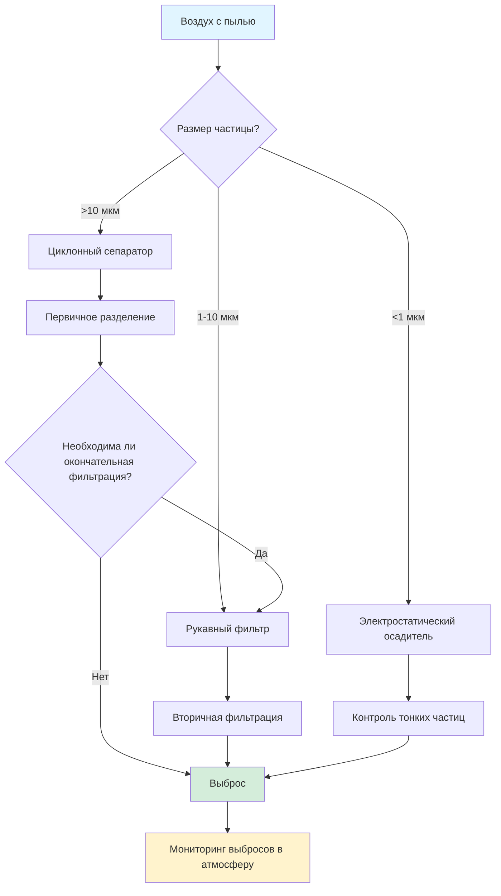

## Основные принципы систем очистки от пыли

Системы очистки от пыли удаляют взвешенные в воздухе твердые частицы путем механического разделения, используя инерцию частиц, гравитационное осаждение, фильтрацию или электростатическое притяжение. Эффективность разделения зависит от распределения размеров частиц, скорости газа, механизма сбора и характеристик перепада давления в системе.

### Физические механизмы

Четыре основных механизма разделения управляют процессом очистки от пыли:

**Инерционное разделение** происходит, когда масса частицы препятствует изменению траектории с потоком несущего газа. Эффективность возрастает с увеличением размера частицы и изменением скорости газа. Циклоны используют этот принцип путем центробежного ускорения.

**Гравитационное осаждение** разделяет частицы на основе конечной скорости осаждения. Скорость осаждения по Стоксу для сферических частиц в ламинарном режиме:

$$V_s = \frac{d_p^2(\rho_p - \rho_g)g}{18\mu}$$

Где:
- $V_s$ = скорость осаждения (м/с)
- $d_p$ = диаметр частицы (м)
- $\rho_p$ = плотность частицы (кг/м³)
- $\rho_g$ = плотность газа (кг/м³)
- $g$ = ускорение свободного падения (9,81 м/с²)
- $\mu$ = динамическая вязкость газа (Па·с)

**Фильтрация** захватывает частицы при перехвате, соударении и диффузии при прохождении газа через волокнистый материал. Субмикронные частицы проявляют броуновское движение, повышая захват путем диффузии.

**Электростатическое осаждение** заряжает частицы и притягивает их к заземленным пластинам сбора. Этот механизм отлично подходит для тонких частиц с высокой удельной проводимостью.

## Определение размеров системы и производительность

### Требования к расходу воздуха

Рассчитайте требуемый расход воздуха по скорости захвата вытяжки и площади открытия:

$$Q = V_c \times A_{hood} \times 60$$

Где:
- $Q$ = объемный расход (CFM)
- $V_c$ = скорость захвата (м/мин, из таблиц ACGIH)
- $A_{hood}$ = площадь открытия вытяжки (м²)

Руководство Industrial Ventilation Manual организации ACGIH определяет скорости захвата:
- Низкая токсичность, низкий уровень образования: 0,25–0,51 м/с
- Средняя токсичность, среднее образование: 0,51–1,02 м/с
- Высокая токсичность, высокое образование: 1,02–2,54 м/с

### Расчет перепада давления

Полный перепад давления в системе определяет требования мощности вентилятора:

$$\Delta P_{total} = \Delta P_{hood} + \Delta P_{duct} + \Delta P_{collector} + \Delta P_{discharge}$$

Перепад давления в воздуховодах для круглых воздуховодов:

$$\Delta P_{duct} = f \times \frac{L}{D} \times \frac{\rho V^2}{2}$$

Где:
- $f$ = коэффициент трения (из диаграммы Муди или уравнения Коулбрука)
- $L$ = длина воздуховода (м)
- $D$ = диаметр воздуховода (м)
- $\rho$ = плотность воздуха (кг/м³)
- $V$ = скорость (м/с)

### Расчет размера сборщика

**Площадь ткани фильтра** на основе соотношения воздух–ткань:

$$A_{cloth} = \frac{Q}{A/C}$$

Где $A/C$ = соотношение воздух–ткань (м³/ч на м²), типично 0,03–0,06 м³/(ч·см²) для стандартных рукавных фильтров, 0,06–0,12 м³/(ч·см²) для импульсных сборщиков.

**Диаметр циклона** по методу Лаппла для диаметра 50% сбора:

$$d_{50} = \sqrt{\frac{9\mu W}{2\pi N_e V_i (\rho_p - \rho_g)}}$$

Где:
- $d_{50}$ = диаметр частицы, собираемой с эффективностью 50% (м)
- $W$ = ширина входа (м)
- $N_e$ = эффективное число оборотов (обычно 5)
- $V_i$ = скорость входа (м/с)

## Выбор типа сборщика

### Сравнительная производительность

| Тип сборщика | Диапазон частиц | Эффективность | Перепад давления | Капитальные затраты | Эксплуатационные затраты |
|----------------|----------------|------------|---------------|--------------|----------------|
| Гравитационный осадитель | >50 мкм | 40–60% | 25–125 Па | Низкие | Очень низкие |
| Циклон | >10 мкм | 70–90% | 500–1500 Па | Низкие | Низкие |
| Множественный циклон | >5 мкм | 80–95% | 750–2000 Па | Средние | Низкие |
| Рукавный фильтр (встряхивающий) | >1 мкм | 99–99,9% | 1000–2000 Па | Средние | Средние |
| Рукавный фильтр (импульсный) | >0,5 мкм | 99,9%+ | 1250–2500 Па | Высокие | Средние |
| Картриджный сборщик | >0,3 мкм | 99,9%+ | 1000–2000 Па | Средние–высокие | Средние |
| Электростатический осадитель | >0,1 мкм | 95–99,9% | 50–250 Па | Очень высокие | Низкие–средние |
| Мокрый скруббер | >1 мкм | 90–99% | 1000–3000 Па | Высокие | Высокие |

### Критерии выбора

**Циклоны** обеспечивают экономичное первичное разделение грубых частиц. Используйте в качестве предварительных сборщиков перед финальными фильтрами для снижения нагрузки на фильтр. Эффективность быстро снижается при размере ниже 10 мкм.

**Рукавные фильтры** обеспечивают высокую эффективность в широком диапазоне размеров частиц. Выбор ткани зависит от температуры (максимум 260°C для стекловолокна, 200°C для полиэстера), химической совместимости и содержания влаги. Импульсные конструкции обеспечивают непрерывную работу с очисткой в режиме онлайн.

**Картриджные сборщики** подходят для умеренных нагрузок пыли при ограничениях по пространству. Гофрированный материал увеличивает площадь поверхности на единицу объема по сравнению с мешками.

**Электростатические осадители** экономично справляются с высокими температурами и большими объемами, но требуют значительного пространства для установки и электрической инфраструктуры.

## Соответствие кодексам и безопасность

### Стандарты NFPA

**NFPA 654: Стандарт предотвращения пожаров и взрывов пыли** предписывает:
- Выпускные отверстия для взрыва или подавление для сборщиков, работающих с горючей пылью
- Максимальное накопление пыли на поверхности <0,8 мм в занятых областях
- Соединение и заземление металлических компонентов
- Обнаружение искр и их тушение для высокорисковых операций

Минимальная площадь выпускного отверстия из эмпирической формулы:

$$A_v = C \times V^{2/3}$$

Где:
- $A_v$ = площадь выпускного отверстия (м²)
- $C$ = коэффициент выпуска (0,1–0,2 в зависимости от пыли)
- $V$ = объем резервуара (м³)

### Рекомендации ACGIH

Руководство Industrial Ventilation Manual, глава 5, содержит проектирование вытяжки, минимальные скорости в воздуховодах для предотвращения осаждения и процедуры балансировки системы. Минимальные транспортные скорости для распространенных материалов:
- Легкая пыль (мука, дерево): 18–20 м/с
- Сухая, мелкая пыль (цемент, пластик): 20–23 м/с
- Тяжелая или влажная пыль (металл, свинец): 23–25 м/с

Транспортная скорость ниже этих пороговых значений вызывает скачкообразное движение материала и блокировку воздуховода.

### Давление проектирования для защиты от взрывов

Сборщики, работающие с горючей пылью, требуют расчетного давления конструкции. Типовые давления взрыва:
- Сельскохозяйственная пыль: 550–830 кПа
- Металлическая пыль: 690–1035 кПа
- Угольная пыль: 620–760 кПа

Давление проектирования обычно устанавливается на уровне 1,5× максимального ожидаемого давления взрыва или минимум 105 кПа в соответствии с NFPA 68.

## Оптимизация производительности

**Частота очистки фильтра** влияет на перепад давления и эффективность. Чрезмерная очистка повреждает материал и приводит к потерям сжатого воздуха. Оптимизируйте очистку на основе перепада давления (обычно 1000–1500 Па для импульсных систем).

**Конструкция бункера** предотвращает мостообразование и образование полостей. Минимальный угол бункера:

$$\theta_{min} = \phi + 10°$$

Где $\phi$ = угол естественного откоса для пыли (обычно 30–50° для порошков).

**Конструкция входа** обеспечивает равномерное распределение потока по элементам фильтра. Плохое распределение вызывает локальную перегрузку и преждевременный отказ фильтра. Перфорированные пластины или поворотные лопатки обеспечивают однородность скорости в пределах ±15%.

Надлежащее проектирование системы очистки от пыли требует комплексного анализа характеристик частиц, выбора механизма сбора, соображений безопасности конструкции и нормативного соответствия для достижения надежного и эффективного контроля твердых частиц.
