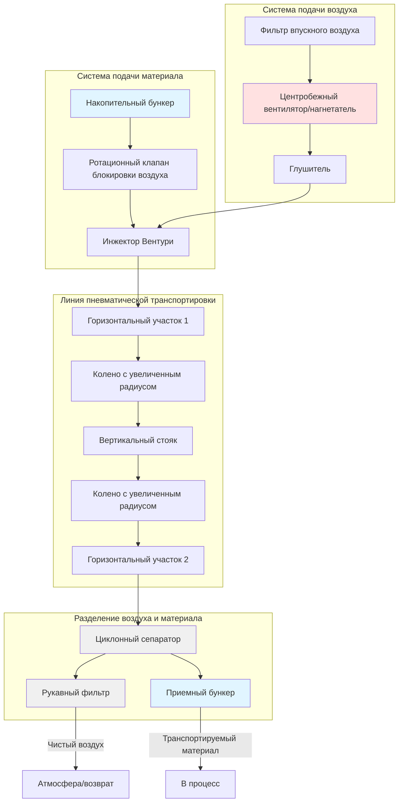

# Системы пневматической транспортировки

Пневматическая транспортировка использует скорость воздуха и дифференциальное давление для перемещения сыпучих твердых материалов по воздуховодам. Этот метод интегрирует обработку материалов с локальной вытяжной вентиляцией, обеспечивая одновременный захват и транспортировку частиц при сохранении санитарии процесса и безопасности рабочих.

## Фундаментальные механизмы транспортировки

Пневматическая транспортировка работает благодаря передаче импульса от воздуха к твердым частицам. Несущий воздух должен обеспечивать достаточную силу сопротивления, чтобы преодолеть вес частиц, трение о стены воздуховода и столкновения частиц между собой. Существует два различных режима в зависимости от коэффициента нагрузки твердых частиц и скорости транспортировки.

### Транспортировка разреженной фазы

Системы разреженной фазы полностью суспендируют частицы в воздушном потоке, поддерживая скорости значительно выше скорости соления. Массовое соотношение твердое вещество к воздуху (коэффициент нагрузки) обычно составляет от 0 до 15 кг твердого вещества на кг воздуха. Высокие скорости (15–30 м/с) обеспечивают сохранение частиц в воздухе на протяжении всей транспортной линии.

Минимальная скорость транспортировки предотвращает оседание частиц. Для горизонтальных участков скорость соления представляет критический порог, ниже которого частицы начинают оседать и образуют дюны на дне воздуховода:

$$V_{salt} = F_p \sqrt{\frac{2gD(\rho_p - \rho_a)}{\rho_a C_D}}$$

Где:
- $V_{salt}$ = скорость соления (м/с)
- $F_p$ = коэффициент формы частицы (1,0–1,5)
- $g$ = ускорение свободного падения (9,81 м/с²)
- $D$ = диаметр частицы (м)
- $\rho_p$ = плотность частицы (кг/м³)
- $\rho_a$ = плотность воздуха (кг/м³)
- $C_D$ = коэффициент лобового сопротивления (безразмерный)

Рабочая скорость должна превышать скорость соления на 25–50%, чтобы предотвратить оседание при колебаниях потока.

### Транспортировка уплотненной фазы

Системы уплотненной фазы транспортируют материалы со скоростями ниже скорости суспензии, перемещая материал в виде серии пробок или скользящих слоев. Коэффициенты нагрузки достигают 15–100 кг твердого вещества на кг воздуха, что резко снижает расход воздуха и деградацию частиц. Этот режим подходит для хрупких материалов и дальних расстояний транспортировки, но требует специализированного оборудования и тщательного проектирования системы.

## Анализ перепада давления

Общий перепад давления в системе включает потери на ускорение, потери на трение и компоненты подъема под давлением:

$$\Delta P_{total} = \Delta P_{acc} + \Delta P_{fric} + \Delta P_{elev}$$

**Перепад давления на ускорение:**

$$\Delta P_{acc} = \frac{\dot{m}_s V_s}{A}$$

Где $\dot{m}_s$ — расход твердого вещества по массе (кг/с), $V_s$ — скорость частицы (м/с), $A$ — площадь поперечного сечения воздуховода (м²).

**Перепад давления на трение (горизонтальные участки):**

$$\Delta P_{fric} = \frac{f L}{D} \cdot \frac{\rho_a V^2}{2} \left(1 + \mu \phi \frac{\rho_p}{\rho_a}\right)$$

Где:
- $f$ = коэффициент трения Дарси
- $L$ = длина воздуховода (м)
- $D$ = диаметр воздуховода (м)
- $\mu$ = коэффициент трения частица-стена
- $\phi$ = коэффициент нагрузки твердого вещества (кг твердого вещества/кг воздуха)

**Перепад давления при вертикальном подъеме:**

$$\Delta P_{elev} = g H \left(\rho_a + \phi \rho_p\right)$$

Где $H$ — высота вертикального подъема (м).

Требуемое общее давление определяет выбор вентилятора. Кривые системы должны учитывать изменения свойств материалов, влажности и влияния температуры на плотность воздуха.

## Сравнение конфигураций системы

| Параметр | Разреженная фаза | Уплотненная фаза |
|-----------|------------------|------------------|
| Скорость воздуха | 15–30 м/с | 3–10 м/с |
| Коэффициент нагрузки | 0–15 кг/кг | 15–100 кг/кг |
| Диапазон давления | 15–70 кПа | 100–700 кПа |
| Расход воздуха | Высокий | Низкий |
| Деградация частиц | Средняя–Высокая | Низкая |
| Сложность оборудования | Простая | Сложная |
| Пригодность материала | Большинство материалов | Хрупкие, абразивные |
| Расстояние транспортировки | Короткое–Среднее | Среднее–Длинное |
| Потребление энергии | 0,8–1,5 кВт на т/ч | 0,3–0,8 кВт на т/ч |

## Процедура проектирования

**1. Характеристика материала**

Измеряют распределение размеров частиц, объемную плотность, угол естественного откоса, влажность и абразивность. Эти свойства определяют конфигурацию системы и рабочие параметры.

**2. Требования к транспортировке**

Установите расход по массе (кг/ч), расстояние транспортировки (горизонтальное и вертикальное), количество изгибов, а также отметки загрузки и выгрузки.

**3. Выбор режима транспортировки**

Выбирайте разреженную фазу для общих применений с хрупкими материалами и умеренными расстояниями. Выбирайте уплотненную фазу для хрупких материалов, абразивных материалов или длительной транспортировки, где сниженная скорость воздуха минимизирует деградацию и износ.

**4. Определение скорости**

Рассчитайте скорость соления, используя свойства материала. Установите скорость проектирования в 1,3–1,5 раза превышающую скорость соления для горизонтальных участков. Вертикальные участки требуют более высоких скоростей (минимум 13–16 м/с для тонких материалов, 18–25 м/с для крупных материалов).

**5. Определение размера воздуховода**

$$A = \frac{\dot{m}_a}{\rho_a V}$$

Где $\dot{m}_a$ — расход воздуха по массе. Выбирайте стандартные размеры труб, предпочтительно сортамент 40 или более тяжелый для абразивных материалов.

**6. Расчет перепада давления**

Суммируйте компоненты ускорения, трения и повышения высоты для каждого участка системы. Добавьте потери на фитинги, используя метод эквивалентной длины или коэффициенты потерь.

**7. Выбор вентилятора**

Подбирайте ротационные вентиляторы положительного вытеснения для уплотненной фазы или центробежные вентиляторы для разреженной фазы на основе требуемого полного давления и объемного расхода. Включите запас безопасности 10–15%.

## Нормы проектирования и рекомендации

**Руководство ASHRAE по промышленной вентиляции** содержит рекомендации по скорости для различных материалов. **NFPA 654** устанавливает требования по опасности горючей пыли в пневматических системах, требуя взрывного выпуска, инертизации или подавления для взрывоопасной пыли.

**ASME MH16.1** определяет терминологию и классификацию пневматической транспортировки. Проектировщики систем должны также консультироваться со **Стандартами HI** по выбору вентилятора и **Стандартами SMACNA по конструкции воздуховодов HVAC** по требованиям к изготовлению воздуховодов.

Минимизируйте изгибы для снижения перепада давления и износа. Используйте колена с увеличенным радиусом с радиусом осевой линии не менее 5 диаметров. Колена вертикально-горизонтальной ориентации испытывают наибольший износ и могут потребовать съемных предохранителей от износа или керамических облицовок.

## Специфические соображения по материалам

**Тонкие порошки** (< 100 мкм) проявляют когезионное поведение и могут осыпаться в приемных бункерах. Аэрация или механическое перемешивание предотвращают прерывание потока.

**Гигроскопичные материалы** требуют осушенного воздуха транспортировки для предотвращения поглощения влаги и закупорки.

**Абразивные материалы** требуют износостойких колен, увеличенной толщины стенок и, где возможно, более низких скоростей транспортировки.

**Взрывоопасная пыль** требует комплексной защиты от взрывов, включая заземление, заземление, взрывной выпуск и возможную инертизацию азотом.

## Оптимизация эксплуатации

Мониторьте перепад давления на участках транспортировки для обнаружения начальной закупорки. Резкие скачки давления указывают на частичную блокировку, требующую немедленного отключения и очистки. Постепенное увеличение давления с течением времени сигнализирует об износе воздуховода или изменении свойств материала.

Поддерживайте постоянный расход материала, используя гравиметрические или объемные питатели. Колебания потока вызывают колебания скорости, которые могут снизиться ниже порога соления, инициируя каскады осаждения.

Регулярно проверяйте колена, особенно в местах изменения направления, на предмет признаков износа, указывающих на чрезмерную скорость или неправильный поток материала. Замените изношенные участки до образования перфораций.

---

*Это содержание отражает практику инженерии пневматической транспортировки и методологии проектирования, актуальные по состоянию на январь 2025 г.*
