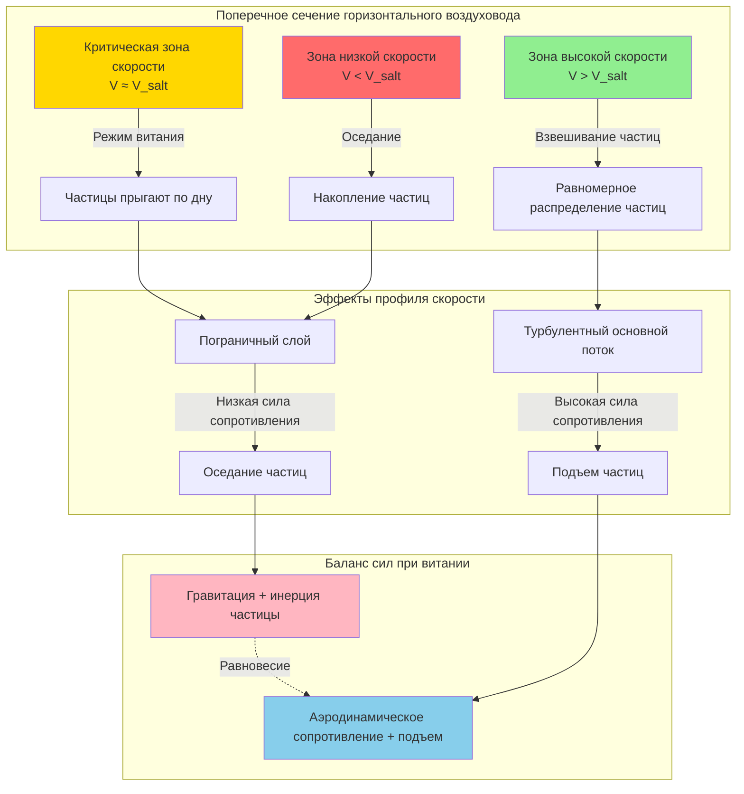

## Физические принципы скорости витания

Скорость витания представляет собой минимальную скорость воздуха, необходимую для поддержания твердых частиц во взвешенном состоянии в горизонтальном воздуховоде. Ниже этой критической скорости частицы оседают и накапливаются на дне воздуховода, что приводит к закупоркам, увеличению перепада давления и потенциальному отказу системы. Термин «витание» происходит от латинского *saltare* (прыгать), описывая характерное движение прыганием, которое частицы проявляют при скоростях, близких к пороговой скорости транспортировки.

Это явление включает динамический баланс между силами гравитационного оседания и аэродинамическими силами подъема и сопротивления. Три различных режима потока характеризуют транспортировку частиц:

1. **Поток с полной взвесью** — частицы полностью взвешены в воздушном потоке при скоростях выше скорости витания
2. **Поток с витанием** — частицы периодически контактируют с дном воздуховода, прыгая по нему в прерывистом режиме
3. **Поток с осадком** — частицы накапливаются в виде неподвижного слоя, в конечном итоге закупоривая воздуховод

Понимание скорости витания является фундаментальным для проектирования промышленных местных вытяжных вентиляционных систем (LEV) для приложений обработки материалов, включая сбор пыли, удаление стружки и транспортировку сыпучих материалов.

## Баланс сил и теоретическое развитие

Скорость витания зависит от баланса между силой сопротивления частицы, силой гравитации и турбулентным подъемом. Для сферической частицы в горизонтальном потоке критическое состояние возникает, когда вертикальная составляющая турбулентных флуктуаций равна скорости оседания частицы.

Сила сопротивления на частицу:

$$F_D = C_D \frac{\pi d_p^2}{4} \frac{\rho_a V^2}{2}$$

Где:
- $C_D$ = коэффициент сопротивления (безразмерный)
- $d_p$ = диаметр частицы (м)
- $\rho_a$ = плотность воздуха (кг/м³)
- $V$ = скорость воздуха (м/с)

Сила гравитации:

$$F_g = \frac{\pi d_p^3}{6} (\rho_p - \rho_a) g$$

Где:
- $\rho_p$ = плотность частицы (кг/м³)
- $g$ = ускорение свободного падения (9,81 м/с²)

Конечная скорость оседания в неподвижном воздухе определяется из условия равновесия сил:

$$V_t = \sqrt{\frac{4 g d_p (\rho_p - \rho_a)}{3 C_D \rho_a}}$$

## Корреляции скорости витания

Существует множество эмпирических корреляций для прогнозирования скорости витания. Наиболее широко используемое соотношение, полученное из экспериментальных данных:

$$V_{salt} = K \sqrt{\frac{g D (\rho_p - \rho_a)}{\rho_a}}$$

Где:
- $V_{salt}$ = скорость витания (м/с)
- $K$ = эмпирическая константа (обычно 1,3–2,5 в зависимости от характеристик частиц)
- $D$ = диаметр воздуховода (м)
- $\rho_p$ = плотность частицы (кг/м³)
- $\rho_a$ = плотность воздуха (кг/м³)

Для инженерного проектирования Руководство по промышленной вентиляции ACGIH содержит модифицированную форму, учитывающую размер частицы:

$$V_{salt} = 1,3 \sqrt{2 g d_p \frac{\rho_p}{\rho_a}} + C$$

Где $C$ — поправочный коэффициент, варьирующийся от 0,3 до 0,6 м/с в зависимости от сферичности частицы и шероховатости поверхности.

Более сложный подход включает число Фруда:

$$Fr = \frac{V^2}{g D}$$

Витание происходит, когда:

$$Fr \approx 1,5 \sqrt{\frac{\rho_p}{\rho_a}}$$

## Скорости витания, специфичные для конкретных материалов

Скорости проектирования должны превышать скорость витания с запасом безопасности 20–50% для обеспечения надежной транспортировки при изменяющихся условиях.

| Материал | Плотность частицы (кг/м³) | Размер частицы (мкм) | Скорость витания (м/с) | Скорость проектирования (м/с) |
|----------|--------------------------|--------------------|--------------------------|-----------------------|
| Опилки | 200–400 | 500–2000 | 12–15 | 15–20 |
| Стружка древесины | 400–600 | 5000–15000 | 18–23 | 23–28 |
| Угольная пыль | 1200–1500 | 50–500 | 15–18 | 20–23 |
| Металлическая стружка (сталь) | 7850 | 1000–5000 | 25–30 | 30–38 |
| Пластиковые гранулы | 900–1100 | 3000–6000 | 18–22 | 23–28 |
| Песок | 2650 | 100–1000 | 20–25 | 25–30 |
| Пыль зерна | 600–800 | 50–200 | 15–18 | 18–23 |
| Алюминиевая стружка | 2700 | 1000–3000 | 20–25 | 25–30 |

*Ссылка: Руководство ACGIH по промышленной вентиляции, 30-е издание*

## Механика транспортировки частиц в воздуховодах

## Соображения проектирования и коэффициенты безопасности

Несколько факторов влияют на требуемую скорость проектирования, выходящих за рамки теоретических расчетов скорости витания:

**Характеристики частиц:**
- **Форма** — угловые частицы требуют на 10–15% более высоких скоростей, чем сферические частицы
- **Распределение по размерам** — наличие мелких частиц снижает требуемую скорость; крупные частицы увеличивают ее
- **Содержание влаги** — влажные материалы проявляют когезию частиц, требуя на 20–30% более высоких скоростей
- **Абразивность** — более высокие скорости увеличивают износ; сбалансируйте надежность транспортировки с долговечностью оборудования

**Геометрия системы:**
- **Ориентация воздуховода** — вертикальные воздуховоды требуют более низких скоростей благодаря помощи гравитации
- **Радиус изгиба** — резкие изгибы вызывают выпадение частиц; поддерживайте R/D > 2,5
- **Изменения диаметра воздуховода** — избегайте резких расширений, которые снижают скорость ниже порога витания

**Условия эксплуатации:**
- **Температура** — влияет на плотность и вязкость воздуха; выполняйте коррекцию расчетов для нестандартных условий
- **Высота** — пониженная плотность воздуха на высоте требует более высоких скоростей
- **Влажность** — минимальное влияние на газофазные свойства, но влияет на поведение частиц

**Запасы безопасности:**
- Легкие, пушистые материалы: 20–30% выше расчетной скорости витания
- Плотные, угловые материалы: 40–50% выше расчетной скорости витания
- Системы с длинными горизонтальными участками: 50% запас для компенсации колебаний давления

Руководство ACGIH по промышленной вентиляции (Раздел 5: Проектирование вытяжных систем) содержит подробные рекомендации по минимальным скоростям транспортировки и рекомендует полевую проверку путем наблюдения во время пусконаладки.

## Практические методы проверки

Подтвердите адекватную скорость транспортировки следующим образом:

1. **Визуальный осмотр** — прозрачные участки воздуховода или смотровые окна для проверки взвешивания частиц
2. **Мониторинг давления** — постепенное увеличение давления указывает на накопление частиц
3. **Акустический мониторинг** — грохочущие звуки предполагают периодический контакт частиц со стенками воздуховода
4. **Частота очистки** — сокращение интервалов обслуживания указывает на пограничную скорость транспортировки

Правильно спроектированные системы работают в стабильном режиме взвешивания, исключая операционные проблемы, связанные с потоком витания или накоплением осадка материала.
