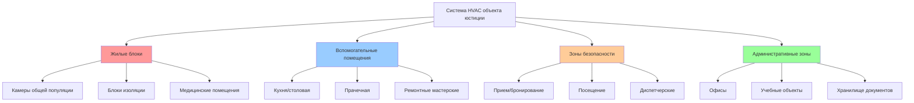
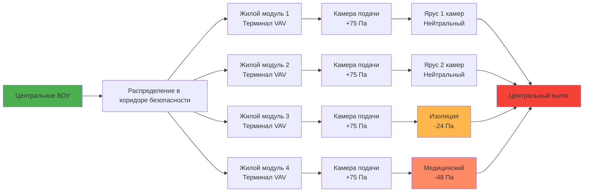

Объекты юстиции предъявляют уникальные требования к системам HVAC, которые сочетают требования безопасности, соображения безопасности жизни и благополучие людей в строго контролируемых условиях. Эти установки требуют специализированных подходов к проектированию, которые интегрируют механические системы с протоколами безопасности при одновременном соблюдении нормативных требований и эффективности работы.

## Классификация объектов и требования HVAC

Объекты юстиции охватывают несколько уровней безопасности и типов операций, каждый из которых имеет отдельные требования к контролю окружающей среды. Понимание этих классификаций определяет выбор системы и параметры проектирования.

### Сравнение типов объектов

| Тип объекта | Уровень безопасности | Плотность населения | Скорость вентиляции (CFM/человек) | Основные проблемы HVAC |
|------------|------------|------------|------------|------------|
| Минимальная безопасность | Низкий | 3,7–5,6 м²/человек | 7,9–10,6 м³/ч | Стандартный комфорт, энергоэффективность |
| Средняя безопасность | Умеренный | 5,6–7,4 м²/человек | 10,6–13,2 м³/ч | Защита от несанкционированного доступа, контроль доступа |
| Максимальная безопасность | Высокий | 7,4–11,2 м²/человек | 13,2–15,8 м³/ч | Полная интеграция безопасности, резервирование |
| Административная изоляция | Максимальный | 9,3–13,9 м²/человек | 15,8–18,5 м³/ч | Контроль отдельных камер, мониторинг |
| Здания судов | Переменный | По нормам | 7,9–10,6 м³/ч (общественные), 10,6–13,2 м³/ч (содержание) | Разделение зон, проверка безопасности |
| Учреждения для несовершеннолетних | Низкий–умеренный | 7,4–9,3 м²/человек | 10,6–13,2 м³/ч | Образовательные помещения, рекреационные пространства |

## Принципы проектирования для защищенных сред

Системы HVAC в учреждениях юстиции должны учитывать требования безопасности, обеспечивая соответствие нормативным требованиям окружающей среды. Три фундаментальных принципа управляют проектированием системы:

**1. Защищенная от несанкционированного доступа конструкция**

Все доступные компоненты требуют укрепленной конструкции. Решетки, воздухозаборники и дефлекторы в занятых помещениях используют защищенные сборки, протестированные для предотвращения удаления или использования в качестве оружия. Оборудование, расположенное в защищенных зонах, требует закрепленной установки с антилигатурными характеристиками где применимо.

**2. Контроль распределения воздуха**

Поддержание надлежащих соотношений давления воздуха предотвращает миграцию загрязняющих веществ между зонами. Отрицательное давление в зонах высокого риска (бронирование, медицинская изоляция) содержит переносимые по воздуху опасности, в то время как положительное давление в диспетчерских и административных помещениях защищает персонал.

**3. Резервирование системы и надежность**

Критические зоны требуют избыточности N+1 для вентиляции и охлаждения. Потеря контроля окружающей среды создает опасности для безопасности жизни и операционные сбои. Резервные системы и режимы аварийной вентиляции обеспечивают непрерывную работу при отказах оборудования или техническом обслуживании.

## Расчет размеров системы вентиляции

Конструкция вентиляции жилого блока следует стандарту ASHRAE 62.1 с модификациями для безопасности и плотности. Расчет общего потока воздуха учитывает требования наружного воздуха, нагрузки по занятости и требования к отведению воздуха.

### Расчет вентиляции блока камер

Для жилого блока общей популяции:

$$Q_{\text{total}} = \max(Q_{\text{OA}}, Q_{\text{thermal}})$$

Где требование наружного воздуха:

$$Q_{\text{OA}} = N \times V_{\text{rate}} + A \times V_{\text{area}}$$

Переменные:
- $N$ = количество человек
- $V_{\text{rate}}$ = скорость вентиляции на человека (CFM/человек)
- $A$ = площадь этажа (м²)
- $V_{\text{area}}$ = скорость вентиляции на основе площади (CFM/м²)

Для жилого блока на 48 мест с требованием 10,6 м³/ч на человека:

$$Q_{\text{OA}} = 48 \times 10,6 = 509 \text{ м³/ч}$$

Расчет тепловой нагрузки для охлаждения:

$$Q_{\text{thermal}} = \frac{Q_{\text{sensible}} + Q_{\text{latent}}}{1.08 \times \Delta T}$$

Где:
- $Q_{\text{sensible}}$ = явная тепловая нагрузка (кДж/ч)
- $Q_{\text{latent}}$ = скрытая тепловая нагрузка (кДж/ч)
- $\Delta T$ = разность температур подачи и помещения (°C)

## Архитектура системы воздухообработки

Объекты юстиции обычно используют централизованную воздухообработку с распределенными концевыми устройствами для балансирования требований доступа безопасности и контроля зоны.

## Требования интеграции безопасности

Системы HVAC интегрируются с инфраструктурой безопасности объекта через несколько интерфейсов:

**Интеграция контроля доступа**
- Доступ в машинные отделения регистрируется в системе управления безопасностью
- Возможность удаленного отключения из диспетчерской
- Сигналы тревоги о несанкционированном доступе к критическим компонентам
- Защищенная маршрутизация кабелепровода, избегающая скомпрометированных путей

**Управление дымом и пожаром**
- Системы наддува для контроля дыма в вертикальных шахтах
- Установка противопожарных дроссельных клапанов в координации с преградами безопасности
- Режимы аварийной вентиляции, активируемые панелью пожарной сигнализации
- Эвакуация дыма из закрытых пространств без внешнего доступа

**Предотвращение контрабанды**
- Размер воздуховодов предотвращает прохождение человека (<7 800 см² площади)
- Отверстия решеток и воздухозаборников <1,3 см
- Сварная конструкция воздуховодов в высокозащищенных зонах
- Доступ для проверки вне занятых зон

## Соответствие нормам и стандартам

Проектирование HVAC объектов юстиции ссылается на несколько нормативно-правовых базис:

- **Стандарт ASHRAE 62.1**: Вентиляция для приемлемого качества воздуха в помещениях
- **Стандарт ASHRAE 55**: Тепловые условия окружающей среды для занятости человеком
- **Глава IMC 4**: Требования вентиляции для помещений собраний и жилых зданий
- **Стандарты ACA для взрослых исправительных учреждений**: Условия окружающей среды и мониторинг
- **NFPA 101**: Положения Кодекса безопасности жизни для объектов содержания и исправительных учреждений
- **Государственные нормативные акты Министерства внутренних дел**: Требования конкретной юрисдикции к диапазонам температур и воздухообменам

Диапазоны контроля температуры согласно стандартам ACA:
- Жилые зоны: 20–26°C
- Медицинское/инфекционное отделение: 21–26°C
- Кухня: Согласно нормативам здравоохранения
- Административные: 20–24°C

Относительная влажность поддерживается между 30–60% для предотвращения роста плесени и поддержания комфорта человека.

## Эксплуатационные соображения

Доступ для технического обслуживания представляет постоянную проблему в защищенных средах. Стратегии проектирования, которые минимизируют доступ в занятые помещения, снижают эксплуатационные затраты и проблемы безопасности. Расположение оборудования в машинных отделениях, доступных из незащищенных коридоров, использование высокоэффективной фильтрации для удлинения интервалов обслуживания и реализация удаленного мониторинга состояния фильтра и производительности оборудования оптимизируют долгосрочную эксплуатацию.

Системы рекуперации энергии требуют тщательного применения. Колеса-теплообменники энтальпии и устройства рекуперации тепла обеспечивают значительную экономию коммунальных услуг, но требуют регулярного обслуживания. Пластинчатые теплообменники обеспечивают более простую эксплуатацию с сниженным риском перекрестного загрязнения между потоками вытяжного и наружного воздуха.

Системы HVAC объектов юстиции представляют специализированное проектирование, требующее координации между механическим проектированием, операциями безопасности и системами безопасности жизни. Надлежащая интеграция этих элементов создает безопасные, соответствующие нормам среды, поддерживающие миссии объекта при защите жильцов и персонала.
