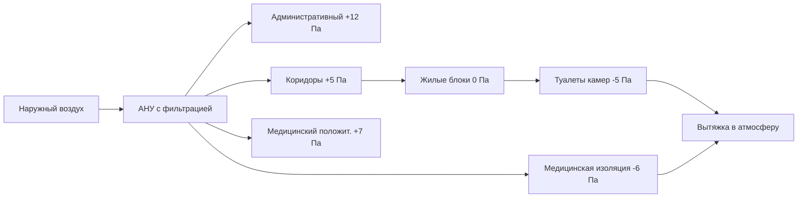

# Системы HVAC для исправительных учреждений

Системы HVAC исправительных учреждений должны уравновешивать экологический контроль, требования безопасности, операционную безопасность и энергоэффективность. Соображения проектирования существенно различаются в зависимости от классификации безопасности, характеров занятости и миссии объекта.

## Влияние классификации безопасности на проектирование HVAC

Уровень безопасности определяет стратегию вентиляции, доступность оборудования и методологию управления.

### Требования по уровням безопасности

| Уровень безопасности | Минимум ACH | Диапазон температур | Индивидуальное управление | Расположение оборудования |
|----------------|-------------|-------------------|-------------------|-------------------|
| Максимум | 10-15 | 20-26°C | Отсутствует | Удаленные защищенные области |
| Средний | 8-12 | 20-24°C | Ограниченная зона | Контролируемый доступ |
| Минимум | 6-10 | 18-26°C | Уровень зоны | Стандартные расположения |
| Административный | 4-8 | 21-23°C | Отдельное помещение | Стандартный доступ |

## Основные типы помещений и критерии вентиляции

Исправительные учреждения содержат разнообразные типы помещений с противоречивыми требованиями HVAC.

### Параметры проектирования жилых блоков

**Вентиляция блока камер:**
- Подача воздуха: минимум 15-20 CFM (25-34 м³/ч) на одного человека
- Места вытяжки: туалет/душевые зоны
- Соотношение давления: слегка отрицательное относительно коридоров
- Установка температуры: 22°C ± 2°C (не регулируется заключенными)

Расход воздуха на жилой блок рассчитывается:

$$Q_{\text{cell}} = N_{\text{occ}} \times 34 + A_{\text{floor}} \times 0.645$$

Где:
- $Q_{\text{cell}}$ = требуемый воздушный поток (м³/ч)
- $N_{\text{occ}}$ = максимальное количество людей
- $A_{\text{floor}}$ = площадь пола (м²)
- 0,645 = норма вентиляции на основе площади (м³/ч·м²)

**Дневные комнаты/общие зоны:**
- Минимум 10 ACH или 42 CFM (71 м³/ч) на одного человека (в зависимости от того, что больше)
- Предпочтительна прямая вытяжка
- Положительное давление относительно камер
- Улучшенная фильтрация (MERV 13 минимум)

### Вспомогательные и служебные помещения

**Кухня и пищевое обслуживание:**
- Вытяжка кухонных вентиляторов: 2550-6800 м³/ч на погонный метр
- Приточный воздух: 80-100% от вытяжки
- Положительное давление в зонах обслуживания
- Отрицательное давление в зонах мытья посуды

**Медицинские отделения:**
- Амбулаторное: 6 ACH подачи, положительное давление
- Изоляционные камеры: 12 ACH подачи, отрицательное давление (минимум -6 Па)
- Кабинеты осмотра: положительное давление, индивидуальная вытяжка

**Зоны свиданий:**
- Контактные: минимум 10 ACH, положительное давление
- Бесконтактные: стандартное комфортное кондиционирование
- Кабинеты адвокатов: акустическая и экологическая изоляция

## Управление давлением и стратегии воздушных потоков

Поддержание перепадов давления предотвращает миграцию запахов, загрязнений и дыма между зонами безопасности.

### Проектирование каскада давления

Перепад давления между соседними зонами поддерживается:

$$\Delta P_{\text{zone}} = 5 \text{ до } 12 \text{ Па}$$

Общий перепад давления в системе объекта:

$$\Delta P_{\text{total}} = \sum_{i=1}^{n} \Delta P_i + P_{\text{filter}} + P_{\text{duct}}$$

Где:
- $\Delta P_i$ = перепад давления через каждую границу зоны
- $P_{\text{filter}}$ = потери давления в фильтровальной установке
- $P_{\text{duct}}$ = сопротивление распределительной системы

## Соображения архитектуры системы

### Расположение оборудования и доступ

Оборудование должно располагаться в защищенных областях, недоступных для заключенных, при этом обеспечивая доступ для обслуживания:

1. **Приточно-вытяжные установки**: механические чердаки или защищенные механические помещения
2. **Концевые приборы**: над защищенными потолками с защищенными от вмешательства крепежами
3. **Воздуховоды**: скрытые в шахтах стен или конструктивных пространствах
4. **Управление**: централизованное с ограниченным локальным доступом
5. **Наружное оборудование**: защищенные дворы или установки на крыше с контролируемым доступом

### Требования резервирования

Критические помещения требуют резервных систем согласно стандартам ACA и местным требованиям юрисдикции:

- **Медицинские отделения**: 100% резервная мощность с автоматическим переключением
- **Кухня**: двойные вытяжные вентиляторы с аварийным питанием
- **Жилые блоки**: резервирование N+1 для оборудования обработки воздуха
- **Комнаты управления**: независимые системы с резервной питающей системой

Расчет резервной мощности:

$$Q_{\text{redundant}} = Q_{\text{design}} \times 1.0$$

Для конфигурации N+1 с модульным оборудованием:

$$N_{\text{units}} = \left\lceil \frac{Q_{\text{total}}}{Q_{\text{module}}} \right\rceil + 1$$

## Безопасность системы управления

Управление HVAC в исправительных учреждениях должно предотвращать вмешательство, допуская при этом операционную гибкость:

- **Системы автоматизации зданий**: ролевой доступ с логированием аудита
- **Локальное управление**: запираемое или исключенное в жилых блоках
- **Пределы температуры**: программно применяемые диапазоны согласно стандартам ACA
- **Возможность переопределения**: аварийное управление из защищенного командного центра
- **Мониторинг**: постоянная проверка соотношений давления

## Энергоэффективность в защищенных средах

Энергосбережение не должно влиять на безопасность или охрану здоровья:

**Приемлемые стратегии:**
- Рекуперация тепла на потоках общей вытяжки (не из загрязненных источников)
- Переменные системы в административных зонах
- Управление на основе присутствия в прерывисто используемых помещениях
- Двигатели и приводы повышенной эффективности
- Бесплатное охлаждение при благоприятных наружных условиях

**Запрещенные или ограниченные:**
- Открывающиеся окна в жилых блоках
- Децентрализованное оборудование, доступное для заключенных
- Циклы экономизатора, компрометирующие фильтрацию
- Управление вентиляцией по требованию в жилых зонах

## Ссылки на коды и стандарты

Проектирование должно соответствовать:

- **ASHRAE Standard 62.1**: Вентиляция для приемлемого качества воздуха в помещениях
- **ASHRAE Standard 170**: Вентиляция объектов здравоохранения (медицинские отделения)
- **Стандарты ACA**: Основанные на характеристике стандарты Американской ассоциации исправительных учреждений
- **NFPA 90A**: Установка систем кондиционирования воздуха и вентиляции
- **Международный механический код**: Минимальные требования вентиляции и безопасности
- **Государственные/местные нормативы исправительных учреждений**: Требования юрисдикции

## Контроль дыма и пожарная безопасность

Системы безопасности жизни должны учитывать защищенные население:

**Подход к управлению дымом:**
- Зонированное управление дымом согласно требованиям IMC
- Автоматическое срабатывание заслонок в координации с пожарной сигнализацией
- Pressurization маршрутов эвакуации
- Выделенная вытяжка дыма в зонах высокой плотности
- Ручное переопределение из пожарной командной станции

**Расположения противопожарных/противодымных заслонок:**
- Все проемы в огнестойких конструкциях
- Боковые подключения к общим вертикальным шахтам
- Границы между зонами управления дымом
- Интерфейс между защищенными и незащищенными зонами

## Пусконаладка и проверка работы

Проверочное тестирование должно подтвердить:

1. Соотношения давления во всех режимах работы
2. Скорости вентиляции во всех занятых помещениях
3. Управление температурой в пределах указанных диапазонов
4. Работу переключения резервной системы
5. Безопасность системы управления и функциональность блокировки
6. Процедуры аварийного переопределения
7. Доступность замены фильтров

Протоколы непрерывной пусконаладки обеспечивают постоянное соответствие требованиям окружающей среды и безопасности при эволюции населения объекта и его миссии.
