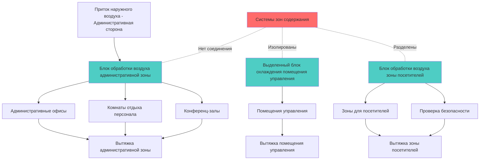
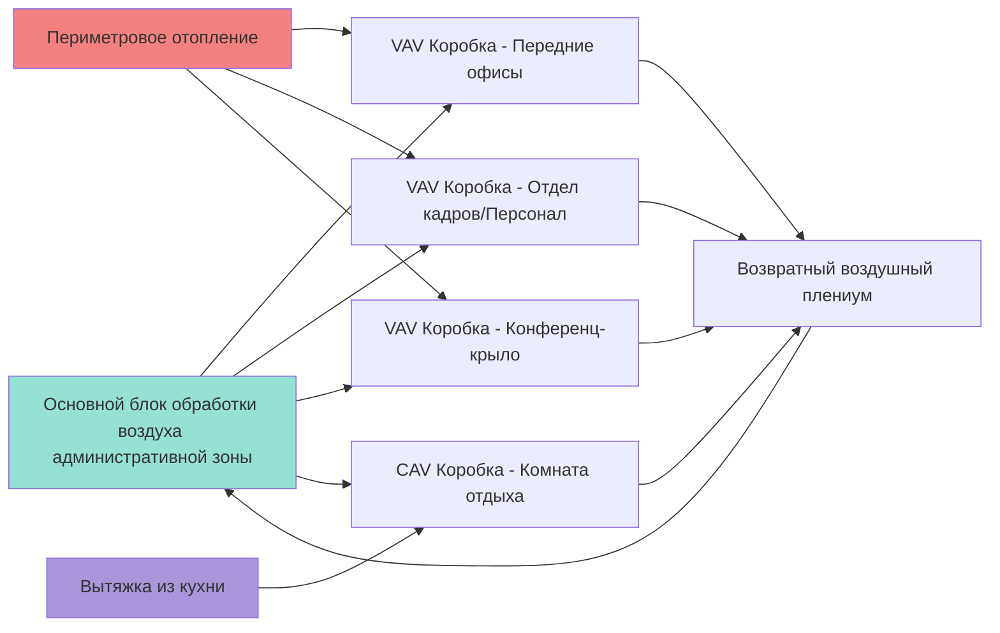

## Обзор

Административные помещения в исправительных учреждениях требуют систем ОВКВ, которые обеспечивают комфорт персонала, размещение посетителей и критическое разделение безопасности от зон, занятых заключёнными. Эти пространства включают переднии офисы, комнаты отдыха персонала, конференц-залы, помещения управления, зоны обработки посетителей и секторы проверки безопасности. Основная проблема проектирования заключается в поддержании независимых систем обработки воздуха, которые предотвращают миграцию воздушного потока между административными и защищёнными зонами содержания, при этом управляя высокими внутренними нагрузками от электронного оборудования безопасности.

## Классификация типов помещений

Административные зоны в исправительных учреждениях демонстрируют отчётливые тепловые и вентиляционные характеристики, требующие адаптированных подходов ОВКВ:

| Тип помещения | Наружный воздух (м³/ч на чел.) | Температура проектирования (°C) | Относительная влажность (%) | Плотность внутренней нагрузки (Вт/м²) |
|-----------|-------------------------|------------------------|---------------------|------------------------------|
| Административные офисы | 8,2-9,6 | 20-24 | 30-60 | 86-129 |
| Помещения управления | 9,6 | 21-23 | 40-55 | 269-430 |
| Обработка посетителей | 8,2 | 20-24 | 30-60 | 108-161 |
| Конференц-залы | 8,2-9,6 | 20-24 | 30-60 | 129-194 |
| Комнаты отдыха персонала | 9,6 | 20-24 | 30-60 | 161-269 |
| Проверка безопасности | 9,6 | 20-24 | 30-60 | 194-323 |

*Ссылка: ASHRAE Standard 62.1-2022 и ASHRAE Handbook - HVAC Applications*

## Требования разделения систем

Системы ОВКВ административных помещений должны поддерживать полную изоляцию от систем зон содержания. Это разделение предотвращает перенос загрязнений, поддерживает компартментализацию безопасности и позволяет независимый контроль температуры для комфорта персонала без нарушения управления окружающей средой в защищённых зонах.

Требования проектирования включают:

- **Выделенные блоки обработки воздуха**, обслуживающие только административные зоны
- **Взаимосвязь давления**, поддерживающая административные помещения при нейтральном или слегка отрицательном давлении относительно внешней среды, но изолированная от зон содержания
- **Отсутствие общих воздуховодов** между административными и защищёнными зонами
- **Независимые системы управления**, предотвращающие взаимное влияние между зонами
- **Отдельные системы вытяжки** без соединения с вытяжками зон содержания

## Расчёты нагрузки охлаждения помещения управления

Помещения управления предъявляют наиболее высокие требования к охлаждению в административных помещениях из-за концентрированного электронного оборудования безопасности, включая системы видеонаблюдения, коммуникационные панели, серверы управления доступом и рабочие станции мониторинга.

### Уравнение общей нагрузки охлаждения

Общая нагрузка охлаждения для помещений управления объединяет прибыль тепла через конструкции, нагрузки от людей, освещение и нагрузки от критического электронного оборудования:

$$Q_{total} = Q_{walls} + Q_{roof} + Q_{windows} + Q_{infiltration} + Q_{occupants} + Q_{lighting} + Q_{equipment}$$

### Расчёт нагрузки от оборудования

Нагрузка от электронного оборудования обычно является доминирующей в требованиях охлаждения помещения управления:

$$Q_{equipment} = \sum_{i=1}^{n} (P_i \times DF_i \times 1.055)$$

Где:
- $Q_{equipment}$ = Прибыль явного тепла от оборудования (кДж/ч)
- $P_i$ = Номинальная мощность устройства $i$ (ватты)
- $DF_i$ = Коэффициент разнообразия для устройства $i$ (обычно 0,7–1,0 для оборудования безопасности)
- $1.055$ = Коэффициент преобразования (кДж/ч на ватт)

### Пример проектирования

Для помещения управления площадью 37,2 м² с типичными нагрузками от оборудования безопасности:

$$Q_{equipment} = [(8 \times 250W) + (2 \times 1500W) + (4 \times 150W)] \times 0.85 \times 1.055$$

$$Q_{equipment} = [2000 + 3000 + 600] \times 0.85 \times 1.055 = 5051 \text{ кДж/ч}$$

В сочетании со структурными нагрузками (прогнозируемо 1 049 кДж/ч), нагрузками от людей (4 человека × 135 кДж/ч = 540 кДж/ч) и освещением (12,9 Вт/м² × 37,2 м² × 1,055 = 506 кДж/ч), общая нагрузка охлаждения достигает примерно 7 146 кДж/ч, требуя выделенного блока охлаждения мощностью около 2 кВт с учётом резервирования.

## Проектирование ОВКВ зоны посетителей

Зоны обработки и ожидания посетителей испытывают переменную заполняемость с пиковыми нагрузками во время запланированных периодов посещений. Системы ОВКВ должны адаптироваться к быстрым колебаниям заполняемости, при этом поддерживая производительность оборудования проверки безопасности.

### Требования к наружному воздуху

Рассчитайте наружный воздух, используя процедуру определения вентиляции согласно ASHRAE Standard 62.1:

$$V_{oz} = R_p \times P_z + R_a \times A_z$$

Где:
- $V_{oz}$ = Объём наружного воздуха в зоне дыхания (м³/ч)
- $R_p$ = Норма наружного воздуха на человека (8,2 м³/ч на чел. для помещений общественного пользования)
- $P_z$ = Численность населения в зоне (максимальная заполняемость)
- $R_a$ = Норма наружного воздуха по площади (0,61 м³/ч·м² для помещений общественного пользования)
- $A_z$ = Площадь пола зоны (м²)

Для зоны ожидания посетителей площадью 111,5 м² с максимальной вместимостью 30 человек:

$$V_{oz} = (8,2 \times 30) + (0,61 \times 111,5) = 246 + 68 = 314 \text{ м³/ч}$$

## Стратегия зонирования административных офисов

Административные офисные помещения получают преимущества от систем VAV с периметровым отоплением для решения проблемы различных солнечных нагрузок и нагрузок от заполняемости при поддержании энергоэффективности. Модульные блоки с переменным расходом воздуха обеспечивают индивидуальный контроль отдельных зон для офисов, конференц-залов и открытых административных пространств.

## Требования к зоне проверки безопасности

Зоны проверки безопасности требуют повышенной вентиляции для управления отводом тепла от оборудования рентгеновских лучей и поддержания комфорта оператора во время непрерывных операций проверки. Соображения проектирования включают:

- **Минимум 9,6 м³/ч на чел.** наружного воздуха для персонала безопасности
- **Точечное охлаждение** для рабочих мест операторов рентгеновского оборудования
- **Дополнительная вытяжка** для удаления локализованного тепла от оборудования обнаружения
- **Контроль температуры**, поддерживающий 20–22°C для точности оборудования и бдительности оператора

Отвод тепла от оборудования рентгеновского скрининга варьируется от 450 до 900 кДж/ч на установку в зависимости от размера и пропускной способности.

## Вентиляция комнаты отдыха персонала

Комнаты отдыха с кухонными приборами требуют выделенных систем вытяжки, независимых от общих возвратов ОВКВ:

$$Q_{exhaust} = CFM_{hood} + CFM_{general}$$

Для установки с микроволновой печью и кофемашиной без коммерческого приготовления пищи обеспечьте прерывистую вытяжку 47–71 м³/ч с воздухом подпитки, интегрированным в подачу ОВКВ для поддержания баланса давления в помещении.

## Заключение

ОВКВ в административных помещениях исправительных учреждений требует строгого разделения систем, учёта высоких нагрузок от электронного оборудования в помещениях управления, гибкого проектирования для переменной заполняемости зон посетителей и координации с операциями безопасности. Надлежащее применение стандартов ASHRAE обеспечивает комфорт персонала, размещение посетителей и надёжность работы при поддержании критической защиты безопасности, которая определяет проектирование окружающей среды исправительного учреждения.

## Ссылки

- ASHRAE Standard 62.1-2022: Вентиляция для приемлемого качества внутреннего воздуха
- ASHRAE Handbook - HVAC Applications, Глава 9: Учреждения правосудия
- ASHRAE Standard 55-2020: Тепловые условия окружающей среды для пребывания людей
- ASHRAE Handbook - Основы: Расчёты прибыли тепла
