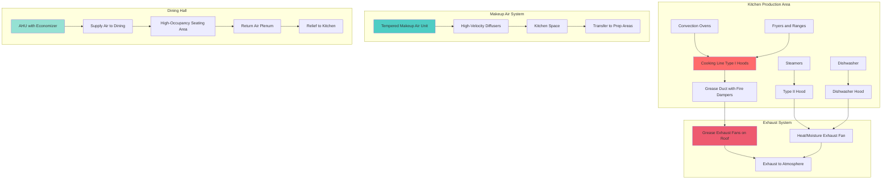
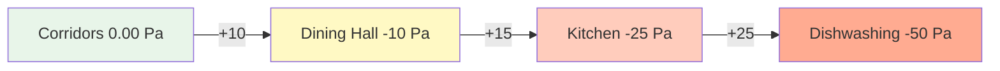

## Обзор

Столовые исправительных учреждений представляют уникальные проблемы HVAC, сочетающие требования коммерческой кухонной вентиляции с протоколами безопасности, высокой плотностью заполнения и стандартами институциональной прочности. Эти пространства должны управлять экстремальными тепловыми нагрузками от кухонного оборудования, контролировать запахи и пары, насыщенные жиром, обеспечивать адекватную вентиляцию для 200–1000 и более человек во время приемов пищи и интегрироваться с системами безопасности, предотвращая скрытие контрабанды или пути побега.

Проектирование HVAC должно учитывать три отдельные зоны: коммерческие кухонные производственные площади с вытяжками типов I и II, помещения мытья посуды и горшков с высокими влажностными нагрузками и столовые для заключенных с сосредоточенной плотностью заполнения в запланированные часы приемов пищи. Каждая зона требует специализированных стратегий вентиляции при сохранении перепадов давления, которые предотвращают миграцию запахов в соседние жилые блоки.

## Проектирование кухонной вытяжки

### Скорость выброса вытяжек типа I

Коммерческие кухонные вытяжки в исправительных учреждениях соответствуют требованиям ASHRAE 154 и NFPA 96 с повышенными мерами безопасности. Скорость потока выброса зависит от режима работы оборудования и типа вытяжки:

| Тип оборудования | Легкая нагрузка | Средняя нагрузка | Тяжелая нагрузка | Очень тяжелая нагрузка |
|---|---|---|---|---|
| Настенный навес (м³/ч на м длины) | 343 | 515 | 686 | 943 |
| Одноостровный навес (м³/ч на м длины) | 515 | 686 | 858 | 1200 |
| Двухостровный навес (м³/ч на м длины) | 686 | 858 | 1029 | 1372 |
| Бровка/близко расположенная (м³/ч на м длины) | 258 | 429 | 600 | 858 |

Полная скорость потока выброса для вытяжки типа I рассчитывается как:

$$Q_{exhaust} = L \cdot R_{duty} \cdot F_{overlap}$$

Где:
- $Q_{exhaust}$ = полная скорость потока выброса (м³/ч)
- $L$ = длина вытяжки (м)
- $R_{duty}$ = скорость выброса для конкретного режима (м³/ч на м)
- $F_{overlap}$ = коэффициент перекрытия для нескольких вытяжек (обычно 0,9)

### Скорость захвата вытяжки и подпиточный воздух

Скорость захвата на лицевой стороне вытяжки должна обеспечивать адекватное сдерживание:

$$V_{capture} = \frac{Q_{exhaust}}{A_{face}}$$

Где:
- $V_{capture}$ = скорость на лицевой стороне (м/с), обычно 0,5–0,75 м/с для настенного навеса
- $A_{face}$ = площадь лицевой стороны вытяжки (м²)

Подпиточный воздух должен быть предусмотрен для предотвращения чрезмерного отрицательного давления на кухне:

$$Q_{makeup} = Q_{exhaust} - Q_{infiltration}$$

Для исправительных кухонь подпиточный воздух должен составлять 85–90% от выброса для поддержания небольшого отрицательного давления (–4,95 до –12,4 Па), предотвращающего миграцию запахов в соседние пространства.

## Архитектура системы вентиляции кухни

## Вентиляция столовой

### Параметры проектирования при высокой плотности заполнения

Столовые исправительных учреждений испытывают максимальное заполнение в запланированные часы приема пищи с быстрой сменой. Параметры проектирования:

| Параметр | Значение | Обоснование |
|---|---|---|
| Плотность заполнения | 1 человек на 1,1–1,4 м² | Институциональная плотность |
| Наружный воздух на человека | 3,5 м³/ч | ASHRAE 62.1 Таблица 6-1 |
| Полная смена воздуха | 6–10 ACH | Во время заполнения |
| Температура подачи воздуха | 13–14°C | Высокие чувствительные нагрузки |
| Уставка температуры пространства | 21–23°C | Требования IMC |

Полная скорость вентиляции:

$$Q_{ventilation} = \max(N \cdot OA_{person}, A \cdot ACH / 60)$$

Где:
- $N$ = максимальная плотность заполнения (человека)
- $OA_{person}$ = наружный воздух на человека (3,5 м³/ч)
- $A$ = объем помещения (м³)
- $ACH$ = смена воздуха в час

### Каскад давления и контроль запахов

Соотношения давления предотвращают миграцию запахов из кухни в столовую и из столовой в соседние коридоры:

## Интеграция безопасности и безопасности

### Спецификации безопасного оборудования

Все оборудование HVAC в зонах, доступных для заключенных, требует повышенных мер безопасности:

- **Решетки и диффузоры**: нержавеющая сталь толщиной 2,6 мм с защищенными от несанкционированного доступа крепежом, без съемных частей
- **Воздуховоды**: минимум 1,6 мм в доступных зонах, сплошные сварные швы, сейсмические скобы предотвращают использование в качестве опоры
- **Управление**: утопленные термостаты с защитными крышками из лексана, без открытых датчиков или проводки
- **Панели доступа**: исключены в занятых пространствах или защищены несъемными петлями и институциональными замками

### Интеграция с системой пожаротушения

Системы вытяжки типа I интегрируются с мокрым химическим пожаротушением:

$$T_{linkage} = T_{cooking} + 10°C$$

Плавкие звенья, рассчитанные на 10°C выше максимальной ожидаемой температуры приготовления пищи, запускают пожаротушение и одновременно:
1. Выключают вытяжные вентиляторы (после задержки продувки 30–60 секунд)
2. Закрывают заслонки подпиточного воздуха
3. Выключают подачу топлива/электроэнергии к оборудованию
4. Активируют оповещение в диспетчерскую

## Производительность и эффективность системы

### Рекуперация тепла выбросов кухни

Выброс кухни представляет значительную потерю энергии. Опции рекуперации тепла, совместимые с выбросом, насыщенным жиром:

| Технология | Эффективность | Применение |
|---|---|---|
| Замкнутый контур (гликоль) | 50–60% | Предварительный нагрев подпиточного воздуха |
| Тепловая труба | 45–55% | Подпиточный воздух или горячее водоснабжение |
| Прямо нагреваемый подпиточный воздух | 80–90% эффективность | Газовый, компенсирует потерю тепла выброса |

Энергия, восстановленная из выброса:

$$Q_{recovered} = Q_{exhaust} \cdot \rho \cdot c_p \cdot \Delta T \cdot \eta$$

Где:
- $\rho$ = плотность воздуха (1,2 кг/м³)
- $c_p$ = удельная теплоемкость (1,005 кДж/кг·К)
- $\Delta T$ = разница температур между выбросом и наружным воздухом (°C)
- $\eta$ = эффективность рекуперации тепла (0,50–0,60)

### Вентиляция кухни на основе спроса

Переменный поток выброса на основе деятельности приготовления пищи снижает энергопотребление на 30–50% в непиковые периоды:

$$Q_{variable} = Q_{design} \cdot \left(\frac{T_{hood} - T_{ambient}}{T_{design} - T_{ambient}}\right)^{0.5}$$

Датчики температуры в плёнуме вытяжки модулируют скорость вентилятора выброса через частотный преобразователь, при этом подпиточный воздух отслеживает поток выброса для поддержания перепадов давления.

## Требования кодексов и стандартов

- **ASHRAE 154**: Вентиляция коммерческих операций приготовления пищи
- **NFPA 96**: Стандарт вентиляции, контроля и пожарной защиты коммерческих операций приготовления пищи
- **IMC Глава 5**: Системы выброса для кухонь учреждений
- **ASHRAE 62.1**: Вентиляция столовых (Таблица 6-1)
- **UMC 510**: Требования к подпиточному воздуху коммерческой кухни
- **Местный отдел здравоохранения**: Одобрения вентиляции пищевого сервиса

## Рабочие соображения

Системы HVAC исправительных кухонь работают 12–16 часов в сутки с минимальным временем простоя. Доступ к техническому обслуживанию должен быть спроектирован с учетом протоколов безопасности, включая контроль инструментов и сопровождение. Все обслуживание, требующее доступа на кухню, должно быть возможно на время вне приемов пищи. Избыточность в вытяжных вентиляторах предотвращает прерывание обслуживания во время отказа оборудования. Доступ к очистке жирного воздуховода должен быть предусмотрен в соответствии с NFPA 96 при предотвращении уязвимостей безопасности. Интерфейсы системы управления должны обеспечивать удаленный мониторинг критических параметров, включая статус вытяжного вентилятора, поток подпиточного воздуха, температуры в пространстве и состояние системы пожаротушения.
