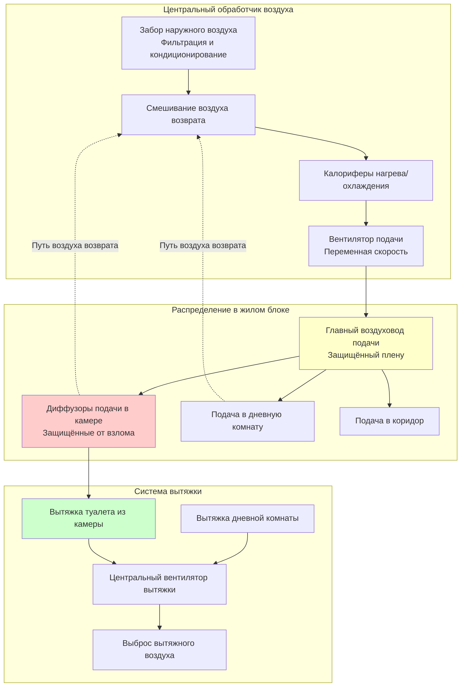

## Обзор

Системы HVAC жилых блоков в исправительных учреждениях должны обеспечивать баланс между тепловым комфортом, качеством воздуха в помещениях, требованиями безопасности и надёжностью работы 24/7. В отличие от обычных жилых и коммерческих помещений, жилые блоки характеризуются уникальными проблемами, включая защищённое от взлома оборудование, постоянную занятость, ограниченный доступ для обслуживания и возможность несанкционированного использования воздушной системы.

Жилые блоки включают отдельные камеры, дневные комнаты, коридоры и связанные с ними санитарные помещения. Каждый тип помещения требует определённых расходов воздуха, стратегий контроля температуры и конфигураций оборудования, соответствующих требованиям безопасности.

## Требования к вентиляции

### Вентиляция отдельных камер

Стандарт ASHRAE 62.1 и стандарты ACA устанавливают минимальные расходы вентиляции для занятых камер на основе сценариев постоянной занятости.

**Минимальные требования к наружному воздуху:**

| Тип помещения | Занятость | Расход вентиляции | Стандарт |
|------------|-----------|------------------|----------|
| Одиночная камера | 1 человек | 15 CFM/чел. | ASHRAE 62.1 |
| Двойная камера | 2 человека | 15 CFM/чел. | ASHRAE 62.1 |
| Стандартная камера ACA | 1-2 человека | 10-15 CFM/чел. | ACA 4-ALDF-4C-16 |
| Дневная комната | Переменное | 10 CFM/чел. + 0,06 CFM/м² | ASHRAE 62.1 |
| Туалет/Душ (в камере) | - | 50 CFM (м³/ч: 85) постоянно | IMC |

Полный расход наружного воздуха для жилого блока рассчитывается по формуле:

$$Q_{oa} = \sum_{i=1}^{n} (R_p \cdot P_i + R_a \cdot A_i)$$

Где:
- $Q_{oa}$ = расход наружного воздуха (CFM)
- $R_p$ = расход наружного воздуха на человека (CFM/чел.)
- $P_i$ = количество людей в зоне i
- $R_a$ = расход наружного воздуха на единицу площади (CFM/м²)
- $A_i$ = площадь пола зоны (м²)

Для типичной камеры одиночного проживания 7,4 м²:

$$Q_{cell} = (15 \text{ CFM/чел.} \times 1) + (0,06 \text{ CFM/м}^2 \times 7,4 \text{ м}^2) = 15,4 \text{ CFM}$$

### Кратность воздухообмена

Жилые блоки требуют более высокую кратность воздухообмена по сравнению с обычными жилыми помещениями в связи с постоянной занятостью и ограниченным количеством открываемых проёмов.

**Рекомендуемые кратности воздухообмена:**

| Помещение | Кратность воздухообмена (ч⁻¹) | Основание |
|-------|----------------------------|-------|
| Отдельная камера | 10-15 ч⁻¹ | ACA/ASHRAE |
| Дневная комната | 8-12 ч⁻¹ | ACA |
| Коридор | 6-8 ч⁻¹ | Вентиляция |
| Туалетная комната (отдельная) | 15-20 ч⁻¹ | Контроль запахов |

Проверка кратности воздухообмена в камере:

$$\text{ACH} = \frac{Q_{cell} \times 60}{V_{cell}}$$

Для камеры 7,4 м² с высотой потолка 3 м (объём 22,2 м³) и расходом подачи 9,5 л/с (32 CFM):

$$\text{ACH} = \frac{32 \times 60}{800} = 2,4 \text{ ч}^{-1}$$

Это указывает на то, что достижение минимального расхода наружного воздуха по коду не обязательно удовлетворяет рекомендуемым кратностям воздухообмена. Полный расход подаваемого воздуха должен быть увеличен через рециркуляцию.

## Конфигурация системы

### Типичное распределение воздуха в жилом блоке

### Соотношения давлений

Жилые блоки обычно работают при небольшом отрицательном давлении по отношению к прилегающим административным зонам для предотвращения миграции запахов и поддержания направленности потока воздуха при открывании дверей.

**Стратегия каскада давлений:**

Расчёт перепада давления через дверь камеры:

$$\Delta P = \frac{\rho \cdot v^2}{2 \times 1097}$$

Где:
- $\Delta P$ = перепад давления (дюйм в. ст.)
- $\rho$ = плотность воздуха (кг/м³)
- $v$ = скорость воздуха через проём (м/мин)

Для скорости подтока 0,25 м/с (15,2 м/мин) с стандартной плотностью воздуха (1,2 кг/м³):

$$\Delta P = \frac{1,2 \times 0,25^2}{2 \times 1097} = 0,000034 \text{ дюйм в. ст.}$$

## Соображения безопасности

### Защищённое от взлома оборудование

Все доступные компоненты HVAC в жилых блоках должны быть защищены от взлома и не пригодны для использования в качестве оружия:

- **Диффузоры:** Заподлицо, без винтового крепления, узкая щелевая конструкция
- **Решётки:** Толстостенная сталь, непрерывная сварка, защищённые крепежи
- **Органы управления:** Утоплённые термостаты в поликарбонатных корпусах или только управление персоналом
- **Воздуховоды:** Скрытые в конструкции с рейтингом, нет открытых гибких соединений воздуховодов

### Безопасность воздушной системы

Системы вентиляции представляют потенциальные уязвимости безопасности:

1. **Передача звука:** Воздуховоды могут передавать разговоры между камерами. Установите глушители воздуховодов с экранированной конструкцией в стратегических местах.

2. **Пропуск контрабанды:** Предотвратите передачу предметов через воздуховоды, используя:
   - Максимальный диаметр воздуховода 10 см к камерам
   - Защитные решётки при больших проникновениях воздуховодов
   - Неправильная прокладка воздуховодов

3. **Противопожарные/дымовые клапаны:** Установите противопожарные клапаны в местах с рейтингом, но избегайте доступа внутри камеры. Используйте места доступа из коридора.

## Контроль температуры и влажности

Стандарты ACA устанавливают определённые диапазоны температур для жилых блоков:

**Требования к температуре:**

| Сезон | Сухобулбовая температура | Относительная влажность |
|--------|---------------------|-------------------|
| Зима | 20-23°C | 25-50% |
| Лето | 22-26°C | 30-60% |

Температурный контроль в отдельной камере обычно ограничен центральным контролем зоны из соображений безопасности и обслуживания. Некоторые учреждения предоставляют двухпозиционный контроль (тепло/охлаждение) заключённым, но большинство использует приоритет персонала из центрального управления.

Контроль влажности критичен в жилых блоках в связи с:
- Деятельностью в душе
- Сушкой белья
- Высокой плотностью людей
- Ограниченной циркуляцией воздуха

Спроектируйте подаваемый воздух для поддержания 40-50% ОВ во время зимнего отопления во избежание чрезмерной сухости, одновременно предотвращая конденсацию во время летнего охлаждения.

## Требования к непрерывной работе

Система HVAC жилого блока работает 24/7 без остановок. Соображения проектирования включают:

- **Резервирование:** Двойные обработчики воздуха или конфигурация N+1 для критических жилых блоков
- **Байпас горячего газа или VFD:** Поддерживать минимальный расход воздуха при низкой нагрузке
- **Доступность фильтров:** Доступ со стороны коридора или механического помещения для смены фильтров без входа в камеру
- **Управление:** Интеграция BAS с сигнализацией для отклонений температуры, отказов вентилятора и перепада давления фильтра

## Проектирование вытяжки из туалета

Каждый туалет в камере требует отдельной вытяжки для контроля запахов и влажности. В отличие от жилых ванных комнат, камеры постоянно заняты, требуя постоянной работы вытяжки.

**Расчёт вытяжки из туалета:**

$$Q_{toilet} = \max(50 \text{ CFM}, 1,0 \text{ CFM/м}^2 \times A_{toilet})$$

Для типичной площади туалета 2,3 м² в камере:

$$Q_{toilet} = \max(50, 2,3) = 50 \text{ CFM (м³/ч: 85)}$$

Решётки вытяжки должны быть защищены от взлома с коррозионностойкими материалами (нержавеющая сталь или порошковое покрытие). Расположите высоко на стене для улавливания поднимающихся запахов и влаги.

## Пуско-наладка системы

Проверьте следующее во время пуско-наладки системы HVAC жилого блока:

1. **Проверка расхода воздуха:** Измерьте и отбалансируйте каждую камеру по конструкции ±10%
2. **Испытание под давлением:** Подтвердите отрицательное давление в камерах относительно коридоров
3. **Однородность температуры:** Проверьте, что все камеры достигают уставки в пределах ±1,1°C
4. **Акустика:** Измерьте уровни шума в диффузорах подачи камеры (<45 дBA рекомендуется)
5. **Непрерывная работа:** 72-часовое испытание с имитацией полной занятости

## Стандарты и ссылки

- ASHRAE Standard 62.1: Вентиляция для приемлемого качества воздуха в помещениях
- ACA Standard 4-ALDF-4C-16: Экологические условия (взрослые местные исправительные учреждения)
- International Mechanical Code: Требования к вытяжке
- ASHRAE Handbook - HVAC Applications, Chapter 9: Justice Facilities
