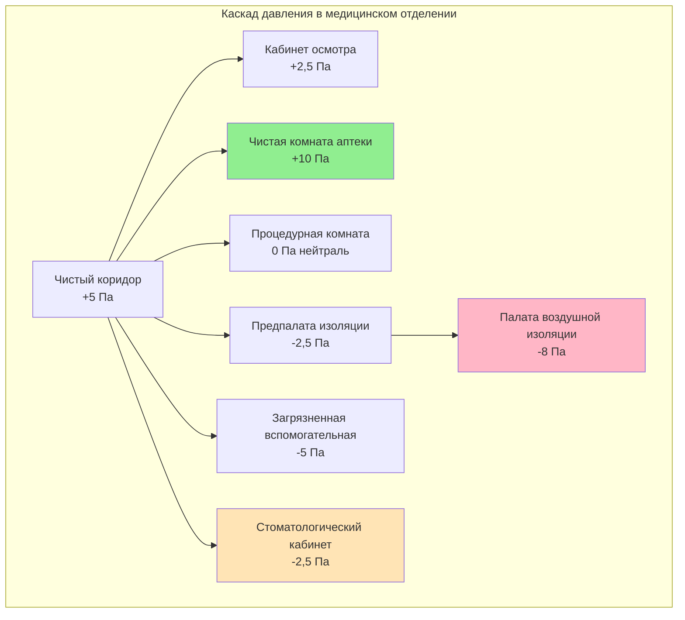
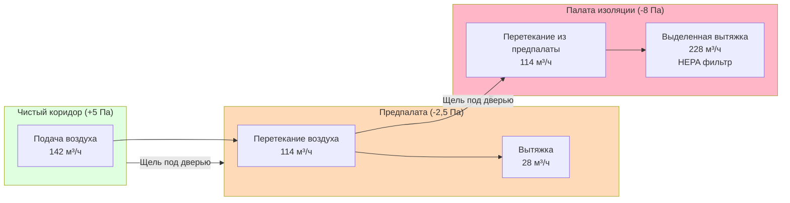
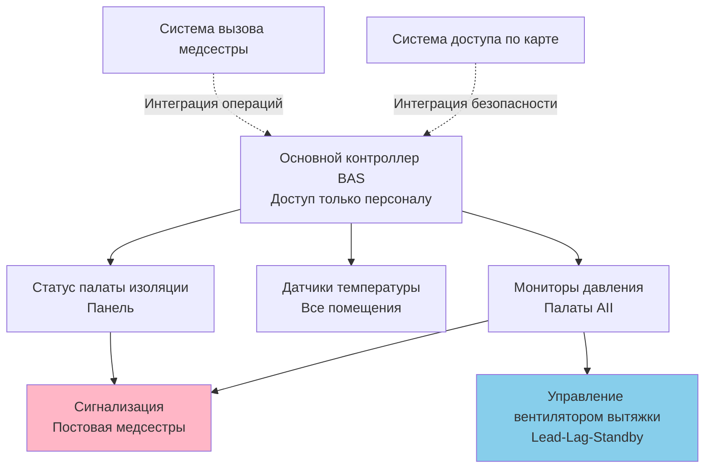

Медицинские учреждения исправительных заведений создают уникальные инженерные проблемы HVAC, которые сочетают требования профилактики инфекций в здравоохранении с ограничениями безопасности. Эти помещения должны соответствовать стандартам ASHRAE 170 и Facility Guidelines Institute (FGI) при соблюдении протоколов охраны, ограниченного доступа для обслуживания и повышенных требований к долговечности.

## Соотношения давлений и каскадное проектирование

Медицинские помещения в исправительных учреждениях требуют точной иерархии давлений для предотвращения перекрестного загрязнения при сохранении целостности коридоров безопасности. Каскад давлений следует принципам профилактики инфекций, адаптированным для окружения задержания.

**Расчет дифференциального давления:**

$$\Delta P = \frac{\rho v^2}{2} + \rho g h + \Delta P_{friction}$$

Где:
- $\Delta P$ = общий дифференциал давления (Па)
- $\rho$ = плотность воздуха (кг/м³)
- $v$ = скорость воздуха на проемах (м/с)
- $g$ = ускорение свободного падения (9,81 м/с²)
- $h$ = вертикальное расстояние (м)
- $\Delta P_{friction}$ = потеря давления через ограничения на пути

**Минимальный дифференциал давления для изоляции:**

$$\Delta P_{min} = 2,5 \text{ Па} + (n \times 0,5 \text{ Па})$$

Где $n$ = количество открытий дверей в час выше базового значения.

## Требования к вентиляции по типам помещений

| Тип помещения | Воздухообмены/час | Давление | Фильтрация | Температура | Влажность | Наружный воздух |
|-----------|------------------|----------|------------|-------------|----------|-------------|
| Кабинет осмотра | 6 ACH минимум | +2,5 Па | MERV 14 | 21-24°C | 30-60% | 2 ACH |
| Палата воздушной изоляции (AII) | 12 ACH | -8 Па мин | MERV 14 + HEPA вытяжка | 21-24°C | 30-60% | 2 ACH |
| Защитная среда (PE) | 12 ACH | +8 Па | HEPA подача | 21-24°C | 40-60% | 2 ACH |
| Стоматологический кабинет | 12 ACH | -2,5 Па | MERV 14 | 21-24°C | 30-60% | 3 ACH |
| Аптека (USP 797) | 30 ACH | +10 Па | HEPA подача | 20-22°C | 30-60% | 4 ACH |
| Лекарственное хранилище | 6 ACH | +2,5 Па | MERV 14 | 20-24°C | 30-60% | 2 ACH |
| Загрязненная вспомогательная | 10 ACH | -5 Па | MERV 14 | 20-24°C | Макс 70% | 2 ACH |
| Психиатрическое отделение | 6 ACH | Нейтраль | MERV 13 | 21-24°C | 30-60% | 2 ACH |

## Проектирование палаты изоляции

Палаты воздушной инфекционной изоляции (AII) в исправительных учреждениях требуют отказоустойчивого управления давлением с компонентами безопасности охраны.

**Балансировка воздуха для отрицательного давления:**

$$Q_{exhaust} = Q_{supply} + Q_{infiltration} + Q_{offset}$$

Типичный компенсирующий поток: 42-56 м³/ч для поддержания -8 Па дифференциала.

**Диаграмма движения воздуха в палате изоляции:**

## Требования к вытяжке стоматологической клиники

Стоматологические кабинеты генерируют аэрозоли, требующие высокой частоты воздухообмена и выделенной вытяжки у источника.

**Расчет скорости захвата:**

$$V_{capture} = \frac{Q}{A} = \frac{Q}{\pi (X + 0,2D)^2}$$

Где:
- $V_{capture}$ = скорость захвата (м/с)
- $Q$ = расход вытяжки (м³/с)
- $X$ = расстояние от лицевой панели вытяжки до источника (м)
- $D$ = диаметр вытяжки (м)

**Требования:**
- Минимум 12 ACH с минимум 3 ACH наружного воздуха
- Системы высокообъемной эвакуации (HVE): 28+ м³/ч на кресло
- Помещение поддерживается при -2,5 Па относительно коридора
- Вытяжка выбрасывается на 3 м выше крыши или на 7,6 м от воздухозаборов
- Защитные от безопасности решетки, препятствующие удавлению или вставлению инструментов

## Управление средой в фармацевтическом отделении

Фармацевтические помещения исправительных учреждений следуют стандартам USP 797/800 с расширениями безопасности для хранения контролируемых веществ.

**Требования буферной комнаты ISO класса 7:**
- 30 ACH минимум, подача с HEPA фильтром
- +10 Па относительно коридора
- Температура: 20-22°C (более жесткие допуски, чем общие медицинские)
- Относительная влажность: 30-60%
- Подсчет частиц: ≤352 000 частиц ≥0,5 мкм на м³

**Приготовление опасных лекарств (USP 800):**
- Внешне вентилируемые боксы биологической безопасности (BSC)
- Помещение с отрицательным давлением (-5 Па) с предбуферной палатой
- 12 ACH минимум с HEPA фильтрацией вытяжки
- Без рециркуляции выхлопного воздуха

## Аспекты безопасности и долговечности

Компоненты HVAC в медицинских учреждениях исправительных заведений требуют модификаций, выходящих за рамки стандартов здравоохранения.

**Элементы конструкции:**
- Защитные от взлома диффузоры и решетки (защитного класса, устойчивые к удавлению)
- Скрытое или потолочное оборудование (без выступающих органов управления)
- Герметизированные пересечения воздуховодов (предотвращение передачи контрабанды)
- Системы мониторинга давления с дистанционными сигналами тревоги
- Резервные вентиляторы вытяжки для палат изоляции (конфигурация N+1)
- Оборудование на виброизолирующих опорах (предотвращение передачи звука между камерами)
- Нержавеющая сталь или толстостенные материалы, устойчивые к повреждениям

**Архитектура системы управления:**

## Профилактика инфекций и стратегия фильтрации

Население исправительных учреждений имеет более высокие показатели туберкулеза, гепатита и других инфекционных заболеваний, требующих расширенного управления окружающей среой.

**Иерархия фильтрации:**
1. **Предварительный фильтр**: MERV 8 (30-35% эффективность по ASHRAE 52.2)
2. **Финальный фильтр**: MERV 14 (85-90% эффективность, минимум для медицинских)
3. **Концевой HEPA**: 99,97% @ 0,3 мкм для помещений PE и аптеки
4. **Выхлопной HEPA**: Требуется для палат AII, стоматологии и опасных лекарственных зон

**Эффективность воздухообмена:**

$$\varepsilon = \frac{\tau_n}{\tau} = \frac{t_{63\%}}{3 \times ACH^{-1}}$$

Где $\varepsilon$ = коэффициент эффективности вентиляции (целевой показатель ≥ 0,95 для палат изоляции).

## Пуск в работу и валидация

Руководящие принципы FGI требуют испытаний характеристик перед вводом в эксплуатацию и ежегодно после этого.

**Критические испытания:**
- Верификация дифференциала давления (все медицинские помещения)
- Измерение объема воздушного потока (TSI или эквивалент)
- Проверка целостности HEPA фильтра (DOP или PAO аэрозольное сканирование)
- Тест направления открывания дверей (палаты изоляции)
- Верификация функции сигнализации (потеря давления, статус фильтра)
- Испытание времени восстановления (время восстановления давления после открывания двери)
- Выборочные проверки температуры и влажности (все зоны)
- Верификация уровня звука (спальные помещения <45 дBA)

Системы HVAC медицинских учреждений исправительных заведений требуют тщательного проектирования, объединяющего стандарты здравоохранения с ограничениями учреждения задержания. Успешные конструкции приоритизируют профилактику инфекций, ремонтопригодность с ограниченным доступом и долговечность компонентов при соблюдении критериев эффективности ASHRAE 170 и FGI Guidelines.
