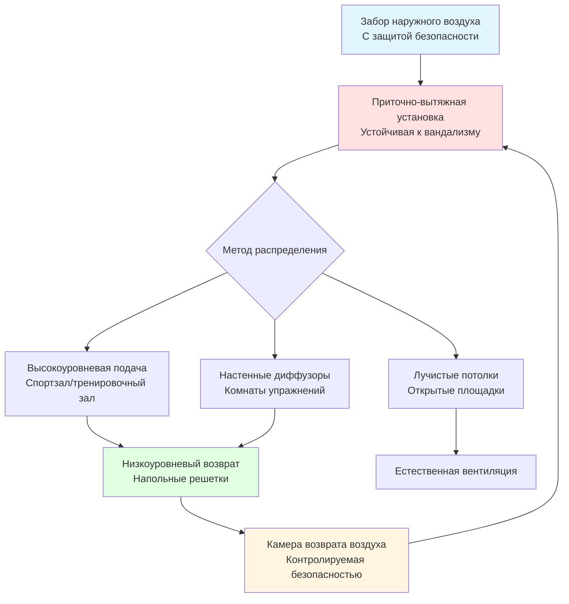
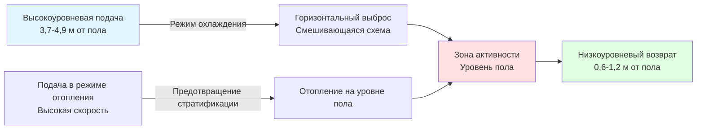

## Обзор

Зоны отдыха в пенитенциарных учреждениях представляют уникальные проблемы HVAC, которые объединяют высокие метаболические нагрузки, требования безопасности, оборудование, устойчивое к вандализму, и переходы между внутренней и внешней средой. Надлежащее проектирование обеспечивает безопасность людей, поддерживает приемлемое качество воздуха при пиковой активности и легко интегрируется с системами безопасности учреждения.

## Расчеты метаболической нагрузки

Зоны отдыха генерируют значительно более высокие тепловые и влажностные нагрузки по сравнению с типичными пенитенциарными зонами из-за повышенного уровня физической активности.

### Таблица нагрузки на основе активности

| Тип активности | Метаболическая скорость (Вт/чел) | Явное тепло (Вт) | Скрытое тепло (Вт) | Общая нагрузка (Вт) |
|---------------|---------------------------|-------------------|-----------------|----------------|
| Легкая активность (ходьба) | 200-250 | 80-100 | 120-150 | 200-250 |
| Умеренная активность (баскетбол) | 350-450 | 100-130 | 250-320 | 350-450 |
| Интенсивная активность (тяжелая атлетика) | 400-500 | 110-140 | 290-360 | 400-500 |
| Очень интенсивная активность (круговая тренировка) | 500-650 | 130-170 | 370-480 | 500-650 |

### Формула общей холодопроизводительности

Общая холодопроизводительность для зоны отдыха объединяет явную и скрытую составляющие:

$$Q_{total} = Q_{sensible} + Q_{latent}$$

Где:

$$Q_{sensible} = (n \times q_s) + (UA \times \Delta T) + Q_{equipment} + Q_{lights}$$

$$Q_{latent} = n \times q_l \times h_{fg}$$

Переменные:
- $n$ = количество людей
- $q_s$ = явное тепло на человека (Вт)
- $q_l$ = скрытое тепло на человека (Вт)
- $h_{fg}$ = латентная теплота парообразования (2257 кДж/кг)
- $UA$ = проводимость ограждающих конструкций (Вт/К)
- $\Delta T$ = разность температур внутри и снаружи (К)

## Требования к вентиляции

Стандарт ASHRAE 62.1 определяет минимальные требования к наружному воздуху, однако зоны отдыха пенитенциарных учреждений обычно требуют повышенной вентиляции.

### Расчет наружного воздуха

$$\dot{V}_{oa} = n \times V_{person} + A \times V_{area}$$

Для спортивных залов и тренировочных комнат:

$$\dot{V}_{oa} = n \times 9,5 \text{ м³/ч·чел} + A \times 0,6 \text{ м³/(ч·м²)}$$

В периоды высокой активности увеличьте вентиляцию на 50-100%:

$$\dot{V}_{peak} = \dot{V}_{oa} \times (1,5 \text{ до } 2,0)$$

### Требования по кратности воздухообмена

| Тип помещения | Минимум ACH | Рекомендуемо ACH | ACH при пиковой активности |
|------------|-------------|-----------------|-------------------|
| Крытый спортзал | 6-8 | 8-12 | 12-15 |
| Тренировочный зал | 8-10 | 10-15 | 15-20 |
| Комната упражнений | 8-10 | 10-15 | 15-20 |
| Многоцелевое помещение | 6-8 | 8-10 | 10-12 |
| Открытая защищенная площадка | 4-6 | 6-8 | N/A |

## Рассмотрения при проектировании системы

### Управление температурой и влажностью

Зоны отдыха требуют более низких уставок по сравнению со стандартными занятыми помещениями из-за повышенной метаболической активности:

- **Уставка температуры**: 18-21°C во время периодов активности
- **Относительная влажность**: максимум 40-55% для предотвращения скопления влаги
- **Открытая площадка**: условия окружающей среды с локализованными зонами охлаждения/отопления

### Стратегия распределения воздуха

### Требования к интеграции безопасности

Все оборудование HVAC в зонах отдыха должно соответствовать стандартам безопасности пенитенциарных учреждений:

1. **Защищенная от вмешательства конструкция**: Все доступные компоненты используют крепежи безопасности (нестандартные головки, заглубленная установка)
2. **Скрытые воздуховоды**: Минимум 4,9 м над отделочным полом или внутри защищенных плениумов потолка
3. **Защита решеток**: Решетки возврата и выпуска с рейтингом ударостойкости, закреплены защитой от вмешательства
4. **Доступ к оборудованию**: Доступ для обслуживания только из защищенных коридоров, никогда из занятых зон отдыха
5. **Интеграция камер**: Комнаты оборудования HVAC контролируются системами безопасности учреждения

## Проектирование HVAC крытого спортзала

### Схема потока воздуха

### Пример расчета нагрузки

Для спортзала площадью 223 м² с 30 человеками во время баскетбола:

$$Q_{occupants} = 30 \times 400 \text{ Вт} = 12000 \text{ Вт} = 12,0 \text{ кВт}$$

$$Q_{lights} = 223 \text{ м}^2 \times 16,1 \text{ Вт/м}^2 = 3590 \text{ Вт} = 3,6 \text{ кВт}$$

$$Q_{envelope} = UA \times \Delta T = (223 \times 2,84) \times (35-21) = 8840 \text{ Вт} = 8,8 \text{ кВт}$$

$$Q_{total} \approx 24,4 \text{ кВт} \text{ (минимум 7,0 кВт охлаждения)}$$

## Проектирование тренировочного зала и зоны упражнений

Тренировочные залы генерируют сосредоточенные тепловые нагрузки с минимальными требованиями к движению воздуха для предотвращения дискомфорта.

### Параметры проектирования

- **Температура приточного воздуха**: 13-16°C для компенсации высоких явных нагрузок
- **Скорость воздуха в зоне пребывания**: <0,25 м/с для минимизации ощущения сквозняка
- **Отдельный наружный воздух**: минимум 11,8-14,2 м³/(ч·чел)
- **Емкость осушения**: Проектирование для коэффициента явного тепла 60%

### Рассмотрения оборудования

Свободные веса и оборудование сопротивления требуют:
- Напольные возвраты, расположенные в стороне от зон поднятия
- Диффузоры подачи с регулируемыми контроллерами потока
- Эпоксидные стальные воздуховоды, устойчивые к коррозии влагой

## Климатический контроль открытой зоны отдыха

Открытые площадки получают преимущества от локализованного кондиционирования вместо полного кондиционирования HVAC:

### Стратегии защищенных зон

1. **Лучистые отопительные панели**: Потолочные инфракрасные обогреватели для зимнего использования (14,1-17,6 кВт на 92,9 м²)
2. **Испарительное охлаждение**: Летнее охлаждение в сухом климате (избегать во влажных регионах)
3. **Вентиляторы высокой скорости**: Потолочные вентиляторы большого диаметра (2,4-3,7 м) для циркуляции воздуха
4. **Периметровое отопление**: Системы лучистого отопления на уровне пола в умеренных зонах

### Психрометрические соображения

Проектирование открытой площадки нацелено на снижение эффективной температуры, а не на конкретные уставки:

$$ET^* = T_{db} - \frac{(1-RH) \times (T_{db}-T_{wb})}{3}$$

Где $ET^*$ - эффективная температура, $T_{db}$ - температура сухого термометра, $T_{wb}$ - температура влажного термометра, $RH$ - относительная влажность.

## Энергоэффективность и управление

### Управление вентиляцией с переменным спросом

Реализуйте управление вентиляцией с переменным спросом на основе CO₂ с возможностью отмены:

$$\dot{V}_{DCV} = \dot{V}_{min} + \left(\frac{CO_2_{space} - CO_2_{outdoor}}{CO_2_{design} - CO_2_{outdoor}}\right) \times (\dot{V}_{max} - \dot{V}_{min})$$

Целевое значение: $CO_2_{design} = 1000$ ppm при пиковой активности

### Интеграция расписания

Системы HVAC зон отдыха должны взаимодействовать с программным обеспечением расписания учреждения:
- Циклы очистки до занятости (за 2 часа до запланированной активности)
- Снижение при отсутствии людей (ночи, изоляция)
- Способность отмены для операций безопасности
- Ручное аварийное отключение, доступное из диспетчерской

## Техническое обслуживание и рабочие соображения

Системы HVAC зон отдыха требуют повышенных протоколов технического обслуживания:

1. **Замена фильтра**: Каждые 1-2 месяца из-за высокой нагрузки частицами
2. **Проверка катушек**: Ежеквартальные проверки на биологический рост в условиях высокой влажности
3. **Техническое обслуживание увлажнителя**: Еженедельная очистка в сезон отопления
4. **Проверка воздуховодов**: Ежегодный визуальный осмотр на предмет несанкционированных изменений
5. **Проверка оборудования безопасности**: Ежемесячные проверки крепежа, устойчивого к вмешательству

## Ссылки

- Стандарт ASHRAE 62.1: Вентиляция для приемлемого качества внутреннего воздуха
- Стандарт ASHRAE 55: Тепловые условия окружающей среды для человека
- Справочник ASHRAE - Применение HVAC, Глава 9: Учреждения юстиции
- National Institute of Corrections: Correctional Facility Design and Detailing (2020)

---

**Файл**: `/Users/evgenygantman/Documents/github/gantmane/hvac/content/specialty-applications-testing/specialty-hvac-applications/justice-facilities/correctional-facilities/recreation-areas/_index.md`
