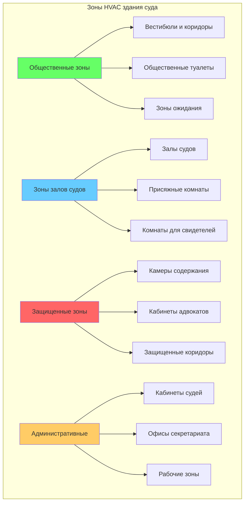

# Системы HVAC в зданиях судов

Системы HVAC в зданиях судов требуют специализированных подходов к проектированию, которые сбалансируют общественно доступные зоны с защищенными площадками, обеспечивают исключительную акустическую производительность в залах судов и поддерживают строгое экологическое разделение между камерами содержания задержанных и общественными пространствами. Проектирование должно учитывать различные модели занятости, требования интеграции системы безопасности и уникальные акустические требования судебного разбирательства.

## Стратегия разделения зон

Объекты судебной системы требуют четких зон HVAC на основе уровней безопасности, моделей занятости и функциональных требований. Основной принцип — полное разделение воздуха между защищенными и незащищенными областями для предотвращения перекрестного загрязнения и соблюдения протоколов безопасности.

### Требования к разделению зон на основе безопасности

**Камеры содержания задержанных:**
- 100% наружный воздух без рециркуляции
- Минимум 10 воздухообменов в час согласно стандарту ASHRAE 62.1
- Отрицательное давление относительно смежных коридоров (-6,4...−12,7 Па)
- Отдельные системы выхлопа без соединения с общественными зонами
- Защищенные от несанкционированного доступа решетки и элементы управления

**Залы судов:**
- Независимые кондиционеры для акустической изоляции
- Положительное давление относительно камер содержания (+5,1 Па)
- Системы с переменным объемом воздуха для гибкости нагрузки
- Минимум 7,08 л/с на человека наружного воздуха для вентиляции

**Общественные зоны:**
- Нейтральный баланс давления
- Стандартные коммерческие расчетные скорости вентиляции
- Разрешена рециркуляция с надлежащей фильтрацией

## Критерии проектирования HVAC залов судов

Залы судов представляют уникальные вызовы, требующие одновременного достижения низкого фонового шума, равномерного распределения температуры и высоких скоростей вентиляции в периоды использования.

### Параметры проектирования типов помещений

| Тип помещения | Проектная температура (°C) | Занятость (м²/человека) | Скорость наружного воздуха (л/с на чел.) | Уровень NC | Воздухообмены в час |
|---------------|----------------------------|--------------------------|------------------------------------------|------------|-------------------|
| Зал суда | 22-23,3 | 1,4-1,9 | 7,08 | NC 25-30 | 4-6 |
| Комната присяжных | 22-23,3 | 2,3 | 7,08 | NC 30-35 | 4-6 |
| Камера содержания | 21,1-23,9 | 4,6-7,4 | 9,43 | NC 35-40 | 10-12 |
| Кабинет судьи | 22-23,3 | 14-18,6 | 7,08 | NC 30-35 | 4-6 |
| Общественный вестибюль | 22-24,4 | 0,9-1,4 | 3,54 | NC 35-40 | 4-6 |
| Кабинет конференции адвокатов | 22-23,3 | 1,9-2,8 | 7,08 | NC 30-35 | 4-6 |

### Расчет вентиляции залов судов

Общий подаваемый воздух в зал суда должен удовлетворять как тепловую нагрузку, так и требования вентиляции, при этом большее значение определяет размер системы.

**Требуемый воздухообмен:**

$$Q_{vent} = N \times V_{OA}$$

где:
- $Q_{vent}$ = общий расход вентиляционного воздуха (м³/ч)
- $N$ = количество людей
- $V_{OA}$ = наружный воздух на человека (м³/ч на человека)

**Требуемый воздухообмен для тепловой нагрузки:**

$$Q_{thermal} = \frac{q_{sensible}}{1,2 \times \Delta T}$$

где:
- $Q_{thermal}$ = расход воздуха для ощутимого охлаждения (м³/ч)
- $q_{sensible}$ = ощутимый прирост тепла (кДж/ч)
- $\Delta T$ = разница температуры подаваемого воздуха (°C)
- 1,2 = константа для стандартного воздуха

**Расход при проектировании:**

$$Q_{design} = \max(Q_{vent}, Q_{thermal})$$

Для зала суда площадью 232 м² со 125 человеками:

$$Q_{vent} = 125 \times 2,0 = 250 \text{ м³/ч}$$

Если ощутимая нагрузка составляет 26,4 кВт с разницей температуры 10°C:

$$Q_{thermal} = \frac{26,4}{1,2 \times 10} = 2,2 \text{ м³/с} = 7,9 \text{ тыс. м³/ч}$$

Следовательно, $Q_{design} = 7,9$ тыс. м³/ч (тепловая нагрузка определяет).

## Требования к акустической производительности

Залы судов требуют исключительно низкого фонового шума для обеспечения разборчивости речи и точной записи судебного разбирательства. Системы HVAC обычно являются доминирующим источником шума.

### Стратегии акустического проектирования

**Ограничения скорости подаваемого воздуха:**
- Основные воздуховоды: максимум 6,1 м/с
- Ответвления: максимум 5,1 м/с
- Терминальные устройства: максимум 3,0 м/с
- Скорость в горловине диффузора: максимум 2,5 м/с

**Выбор оборудования:**
- Отдельные кондиционеры с изолированными кожухами толщиной 51 мм
- Скорости вращения вентилятора ограничены максимум 1200 об/мин
- Звукопоглощающие ловушки в подающих и возвратных воздуховодах
- Гибкие соединения воздуховодов у всего оборудования
- Виброизоляция всего вращающегося оборудования

**Затухание в воздуховодах:**

Требуемое звуковое затухание можно оценить, используя:

$$L_{required} = L_{source} - NC_{target} - L_{natural}$$

где:
- $L_{required}$ = требуемые потери при вставке (дБ)
- $L_{source}$ = уровень звуковой мощности источника (дБ)
- $NC_{target}$ = целевой критерий шума (обычно NC 25-30)
- $L_{natural}$ = естественное затухание в воздуховоде (дБ)

## Интеграция систем безопасности

Системы HVAC должны интегрироваться с протоколами безопасности здания для предотвращения несанкционированного доступа и поддержания контролируемых сред.

### Интерфейсы систем безопасности

**Интеграция системы контроля доступа:**
- Детекторы дыма в воздуховодах с автоматическим закрытием заслонок
- Уплотнения проходов, соответствующие требованиям разделения защищенных зон
- Запираемые люки доступа в защищенных зонах
- Концевые выключатели на решетках в камерах содержания

**Контроль перепада давления:**

Перепад давления между зонами:

$$\Delta P = \frac{Q_{leak}}{C_{flow} \times A_{leak}}$$

где:
- $\Delta P$ = перепад давления (Па)
- $Q_{leak}$ = расход утечки (м³/ч)
- $C_{flow}$ = коэффициент потока
- $A_{leak}$ = площадь эффективной утечки (см²)

Поддерживайте отрицательное давление в камерах содержания относительно защищенных коридоров, выпуская на 10-15% больше воздуха, чем подается.

**Пожарная/дымовая защита:**
- Отдельные зоны дымовой защиты для общественных и защищенных зон
- Автоматическое отключение рециркуляции при включении пожарной сигнализации
- Системы нагнетания воздуха в лестничные клетки эвакуации
- Разделение, согласованное с противопожарными перегородками

## Выбор типа системы

**Рекомендуемые системы:**
- Системы с переменным объемом воздуха (VAV) с дополнительным нагревом для залов судов и кабинетов
- Системы выделенного наружного воздуха (DOAS) с локальными фанкойлами для периферийных зон
- 100% наружный воздух постоянного объема для камер содержания
- Рекуперация энергии вентиляции, где коды это разрешают (не на выхлопе камер содержания)

**Стратегии управления:**
- Управление вентиляцией на основе занятости для различных графиков залов судов
- Управление вентиляцией по спросу в общественных пространствах для сборок
- Ночной отвод с последовательностью утреннего прогрева
- Интеграция с системами контроля доступа для активации зон

## Ссылки

- Стандарт ASHRAE 62.1: Вентиляция для приемлемого качества воздуха в помещениях
- Справочник приложений ASHRAE, глава 8: Учреждения судебной системы
- Стандарт ASHRAE 55: Условия теплового окружения для занятости людьми
- Стандарт AHRI 885: Процедура оценки уровней звука в занятых пространствах

---

*Проектируйте системы HVAC в зданиях судов с приоритетом безопасности при разделении зон, исключительной акустической производительностью и строгим экологическим разделением для эффективного поддержания судебного разбирательства.*
