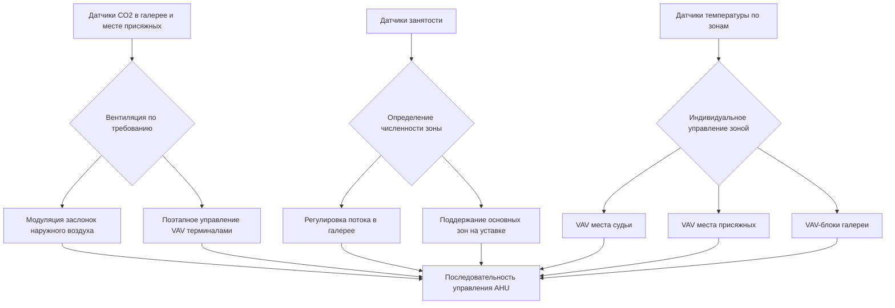
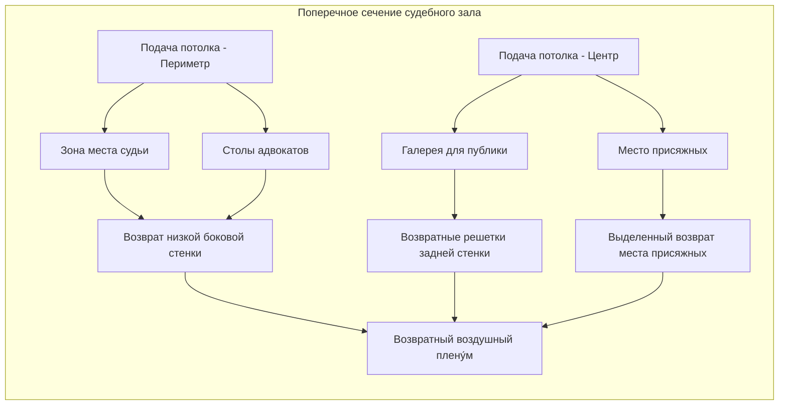
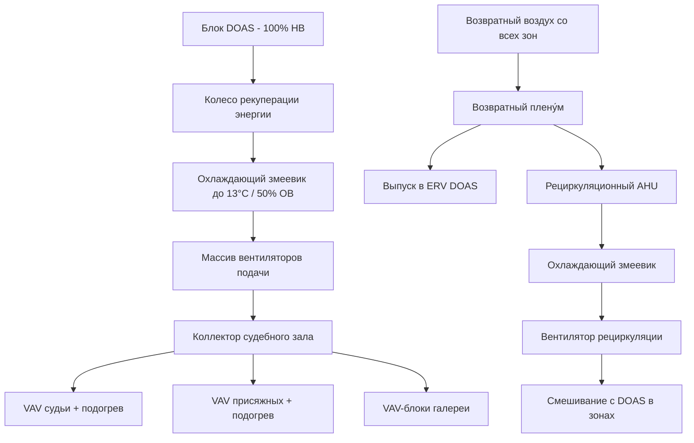

## Общие сведения

Системы HVAC в судебных залах представляют уникальные проблемы, требующие одновременного достижения строгих акустических характеристик (NC-25 до NC-30), кондиционирования при переменной занятости и зонально-специфичного контроля комфорта. Функциональное разделение областей судебного зала — место судьи, место присяжных, место свидетеля, столы адвокатов и галерея для публики — требует точного распределения воздушного потока и управления тепловой стратификацией при сохранении разборчивости речи.

## Параметры проектирования

### Характеристики занятости и нагрузок

| Зона | Проектная занятость | Явная теплота (Вт/чел) | Скрытая теплота (Вт/чел) | Наружный воздух (м³/ч на чел) |
|------|---------------------|------------------------|--------------------------|-------------------------------|
| Место судьи | 1-3 | 75 | 55 | 7,5 |
| Место присяжных | 12-14 | 75 | 55 | 7,5 |
| Место свидетеля | 1 | 85 | 65 | 7,5 |
| Столы адвокатов | 4-8 | 75 | 55 | 7,5 |
| Галерея для публики | 30-60 | 75 | 55 | 7,5 |
| Всего судебный зал | 48-86 | - | - | - |

### Критерии окружающей среды

| Параметр | Требование | Примечания |
|----------|-----------|-----------|
| Температура (при занятости) | 22°C ± 1,1°C | По ASHRAE 55 |
| Относительная влажность | 40-55% | Диапазон разборчивости речи |
| Критерии шума | NC-25 до NC-30 | Критично для записи |
| Воздухообмены | 6-8 ACH минимум | Переменный в зависимости от занятости |
| Наружный воздух | 7,5 м³/ч на чел | ASHRAE 62.1 минимум |
| Вертикальный градиент температуры | < 1,7°C на 1,8 м | Предотвращение стратификации |

## Требования акустической производительности

### Расчет критериев шума

Эффективный уровень шума от систем HVAC не должен превышать NC-25 до NC-30 для обеспечения разборчивости речи и качества записи:

$$NC = 10 \log_{10} \left( \sum_{i=1}^{8} 10^{L_i/10} \right) - C$$

Где:
- $L_i$ = уровень звукового давления в октавной полосе $i$ (дБ)
- $C$ = коэффициент коррекции для акустики помещения (обычно 5-10 дБ)

### Выбор концевых устройств

Максимальная скорость выхода воздуха из диффузоров для поддержания NC-25:

$$v_{max} = \sqrt{\frac{2 \Delta P}{\rho}} \leq 2 \text{ м/с}$$

Где:
- $\Delta P$ = перепад давления на диффузоре (Па)
- $\rho$ = плотность воздуха (1,2 кг/м³ при стандартных условиях)

Для соответствия NC-25 концевые устройства должны работать с:
- Линейные диффузоры: 1,5-2,0 м/с
- Перфорированные диффузоры: 1,0-1,5 м/с
- Вытеснительные выпускные отверстия: 0,25-0,5 м/с

## Управление нагрузкой при переменной занятости

Занятость в судебном зале варьируется от минимальной (судья, секретарь, охрана) до полной вместимости во время судебных разбирательств. Колебание нагрузки охлаждения требует динамического отклика:

$$Q_{total} = Q_{sensible} + Q_{latent} = \sum (n \cdot q_s) + \sum (n \cdot q_l)$$

Дифференциал нагрузки при пиковой занятости:

$$\Delta Q = (n_{peak} - n_{min}) \cdot (q_s + q_l)$$

Для типичного судебного зала с минимальной занятостью 48 и пиковой 86:

$$\Delta Q = (86 - 48) \times (75 + 55) = 4940 \text{ Вт} \approx 1,4 \text{ кВт}$$

### Стратегия управления

## Архитектура распределения воздушного потока

### Предотвращение стратификации

Судебные залы с высокими потолками (типично 4,3-6,1 м) требуют тщательного размещения подачи воздуха для предотвращения тепловой стратификации:

$$\Delta T_{vertical} = \frac{Q_{room} \cdot H}{k \cdot A \cdot ACH} \leq 1,7°C$$

Где:
- $Q_{room}$ = общий прирост тепла помещения (кДж/ч)
- $H$ = высота потолка (м)
- $k$ = коэффициент теплового перемешивания (0,7-0,9 для хорошо перемешанного)
- $A$ = площадь пола (м²)
- $ACH$ = воздухообмены в час

### Схема распределения подаваемого воздуха

### Требования по отдельным зонам

**Зона места судьи:**
- Выделенный VAV терминал с подогревом
- Подача воздуха из потолочных линейных диффузоров
- Целевой выброс: 2,4-3,7 м для предотвращения сквозняков
- Индивидуальное управление с переопределением: ±1,1°C от уставки

**Место присяжных:**
- Отдельная VAV зона для 12-14 человек
- Предпочтительна низкоскоростная вытеснительная вентиляция
- Возврат воздуха на высокую боковую стенку для удаления тепловой завесы
- Акустическая облицовка во всех воздуховодах

**Место свидетеля:**
- Часто кондиционируется общей подачей в судебный зал
- Избегать прямого воздействия воздуха на свидетеля
- Учитывать помехи микрофону от шума воздуха

**Галерея для публики:**
- Несколько VAV терминалов в зависимости от вместимости мест
- 7,5 м³/ч на человека наружного воздуха минимум
- Вентиляция по требованию на основе CO2
- Перфорированные потолочные диффузоры для равномерного распределения

## Конфигурация системы

### Интеграция системы выделенного наружного воздуха (DOAS)

Преимущества DOAS для судебных залов:
- Развязывает вентиляцию от контроля температуры в зоне
- Обеспечивает согласованную подачу наружного воздуха при всех нагрузках
- Снижает расход энергии на подогрев при частичной занятости
- Упрощает контроль влажности для записывающего оборудования

### Акустическая обработка воздуховодов

Все воздуховоды, обслуживающие судебные залы, требуют:

| Компонент | Обработка | Целевая производительность |
|-----------|-----------|---------------------------|
| Главные воздуховоды подачи | Внутренняя облицовка 25-50 мм | 10-15 дБ затухания |
| Разветвления терминалов | Облицовка полной длины | NC-25 на диффузоре |
| Воздуховоды возврата | Акустическая облицовка | Предотвращение перекрестных помех |
| Выпуск AHU | Глушитель (1,5-3 м) | 20-25 дБ потерь вставки |
| Секция вентилятора | Виброизоляция | < 2,5 мм прогиба |

Затухание звуковой мощности через облицованный воздуховод:

$$L_{out} = L_{in} - (P \cdot L / S)$$

Где:
- $L_{out}$ = уровень звуковой мощности, выходящей из воздуховода (дБ)
- $L_{in}$ = уровень звуковой мощности, входящей в воздуховод (дБ)
- $P$ = периметр воздуховода с облицовкой (м)
- $L$ = длина облицованной секции (м)
- $S$ = площадь поперечного сечения воздуховода (м²)

## Контроль влажности для записывающего оборудования

Современные судебные залы содержат обширные системы аудио/видеозаписи, требующие контроля влажности:

$$W_{室内} = W_{НВ} \cdot \frac{м³/ч_{НВ}}{м³/ч_{total}} + W_{generated}$$

Целевое отношение влажности: 0,0060-0,0075 кг влаги/кг сухого воздуха (40-55% ОВ при 22°C)

Осушение может требовать:
- Охлаждающий змеевик DOAS до точки росы 10-11°C
- Адсорбционное колесо для приложений с низкой точкой росы
- Подогрев для предотвращения переохлаждения при осушении

## Техническое обслуживание и эксплуатационные соображения

**Выбор фильтра:**
- Минимум MERV 13 по ASHRAE 62.1
- MERV 14-15 предпочтительны для качества воздуха и акустической производительности
- Фильтры с низким перепадом давления снижают шум вентилятора

**Требования балансировки:**
- Проверить уровни NC с помощью калиброванного звукомера
- Тестирование при минимальной и максимальной скорости потока воздуха
- Документировать фоновый шум с включенным и выключенным HVAC

**Аварийная вентиляция:**
- Поддерживать минимальную вентиляцию во время блокировки по соображениям безопасности
- Рассмотреть отдельное нагнетание воздуха в зону безопасности
- Обеспечить, чтобы системы безопасности жизни переопределяли органы управления комфортом

## Ссылки

- ASHRAE Standard 62.1-2022: Вентиляция для приемлемого качества внутреннего воздуха
- ASHRAE Standard 55-2020: Условия теплового комфорта для занятости человека
- ASHRAE Applications Handbook, Глава по учреждениям правосудия
- Руководство GSA по проектированию звука и вибрации (P100)
- ANSI S12.60: Критерии акустической производительности судебных залов
