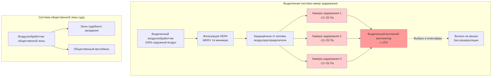

## Обзор

Камеры задержания в зданиях суда требуют специализированных систем HVAC, которые обеспечивают баланс между безопасностью, здоровьем занимающих помещение лиц и надёжностью эксплуатации. Эти временные помещения содержания требуют норм вентиляции, превышающих требования для стандартной загруженности, при одновременном включении защищённых от взлома компонентов и полного разделения от систем общественного здания.

## Требования к вентиляции

### Нормы воздухообмена

Стандарт ASHRAE 62.1 и стандарты Американской ассоциации исправительных учреждений (ACA) устанавливают минимальные требования к вентиляции камер задержания. Норма вентиляции должна учитывать высокую плотность размещения людей и ограниченные пути эвакуации.

**Требуемая норма вентиляции:**

$$Q = \max(n \cdot V, P \cdot R_p)$$

где:
- $Q$ = требуемый воздушный расход (CFM)
- $n$ = воздухообмены в час (ACH)
- $V$ = объём камеры (м³)
- $P$ = количество человек
- $R_p$ = норма вентиляции на одного человека (CFM/человек)

Для камер задержания в суде:

$$Q_{cell} = \max\left(12 \cdot \frac{V}{60}, P \cdot 20\right)$$

Стандартные параметры проектирования предусматривают 12–15 ACH или 20 CFM на одного человека, в зависимости от того, что больше.

### Таблица норм вентиляции

| Тип помещения | Минимум ACH | CFM/человек | Отношение давления |
|------------|-------------|------------|----------------------|
| Камера задержания одиночная | 12 | 20 | Отрицательное |
| Камера многоместная | 15 | 20 | Отрицательное |
| Коридор камер | 10 | 15 | Отрицательное |
| Кабинет для встреч адвоката с клиентом | 8 | 15 | Нейтральное |
| Шлюзовой выход транспортировки | 12 | N/A | Отрицательное |

## Принципы проектирования систем

### Разделение воздухораспределения

Системы HVAC камер задержания должны работать независимо от общественных зон здания суда для предотвращения:

1. **Миграции загрязняющих веществ** из помещений содержания в общественные зоны
2. **Нарушений безопасности** через совместные воздуховоды
3. **Перекрёстного загрязнения** между камерами

### Стратегия контроля давления

Поддерживайте отрицательное давление во всех зонах содержания относительно смежных помещений:

$$\Delta P = P_{adjacent} - P_{cell} = 12 \text{ до } 25 \text{ Па}$$

Этот перепад давления предотвращает миграцию запахов и обеспечивает направленный воздушный поток в помещения содержания.

### Методы контроля запахов

**Многоступенчатый подход:**

1. **Высокие нормы вентиляции** (12–15 ACH минимум)
2. **100% наружный воздух** (без рециркуляции)
3. **Поддержание отрицательного давления**
4. **Активированная угольная фильтрация** в выпускном потоке
5. **Прямой выброс** в атмосферу выше уровня крыши

Определение размера угольного фильтра:

$$M_{carbon} = \frac{Q \cdot C \cdot t}{1000 \cdot \eta}$$

где:
- $M_{carbon}$ = требуемая масса углерода (кг)
- $Q$ = выпускной воздушный расход (CFM)
- $C$ = концентрация загрязняющего вещества (ppm)
- $t$ = срок службы (часы)
- $\eta$ = эффективность удаления (доля)

## Требования безопасности

### Спецификации компонентов, защищённых от взлома

| Компонент | Функция безопасности | Спецификация материала |
|-----------|------------------|------------------------|
| Воздухораспределители подачи | Защитная решётка, заподлицо | Нержавеющая сталь 14-го калибра |
| Вытяжные решётки | Сварная рама, защищённые от взлома винты | Нержавеющая сталь 12-го калибра |
| Термостаты | Утопленные, поликарбонатное покрытие | Жилище, устойчивое к вандализму |
| Воздуховоды | Скрыты над защищённым потолком | Оцинкованная сталь 22-го калибра минимум |
| Люки доступа | С ключом, армированные | Сталь 16-го калибра с защищёнными замками |

### Маршрутизация воздуховодов

**Критические параметры проектирования:**

1. **Отсутствие совместных воздуховодов** между камерами задержания и общественными зонами
2. **Проходы воздуховодов** через барьеры безопасности требуют стальных гильз
3. **Минимальный калибр воздуховода** 22 для скрытых зон
4. **Доступ для осмотра** только из защищённых коридоров
5. **Расстояние между прутьями решётки** не более 10 см

## Контроль температуры

Поддерживайте температуру в диапазонах, установленных стандартами ACA:

**Зима:** 20–22°C
**Лето:** 22–26°C

Контроль температуры должен быть:
- **Недостижимым для регулировки** занимающими помещение лицами
- **Дистанционно контролируемым** персоналом учреждения
- **Сигнализированным** при выходе за пределы диапазона

Уравнение стратегии контроля:

$$T_{supply} = T_{setpoint} - \frac{Q_{sensible}}{1.08 \cdot CFM}$$

## Контроль системы

Внедрите непрерывный контроль:

1. **Воздушный расход подачи** в каждую камеру (сигнал тревоги ±10%)
2. **Статус вытяжного вентилятора** (сигнал тревоги отказа)
3. **Перепад давления** (сигнал тревоги потери отрицательного давления)
4. **Температура** в каждой камере (сигнал тревоги выхода за пределы диапазона)
5. **Перепад давления фильтра** (индикатор замены)

## Контрольный список проектирования

- [ ] Выделенный воздухообработчик для зоны камер задержания
- [ ] Подача 100% наружного воздуха (без рециркуляции)
- [ ] Минимальная норма вентиляции 12–15 ACH
- [ ] Отрицательное давление, поддерживаемое во всех камерах
- [ ] Решётки и компоненты, защищённые от взлома
- [ ] Отсутствие совместных воздуховодов с общественными зонами
- [ ] Выброс в атмосферу
- [ ] Установлен дистанционный контроль температуры
- [ ] Контроль давления с сигнализацией
- [ ] Расстояние между прутьями защитной решётки ≤ 10 см
- [ ] Все компоненты доступны только из защищённых зон

## Ссылки

- ASHRAE Standard 62.1: Вентиляция для приемлемого качества воздуха в помещении
- American Correctional Association (ACA): Стандарты, основанные на результатах для взрослых местных учреждений содержания
- International Mechanical Code (IMC): Требования для специальных категорий помещений
- ASHRAE Handbook - HVAC Applications: Глава по объектам системы правосудия
