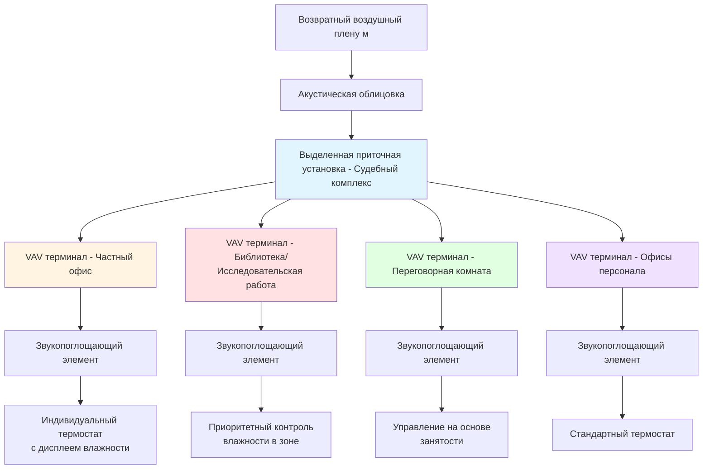
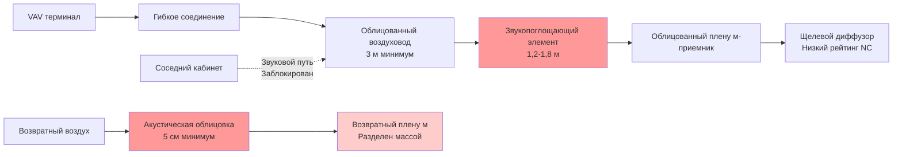

## Обзор

Кабинеты судей представляют критическую приватную зону в зданиях судов, требующую специализированных соображений при проектировании HVAC. Эти помещения требуют индивидуального контроля окружающей среды, акустической изоляции от залов судебных заседаний и общественных зон, разделения воздушных систем в целях безопасности и точного контроля влажности для хранения юридических документов и книг. Проектирование HVAC должно сбалансировать требования к комфорту судей в соответствии со стандартом ASHRAE 55 с требованиями безопасности эксплуатации и обеспечить надлежащее разделение от зон общественного доступа.

## Параметры проектирования

### Условия окружающей среды

| Параметр | Лето | Зима | Примечания |
|-----------|------|------|-----------|
| Температура сухого термометра | 23°C ± 1°C | 22°C ± 1°C | По ASHRAE 55 Категория II |
| Относительная влажность | 45-55% | 40-50% | Критично для сохранения документов |
| Воздухообмены в час | 6-8 ACH | 6-8 ACH | Выше, чем стандартный офис |
| Наружный воздух | 34 CFM (0,58 м³/ч)/человека | 34 CFM (0,58 м³/ч)/человека | По ASHRAE 62.1 для офисных помещений |
| Уровень звука (NC) | NC 30-35 | NC 30-35 | Требование акустической конфиденциальности |
| Соотношение давлений | Нейтральное или положительное | Нейтральное или положительное | Относительно коридоров |

### Зоны хранения книг и библиотеки

| Параметр | Требование | Допуск |
|-----------|------------|--------|
| Температура | 20-22°C | ± 0,5°C |
| Относительная влажность | 45-55% | ± 3% |
| Скорость изменения температуры | < 2,8°C/час | Максимум |
| Скорость изменения ОВ | < 5%/час | Максимум |
| Фильтрация | MERV 13 минимум | Выше для редких документов |

## Архитектура системы

### Стратегия разделения зон

Кабинеты судей требуют выделенных зон HVAC, физически и операционно разделенных от общественных зон. Это разделение обеспечивает:

1. **Изоляцию безопасности**, предотвращающую несанкционированный доступ через воздушные пути
2. **Индивидуальный контроль** для удовлетворения предпочтений судей
3. **Акустическую конфиденциальность** посредством надлежащего проектирования воздуховодов и звукопоглощения
4. **Работу в нерабочее время**, независимую от расписания залов судебных заседаний

## Индивидуальный контроль температуры

Каждый приватный офис судьи требует выделенного контроля температуры с расширенным диапазоном регулировки для учета индивидуальных тепловых предпочтений. Система управления реализует ограниченный диапазон уставок для предотвращения потерь энергии при обеспечении воспринимаемой автономии.

### Алгоритм управления уставкой

Эффективная охлаждающая нагрузка при индивидуальном управлении регулировкой:

$$Q_{cooling} = Q_{sensible} + Q_{latent} + Q_{offset}$$

где смещение нагрузки учитывает отклонение от базовой уставки:

$$Q_{offset} = \dot{m} \cdot c_p \cdot (T_{setpoint} - T_{baseline})$$

Для типичного кабинета судьи (18,6 м²) с расходом воздуха 57 CFM (1,6 м³/ч):

$$Q_{offset} = (57 \text{ CFM} \cdot 1.699 \text{ м³/ч}/\text{CFM} \cdot 1.2 \text{ кг/м³}) \cdot 1005 \text{ Дж/(кг·°C)} \cdot \Delta T$$

$$Q_{offset} = 1,15 \text{ кВт/°C} \cdot \Delta T$$

Диапазон уставки 1,5°C представляет приблизительно 1,72 кДж/ч дополнительного требования к мощности на зону.

## Требования к акустической конфиденциальности

### Проектирование звукопоглощения

Звук, передаваемый через HVAC между кабинетами и соседними помещениями, должен соответствовать критериям NC 30-35. Требуемое снижение уровня звукового давления через системы воздуховодов:

$$IL = 10 \log_{10}\left(\frac{W_{in}}{W_{out}}\right)$$

где звукоизоляция (IL) должна обеспечить минимум 20 дБ ослабления на частотах речи (500-2000 Гц). Установленные в воздуховоде звукопоглощающие элементы обеспечивают:

- **Реактивное ослабление**: 15-25 дБ в диапазоне 500-1000 Гц
- **Абсорбционное ослабление**: 10-20 дБ в диапазоне 1000-4000 Гц
- **Требуемая длина**: Минимум 1,2 м звукопоглощающего элемента для судебных приложений

### Проектирование воздуховодов для акустической изоляции

## Разделение по безопасности

### Изоляция воздушной системы

Кабинеты судей располагаются в защищенной зоне, требующей физического разделения систем распределения воздуха от общественных зон. Это предотвращает:

1. **Несанкционированный доступ** через воздуховоды
2. **Передачу звука** из общественных помещений
3. **События загрязнения**, влияющие на судебные операции
4. **Нарушение безопасности** через компрометацию воздушной системы

Требования к разделению:

- **Выделенное воздухообрабатывающее оборудование**, обслуживающее только защищенные зоны
- **Отдельные стояки воздуховодов** без перекрытия с общественными системами
- **Панели доступа к воздуховодам, соответствующие требованиям безопасности** в зонах кабинетов
- **Положительное давление** относительно соседних коридоров (5-7,5 Па)

Давление поддерживает направленный поток воздуха:

$$\Delta P = \frac{\rho \cdot v^2}{2} \cdot C$$

Для обеспечения безопасности минимум 7,1 CFM (0,12 м³/ч) дифференциального расхода воздуха на дверной проем поддерживает положительное давление при подрезах дверей.

## Контроль влажности при хранении документов

### Требования сохранения

Судебные библиотеки и системы хранения документов в кабинетах требуют точного контроля влажности для предотвращения:

- Деградации бумаги при чрезмерной сухости (< 40% ОВ)
- Развития плесени при чрезмерной влажности (> 60% ОВ)
- Изменений размеров переплетенных томов
- Отказа клея в переплетах

### Реализация управления влажностью

Выделенный контроль влажности в зонах библиотеки использует:

$$\dot{m}_{steam} = \frac{Q_{latent}}{h_{fg}}$$

где латентная нагрузка включает:

$$Q_{latent} = \dot{V} \cdot \rho \cdot (W_{supply} - W_{room}) \cdot h_{fg}$$

Для судебной библиотеки площадью 37 м² с 6 ACH и целевым значением 50% ОВ при 21°C поддержание условий требует приблизительно 0,9-1,8 кг/ч паровой производительности при зимней эксплуатации.

## Рекомендации по конфигурации системы

### Выбор оборудования

**Приточные установки:**
- Выделенная установка, обслуживающая только судебный комплекс
- Приводы переменной скорости для тихой работы
- Фильтрация MERV 13 минимум
- Гидравлическое отопление и охлаждение (избегает хладагента в защищенных зонах)
- Скорость приточного вентилятора: 9-11 м/с максимум для низкого уровня звука

**Терминальные устройства:**
- Не зависящие от давления VAV коробки с доподогревом горячей водой
- Минимальный расход воздуха: 30% от пикового для поддержания вентиляции
- Прямые цифровые регуляторы с отдельными датчиками в помещении
- Датчики влажности в приватных офисах и библиотеках

**Диффузоры и решетки:**
- Щелевые диффузоры с рейтингом NC 25-30 при расчетном расходе
- Возвратные решетки: 2-2,5 м/с максимум скорости на фронтальную поверхность
- Архитектурное интегрирование для профессионального вида

### Последовательности управления

1. **Управление индивидуальным офисом:**
   - Отключение на основе занятости (незанято: 26°C охлаждение, 20°C отопление)
   - Регулировка пользовательской уставки: ±1,5°C от базовой
   - Мониторинг влажности с оповещениями при 40% и 60% ОВ
   - Возможность работы в нерабочее время через переключатель переопределения настенного выключателя

2. **Управление библиотекой/хранилищем:**
   - Непрерывная работа во время занятости здания
   - Приоритетное управление влажностью: жесткая мертвая зона (48-52% ОВ)
   - Уставка температуры: 21°C с допуском ±0,5°C
   - Тревожное сигнализирование при выходе влажности за пределы

## Заключение

Кабинеты судей представляют специализированную проблему проектирования HVAC, требующую интеграции индивидуального управления комфортом, акустической изоляции, разделения по безопасности и контроля окружающей среды музейного класса для сохранения. Успех требует выделенных воздухообрабатывающих систем, надежного звукопоглощения, точного контроля влажности для хранения документов и индивидуального управления зонами, которое балансирует предпочтения судей с управлением энергией. Надлежащая реализация обеспечивает производительность судей, сохранение документов, акустическую конфиденциальность и эксплуатационную безопасность на протяжении всего жизненного цикла здания.
