## Обзор

Общественные зоны суда представляют уникальные проблемы HVAC из-за экстремальной переменности занятости, тепловых нагрузок охранной проверки, атмосферного загрязнения от интенсивного потока людей и необходимости поддерживать достойные условия окружающей среды в различных сценариях операций. Эти пространства требуют отзывчивых систем вентиляции, способных справиться с утренними скачками, превышающими 200 человек в час, при одновременном поддержании приемлемого качества воздуха в помещении в периоды низкой загруженности.

## Критерии проектирования

### Классификация помещений и тепловые параметры

| Тип помещения | Расчётная температура | Относительная влажность | Минимальный наружный воздух | Кратность воздухообмена |
|------------|-------------------|-------------------|---------------------|---------------------|
| Главный вестибюль | 22°C ± 1°C | 40-60% | 0,06 CFM (0,102 м³/ч)/м² + 2,36 CFM (4,01 м³/ч)/человека | 4-6 ACH |
| Охранная проверка | 21°C ± 1°C | 35-55% | 3,54 CFM (6,01 м³/ч)/человека | 6-8 ACH |
| Общественные коридоры | 22°C ± 2°C | 40-60% | 0,06 CFM (0,102 м³/ч)/м² | 3-4 ACH |
| Зоны ожидания | 22°C ± 1°C | 40-60% | 2,36 CFM (4,01 м³/ч)/человека | 4-5 ACH |
| Общественные санузлы | 21°C ± 2°C | Максимум 60% | 100% вытяжка | 10-15 ACH |
| Общественная столовая | 22°C ± 1°C | 40-55% | 3,54 CFM (6,01 м³/ч)/человека | 8-12 ACH |

Ссылка: ASHRAE Standard 62.1-2022 для норм вентиляции; ASHRAE Standard 55-2020 для параметров теплового комфорта.

## Методология расчёта нагрузок

### Расчёт явного охлаждающего эффекта для помещений с переменной загруженностью

Общий чувствительный теплоприток для вестибюлей судов и общественных зон:

$$Q_{sensible} = Q_{lights} + Q_{equip} + Q_{people} + Q_{solar} + Q_{transmission}$$

Где нагрузка от людей доминирует в часы пик:

$$Q_{people} = N_{occ} \times q_{sensible} \times CLF$$

Для зон охранной проверки с рентгеновским оборудованием:

$$Q_{screening} = \sum_{i=1}^{n} P_{equip,i} \times F_{usage} \times F_{radiation} + N_{occ} \times 264 \text{ кДж/ч}$$

Где:
- $N_{occ}$ = пиковая занятость (человек)
- $q_{sensible}$ = чувствительное тепло на человека (264 кДж/ч сидя, 369 кДж/ч стоя/ходьба)
- $CLF$ = коэффициент охлаждающей нагрузки (0,85-0,95 для помещений с высокой проходимостью)
- $P_{equip,i}$ = подключённая электрическая мощность оборудования проверки (Вт)
- $F_{usage}$ = коэффициент использования (0,7-0,9 для охранного оборудования)
- $F_{radiation}$ = коэффициент излучения (0,6-0,8 для закрытой электроники)

### Расчёт расходов вентиляционного воздуха

В соответствии с ASHRAE 62.1, наружный воздушный поток в зоне дыхания:

$$V_{bz} = R_p \times P_z + R_a \times A_z$$

Для динамического управления занятостью:

$$V_{oa,dynamic} = V_{oa,min} + K_{resp} \times (CO_2 - CO_{2,baseline})$$

Где:
- $R_p$ = норма наружного воздуха на человека (CFM/человека, м³/ч/человека)
- $P_z$ = население зоны (человек)
- $R_a$ = норма наружного воздуха на единицу площади (CFM/м², м³/ч/м²)
- $A_z$ = площадь пола зоны (м²)
- $K_{resp}$ = коэффициент отклика для управления спросом на основе CO₂
- $CO_{2,baseline}$ = концентрация CO₂ на улице (обычно 400 ppm)

## Стратегия зонирования системы

```mermaid
graph TD
    A[Система HVAC общественных зон суда] --> B[Зона главного вестибюля]
    A --> C[Зона охранной проверки]
    A --> D[Зона общественного коридора]
    A --> E[Зона ожидания]
    A --> F[Зона вытяжки санузлов]
    A --> G[Зона столовой]

    B --> B1[VAV с управлением CO2]
    B --> B2[Обогрев вестибюля]
    B --> B3[Перемешивание воздуха при высоких потолках]

    C --> C1[Постоянный объём подачи]
    C --> C2[Удаление тепла оборудования]
    C --> C3[Комфорт в очереди]

    D --> D1[VAV с минимальным отступлением]
    D --> D2[Компенсация периметра]

    E --> E1[VAV с датчиком занятости]
    E --> E2[Индивидуальное управление зоной]

    F --> F1[Постоянная вытяжка]
    F --> F2[Поддержание отрицательного давления]

    G --> G1[Выделенная система наружного воздуха]
    G --> G2[Координация вытяжки кухни]
    G --> G3[Управление запахами]

    style C fill:#ffcccc
    style B fill:#cce5ff
    style F fill:#ffffcc
```

## Стратегии управления переменной загруженностью

### Управление спросом на основе содержания CO₂

Реализуйте управление спросом на основе CO₂ в вестибюлях и зонах ожидания для оптимизации энергопотребления в периоды низкой занятости, обеспечивая при этом адекватную вентиляцию в часы пик. Уставка CO₂: максимум 1000 ppm, с модуляцией наружного воздуха между минимальной нормативной вентиляцией и максимальным расчётным значением.

### Сброс на основе занятости

Настройте последовательности DDC для регулировки температуры приточного воздуха и расхода воздуха на основе данных реального времени по занятости из журналов безопасности или массивов инфракрасных датчиков:

- **Режим утреннего скачка** (07:00-09:00): Предварительный нагрев/охлаждение на 0,6°C ниже уставки, увеличение до 100% производительности воздушного потока
- **Пиковая операция** (09:00-16:00): Стандартное управление температурой, полная вентиляция воздухом
- **Вечернее снижение** (16:00-18:00): Постепенный сброс на 21°C при нагреве / 24°C при охлаждении
- **Ночной сброс** (18:00-07:00): Минимальная вентиляция, 16°C при нагреве / 29°C при охлаждении

### Требования зоны охранной проверки

Поддерживайте постоянный воздушный поток к контрольно-пропускным пунктам независимо от занятости для удаления тепла от постоянно работающих рентгеновских аппаратов и металлоискателей. Нагрузки оборудования обычно варьируются от 2-5 кВт на полосу контроля. Обеспечьте локальное охлаждение для предотвращения дискомфорта у операторов в закрытых будках контроля.

## Перепад давления и взаимосвязь воздушных потоков

Поддерживайте небольшое избыточное давление (+10-25 Па) в общественных вестибюлях относительно наружного воздуха для минимизации инфильтрации. Зоны охранной проверки должны работать при нейтральном или слегка положительном давлении относительно вестибюлей. Обеспечьте поддержание отрицательного давления в санузлах (-25-50 Па) относительно смежных общественных пространств со 100% вытяжкой и без рециркуляции.

## Акустические соображения

Общественные зоны требуют строгих акустических характеристик для поддержания достоинства:

- **Вестибюли и зоны ожидания**: NC 35-40
- **Охранная проверка**: NC 40-45
- **Коридоры**: NC 40
- **Санузлы**: NC 45

Задайте проектирование воздуховодов с низкой скоростью (максимум 7,6 м/с в занятых помещениях), акустическую облицовку воздуховодов в концевых секциях и звуковые ловушки у основных ответвлений. Расположите механические помещения вдали от общественных зон ожидания.

## Рекуперация энергии и устойчивое развитие

Высокие требования к наружному воздуху в общественных зонах делают рекуперацию энергии экономически благоприятной. Ротационные энтальпийные колёса или пластинчатые теплообменники могут восстанавливать 60-75% энергии выхлопа. Рассчитайте системы рекуперации для расчётного расхода наружного воздуха, а не пикового воздушного потока, чтобы оптимизировать первоначальную стоимость и эффективность.

## Специальные соображения

**Проектирование вестибюля**: Обеспечьте обогреваемые вестибюли у главных входов с минимальной скоростью воздуха 0,5 м/с из воздушных завес или положительно нагруженные вестибюли для минимизации зимней инфильтрации в периоды высокой проходимости.

**Помещения с высокими потолками**: Вестибюли с высотой потолков более 6 м требуют вентиляторов для перемешивания воздуха для предотвращения тепловой стратификации и поддержания комфорта человека на уровне пола.

**Операция в чрезвычайных ситуациях**: Проектируйте системы для поддержания минимальной вентиляции и управления температурой в чрезвычайных сценариях, когда общественные зоны могут служить пунктами сборки. Обеспечьте резервное электроснабжение от аварийного генератора для основных блоков обработки воздуха вестибюля.

**Фильтрация**: Минимум MERV 13 для всех систем общественных зон в соответствии с ASHRAE Standard 62.1. Рассмотрите MERV 14 или выше в зонах с высокой проходимостью для решения проблемы твёрдых частиц от пешеходного потока и уличного загрязнения.
