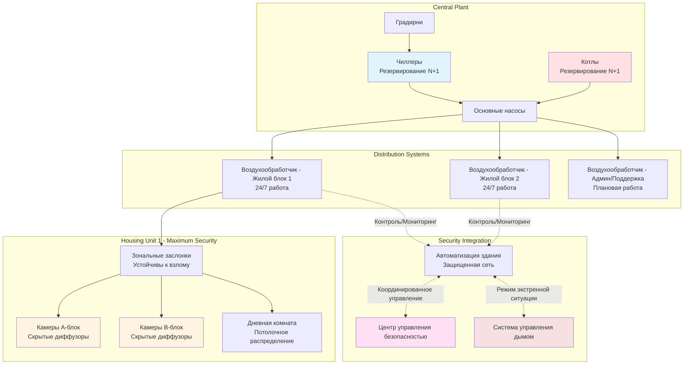
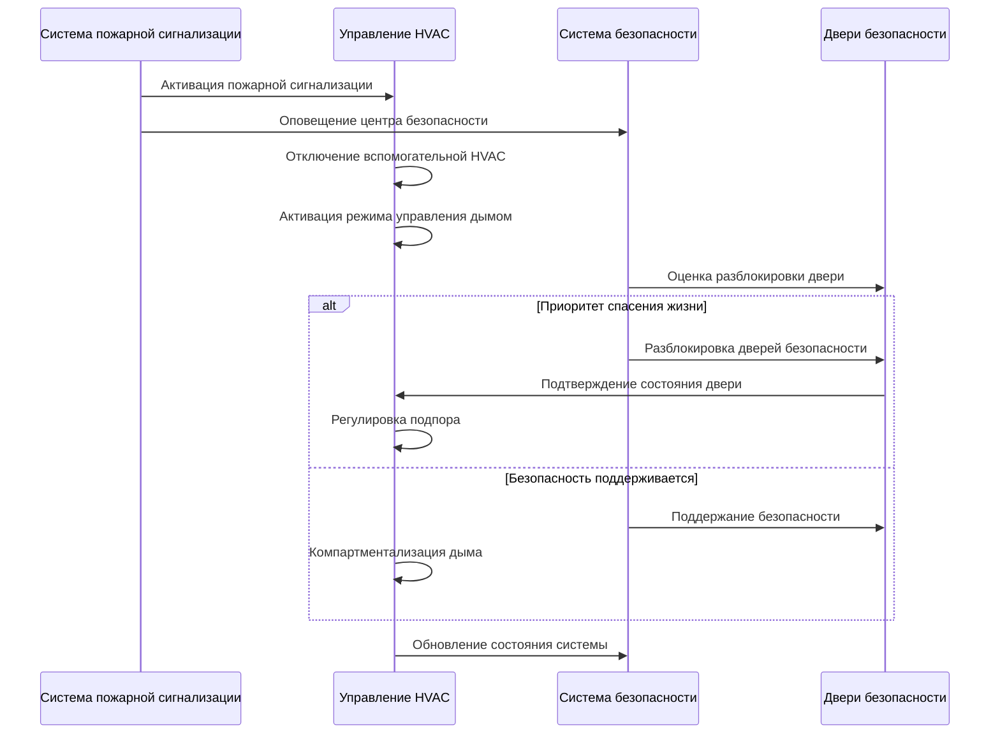

Системы HVAC в тюрьмах и тюремных камерах представляют уникальные вызовы, которые объединяют обычное климатическое управление с критическими требованиями безопасности. Эти системы должны обеспечивать соответствующую нормам вентиляцию и тепловой комфорт, при этом предотвращая несанкционированный доступ, исключая возможности скрывать контрабанду и поддерживая непрерывность работы в высокорисковых условиях.

## Уникальные требования HVAC для исправительных учреждений

Проектирование HVAC в исправительных учреждениях существенно отличается от коммерческих приложений из-за требований безопасности, эксплуатационных ограничений и нормативного контроля.

**Ограничения проектирования, связанные с безопасностью:**
- Все доступные компоненты должны быть устойчивы к несанкционированному доступу или недоступны для заключенных
- Воздуховоды и решетки спроектированы для предотвращения прохождения или скрытия контрабанды
- Расположение оборудования не должно создавать возможности для лазанья или создания скрытых пространств
- Отсутствие съемных деталей, которые могут быть использованы как оружие
- Противопожарные клапаны и люки доступа защищены от несанкционированного манипулирования

**Операционные требования:**
- Круглосуточная работа 24/7/365 без окон плановых остановок
- Резервирование для критических зон (изолирование, медицина, прием)
- Независимое зональное управление для сценариев блокировки
- Управление дымом, интегрированное с протоколами безопасности
- Быстрое реагирование на чрезвычайные ситуации в окружающей среде без компрометации безопасности

**Нормативно-правовая база:**
- Стандарт ASHRAE 62.1 для норм вентиляции
- Стандарты Американской ассоциации исправительных учреждений (ACA) для условий окружающей среды
- Рекомендации по проектированию Национального института исправительных учреждений (NIC)
- Государственные и местные нормы для исправительных учреждений
- Строительные и механические коды с дополнениями для исправительных учреждений

## Классификация типов учреждений и влияние на HVAC

Различные типы исправительных учреждений требуют различных требований к проектированию HVAC в зависимости от уровня безопасности, плотности заполнения и эксплуатационных характеристик.

| Тип учреждения | Уровень безопасности | Обычное размещение | Приоритет проектирования HVAC |
|---|---|---|---|
| Тюрьма максимального режима | Уровень 5 | Одноместные камеры, блокировка на 23 часа | Полная недоступность оборудования, резервирование |
| Тюрьма среднего режима | Уровень 3-4 | Двухместные камеры, казармы | Устойчивость к несанкционированному доступу, гибкость зонирования |
| Тюрьма минимального режима | Уровень 1-2 | Казарма, барраки | Стандартное коммерческое с усовершенствованиями безопасности |
| Окружной тюремный камера | Переменный | Модули, казармы, камеры | Гибкое управление, быстрое реагирование |
| Центр содержания под стражей несовершеннолетних | Низкий-средний | Одноместные комнаты, групповое размещение | Доступные элементы управления с надзором, фокус на комфорт |
| Центр содержания под стражей | Низкий-средний | Казарма, временное размещение | Масштабируемая вместимость, быстрая установка |

## Требования к вентиляции и расчеты

Исправительные учреждения требуют повышенных норм вентиляции по сравнению с коммерческими зданиями из-за высокой плотности занятости и ограниченных открываемых окон.

**Минимальные нормы вентиляции ASHRAE 62.1:**

$$Q_{total} = \sum_{i=1}^{n} \left( R_p \cdot P_i + R_a \cdot A_i \right)$$

Где:
- $Q_{total}$ = общее требуемое количество наружного воздуха (CFM)
- $R_p$ = норма наружного воздуха на одного человека (CFM/чел)
- $P_i$ = численность зоны
- $R_a$ = норма наружного воздуха по площади (CFM/м²)
- $A_i$ = площадь зоны (м²)

**Специфические нормы для исправительных учреждений:**

| Тип помещения | $R_p$ (CFM/чел) | $R_a$ (CFM/м²) | Воздухообмены в час |
|---|---|---|---|
| Камеры (одно/двухместные) | 5 | 1.29 | 10-15 ACH |
| Казармы | 5 | 1.29 | 12-18 ACH |
| Дневные комнаты | 7.5 | 0.65 | 8-12 ACH |
| Кухни | 7.5 | 1.94 | 15-20 ACH |
| Прием/Оформление | 7.5 | 0.65 | 10-15 ACH |
| Медицинское отделение/Лазарет | 25 | 1.29 | 6-12 ACH |
| Комнаты свиданий | 7.5 | 0.65 | 8-10 ACH |

**Пример расчета для 48-местной казармы:**

Дано: 48 заключенных, 446 м² площадь

$$Q_{total} = (5 \text{ CFM/чел} \times 48) + (1,29 \text{ CFM/м}^2 \times 446)$$

$$Q_{total} = 240 + 575 = 815 \text{ CFM минимум наружного воздуха}$$

Для 15 воздухообменов в час в этом помещении:

$$Q_{supply} = \frac{446 \text{ м}^2 \times 3,66 \text{ м высота} \times 15 \text{ ACH}}{60 \text{ мин/ч}} = 407 \text{ м}^3\text{/ч}$$

## Архитектура системы и конфигурации

## Типы систем HVAC для исправительных применений

**Центральные системы обработки воздуха с концевым распределением:**
- Наиболее распространены для средних и крупных учреждений
- Центральные воздухообработчики расположены в защищенных механических помещениях
- Подающие и обратные воздуховоды скрыты над потолками безопасности или в шахтах
- Концевые устройства (диффузоры, решетки) заподлицо установленные и устойчивы к взлому
- Обеспечивают отличное управление и фильтрацию

**Крышные блоки с трубопроводным распределением:**
- Оборудование физически недоступно на крыше
- Подходит для одноэтажных или низкоэтажных учреждений
- Пониженные требования к пространству механического помещения
- Индивидуальное зональное управление через VAV или зональные заслонки
- Ограниченное резервирование по сравнению с центральными системами

**Выделенные системы наружного воздуха (DOAS) с локальным кондиционированием:**
- DOAS обеспечивает требуемый нормами вентиляционный воздух
- Дополнительное отопление/охлаждение через радиантные панели или фанкойлы
- Повышенная энергоэффективность
- Требует тщательной интеграции вопросов безопасности с распределенным оборудованием

**Системы тепловых насосов с источником воды:**
- Отдельные тепловые насосы обслуживают зоны или жилые блоки
- Оборудование расположено в защищенных зонах или над потолками
- Обеспечивает отопление и охлаждение единой системой
- Ограниченная способность подвода наружного воздуха требует дополнительной вентиляционной системы

## Рассмотрения интеграции безопасности

**Физические меры безопасности:**
- Воздуховоды размерены для предотвращения прохождения человека (обычно максимум 15 см в сечении)
- Охранные решетки или расширенный металл в больших воздуховодах рядом с точками доступа
- Непрерывные сварные соединения воздуховодов в зонах максимальной безопасности
- Отсутствие съемных потолочных плиток в доступных для заключенных зонах
- Диффузоры и решетки с винтами, устойчивыми к взлому (односторонние винты, сварка)

**Безопасность системы управления:**
- Автоматизация здания на изолированном сегменте сети
- Отсутствие доступа заключенных к термостатам или элементам управления
- Способность переопределения из центра управления безопасностью
- Программирование режима блокировки для сценариев чрезвычайных ситуаций
- Логирование аудита всех изменений управления

**Пожарная безопасность и контроль дыма:**
- Дымовые клапаны согласованы с системами разблокировки дверей безопасности
- Интеграция пожарной сигнализации с последовательностями отключения HVAC
- Системы подпора для коридоров выхода и лестниц
- Аварийное питание для критических систем вентиляции

## Лучшие практики проектирования

**Выбор и размещение оборудования:**
- Расположение всего механического оборудования вне доступных для заключенных зон
- Использование высокопрочных материалов для открытых воздуховодов и компонентов
- Выбор оборудования с длинными интервалами обслуживания для снижения вторжений в помещения
- Обеспечение резервирования для критических систем (минимум N+1 для жилых блоков)

**Воздуховоды и распределение:**
- Скрытие всех воздуховодов в стенах, структурных шахтах или над потолками безопасности
- Использование сварных или клепаных швов в зонах максимальной безопасности
- Установка отверстий для очистки воздуховодов только в защищенных коридорах или механических пространствах
- Проектирование для акустической приватности между камерами и жилыми блоками

**Управление и мониторинг:**
- Централизованное управление без локального управления жильцов
- Мониторинг температуры во всех занятых помещениях
- Интеграция сигнализации для условий выхода за границы нормы
- Возможность ручного переопределения из центра управления безопасностью
- Логирование трендов для проверки эксплуатации и судебного анализа

**Доступ для обслуживания:**
- Все точки доступа для обслуживания только в защищенных зонах
- Координирование процедур доступа с операциями безопасности
- Проектирование для замены фильтров и планового обслуживания без входа в помещения заключенных
- Обеспечение адекватного пространства для снятия и замены оборудования

## Эксплуатационные соображения

Системы HVAC в исправительных учреждениях требуют специализированных протоколов эксплуатации, которые уравновешивают механическую производительность с требованиями безопасности. Мероприятия по техническому обслуживанию должны быть запланированы на периоды полной блокировки или проводиться с повышенным присутствием персонала безопасности. Резервирование системы позволяет проводить обслуживание без прерывания обслуживания занятых жилых блоков.

Энергоэффективность в исправительных учреждениях должна быть достигнута через оптимизацию центральной установки, системы рекуперации тепла и выбор эффективного оборудования, а не через стратегии снижения температуры в неиспользуемые периоды, обычные в коммерческих зданиях. Профиль круглосуточной занятости требует непрерывной работы с минимальными колебаниями температуры.

Контроль температуры представляет собой баланс между гуманными условиями и оперативным контролем. Стандарты ACA обычно требуют поддержания температуры помещения между 20°C и 29°C. Точное управление может быть сложным при высокой плотности заселения с переменной занятостью и тепловыми нагрузками от освещения, жильцов и оборудования.
