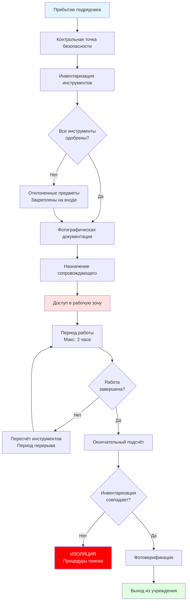

## Обзор

Контроль доступа к HVAC в исправительных учреждениях требует согласованной интеграции доступности механических систем с протоколами безопасности учреждений. Доступ к механическому оборудованию, панелям управления и распределительным системам должен уравновешивать требования эксплуатационного обслуживания с требованиями безопасности, которые предотвращают маршруты побега, изготовление оружия и саботаж системы.

Фундаментальная проблема проектирования заключается в создании путей доступа для обслуживания, которые удовлетворяют требованиям зазоров ASHRAE Standard 15, сохраняя при этом границы классификации безопасности, установленные Американской ассоциацией исправительных учреждений (ACA) и Национальным институтом исправлений (NIC).

## Зоны классификации безопасности

Протоколы контроля доступа HVAC варьируются в зависимости от уровня безопасности учреждения и классификации зоны:

| Уровень безопасности | Протокол доступа | Требование сопровождения | Контроль инструментов | Время отклика |
|---|---|---|---|---|
| Максимальная безопасность | Двойная проверка + вооруженное сопровождение | Минимум 2 офицера | Индивидуальный журнал инвентаризации | <15 минут |
| Средняя безопасность | Одинарная проверка + сопровождение | Минимум 1 офицер | Групповой лист инвентаризации | <30 минут |
| Минимальная безопасность | Доступ по удостоверению + уведомление | По наличию | Процедура выдачи | <60 минут |
| Административная | Доступ только по удостоверению | Не требуется | Нет формального контроля | Немедленно |
| Поддержка периметра | Контролируемый доступ | По наличию | Стандартные процедуры | <45 минут |

## Проектирование безопасности механического помещения

### Физический контроль доступа

Механические помещения в исправительных учреждениях требуют усиленной конструкции, превосходящей коммерческие стандарты строительства. Конструкции стен должны достичь рейтингов безопасности, которые предотвращают взлом:

**Минимальные стандарты конструкции:**
- Стены: 20 см армированного бетона или блочной кладки с арматурой №5 через 30 см по центру
- Двери: сталь 16 калибра с непрерывной рояльной петлей, рассчитанная на 3-часовую огнестойкость
- Замки: Abloy Protec2 или эквивалент высокозащищенного цилиндра с ограниченным профилем
- Смотровые панели: остекление из поликарбоната толщиной минимум 1,9 см с армированием металлической сеткой
- Потолок: укреплен до того же стандарта, что и стены, для предотвращения доступа сверху

### Интеграция казематов пропуска

Крупное механическое оборудование, требующее периодической замены, требует конструкции доступа через казематы пропуска:

**Требования к блокировкам:**
- Двери 1 и 2 не могут одновременно открываться (электрическая блокировка + механический обход)
- Минимум 1,8 м свободного расстояния между дверями
- Покрытие CCTV с записью на посту управления
- Двусторонняя система связи
- Кнопка срочного оповещения доступна с обеих дверей

### Корпуса оборудования в клетках

В механических помещениях, обслуживающих зоны содержания заключенных, отдельные единицы оборудования требуют вторичного ограждения:

**Стандарты размещения в клетках:**
- Сварная проволочная сетка: 9 калибра минимум, максимум 5×5 см ячейки
- Каркас: стальная труба сечением 5×5 см, закреплённая к конструкции
- Дверь доступа: навесной замок с наглядной пломбой
- Зазор: поддерживать минимум 90 см обслуживающего доступа ASHRAE 15 с боков оборудования, требующего обслуживания

Этот вторичный барьер предотвращает доступ к:
- Сервисным портам хладагента (баллоны R-410A как потенциальное оружие)
- Выключателям отключения электроэнергии (создание опасности поражения)
- Защитам ремней и вращающемуся оборудованию (потенциал травм)
- Управляющей проводке и пневматическим трубкам (саботаж системы)

## Контроль воздушного потока и давления

Зоны контролируемого доступа требуют поддержания перепада давления для предотвращения миграции переносимых по воздуху загрязнителей и инфильтрации дыма в условиях чрезвычайной ситуации.

### Требования к перепаду давления

Требуемый приточный воздушный поток для поддержания перепада давления через барьеры доступа определяется следующим образом:

$$Q = \frac{A \cdot \sqrt{2 \cdot \Delta P \cdot \rho}}{\rho} \cdot C_d$$

Где:
- $Q$ = Требуемый воздушный поток (м³/ч)
- $A$ = Площадь утечки двери (м²), обычно 0,05-0,14 м² для защищённых дверей
- $\Delta P$ = Перепад давления (Па), минимум 12 Па
- $\rho$ = Плотность воздуха (1,2 кг/м³ при стандартных условиях)
- $C_d$ = Коэффициент истечения (0,65 для дверных щелей)

Для механических помещений относительно соседних защищённых коридоров:

$$Q_{mech} = 1,5 \cdot V \cdot ACH$$

Где:
- $V$ = Объём помещения (м³)
- $ACH$ = Кратность воздухообмена в час (минимум 6 согласно ASHRAE 62.1 для механических помещений)
- Коэффициент 1,5 учитывает инфильтрацию через щели защищённой конструкции

**Целевые соотношения давлений:**
- Механическое помещение: +7-12 Па относительно коридора (предотвращение входа воздуха из коридора)
- Казематный пропуск: нейтральное давление (предотвращение проблем с силой открытия двери)
- Пост управления: +19-24 Па относительно всех соседних пространств

## Протоколы сопровождения и доступа

### Процедуры доступа подрядчиков

Внешние подрядчики, выполняющие обслуживание HVAC в защищённых зонах, следуют структурированным протоколам:

1. **Предварительная очистка доступа** (24-48 часов заранее)
   - Проверка происхождения через безопасность учреждения
   - Представление и одобрение инвентаризации инструментов
   - Брифинг о запрещённых предметах
   - Назначение офицера(ов) сопровождения

2. **Процедура входа**
   - Проверка на металлодетекторе
   - Проверка инвентаризации инструментов против представленного списка
   - Фотографическая документация инструментов и оборудования
   - Выдача временного удостоверения с ограничениями по зонам

3. **Контроль в период работы**
   - Постоянное присутствие сопровождающего (прямая видимость)
   - Периодический подсчёт инвентаризации инструментов (минимум каждые 2 часа)
   - Устройство связи для сопровождающего (радиосвязь на пост)
   - Контроль ограничения по времени согласно политике безопасности

4. **Процедура выхода**
   - Окончательная проверка инвентаризации инструментов
   - Повторная проверка на металлодетекторе
   - Фотографическая документация выносимых инструментов
   - Сдача удостоверения и выход из системы
   - Отчёт офицера сопровождения об инцидентах (любые отклонения отмечены)

### Процедуры контроля инструментов

Подотчётность инструментов предотвращает создание оружия и предоставление приспособлений для побега:

**Запрещённые предметы:**
- Напильники и рашпили (могут создать острое оружие)
- Кусачки длиной более 15 см
- Портативные шлифмашины и режущие диски
- Пилы с лезвиями длиннее 10 см
- Стеклянные термометры, содержащие ртуть

**Контролируемые предметы, требующие специального одобрения:**
- Аккумуляторные электроинструменты (извлечение батареи между использованиями)
- Удлинители и временная проводка (подсчёт входа/выхода)
- Баллоны с хладагентом (закреплены и инвентаризированы)
- Оборудование для пайки и топливные баллончики (специальные протоколы хранения)
- Лестницы длиной более 1,8 м (опасность побега)

## Интеграция удалённого мониторинга

Эффективность контроля доступа увеличивается за счёт интеграции систем автоматизации зданий HVAC (BAS) с инфраструктурой безопасности учреждения.

### Критические точки мониторинга

**Датчики положения двери:**
- Двери доступа механического помещения (жёсткое подключение к посту управления безопасностью)
- Затворы оборудования в клетках
- Двери казематных пропусков (проверка блокировки)
- Передача статуса: немедленная тревога при несанкционированном открытии

**Датчики окружающей среды, указывающие на доступ:**
- Датчики присутствия в механических помещениях (PIR или ультразвуковые)
- Статус выключателя света (неожиданное освещение)
- Отклонение температуры (открытые двери)
- Повышение углекислого газа (присутствие персонала)

**Мониторинг статуса оборудования:**
- Положение отключающего выключателя (неожиданное отключение)
- Коды ошибок VFD (указание на вмешательство)
- Перепад давления фильтра (снятие панели доступа)
- Давление хладагента (доступ к сервисному порту)

### Интеграция системы BAS с системой безопасности

Архитектура интеграции соединяет механический мониторинг с централизованным управлением безопасностью:

- Выходы контроллера DDC жёстко подключены к входам панели безопасности (контакты без потенциала)
- Классификация приоритета тревоги: немедленный отклик vs. уведомление о техническом обслуживании
- Корреляция доступа: сравнение времени считывания удостоверения с активацией датчика двери
- Интеграция системы управления видео: тревога механического помещения активирует запись камеры
- Автоматизированный отклик блокировки: система HVAC переходит в аварийный режим при учреждении-широком оповещении

## Ограничения доступа к панелям

Электрические панели и управляющие интерфейсы в защищённых зонах требуют ограниченного доступа, независимого от безопасности механического помещения:

**Меры безопасности панелей:**
- Блокировки корпуса: кулачковые замки с ограниченным контролем ключей
- Наглядные пломбы на краях дверей (ежемесячная проверка)
- График панели размещён внутри двери только (внешняя метка показывает только номер панели)
- Возможность блокировки автоматических выключателей для критичных цепей
- Журнал доступа, ведущийся для всех открытий панели

**Критичные цепи, требующие дополнительной защиты:**
- Системы безопасности жизни (управление дымом, аварийное освещение)
- Системы безопасности (камеры, контроль доступа, тревоги)
- Системы связи (домофоны, общественное оповещение)
- HVAC поста управления (поддерживает окружающую среду оператора)

## Планирование доступа для обслуживания

Проектирование системы HVAC должно учитывать требования к обслуживанию в рамках ограничений безопасности:

**Рассмотрения при проектировании:**
- Выбор оборудования, благоприятствующий надёжности над сложностью (снижает частоту доступа)
- Избыточность, позволяющая техническое обслуживание во время работы учреждения (нет доступа во время проверок)
- Доступ к фильтру из незащищённых коридоров, где возможно (предотвращает требования к сопровождению)
- Дистанционно установленные компрессоры и конденсаторы (размещение в менее защищённых зонах)
- Модульная конструкция компонентов (минимизирует время в защищённых зонах)

**Запланированные окна обслуживания:**
- Координация с расписанием работы учреждения
- Избегание смены смен, приёмов пищи, проверок (периоды максимального движения заключённых)
- Предпочтительное время: середина утра (09:00-11:00) или середина дня (14:00-16:00)
- Предварительное планирование: минимум 72 часа уведомления для доступа в защищённую зону
- Резервные даты: предусмотреть инциденты безопасности, препятствующие доступу

## Заключение

Контроль доступа к HVAC в исправительных учреждениях требует физических мер безопасности, процедурных протоколов и интеграции мониторинга, которые превосходят коммерческие стандарты строительства. Успешная реализация уравновешивает доступность обслуживания против требований безопасности через многоуровневые системы управления, структурированные процедуры доступа и интеграцию технологий, связывающую механические операции и операции безопасности. Решения при проектировании должны приоритизировать безопасность без ущерба надёжности системы HVAC, которая поддерживает пригодные для проживания условия, требуемые конституционными стандартами.

## Ссылки

- ASHRAE Standard 15: Safety Standard for Refrigeration Systems
- ASHRAE Standard 62.1: Ventilation for Acceptable Indoor Air Quality
- American Correctional Association: Standards for Adult Correctional Institutions
- National Institute of Corrections: Planning and Design Guide for Secure Adult and Juvenile Facilities
- International Mechanical Code: Chapter 3, General Regulations
