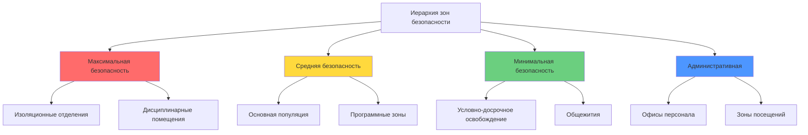
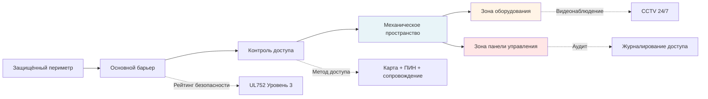

## Требования к физической безопасности

Системы HVAC в исправительных учреждениях работают в принципиально отличных от обычных зданий условиях проектирования. Требования безопасности определяют размещение оборудования, доступность, выбор компонентов и архитектуру системы. Каждый воздухообрабатывающий агрегат, проход воздуховода и управляющее устройство представляют потенциальную уязвимость в системе безопасности, требующую инженерного обоснования.

### Классификация зон безопасности

Проектирование HVAC в исправительных учреждениях начинается с картирования зон безопасности. Каждая зона требует определённого уровня безопасности, который напрямую влияет на проектирование механической системы:

## Принципы проектирования защищённых от вмешательства систем

### Требования к усилению оборудования

Все компоненты HVAC, доступные заключённым или видимые ими, требуют усиления в целях безопасности. Технические характеристики должны учитывать выбор материалов, методы крепления и безопасные режимы отказа.

| Компонент | Требование безопасности | Решение проектирования |
|-----------|------------------------|------------------------|
| Диффузоры/решётки | Защита от несанкционированного вмешательства | Нержавеющая сталь, защищённые винты, сварные рамы |
| Термостаты | Герметичные корпусы | Защищённые от вандализма крышки, дистанционное зондирование |
| Воздуховоды | Устойчивость к проникновению | Минимум 16 калибр, сварные швы, защищённые крепления |
| Клапаны | Предотвращение ручного отключения | Запирающиеся приводы, закрытые рычаги управления |
| Трубопроводы | Устойчивость к разрезанию/разрыву | Сортамент 80, защитные коробки, скрытая маршрутизация |
| Системы управления | Предотвращение несанкционированного доступа | Запирающиеся панели, шифрованные протоколы, журналирование действий |

### Предотвращение контрабанды через проектирование

Системы HVAC представляют риск передачи контрабанды через воздуховоды, кабельные каналы и панели доступа к оборудованию. Проектирование должно исключить или значительно ограничить эти пути.

**Анализ контрабанды при выборе размеров воздуховодов:**

Максимально допустимый размер воздуховода для предотвращения контрабанды:

$$D_{max} = \min(D_{flow}, D_{security})$$

Где:
- $D_{flow}$ = гидравлически требуемый размер воздуховода (см)
- $D_{security}$ = максимально допустимый размер для безопасности (обычно 15–20 см)

Для требований по расходу воздуха, превышающих допустимые размеры для безопасности:

$$n = \left\lceil \frac{Q_{total}}{V \cdot A_{max}} \right\rceil$$

Где:
- $n$ = количество параллельных воздуховодов
- $Q_{total}$ = общее требование расхода воздуха (CFM)
- $V$ = скорость проектирования (м/ч)
- $A_{max}$ = максимально допустимая площадь воздуховода (м²)

### Технические характеристики решёток безопасности

Решётки и диффузоры в высокозащищённых зонах требуют специфических параметров конструкции:

**Требования к размеру перфорации:**

$$d_{perf} \leq 6,4 \text{ мм}$$

$$t_{screen} \geq 2,76 \text{ мм}$$

**Коэффициент безопасности крепления:**

$$SF = \frac{F_{fastener} \cdot n_{fasteners}}{F_{removal}}$$

Где:
- $SF$ = коэффициент безопасности (требуется минимум 3,0)
- $F_{fastener}$ = сдвиговая прочность отдельного крепёжного элемента (Н)
- $n_{fasteners}$ = количество крепёжных элементов
- $F_{removal}$ = расчётная сила удаления (Н)

## Архитектура безопасности механического отделения

### Матрица контроля доступа в помещения оборудования

| Тип помещения | Уровень доступа | Требования входа | Мониторинг |
|---------------|-----------------|------------------|-----------|
| Основные машинные отделения | Уровень 1 (Ограниченный) | Карта + ПИН + сопровождение | CCTV + датчик движения + журнал доступа |
| Вторичные пространства оборудования | Уровень 2 (Контролируемый) | Карта + сопровождение | CCTV + журнал доступа |
| Оборудование на крыше | Уровень 1 (Ограниченный) | Только контролируемое обслуживание | Обнаружение периметра + CCTV |
| Комнаты управления | Уровень 1 (Ограниченный) | Карта + ПИН + биометрия | CCTV + журнал доступа + журнал аудита |

### Стратегии предотвращения доступа на крышу

Оборудование HVAC на крыше создаёт риски побега и возможность проникновения контрабанды. Проектирование должно включать несколько уровней безопасности:

1. **Физические барьеры**: минимальная высота забора 3,7 м с колючей проволокой или антиклиммактическими расширениями
2. **Системы обнаружения**: датчики движения, датчики вибрации, чувствительные к давлению поверхности
3. **Визуальный контроль**: видеонаблюдение на 360 градусов с инфракрасными возможностями
4. **Ограничение доступа**: единственная контролируемая точка входа, требования сопровождения
5. **Усиление оборудования**: сварные панели, защищённые крепежи, запирающиеся отключатели

**Расчёт минимальной высоты барьера:**

$$H_{barrier} = H_{equip} + H_{climb} + H_{det}$$

Где:
- $H_{barrier}$ = требуемая высота барьера
- $H_{equip}$ = высота оборудования над кровельным покрытием
- $H_{climb}$ = дополнительный потенциал подъёма (обычно 1,2–1,8 м)
- $H_{det}$ = высота сдерживания обнаружения (минимум 0,6 м выше поверхности для лазания)

## Изоляция зон и контроль давления

Зонирование для безопасности требует точных отношений давления для предотвращения перекрёстного загрязнения и поддержания контролируемых условий.

### Проектирование каскада давления

Зоны максимальной безопасности работают с отрицательным давлением относительно соседних пространств:

$$\Delta P_{cascade} = -5 \text{ до } -12 \text{ Па на границу}$$

**Взаимосвязь давления в многозонной системе:**

$$P_{admin} > P_{min-sec} > P_{med-sec} > P_{max-sec} > P_{isolation}$$

Минимальный перепад давления между зонами:

$$\Delta P_{min} = 5 \text{ Па}$$

Допуск управления:

$$\Delta P_{tolerance} = \pm 1,2 \text{ Па}$$

## Рамки стандартов и соответствия требованиям

### Требования Американской ассоциации исправительных учреждений (ACA)

Стандарты ACA, основанные на производительности, требуют:
- Минимум 10 воздухообменов в час в жилых отделениях
- Диапазон температур: 20–29°C
- Относительная влажность: 30–60%
- Наружный воздух: минимум 7,1 м³/ч на человека

### Рекомендации по применению ASHRAE

Положения стандарта ASHRAE 62.1 применяются с модификациями для безопасности:
- Регулировки эффективности вентиляции для защищённых решёток (обычно коэффициент 0,8–0,9)
- Требования к вытяжке для специальных зон (приём/обработка, медицинское отделение, кухни)
- Мониторинг качества воздуха в изоляционных и сегрегационных отделениях

### Интеграция управления ключами и запирания/блокирования оборудования

Все механические помещения требуют комплексных процедур контроля ключей, интегрированных с протоколами безопасности учреждения. Доступ к системам HVAC должен следовать задокументированным процедурам с двойной авторизацией для критических зон оборудования. Техническое обслуживание требует согласования с безопасностью с предварительным уведомлением, назначением сопровождающего лица и процедурами учёта инструментов.

## Проектирование систем безопасного отказа

Элементы управления HVAC должны по умолчанию переходить в безопасные режимы работы при отказе питания или системы:
- Дымозащитные клапаны закрываются
- Противопожарные клапаны закрываются автоматически
- Вентиляция поддерживает минимальные требования кодекса на аварийном питании
- Давление в критических зонах поддерживается с помощью управления, поддерживаемого источником бесперебойного питания
- Возможность ручного отключения заперта за защищённым корпусом

Проектирование HVAC с приоритетом безопасности балансирует операционную эффективность с требованиями безопасности учреждения. Каждое решение проектирования учитывает последствия для безопасности при поддержании соответствующих кодам условий окружающей среды для заключённых и персонала.
