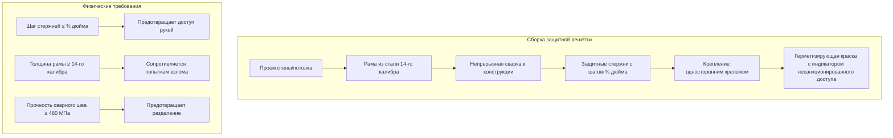
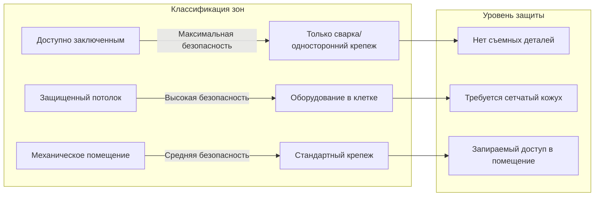

## Принципы физической безопасности

Конструкция систем HVAC, защищенных от несанкционированного доступа в исправительных учреждениях, решает три основные задачи безопасности: предотвращение несанкционированного доступа к оборудованию, исключение возможности скрытия оружия или запрещенных предметов, а также защита целостности системы управления микроклиматом. Все доступные компоненты HVAC в зонах, занятых заключенными, требуют усиления исправительного уровня, обеспечивающего устойчивость к несанкционированному доступу, вандализму и использованию в качестве оружия.

Основной механизм отказа в системах HVAC исправительных учреждений включает разборку компонентов для извлечения крепежных элементов, создания острых кромок или отключения систем управления микроклиматом. Инженерия безопасности сосредоточена на исключении съемных деталей, использовании односторонних методов крепления и конструировании компонентов, которые не могут быть повреждены без специализированных инструментов, недоступных заключенным.

## Спецификации оборудования исправительного уровня

### Требования к защищенному от несанкционированного доступа крепежу

| Тип крепежа | Уровень безопасности | Применение | Сопротивление крутящему моменту |
|---|---|---|---|
| Односторонние винты | Максимальная безопасность | Все доступные панели | Удаление невозможно без разрушения |
| Защищенный Torx (T5-Pin) | Высокая безопасность | Крышки оборудования | 20-27 Нм сопротивление несанкционированному доступу |
| Срезные гайки | Максимальная безопасность | Крепление решеток | Головки срезаются при 16 Нм |
| Сварная конструкция | Абсолютная безопасность | Дефлекторы, концевые элементы | Неприменимо (постоянная сборка) |
| Защищенный шестигранник | Средняя безопасность | Некритичный доступ | 13-20 Нм сопротивление несанкционированному доступу |

Все крепежные элементы в зонах прямого надзора, камерах максимальной безопасности и помещениях ожидания должны быть либо односторонними (только установка), либо требовать специализированные инструменты, недоступные через стандартное техническое обслуживание. Глубина зацепления резьбы должна предотвращать расслабление крепежа до разрушения резьбы.

### Усиление решеток и дефлекторов

Защитные решетки должны предотвращать введение рук или инструментов в воздуховод при сохранении требуемого воздушного потока. Шаг между стержнями не должен превышать ¾ дюйма (19 мм) в любом направлении. Конструкция рамы выполняется из стали минимум 14-го калибра с непрерывной сваркой к конструктивным элементам вместо механического крепежа.

Критическое геометрическое ограничение для шага стержней вытекает из антропометрии руки человека:

$$w_{\text{max}} = d_{\text{hand}} - 2t_{\text{compression}} \leq 19 \text{ мм}$$

где $w_{\text{max}}$ — максимальная ширина отверстия, $d_{\text{hand}}$ — диаметр сжатой руки (обычно 25 мм), и $t_{\text{compression}}$ учитывает пределы сжатия тканей.

### Защита концевых элементов

Концевые элементы с вентилятором и VAV в доступных пленумах потолка требуют стальной сетчатой клетки с максимальным размером отверстия ½ дюйма. Защитный кожух должен:

- Закрывать все доступные поверхности сварной сетью 12-го калибра
- Предусматривать защищенные от несанкционированного доступа панели доступа для технического обслуживания (запираемый доступ)
- Предотвращать контакт с движущимися компонентами (минимальный зазор 5 см)
- Сохранять требуемые зазоры для обслуживания вне защитной клетки

Кабели управления и пневматические трубопроводы должны прокладываться в жестком кабелепроводе, а не открыто. Все концы кабелепровода требуют компрессионных фитингов, которые нельзя разобрать без специализированных инструментов.

## Управление доступом и размещение оборудования

### Стратегия зонирования оборудования

**Зона 1 — Прямой контакт с заключенными**: Все компоненты в пределах 3 метров от уровня пола или доступные с нар/мебели требуют полной защиты от несанкционированного доступа. Это включает решетки подачи/возврата воздуха, термостаты, осветительные приборы с интеграцией HVAC и любые видимые крепежные элементы.

**Зона 2 — Защищенный плены потолка**: Оборудование в недоступных плена потолка (выше защищенных потолочных систем) требует промежуточной защиты, состоящей из запираемых панелей доступа и размещенных в клетке механических компонентов.

**Зона 3 — Механические помещения**: Оборудование HVAC в запираемых механических помещениях с контролируемым доступом следует стандартным коммерческим протоколам безопасности с запираемым доступом и обнаружением несанкционированного доступа.

## Усиление системы управления

Спецификации термостата и устройств управления для исправительных приложений:

| Компонент | Стандартная конструкция | Требование исправительного уровня |
|---|---|---|
| Корпус термостата | Пластик с защелкой | Сварной корпус из поликарбоната |
| Регулировка установки | Открытый циферблат | Впаянная регулировка инструментом |
| Крепеж крышки | Винты Phillips | Односторонние защищенные винты |
| Доступ к кабелю | Съемная задняя панель | Герметизированная распределительная коробка |
| Элементы управления переопределением | Доступные кнопки | Только переключатель с ключом или BMS |

Регулировка установки должна требовать специализированные инструменты или быть заперта позади панелей, доступных только персоналу. Физическое соотношение между усилием снятия крышки и возможностями заключенного:

$$F_{\text{required}} > 3 \cdot F_{\text{manual}} \approx 2000 \text{ Н}$$

где $F_{\text{manual}}$ представляет максимальное устойчивое ручное усилие (примерно 670 Н) и коэффициент безопасности 3 учитывает импровизированные рычажные инструменты.

## Стандарты защиты воздуховодов

Открытые воздуховоды в зонах, доступных заключенным, требуют внутреннего укрепления стержнями для предотвращения обрушения или смятия, которое могло бы нарушить воздушный поток. Прямоугольные воздуховоды размером более 20×20 см требуют:

- Внутренних перекрестных распорок с максимальным шагом 61 см
- Конструкции из оцинкованной стали минимум 16-го калибра (22-го калибра недостаточно)
- Сварные швы вместо защелок или Pittsburgh-соединений
- Внешнего защитного кожуха, где воздуховоды проходят ниже 3 метров от пола

Требование по толщине воздуховода при ударных нагрузках:

$$t_{\text{min}} = \frac{F_{\text{impact}} \cdot L^2}{4 \sigma_{\text{yield}} \cdot w}$$

где $t_{\text{min}}$ — минимальная толщина воздуховода, $F_{\text{impact}}$ — ожидаемая ударная сила (обычно 2200 Н), $L$ — длина неподдерживаемого пролета, $\sigma_{\text{yield}}$ — предел текучести материала, и $w$ — ширина воздуховода.

## Соответствие и проверка

Стандарты Американской ассоциации исправительных учреждений (ACA) требуют документирования защитных от несанкционированного доступа функций при рассмотрении проекта и периодической проверки во время инспекций учреждения. Все компоненты HVAC с классом безопасности должны сохранять свою целостность без деградации в течение всего эксплуатационного периода учреждения, обычно указываемого минимум на 20 лет.

Проверка установки включает разрушающее испытание образцов сборок для подтверждения безопасности крепежа, проверку прочности сварных швов в соответствии с AWS D1.1 и документирование измерений шага стержней на всех установленных решетках. Процедуры технического обслуживания должны сохранять защитные от несанкционированного доступа функции во время плановых операций обслуживания.
