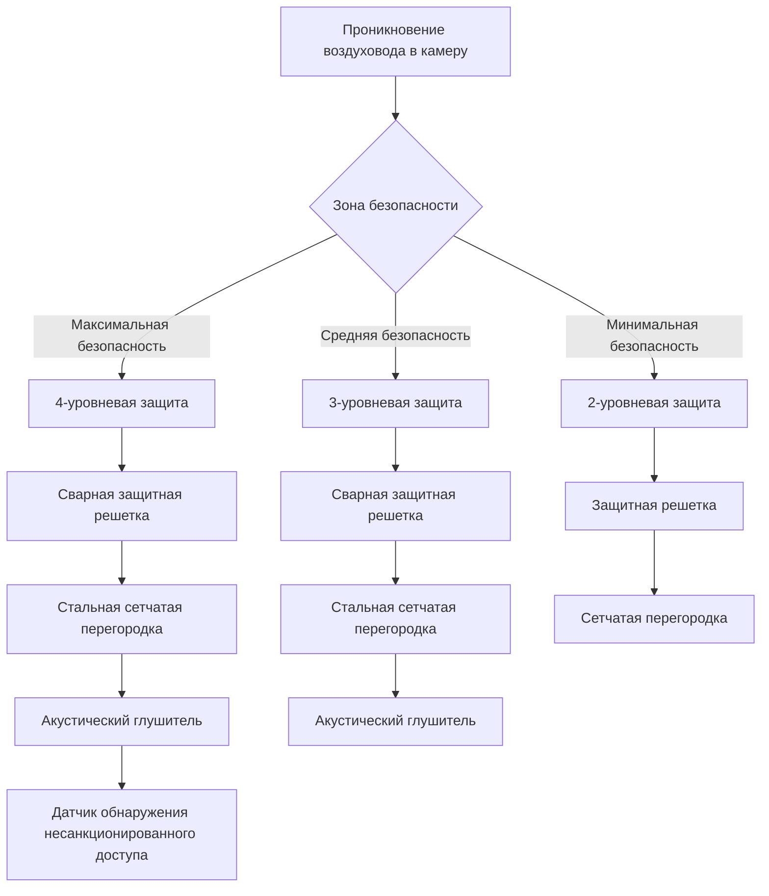
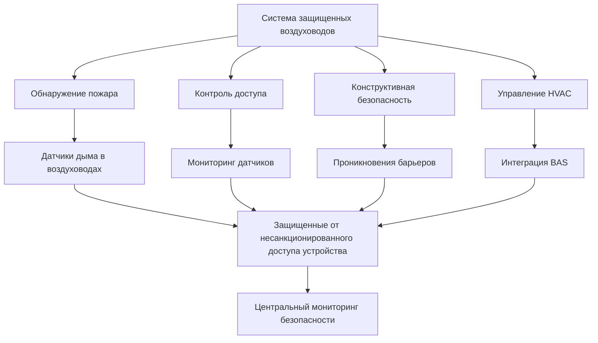

# Защищенные воздуховоды для исправительных учреждений

Воздуховоды в учреждениях уголовного правосудия требуют специального проектирования для предотвращения несанкционированного доступа, попыток побега и скрытия контрабанды при соблюдении требований кодексов вентиляции. Соображения безопасности имеют приоритет над обычными приоритетами проектирования HVAC.

## Требования к конструкции

### Толщина стенок воздуховода

Защищенные воздуховоды используют более толстый материал, чем коммерческие стандарты, для сопротивления физическому воздействию:

| Расположение | Минимальный калибр | Толщина стенки | Уровень безопасности |
|----------|---------------|----------------|----------------|
| Камеры максимальной безопасности | 14 ga | 1,91 мм | Высокий |
| Помещения общей популяции | 16 ga | 1,52 мм | Средний |
| Административные помещения | 18 ga | 1,22 мм | Стандартный |
| Периметровые зоны | 14 ga | 1,91 мм | Высокий |
| Зоны приема/передачи | 14 ga | 1,91 мм | Высокий |

### Определение размера воздуховода с ограничениями безопасности

Стандартные расчеты потерь на трение применяются, но ограничения безопасности ограничивают максимальные размеры воздуховода. Скорость должна оставаться в приемлемых пределах несмотря на ограниченные размеры:

$$Q = VA$$

Где:
- $Q$ = объемный расход воздуха (CFM)
- $V$ = скорость (FPM)
- $A$ = площадь поперечного сечения (м²)

Для защищенных воздуховодов с ограничениями размеров:

$$A_{max} = \frac{w_{max} \times h_{max}}{144}$$

Где:
- $w_{max}$ = максимальная допустимая ширина (см)
- $h_{max}$ = максимальная допустимая высота (см)

Проверка максимальной скорости:

$$V = \frac{Q}{A_{max}}$$

Скорость не должна превышать 6,1 м/с в занятых помещениях для контроля шума. При превышении необходимо применение нескольких меньших воздуховодов или увеличение статического давления.

### Компенсация падения давления

Функции безопасности увеличивают падение давления. Общее системное давление учитывает стандартное трение плюс компоненты безопасности:

$$\Delta P_{total} = \Delta P_{friction} + \Delta P_{grilles} + \Delta P_{baffles}$$

Типичные перепады давления компонентов безопасности:
- Защитные решетки: 37-62 Па
- Защитные жалюзи против странгуляции: 25-45 Па
- Защищенные от несанкционированного доступа заслонки: 20-30 Па

## Функции безопасности

### Системы предотвращения доступа

### Спецификации решеток

Защитные решетки предотвращают доступ при поддержании воздушного потока:

| Характеристика | Спецификация | Назначение |
|---------|--------------|---------|
| Расстояние между стержнями | Макс. 1,27 см свободного проема | Предотвращение введения инструментов |
| Диаметр стержня | Мин. 0,95 см диаметра | Сопротивление разрезанию/изгибанию |
| Крепление | Непрерывная сварка к воздуховоду | Предотвращение снятия |
| Материал | Нержавеющая сталь 304 | Устойчивость к коррозии |
| Толщина рамы | Мин. 3,18 мм | Конструктивная целостность |
| Защита от несанкционированного доступа | Без открытых крепежных элементов | Предотвращение разборки |

### Системы глушителей

Глушители предотвращают визуальный доступ и прохождение предметов при сохранении воздушного потока:

Параметры конфигурации глушителя:
- Минимум 3 поворота по 90° каждый
- Перекрытие глушителя: минимум 15,2 см
- Максимальное расстояние между глушителями: 10,2 см
- Общая глубина: 46-61 см типично

## Соединения и герметизация

### Требования к сварке

Высокозащищенные воздуховоды требуют сварных соединений:

$$L_{weld} = 2(w + h)$$

Где:
- $L_{weld}$ = общая длина сварки на соединение (см)
- $w$ = ширина воздуховода (см)
- $h$ = высота воздуховода (см)

**Спецификации сварки:**
- Непрерывные швы на всех продольных стыках
- Сплошные сварные швы по периметру на соединениях
- Шлифовка до гладкости для устранения острых краев
- 100% визуальный контроль
- Рентгеновское исследование для критических участков

### Проникновения воздуховодов

Проникновения стен и потолков требуют специального решения:

| Компонент | Требование | Стандартный справочник |
|-----------|-------------|-------------------|
| Огнестойкость | Соответствие рейтингу барьера | IBC Глава 7 |
| Защита безопасности | Сварной гильз с обеих сторон | Учреждение, специфичное |
| Зазор | Установка с нулевым зазором | SMACNA HVAC Security |
| Доступ для инспекции | За пределами защищенного периметра | Стандарты ACA |
| Дымовая заслонка | Защищенный от несанкционированного доступа привод | NFPA 90A |

## Испытания и проверка

### Конструктивные испытания

Испытания физической безопасности проверяют конструктивную целостность:

1. **Испытание на удар**: Приложить 90,7 кДж ударной силы к открытым секциям
2. **Сопротивление инструментам**: 30-минутное сопротивление при атаке стандартными инструментами
3. **Инспекция крепежа**: Проверка всех сварных соединений
4. **Визуальное обследование**: Проверка производственных дефектов

### Проверка воздушного потока

Стандартное испытание HVAC применяется с ограничениями безопасности:

$$Q_{actual} = K \times A \times \sqrt{\Delta P_{v}}$$

Где:
- $K$ = коэффициент коррекции (0,85-0,95 для защитных решеток)
- $A$ = эффективная свободная площадь (м²)
- $\Delta P_{v}$ = скоростное давление (Па)

**Процедура испытания:**
1. Измерить общий воздушный поток на установке обработки воздуха
2. Измерить воздушный поток на каждом выходе камеры
3. Проверить минимальные скорости вентиляции на одного человека
4. Задокументировать скоростное давление через защитные решетки
5. Проверить на наличие несанкционированных точек доступа

### Испытание герметичности

Защищенные воздуховоды требуют более строгих стандартов утечки:

$$CL_{max} = \frac{Q_{leak}}{100 \times A_{duct}} \times P^{0.65}$$

Максимальный класс утечки:
- Зоны максимальной безопасности: CL 3
- Общие помещения: CL 6
- Административные помещения: CL 12

## Надзор при установке

Установка защищенных воздуховодов требует непрерывной проверки:

- Персонал безопасности объекта присутствует во время установки
- Проверка отсутствия возможностей скрытия контрабанды
- Документирование всех проникновений с чертежами "как построено"
- Фотографирование качества сварки и функций безопасности
- Испытание предотвращения доступа перед активацией объекта
- Координация с системами периметровой безопасности

## Интеграция с системами здания

Защищенные воздуховоды взаимодействуют с несколькими системами здания:

Защищенные воздуховоды представляют пересечение инженерии HVAC и безопасности исправительных учреждений. Каждое решение при проектировании балансирует требования вентиляции с предотвращением побега, требуя тесного сотрудничества между инженерами-механиками, консультантами по безопасности и операторами объекта. Надлежащее выполнение этих систем защищает как заключенных, так и персонал при соблюдении требований кодексов по условиям окружающей среды.
