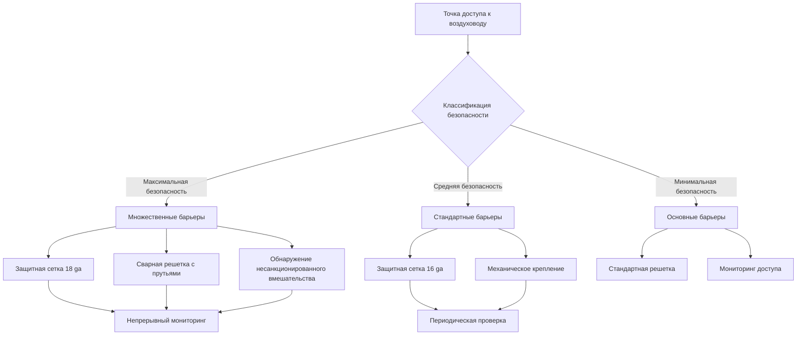
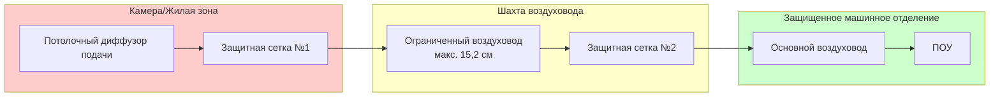
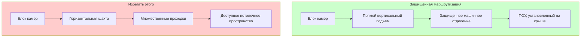

## Обзор

Предотвращение доступа к воздуховодам в учреждениях уголовно-исполнительной системы требует спроектированных физических барьеров и ограничений размеров, которые препятствуют несанкционированному проникновению, сохраняя при этом требуемый расход воздуха. Основная цель состоит в исключении воздуховодов как потенциального маршрута побега или пути контрабанды без ущерба вентиляционным характеристикам.

## Требования к ограничению размеров воздуховодов

Стандарты исправительных учреждений ограничивают размеры воздуховодов, чтобы предотвратить проникновение человека. Максимальный допустимый размер воздуховода зависит от уровня безопасности.

### Расчеты критических размеров

Максимальная площадь поперечного сечения воздуховода для предотвращения доступа:

$$A_{max} = 0,0619 \text{ м}^2 \text{ (максимальная безопасность)}$$

$$A_{max} = 0,0774 \text{ м}^2 \text{ (средняя безопасность)}$$

Для прямоугольных воздуховодов ограничивающий размер составляет:

$$D_{limit} = \min(w, h) \leq 15,2 \text{ см (максимальная безопасность)}$$

$$D_{limit} = \min(w, h) \leq 20,3 \text{ см (средняя безопасность)}$$

Где:
- $w$ = ширина воздуховода
- $h$ = высота воздуховода
- $A_{max}$ = максимальная площадь поперечного сечения

### Компенсация скорости

Когда ограничения размеров ограничивают площадь воздуховода, скорость должна увеличиться для поддержания расхода воздуха:

$$V_2 = V_1 \times \frac{A_1}{A_2}$$

$$\Delta P_{friction} = \left(\frac{f \cdot L \cdot \rho \cdot V^2}{2 \cdot D_h}\right)$$

Где:
- $V$ = скорость воздуха (м/с)
- $A$ = площадь поперечного сечения (м²)
- $f$ = коэффициент трения
- $L$ = длина воздуховода (м)
- $\rho$ = плотность воздуха (кг/м³)
- $D_h$ = гидравлический диаметр (м)

## Системы физических барьеров

## Спецификация защитной сетки

| Уровень безопасности | Материал | Калибр | Размер отверстия | Расстояние между прутьями | Метод крепления | Стандарт испытания |
|----------------|----------|-------|--------------|-------------|------------------|------------------|
| Максимальный | Нержавеющая сталь 304 | 18 ga | 1,27 см × 1,27 см | 1,27 см o.c. | Сварная рама, защитные болты | ASTM F1915 |
| Высокий | Оцинкованная сталь | 16 ga | 1,91 см × 1,91 см | 1,91 см o.c. | Сварная рама, крепежные элементы, защищенные от несанкционированного вмешательства | ASTM A653 |
| Средний | Оцинкованная сталь | 14 ga | 2,54 см × 2,54 см | 2,54 см o.c. | Механическое крепление | ASTM A653 |
| Минимальный | Углеродистая сталь | 12 ga | 3,81 см × 3,81 см | 3,81 см o.c. | Стандартное крепление | ASTM A1008 |

## Стратегия расположения барьеров

## Исключение дверей доступа

Стандартные двери доступа к воздуховодам создают уязвимости безопасности. Стратегии исключения включают:

**Подход с сегментированным воздуховодом:**
- Секции воздуховода ≤ 3 м между фланцами
- Полное удаление секции для обслуживания
- Нет панелей доступа в защищенных зонах
- Фланцевые соединения только в защищенных машинных отделениях

**Расположение доступа для очистки:**
$$L_{max} = 7,6 \times D_h$$

Максимальное расстояние между точками очистки, расположенными в защищенных зонах, где $D_h$ — гидравлический диаметр в метрах.

## Требования к герметизации проходок

Все проходки воздуховодов через барьеры безопасности требуют неснимаемой герметизации:

| Тип проходки | Метод герметизации | Материал | Требование испытания |
|------------------|----------------|----------|---------------------|
| Проходка в стене | Загрунтованное кольцевое пространство | Невусаживающийся цементный раствор | Прочность на сжатие 13,8 МПа |
| Проходка в полу | Загрунтованный раствор с блокировкой арматурой | Конструкционный раствор + сетка арматуры | Прочность на сжатие 20,7 МПа |
| Проходка в потолке | Сварная защитная пластина | Стальная пластина 12 ga, сваренная с конструкцией | Визуальная проверка сварки |
| Проходка в кровле | Загрунтованный раствор с защитным ошейником | Раствор + сварной стальной ошейник | 17,2 МПа + проверка сварки |

## Безопасность потолочного плена

Возвратные воздушные плены над защищенными помещениями требуют непрерывных барьеров:

$$h_{barrier} \geq h_{ceiling} + 61 \text{ см}$$

Требования к конструкции барьера:
- Минимум стальной настил 20 ga
- Непрерывные сварные швы
- Проходки ограничены требованиями $A_{max}$
- Все отверстия оснащены защитной сеткой

## Принципы маршрутизации воздуховодов

**Маршрутизация в защищенной зоне:**
1. Минимизировать длину воздуховода в зонах, доступных для заключенных
2. Маршрутизировать вертикально через конструкцию, а не горизонтально через шахты
3. Консолидировать проходки в контролируемых местах
4. Избегать маршрутизации через подвальные помещения или доступные потолочные плены
5. Сохранять непрерывные линии видимости для проверки воздуховодов, где возможно

## Безопасность решеток и диффузоров

Концевые устройства требуют защищенного монтажа от несанкционированного вмешательства:

**Требования к силе удаления:**
$$F_{removal} \geq 2224 \text{ Н (максимальная безопасность)}$$

**Методы установки:**
- Винты с защитной головкой (нестандартный привод)
- Сварные монтажные рамы
- Анкерные точки, заполненные раствором
- Непрерывное периметровое крепление на расстоянии ≤ 10 см

## Проверка и испытание

**Начальная проверка:**
- Физическая попытка удалить барьеры (испытание на растяжение 2224 Н)
- Визуальная проверка всех сварных швов и крепежных элементов
- Проверка размеров всех поперечных сечений воздуховодов
- Испытание на прочность герметизации проходок (пробы керна)

**Постоянный мониторинг:**
- Ежемесячная визуальная проверка доступных барьеров
- Ежеквартальная детальная проверка с использованием зеркал/камер
- Ежегодное физическое испытание целостности барьеров
- Непрерывный электронный мониторинг при необходимости

## Координация проектирования

Эффективное предотвращение доступа требует интеграции с операциями безопасности:

1. **Обзор классификации безопасности:** Подтвердить уровни безопасности учреждения с органами уголовно-исполнительной системы
2. **Утверждение разводки воздуховодов:** Подать планы маршрутизации на рассмотрение персоналу безопасности
3. **Спецификация барьеров:** Предоставить подробные расписания барьеров, связанные с классификациями безопасности помещений
4. **Надзор за установкой:** Персонал безопасности присутствует во время установки барьеров и герметизации проходок
5. **Испытание при приеме:** Задокументировать физические испытания, проведенные под контролем персонала безопасности учреждения

## Нормативные ссылки

- **ASHRAE Applications Handbook, Chapter 9:** Justice Facilities
- **ACA Standards for Adult Correctional Institutions:** 4th Edition
- **National Institute of Corrections:** HVAC Security Guidelines
- **ICC International Mechanical Code:** Section 403.3 (Duct Construction)
- **ASTM F1915:** Standard Specification for Welded Wire Security Mesh

Надлежащее внедрение мер по предотвращению доступа гарантирует, что системы HVAC обеспечивают требуемый контроль окружающей среды без ущерба для целей безопасности учреждения.
