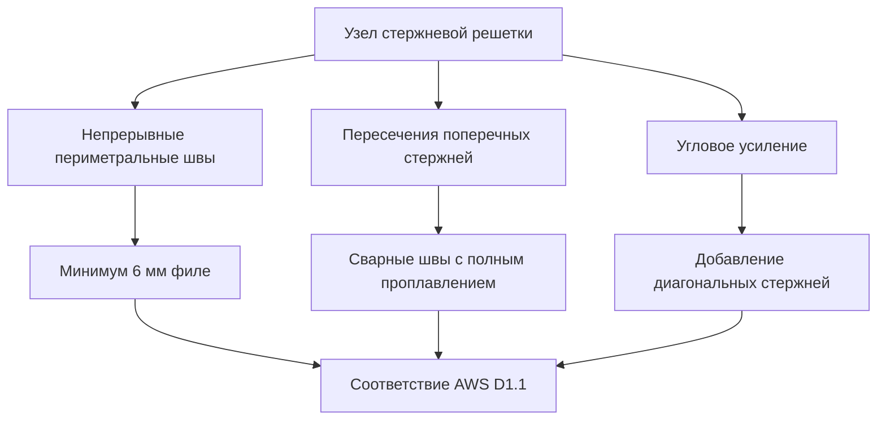
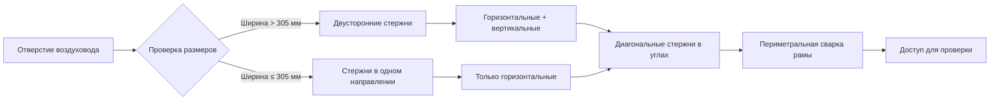
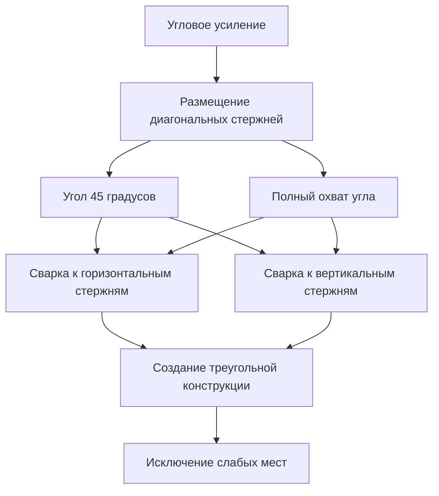

## Обзор

Стальная арматура является основным механическим барьером, предотвращающим несанкционированный выход через воздуховоды HVAC в учреждениях юстиции. Правильно спроектированные стержневые системы сопротивляются резанию, взлому и попыткам снятия, сохраняя при этом требуемую пропускную способность воздуха. Армирование должно интегрироваться структурно с воздуховодом для предотвращения смещения при длительном воздействии.

## Требования к конфигурации стержней

### Спецификации материалов

Системы стальной арматуры требуют определенных марок стали и размеров для достижения сопротивления взлому.

| Компонент | Спецификация | Стандарт |
|-----------|--------------|----------|
| Материал стержня | ASTM A36 конструкционная сталь | Минимальный предел текучести 250 МПа |
| Минимальный диаметр стержня | 12,7 мм | Круглый или квадратный профиль |
| Максимальное расстояние между стержнями | 102 мм по центру | Зазор ≤ 89 мм |
| Сварной материал | Электрод E70XX | По AWS D1.1 |
| Покрытие поверхности | Горячее цинкование | ASTM A123 |
| Угловое усиление | Дополнительные диагональные стержни | Ориентация 45 градусов |

### Анализ расстояния между стержнями

Максимальное расстояние 102 мм предотвращает проход предметов и частей тела при минимизации ограничения воздушного потока. Перепад давления через стержневые решетки следует уравнению:

$$\Delta P = \frac{1}{2} \rho V^2 \left( K_c + K_e + K_f \right)$$

Где:
- $\Delta P$ = перепад давления через стержневую решетку (Па)
- $\rho$ = плотность воздуха (кг/м³)
- $V$ = лицевая скорость (м/с)
- $K_c$ = коэффициент сужения (обычно 0,4–0,5)
- $K_e$ = коэффициент расширения (обычно 0,5–0,6)
- $K_f$ = коэффициент трения на основе расположения стержней

Эффективное соотношение свободной площади для стержневых решеток:

$$\beta = \frac{A_{free}}{A_{gross}} = 1 - \frac{n \cdot d}{W}$$

Где:
- $\beta$ = коэффициент свободной площади (безразмерный)
- $n$ = количество стержней
- $d$ = диаметр стержня (мм)
- $W$ = ширина воздуховода (мм)

Для стержней диаметром 12,7 мм с расстоянием 102 мм: $\beta \approx 0,875$ (87,5% свободной площади).

## Методы установки

### Сварное крепление стержней

Сварные швы с полным проплавлением обеспечивают требуемую прочность крепления для сопротивления снятию стержней.

### Грузоподъемность конструкции

Стальная арматура должна выдерживать сосредоточенные нагрузки при попытках побега. Момент сопротивления изгибу:

$$M_{max} = \frac{\sigma_y \cdot \pi d^3}{32}$$

Где:
- $M_{max}$ = максимальный момент изгиба (Н·мм)
- $\sigma_y$ = предел текучести (МПа)
- $d$ = диаметр стержня (мм)

Для стержней диаметром 12,7 мм из ASTM A36:
$$M_{max} = \frac{250 \times \pi \times (12,7)^3}{32} = 50 000 \text{ Н·мм}$$

Прогиб под сосредоточенной нагрузкой в центре стержня:

$$\delta = \frac{P \cdot L^3}{48 \cdot E \cdot I}$$

Где:
- $\delta$ = прогиб (мм)
- $P$ = сосредоточенная нагрузка (Н)
- $L$ = пролет между опорами (мм)
- $E$ = модуль упругости (200 ГПа для стали)
- $I$ = момент инерции (мм⁴)

## Конфигурации проектирования стержневых решеток

### Детали углового усиления

Углы представляют конструктивные слабые места, требующие дополнительного усиления. Установите диагональные стержни под углом 45 градусов через все четыре угла для отверстий воздуховодов, превышающих 305 мм в любом измерении.

## Тестирование сопротивления взлому

Протоколы тестирования проверяют целостность стержневой системы при попытках резания и взлома в соответствии со стандартом ASTM F1450 для защитного стекла, адаптированным для металлоконструкций.

| Метод испытания | Тип инструмента | Критерии прохождения |
|-----------------|-----------------|---------------------|
| Сопротивление резанию | Ножовка, 5 минут | Отсутствие перерезания стержня |
| Сопротивление взлому | Монтировка 457 мм, усилие 890 Н | Отсутствие смещения стержня |
| Сопротивление удару | Молоток 2,3 кг, 10 ударов | Отсутствие разрушения сварки |
| Сопротивление горелке | Кислородно-ацетиленовая, 2 минуты | Проникновение < 3,2 мм |

## Спецификации установки

### Требования к сварке

- Выполняйте сварку всех пересечений стержней минимум с 6 мм филе-швами
- Используйте непрерывные периметральные швы, соединяющие раму решетки со стенкой воздуховода
- Отшлифуйте все сварные поверхности гладко для исключения точек подъема
- Проведите визуальный контроль 100% сварных швов
- Проведите контроль методом люминесцентной дефектоскопии на 10% сварных швов (случайная выборка)

### Контрольные точки при проверке

1. Убедитесь, что расстояние между стержнями не превышает 102 мм ни в одном месте
2. Подтвердите минимальный диаметр стержня 12,7 мм на всей протяженности
3. Проверьте качество сварки и глубину проплавления
4. Убедитесь, что диагональные угловые стержни установлены на отверстиях > 305 мм
5. Обеспечьте завершенность цинкования или защитного покрытия
6. Задокументируйте установку фотографиями и проверкой размеров

## Соответствие стандартам исправительных учреждений

Системы стальной арматуры должны соответствовать требованиям:

- **Стандарты ACA для взрослых исправительных учреждений**: 4-е издание, Стандарт 4-ALDF-4C-06
- **ASTM F1450**: Методология тестирования производительности безопасности
- **AWS D1.1**: Код конструкционной сварки - сталь
- **NFPA 90A**: Установка систем кондиционирования и вентиляции (совместимость с огнестойкостью)

## Интеграция с конструкцией воздуховода

Стержневые решетки интегрируются с воздуховодом из оцинкованной стали толщиной минимум 1,6 мм. Комбинированная сборка обеспечивает структурную жесткость, предотвращающую деформацию стенки воздуховода при воздействии на стержни. Закрепите раму стержневой решетки к фланцам воздуховода непрерывными швами перед окончательной установкой воздуховода для предотвращения снятия всей сборки.

## Техническое обслуживание и проверка

Проверяйте стальную арматуру ежеквартально на наличие:
- Развития трещин в сварке
- Коррозии стержней или деградации покрытия
- Структурной деформации или смещения
- Признаков попыток резания или взлома
- Правильности расстояния между стержнями

Немедленно замените любую решетку, показывающую признаки компрометации или структурной деградации.

---

**Файл**: `/Users/evgenygantman/Documents/github/gantmane/hvac/content/specialty-applications-testing/specialty-hvac-applications/justice-facilities/secure-ductwork/bar-reinforcement/_index.md`
