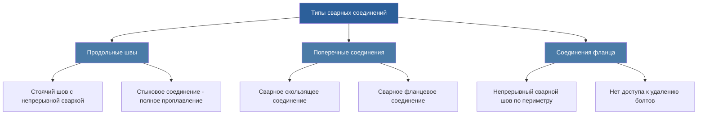
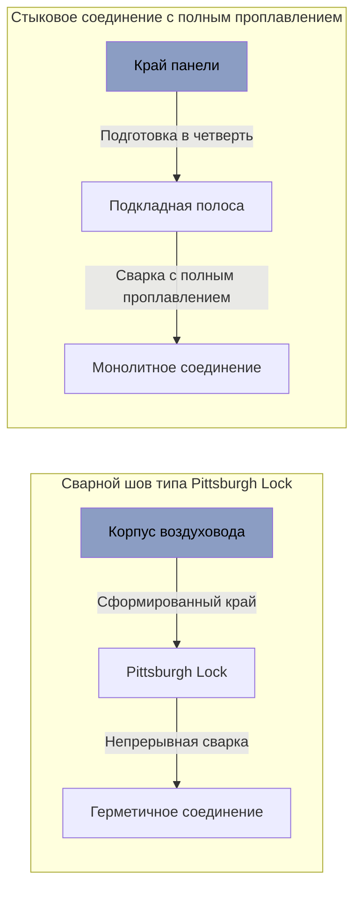

## Стандарты сварной конструкции

Сварная конструкция воздуховодов в учреждениях уголовного правосудия исключает механические крепежные элементы, которые могут быть повреждены или удалены заключенными. Непрерывная сварка создает монолитные конструкции, устойчивые к вскрытию, проникновению инструментов и попыткам несанкционированного доступа.

### Требования к толщине материала

Сварная защищенная конструкция воздуховодов требует более тяжелого материала, чем стандартные коммерческие системы, для предотвращения деформации, разрезания или нарушения целостности. Минимальные спецификации толщины варьируются в зависимости от размера воздуховода и уровня защиты.

| Размер воздуховода | Стандартная защита | Максимальная защита | Материал |
|-------------------|-------------------|-------------------|----------|
| ≤30 см диаметр | 16 калибр (1,5 мм) | 14 калибр (1,9 мм) | Оцинкованная сталь |
| 33-61 см диаметр | 14 калибр (1,9 мм) | 12 калибр (2,7 мм) | Оцинкованная сталь |
| 64-91 см диаметр | 12 калибр (2,7 мм) | 11 калибр (3,0 мм) | Оцинкованная сталь |
| >91 см диаметр | 11 калибр (3,0 мм) | 10 калибр (3,4 мм) | Оцинкованная сталь |
| Зоны с высокой коррозией | 14 калибр (1,9 мм) | 12 калибр (2,7 мм) | Нержавеющая сталь 304 |

### Спецификации непрерывной сварки

Все продольные и поперечные швы требуют непрерывной сварки в соответствии со стандартами защищенных воздуховодов SMACNA. Прихваточные швы, точечная сварка и прерывистая сварка запрещены в защищенных зонах.

**Конструкция сварного соединения:**

### Конструкция деталей сварки

**Конфигурация продольного шва:**

**Типы поперечных соединений:**

1. **Сварное скользящее соединение:** Внутренний конец скользит во внешний раздел, непрерывный угловой шов по периметру
2. **Сварное фланцевое соединение:** Минимальная ширина фланца 38 мм, непрерывная сварка с обеих сторон уголка
3. **Стыковое сварное соединение:** Сварка с полным проплавлением с подкладным кольцом или присадочным материалом

### Рейтинг давления сварки

Швы защищенных воздуховодов должны выдерживать испытательное давление без утечки или расслоения соединения. Испытание давлением проверяет целостность сварки и защиту системы.

Требуемая прочность сварки для герметизации под давлением:

$$\sigma_w = \frac{P \cdot D}{2t \cdot \eta}$$

Где:
- $\sigma_w$ = напряжение сварки (кПа)
- $P$ = внутреннее испытательное давление (мм w.g. × 0.0098)
- $D$ = диаметр воздуховода (см)
- $t$ = толщина материала (см)
- $\eta$ = коэффициент эффективности сварного соединения (0,85–1,0)

Для проверки класса герметичности:

$$CL_{max} = \frac{F \cdot P^{0.65}}{100}$$

Где:
- $CL_{max}$ = максимальная утечка (м³/ч на 10 м²)
- $F$ = коэффициент класса герметизации (3 для защищенного сварного воздуховода)
- $P$ = испытательное давление (мм w.g.)

### Требования к инспекции сварки

Все швы в зонах максимальной защиты требуют 100% визуальной инспекции. Случайная выборка применяется к установкам с стандартным уровнем защиты.

| Уровень защиты | Визуальная инспекция | Люминесцентная дефектоскопия | Радиографическое исследование | Испытание давлением |
|----------------|-------------------|--------------------------|----------------------|----------------------|
| Максимальная | 100% швов | 25% соединений | Критические проникновения | Все секции |
| Высокая | 100% швов | 10% выборка | Проникновения барьеров | Все секции |
| Стандартная | 50% выборка | 5% выборка | Не требуется | Ветвевые секции |

**Критерии визуальной инспекции:**

- Полное проплавление по всей длине сварки
- Отсутствие трещин, пористости или подреза, превышающих 0,8 мм
- Однородный внешний вид валика без чрезмерного разбрызгивания
- Отсутствие прожога или оплавления края на тонких материалах
- Высота усиления сварки 1,6–2,4 мм

### Конструкция предотвращения доступа

Сварная конструкция исключает общие уязвимости безопасности в механических системах воздуховодов.

**Запрещенные элементы в защищенных зонах:**

- Скользящие соединения-втулки с листовыми металлическими винтами
- Болтовые фланцевые сборки со съемными крепежами
- Дверцы доступа или панели воздуховода
- Фланцевые соединения TDC/TDF
- Стоячие швы без непрерывной сварки
- Заклепочная конструкция

**Требуемые функции безопасности:**

- Непрерывный продольный шов на всех швах
- Сварные поперечные соединения (без механических крепежей)
- Сварные фланцевые соединения (болты захватные, если требуется)
- Усиленные проникновения на границах стены/потолка
- Явный внешний вид сварки, определяющий вскрытие, по всей системе

### Оцинкованная сталь и нержавеющая сталь

**Применение оцинкованной стали:**

- Жилые помещения общего населения
- Административные коридоры
- Комнаты свиданий
- Среды с низкой коррозией
- Установки с ограниченным бюджетом

**Требования из нержавеющей стали:**

- Вытяжка пищевого обслуживания и кухни
- Системы вытяжки прачечной
- Вытяжка для душевых и ванных комнат
- Вентиляция хранилища химических веществ
- Прибрежные или влажные учреждения

Нержавеющая сталь 304 обеспечивает превосходную коррозионную стойкость в агрессивных средах. Сварка нержавеющей стали требует защиты инертным газом (TIG/MIG) для предотвращения осаждения карбидов и сохранения коррозионной стойкости.

### Процедуры полевой сварки

Сварка на месте требует квалифицированных сварщиков, сертифицированных по AWS D9.1 или эквивалентным стандартам сварки листового металла.

**Требования перед сваркой:**

1. Удалить цинковое покрытие на расстоянии 5 см с каждой стороны зоны сварки
2. Очистить поверхность соединения от масла, грязи и окисления
3. Проверить толщину материала и подготовку соединения
4. Установить надлежащий выбор электрода/проволоки
5. Установить параметры силы тока и скорости перемещения

**Обработка после сварки:**

1. Удалить шлак и разбрызгивание проволочной щеткой
2. Нанести холодный цинковый состав на голую сталь
3. Сгладить острые края, которые могут повредить изоляцию
4. Визуальная инспекция перед скрытием
5. Испытание давлением в соответствии с требованиями спецификации

### Соответствие стандартам SMACNA

Сварные защищенные воздуховоды следуют SMACNA "HVAC Duct Construction Standards" с расширенными модификациями безопасности:

- Повышенная толщина материала в зависимости от уровня защиты
- Непрерывная сварка вместо механических крепежей
- Расширенное усиление в местах проникновения и опор
- Жесткие протоколы инспекции и тестирования
- Защищенная от вскрытия конструкция по всей системе

### Язык спецификации

**Пример раздела спецификации:**

"Воздуховоды в жилых помещениях с максимальной защитой должны быть изготовлены из оцинкованной стали 12 калибра с непрерывными сварными швами. Все продольные соединения должны быть конфигурации Pittsburgh lock или стыкового соединения с непрерывным угловым или полным проплавлением. Поперечные соединения должны быть сварными скользящими соединениями или сварными фланцевыми сборками с захватными крепежами. Механические крепежи, дверцы доступа и съемные панели запрещены. Подрядчик должен провести испытание давлением всех секций воздуховода при давлении 249 Па в течение 15 минут с утечкой менее 1%."

---

**Расположение файла:** /Users/evgenygantman/Documents/github/gantmane/hvac/content/specialty-applications-testing/specialty-hvac-applications/justice-facilities/secure-ductwork/welded-construction/_index.md
